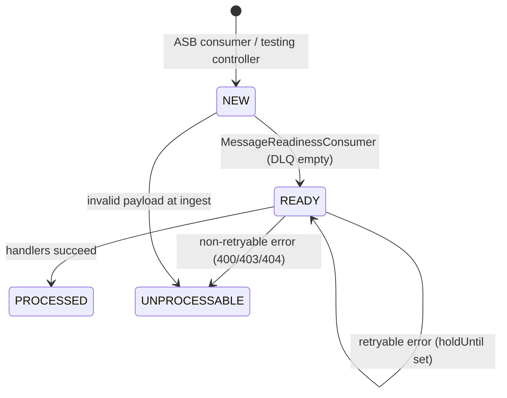

## TL;DR

- `wa-case-event-handler` (port 8088) bridges the Azure Service Bus CCD case-events topic to the WA task pipeline, consuming session-based messages (session ID = case ID) and persisting them into PostgreSQL for dedup, ordering, and retry.
- Messages traverse a 4-state machine (`NEW` -> `READY` -> `PROCESSED` / `UNPROCESSABLE`) backed by `SELECT ... FOR UPDATE SKIP LOCKED` for concurrent-safe processing.
- Four ordered handlers route messages downstream: Cancellation (1) and Warning (2) correlate Camunda messages via `wa-workflow-api`; Reconfiguration (3) calls `wa-task-management-api` directly; Initiation (4) sends `createTaskMessage` via `wa-workflow-api`.
- The `AZURE_SERVICE_BUS_DLQ_FEATURE_TOGGLE` property gates all ASB consumers and DLQ checking -- despite its name, setting it `false` disables the entire ASB integration path.
- Functional tests bypass ASB entirely via `CaseEventHandlerTestingController`, a non-prod REST controller that injects/queries messages directly in the database.
- Production throughput is approximately 20-30K messages per working day (~6K on weekends); the database retains 90 days of history (configurable via `CLEAN_UP_STARTED_DAYS_BEFORE`).

## Design rationale

The architecture solves three core non-functional requirements established at the WA programme level:

1. **Exactly-once processing** -- CCD events must never produce duplicate tasks, even when retries or node failures occur. This is achieved through (a) the idempotency key mechanism at the Camunda layer and (b) DB-backed dedup at the message layer.
2. **Per-case ordering** -- within a single case, events must be processed in the order they occurred. ASB sessions (session ID = case ID) guarantee transport-layer FIFO; the database ordering query enforces application-layer ordering even when DLQ messages are involved.
3. **Resilience to partial failure** -- if a message fails partway through processing (e.g. one DMN evaluation succeeds but another fails), the entire message can be safely retried because downstream Camunda calls are idempotent.

The initial MVP used ASB sessions alone for ordering. The database-backed queue was added later (RWA-940) to handle the scenario where DLQ messages cause out-of-order processing: once a message lands on the DLQ, subsequent messages for the same case would otherwise be processed without the failed predecessor.
<!-- CONFLUENCE-ONLY: not verified in source -->

## CCD event message structure

The service consumes messages from the `ccd-case-events` ASB topic. Each message body is a JSON object conforming to the `EventInformation` structure (`EventInformation.java`):

```json
{
  "EventInstanceId": "<uuid>",
  "EventTimeStamp": "2024-03-15T10:30:00.000",
  "CaseId": "1234567890123456",
  "JurisdictionId": "IA",
  "CaseTypeId": "Asylum",
  "EventId": "submitAppeal",
  "PreviousStateId": "appealStarted",
  "NewStateId": "appealSubmitted",
  "UserId": "<idam-user-id>",
  "AdditionalData": {
    "Data": { "<fieldName>": "<value>", ... },
    "Definition": { "<fieldName>": { "originalId": "...", "type": "...", "subtype": "...", "typeDef": ... }, ... }
  }
}
```

Key behaviours:

- `JurisdictionId` and `CaseTypeId` are **lowercased on ingestion** (`EventInformation.java:55-56`) and used to construct DMN table keys (e.g. `wa-task-initiation-ia-asylum`).
- `EventId`, `PreviousStateId`, and `NewStateId` are the primary DMN input columns for matching initiation/cancellation rules.
- `AdditionalData.Data` fields are flattened into Camunda DMN variables. Simple types (text, boolean, date, number) become typed variables; complex and collection types become `json`-typed variables.
- `AdditionalData.Definition` carries CCD type metadata enabling correct Camunda variable typing. Dates embedded in JSON structures remain strings (no native JSON date type), requiring DMN authors to handle conversion in FEEL expressions.
<!-- CONFLUENCE-ONLY: not verified in source -->

## ASB session subscription

The service subscribes to the `ccd-case-events` ASB topic using `ServiceBusSessionReceiverClient` (azure-messaging-servicebus). Each message's session ID equals the CCD case ID, which guarantees ordered processing per case at the transport layer.

`CcdCaseEventsExecutor.start()` launches N threads (controlled by `AZURE_SERVICE_BUS_CONCURRENT_SESSIONS`, default 1), each running a prototype-scoped `CcdCaseEventsConsumer` instance (`CcdCaseEventsExecutor.java:34`). Each consumer loops calling `sessionReceiver.acceptNextSession()` then `receiveMessages(1)`:

- **Success**: `receiver.complete(message)` then `eventMessageReceiverService.handleCcdCaseEventAsbMessage(messageId, sessionId, body)` (`CcdCaseEventsConsumer.java:62`).
- **Failure**: `receiver.abandon(message)` -- ASB redelivers (`CcdCaseEventsConsumer.java:69`).

Both the consumer and the executor are gated by:

- `@ConditionalOnProperty("azure.servicebus.enableASB-DLQ")` -- bean only created when toggle is `true`.
- `@Profile("!functional & !local")` -- never active in functional-test or local-dev profiles.

Key config properties (from `application.yaml`):

| Property | Env var | Default | Purpose |
|----------|---------|---------|---------|
| `azure.servicebus.connection-string` | `AZURE_SERVICE_BUS_CONNECTION_STRING` | -- | ASB connection |
| `azure.servicebus.topic-name` | `AZURE_SERVICE_BUS_TOPIC_NAME` | -- | Topic to subscribe |
| `azure.servicebus.ccd-case-events-subscription-name` | `AZURE_SERVICE_BUS_CCD_CASE_EVENTS_SUBSCRIPTION_NAME` | -- | Subscription name |
| `azure.servicebus.threads` | `AZURE_SERVICE_BUS_CONCURRENT_SESSIONS` | 1 | Consumer threads |
| `azure.servicebus.retry-duration` | -- | 60 | `AmqpRetryOptions.tryTimeout` (seconds) |

## Database schema

The service owns the `wa_case_event_messages_db` PostgreSQL database, managed by Flyway migrations in `src/main/resources/db/migration/`. The primary table is `wa_case_event_messages`:

| Column | Type | Nullable | Default | Description |
|--------|------|----------|---------|-------------|
| `message_id` | text | NOT NULL | -- | ASB message ID (primary key) |
| `sequence` | serial | -- | auto | Insertion-order sequence |
| `case_id` | text | YES | -- | CCD case ID (nullable since RWA-931; null blocks processing) |
| `event_timestamp` | timestamp | YES | -- | Timestamp of the originating CCD event |
| `from_dlq` | boolean | NOT NULL | false | Whether message originated from the DLQ |
| `state` | message_state_enum | NOT NULL | -- | `NEW`, `READY`, `PROCESSED`, or `UNPROCESSABLE` |
| `message_properties` | jsonb | YES | -- | ASB message properties (e.g. deadLetterReason) |
| `message_content` | text | YES | -- | Raw message body (kept as text for unparseable payloads) |
| `received` | timestamp | NOT NULL | -- | When the message was inserted |
| `delivery_count` | integer | NOT NULL | 1 | ASB delivery attempts (incremented on redelivery) |
| `hold_until` | timestamp | YES | -- | Backoff: message not eligible for processing until this time |
| `retry_count` | integer | NOT NULL | 0 | Application-level retry attempts |

### Indexes

```sql
-- RWA-1030
CREATE INDEX idx_wa_case_event_messages_case_id_event_timestamp
  ON wa_case_event_messages(case_id, event_timestamp);
CREATE INDEX idx_wa_case_event_messages_case_id_state_event_timestamp
  ON wa_case_event_messages(case_id, state, event_timestamp);
CREATE INDEX idx_wa_case_event_messages_state_from_dlq_case_id_event_timestamp
  ON wa_case_event_messages(state, from_dlq, case_id, event_timestamp);

-- RWA-4922 (2026) - partial index for active messages
CREATE INDEX idx_wacem_case_ts_not_processed
  ON wa_case_event_messages(case_id, event_timestamp)
  WHERE state <> 'PROCESSED';
```

The partial index (`idx_wacem_case_ts_not_processed`) was added as a performance improvement to reduce the working set the ordering query scans, given that 90 days of history can accumulate ~2.7M rows while only a small fraction remain unprocessed.

## Message deduplication

Deduplication is DB-backed and operates at two levels:

### ASB redelivery dedup

`EventMessageReceiverService.insertMessage()` (`EventMessageReceiverService.java:72`) checks `findByMessageId()` before inserting. If the `message_id` already exists, it increments `deliveryCount` on the existing row rather than inserting. The existing state is preserved -- a `PROCESSED` message stays `PROCESSED` regardless of redelivery.

If a true duplicate arrives concurrently (race condition), `DataIntegrityViolationException` on the `PRIMARY KEY` constraint is caught and re-thrown as `CaseEventMessageDuplicateMessageIdException` (`EventMessageReceiverService.java:144-147`).

### Task-level dedup

`InitiationCaseEventHandler` generates an `idempotencyKey` = `MD5(eventInstanceId + taskId)` (uppercased) via `IdempotencyKeyGenerator` (`IdempotencyKeyGenerator.java:14`). This key is passed as a Camunda process variable; the BPMN in `wa-workflow-api` uses it to prevent duplicate task instances from being created.

### Per-case ordering

The `getNextAvailableMessageReadyToProcess()` native query (`CaseEventMessageRepository.java:17-52`) enforces:

1. Earliest unprocessed `event_timestamp` per `case_id` is selected first.
2. No DLQ message is processed before a non-DLQ message at a higher timestamp for the same case.
3. Messages with `null` `event_timestamp` or `null` `case_id` are never dequeued -- they block the case queue until resolved via the problem-message job.

## Message processing pipeline



Three background threads run concurrently:

1. **ASB consumer** -- stores messages as `NEW`.
2. **MessageReadinessConsumer** -- promotes `NEW` to `READY` only when `DeadLetterQueuePeekService.isDeadLetterQueueEmpty()` returns true (`MessageReadinessConsumer.java:49-71`).
3. **DatabaseMessageConsumer** -- picks one `READY` message per poll (default 1000ms, env `MESSAGE_PROCESSING_POLL_INTERVAL_MILLISECONDS`) using `SELECT ... FOR UPDATE SKIP LOCKED`, processes it, and transitions state.

On processing, `CcdEventProcessor.processMessage()` iterates all four `CaseEventHandler` beans ordered by `@Order`, calling `evaluateDmn()` and then `handle()` if results are non-empty (`CcdEventProcessor.java:79-84`).

### Retry backoff

Retryable errors trigger exponential-ish backoff via `holdUntil`:

| Retry | Delay |
|-------|-------|
| 1 | 5s |
| 2 | 15s |
| 3 | 30s |
| 4 | 60s |
| 5 | 300s |
| 6 | 900s |
| 7 | 1800s |
| 8 | 3600s |

<!-- DIVERGENCE: Confluence (page 1531414005) says retry 8 delay is 1800s, but DatabaseMessageConsumer.java:49 shows RETRY_COUNT_TO_DELAY_MAP.put(8, 3600). Source wins. -->

After retry 8, state transitions to `UNPROCESSABLE` (`DatabaseMessageConsumer.java:39-52`). Non-retryable HTTP errors (400, 403, 404) immediately mark a message as `UNPROCESSABLE`.

## Routing to downstream services

### Initiation (Order 4)

`InitiationCaseEventHandler` calls `wa-workflow-api`:

- **DMN evaluation**: `POST /workflow/decision-definition/key/wa-task-initiation-{jurisdiction}-{caseTypeId}/tenant-id/{tenant-id}/evaluate` with variables `{eventId, postEventState, additionalData, now, directionDueDate}`.
- **Message send**: for each `InitiateEvaluateResponse`, sends `POST /workflow/message` with `messageName=createTaskMessage` and process variables including `idempotencyKey`, `taskState=unconfigured`, `caseId`, `taskId`, `dueDate`, `workingDaysAllowed`, per-category `__processCategory__<cat>=true` flags.

### Cancellation (Order 1)

`CancellationCaseEventHandler` calls `wa-workflow-api`:

- **DMN evaluation**: `POST /workflow/decision-definition/key/wa-task-cancellation-{jurisdiction}-{caseTypeId}/tenant-id/{tenant-id}/evaluate` with variables `{event, state, fromState, additionalData}`.
- Filters results where `action=CANCEL`.
- Sends two `POST /workflow/message` requests per result: new-format (correlation keys `{caseId, __processCategory__<cat>=true}`) and deprecated old-format (correlation key `{caseId, taskCategory}`). Both use `messageName=cancelTasks`, `processVariables={cancellationProcess=CASE_EVENT_CANCELLATION}`, `all=true` (`CancellationCaseEventHandler.java:130-177`).

### Warning (Order 2)

`WarningCaseEventHandler` uses the same cancellation DMN but sends `messageName=warnProcess`. Three scenarios: empty warnings, warnings without categories, and warnings with categories (`WarningCaseEventHandler.java:73-106`).

### Reconfiguration (Order 3)

`ReconfigurationCaseEventHandler` evaluates the **cancellation** DMN (same table), filters for `action=RECONFIGURE`, then calls `wa-task-management-api` directly:

- `POST /task/operation` with `MARK_TO_RECONFIGURE` operation and filter `case_id IN [caseReference]` (`ReconfigurationCaseEventHandler.java:115-128`).

This is the only handler that calls `wa-task-management-api` -- the others route through `wa-workflow-api`.

All outbound calls use S2S `ServiceAuthorization` header only (no IDAM bearer token).

## DLQ toggle and handling

The property `azure.servicebus.enableASB-DLQ` (env `AZURE_SERVICE_BUS_DLQ_FEATURE_TOGGLE`) gates the entire ASB integration. Despite the DLQ-specific name, when set to `false`:

- No ASB consumer threads start.
- No DLQ consumer threads start.
- No readiness promotion occurs (the beans are absent).

When enabled (`true`), a `CcdCaseEventsDeadLetterQueueConsumer` reads from the ASB DLQ (non-session-based receiver) and persists messages with `from_dlq=true`. The ordering query in `CaseEventMessageRepository` prevents a DLQ message from being processed until its corresponding normal message has been processed or 30 minutes have passed (`CaseEventMessageRepository.java:37-49`).

The `MessageReadinessConsumer` peeks the DLQ before promoting any `NEW` message. If the DLQ is non-empty, the entire pipeline stalls -- no messages are promoted to `READY` until the DLQ is cleared. This ensures no message is processed out of order relative to failed messages that ended up on the DLQ.

## Testing controller

`CaseEventHandlerTestingController` provides REST endpoints to inject and observe messages without ASB. It is **not** profile-guarded -- the bean is always present but throws 403 in production (checked at runtime via `isNonProdEnvironment()` at `CaseEventHandlerTestingController.java:142`).

| Method | Path | Purpose |
|--------|------|---------|
| `POST` | `/messages/{message_id}` | Inject a message (optionally `?from_dlq=true`) |
| `PUT` | `/messages/{message_id}?from_dlq={bool}` | Upsert (update or create) |
| `GET` | `/messages/{message_id}` | Retrieve by message ID |
| `GET` | `/messages/query?states=&case_id=&event_timestamp=&from_dlq=` | Query messages |
| `DELETE` | `/messages/{message_id}` | Delete a message |

Functional tests set `AZURE_SERVICE_BUS_DLQ_FEATURE_TOGGLE=false` and use `POST /messages/{id}` to inject, `GET /messages/query` to assert state transitions, and `DELETE /messages/{id}` to clean up.

### Problem message jobs

`ProblemMessageController` at `POST /messages/jobs/{jobName}` triggers maintenance jobs by `JobName` enum:

- `FIND_PROBLEM_MESSAGES` -- identifies stuck messages (called periodically by `wa-message-cron-service`).
- `RESET_PROBLEM_MESSAGES` -- resets problem messages for reprocessing.
- `RESET_NULL_EVENT_TIMESTAMP_MESSAGES` -- handles messages with null timestamps that block case queues.
- `SET_STATE_TO_PROCESSED_ON_MESSAGES` -- force-marks messages as processed.
- `CLEAN_UP_MESSAGES` -- removes old processed/unprocessable rows.

### Production endpoint (legacy)

`CaseEventHandlerController` exposes `POST /messages` which calls all handlers synchronously **without** DB persistence or dedup. This endpoint is not part of the ASB flow and is not used by functional tests for standard scenarios.

## Operational characteristics

### Throughput and scaling

Production processes approximately 20-30K event messages per working day and ~6K on weekends. Burst scenarios (e.g. IAC batch operations) can produce thousands of messages in minutes, creating backlogs that take hours to clear due to per-case ordering constraints.
<!-- CONFLUENCE-ONLY: not verified in source -->

Scaling levers:

| Lever | Config | Effect |
|-------|--------|--------|
| ASB consumer threads | `AZURE_SERVICE_BUS_CONCURRENT_SESSIONS` | More parallel session locks; default 1 |
| DB poll interval | `MESSAGE_PROCESSING_POLL_INTERVAL_MILLISECONDS` | How often READY messages are dequeued; default 1000ms |
| Horizontal pod scaling | K8s HPA (CPU/Mem 80% threshold) | Additional pods can process different cases in parallel |

The primary bottleneck is typically the ordering query cost against a large `wa_case_event_messages` table rather than downstream Camunda latency.
<!-- CONFLUENCE-ONLY: not verified in source -->

### Message retention and cleanup

The `CLEAN_UP_MESSAGES` job (triggered by `wa-message-cron-service`) deletes messages older than `CLEAN_UP_STARTED_DAYS_BEFORE` days (default 90). In production, only `PROCESSED` messages are cleaned (`CLEAN_UP_STATE_FOR_PROD`); in non-prod, the same applies (`CLEAN_UP_STATE_FOR_NON_PROD`). The delete is batched in chunks of `CLEAN_UP_MESSAGE_LIMIT` (default 100) per invocation.

### Alerting

An existing alert fires when messages remain unprocessed for longer than 2 hours. The `FIND_PROBLEM_MESSAGES` job (called by `wa-message-cron-service`) logs diagnostic information to Application Insights for:

1. Messages in `UNPROCESSABLE` state (require manual intervention)
2. Messages stuck in `READY` state beyond expected processing time
3. Messages with null `case_id` or null `event_timestamp` blocking their case queue

LaunchDarkly feature flags (prefixed `wa-dlq-*`) gate incremental rollout of DLQ-related functionality.
<!-- CONFLUENCE-ONLY: not verified in source -->

### Local development

There is no local ASB emulator. Developers connect to Azure ASB in the demo environment using a personal subscription. The `local` Spring profile disables all ASB consumers, allowing message injection via the testing controller or direct DB inserts. Database migrations run automatically on startup via Flyway.

## Examples

### Initiation handler: DMN evaluation and message send

`InitiationCaseEventHandler` (order 4 in the handler chain) evaluates the initiation DMN and sends a `createTaskMessage` to Camunda for each matched row.

```java
// Source: apps/wa/wa-case-event-handler/src/main/java/uk/gov/hmcts/reform/wacaseeventhandler/handlers/InitiationCaseEventHandler.java
@Service
@Order(4)   // runs last: Cancel(1) → Warn(2) → Reconfigure(3) → Initiate(4)
@Slf4j
public class InitiationCaseEventHandler implements CaseEventHandler {

    @Override
    public List<? extends EvaluateResponse> evaluateDmn(EventInformation eventInformation) {
        // Build DMN key from lowercased jurisdictionId + caseTypeId
        String tableKey = TASK_INITIATION.getTableKey(
            eventInformation.getJurisdictionId(),   // e.g. "ia"
            eventInformation.getCaseTypeId()         // e.g. "asylum"
        );  // → "wa-task-initiation-ia-asylum"

        EvaluateDmnRequest request = buildEvaluateDmnRequest(
            eventInformation.getEventId(),
            eventInformation.getNewStateId(),
            AdditionalDataReader.readValue(objectMapper, eventInformation.getAdditionalData()),
            LocalDateTime.now().format(DateTimeFormatter.ISO_LOCAL_DATE),
            directionDueDate
        );
        return workflowApiClient.evaluateInitiationDmn(
            serviceAuthGenerator.generate(), tableKey, tenantId, request
        ).getResults();
    }

    @Override
    public void handle(List<? extends EvaluateResponse> results, EventInformation eventInformation) {
        results.stream()
            .filter(InitiateEvaluateResponse.class::isInstance)
            .map(InitiateEvaluateResponse.class::cast)
            .forEach(resp -> {
                SendMessageRequest request = buildInitiateTaskMessageRequest(resp, eventInformation);
                workflowApiClient.sendMessage(serviceAuthGenerator.generate(), request);
            });
    }

    private Map<String, DmnValue<?>> buildProcessVariables(
            InitiateEvaluateResponse resp, EventInformation eventInformation) {
        Map<String, DmnValue<?>> vars = new ConcurrentHashMap<>();
        vars.put("idempotencyKey", dmnStringValue(idempotencyKeyGenerator.generateIdempotencyKey(
            eventInformation.getEventInstanceId(), resp.getTaskId().getValue())));
        vars.put("taskState",         dmnStringValue("unconfigured"));
        vars.put("caseTypeId",        dmnStringValue(eventInformation.getCaseTypeId()));
        vars.put("dueDate",           dmnStringValue(dueDate.format(ISO_LOCAL_DATE_TIME)));
        vars.put("workingDaysAllowed",cannotBeNull(resp.getWorkingDaysAllowed()));
        vars.put("jurisdiction",      dmnStringValue(eventInformation.getJurisdictionId()));
        vars.put("name",              resp.getName());
        vars.put("taskId",            resp.getTaskId());
        vars.put("caseId",            dmnStringValue(eventInformation.getCaseId()));
        vars.put("delayUntil",        dmnStringValue(delayUntil.format(ISO_LOCAL_DATE_TIME)));

        // Process categories become boolean flags: __processCategory__<cat>=true
        if (resp.getProcessCategories() != null) {
            Stream.of(resp.getProcessCategories().getValue().split(","))
                .map(String::trim)
                .forEach(cat -> vars.put("__processCategory__" + cat, dmnBooleanValue(true)));
        }
        return vars;
    }
}
```

### Per-case ordering SQL query

The `getNextAvailableMessageReadyToProcess()` query selects only the earliest unprocessed message per case, blocking processing if DLQ messages or null timestamps are present for that case:

```sql
// Source: apps/wa/wa-case-event-handler/src/main/java/uk/gov/hmcts/reform/wacaseeventhandler/repository/CaseEventMessageRepository.java
select * from public.wa_case_event_messages msg
where msg.state = 'READY'
-- earliest unprocessed message for each case_id
and (msg.case_id, msg.event_timestamp) in (
    select case_id, min(event_timestamp)
    from wa_case_event_messages
    where state != 'PROCESSED'
    group by case_id)
-- block if any message for this case has a null event_timestamp
and not exists (select 1 from wa_case_event_messages e
                where e.case_id = msg.case_id
                and e.event_timestamp is null)
-- block if any message has a null case_id (unroutable)
and not exists (select 1 from wa_case_event_messages c
                where c.case_id is null)
-- DLQ ordering: DLQ messages only processed after a higher-timestamp non-DLQ message is READY
-- or 30 minutes have elapsed
and (
    not msg.from_dlq
    or (msg.from_dlq and (
        exists (select 1 from wa_case_event_messages d
                where d.case_id = msg.case_id
                and d.event_timestamp > msg.event_timestamp
                and not d.from_dlq and d.state = 'READY')
        or exists (select 1 from wa_case_event_messages d
                   where d.event_timestamp > msg.event_timestamp + interval '30 minutes'
                   and not d.from_dlq and d.state in ('READY', 'PROCESSED')))))
and (current_timestamp > hold_until or hold_until is null)
for update skip locked
limit 1
```

## See also

- [Architecture](architecture.md) — ASB topology, subscription naming, and the full message flow from CCD to XUI
- [BPMN Workflows](bpmn-workflows.md) — what happens inside Camunda after CEH sends `createTaskMessage` or `cancelTasks`
- [DMN Task Configuration](dmn-task-configuration.md) — the initiation and cancellation DMN tables that CEH evaluates for each message
- [How-to: Debug Stuck Tasks](../how-to/debug-stuck-tasks.md) — how to diagnose `UNCONFIGURED` tasks and `UNPROCESSABLE` messages
- [Glossary](../reference/glossary.md) — definitions of CEH-specific terms (ASB, idempotencyKey, MessageReadinessConsumer, etc.)
