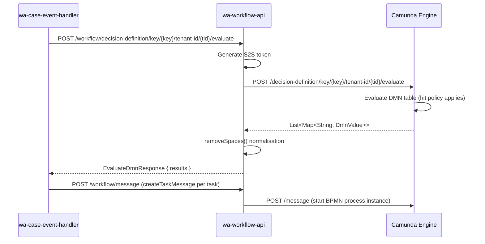

## TL;DR

- DMN (Decision Model and Notation) decision tables are the primary mechanism through which jurisdiction teams configure Work Allocation tasks — what tasks exist, when they fire, what attributes they carry, and who can act on them.
- Seven distinct DMN table types exist per case type: initiation, configuration, permissions, cancellation, completion, allowed-days, and task-types.
- `wa-workflow-api` evaluates DMN tables at runtime by calling Camunda's REST API (`POST /decision-definition/key/{key}/tenant-id/{tenant-id}/evaluate`); it does not interpret results itself — it returns raw outputs to the caller (`wa-case-event-handler`).
- Date calculation happens **after** DMN evaluation: the configuration DMN emits key-value pairs describing *how* to calculate dates, and `wa-task-management-api`'s date calculation engine performs the actual computation using external bank-holiday calendars.
- DMN files follow the naming convention `wa-task-<category>-<jurisdiction>-<casetype>.dmn` and are deployed to a shared Camunda cluster via `camunda-deployment.sh`.
- Onboarding requires whitelisting, CCD role grants for `caseworker-wa-task-configuration`, and deploying correctly-named DMN tables with mandatory output fields (without which tasks remain `UNCONFIGURED`).

## The evaluation flow in wa-workflow-api

`wa-workflow-api` (port 8099) is the gateway between WA services and the Camunda BPMN/DMN engine. It exposes a single DMN evaluation endpoint:

```
POST /workflow/decision-definition/key/{key}/tenant-id/{tenant-id}/evaluate
```

The request body is an `EvaluateDmnRequest` containing a free-form variables map:

```json
{
  "variables": {
    "eventId": { "value": "submitCase", "type": "String" },
    "postEventState": { "value": "caseUnderReview", "type": "String" },
    "additionalData": { "value": { "Data": { "appealType": "protection" } }, "type": null }
  }
}
```

Each variable is a `DmnValue<T>` with `value` and `type` fields (`wa-workflow-api:src/main/java/uk/gov/hmcts/reform/waworkflowapi/clients/model/DmnValue.java`). Factory methods include `dmnStringValue`, `dmnIntegerValue`, `booleanValue`, `jsonValue`, and `dmnMapValue`.

The response returns all matching DMN rows:

```json
{
  "results": [
    {
      "taskId": { "value": "reviewAppealSkeletonArgument", "type": "String" },
      "name": { "value": "Review Appeal Skeleton Argument", "type": "String" },
      "workingDaysAllowed": { "value": 2, "type": "Integer" },
      "processCategories": { "value": "caseProgression", "type": "String" }
    }
  ]
}
```

### Internal mechanics

1. `CreateTaskController.evaluateDmn` (`CreateTaskController.java:84-96`) receives the HTTP POST.
2. It delegates through `EvaluateDmnService` to `TaskClientService.evaluate` (`TaskClientService.java:37-48`).
3. `TaskClientService` generates an S2S token via `AuthTokenGenerator` and forwards the request to `CamundaClient.evaluateDmn` — a Feign client targeting `${camunda.url}/decision-definition/key/{key}/tenant-id/{tenant-id}/evaluate` (`CamundaClient.java:41-50`).
4. Camunda evaluates the DMN table and returns matching rows.
5. `TaskClientService.removeSpaces` (`TaskClientService.java:50-76`) post-processes every String-typed output that contains commas and spaces — splitting on `,`, trimming each element, re-joining without spaces. This normalises permission lists like `"Read, Own, Cancel"` to `"Read,Own,Cancel"`.

If the DMN table is not found, Camunda returns 404 which propagates to the caller. If no row matches, the endpoint returns HTTP 200 with `{ "results": [] }`.

### Sequence diagram



After receiving initiation DMN results, `wa-case-event-handler` maps the output rows to BPMN process variables and sends a `createTaskMessage` for each task to be created. The BPMN process (from `wa-standalone-task-bpmn`) then drives task creation and triggers configuration DMN evaluation downstream.

## DMN table types and their schemas

### 1. Initiation DMN

**Purpose**: determines which tasks to create when a CCD event fires.

**Hit policy**: COLLECT — multiple rules can match, creating multiple tasks from a single event.

**Inputs**:

| Input | Type | Source |
|-------|------|--------|
| `eventId` | String | CCD event ID |
| `postEventState` | String | CCD case state after the event |
| `appealType` | String | `additionalData.Data.appealType` (FEEL) |
| `journeyType` | String | `additionalData.Data.journeyType` (FEEL) |
| `lastModifiedApplicationType` | String | `additionalData.Data.lastModifiedApplication.type` (FEEL) |
| `lastModifiedApplicationDecision` | String | FEEL expression from additional data |

**Outputs**:

| Output | Type | Description |
|--------|------|-------------|
| `taskId` | String | Task identifier (matches `taskType`) |
| `name` | String | Human-readable task name |
| `delayDuration` | Integer | Simple day-offset delay |
| `delayUntil` | JSON | Structured delay object (see below) |
| `workingDaysAllowed` | Integer | SLA in working days (default 2) |
| `processCategories` | String | Comma-separated categories, e.g. `"caseProgression,followUpOverdue"` |
| `taskType` | String | Must match `taskId`; consumed by configuration DMN |

The `delayUntil` output supports rich scheduling:

```json
{
  "delayUntilOrigin": "2026-12-23T18:00",
  "delayUntilIntervalDays": 4,
  "delayUntilNonWorkingCalendar": "https://www.gov.uk/bank-holidays/england-and-wales.json",
  "delayUntilNonWorkingDaysOfWeek": "SATURDAY,SUNDAY",
  "delayUntilSkipNonWorkingDays": true,
  "delayUntilMustBeWorkingDay": "No"
}
```

This is from `wa-task-configuration-template:src/main/resources/wa-task-initiation-wa-wacasetype.dmn:797-843`.

### 2. Configuration DMN

**Purpose**: populates task attributes after a task is initiated.

**Hit policy**: RULE ORDER — all matching rules apply in sequence; later rules override earlier ones for the same attribute name.

**Inputs**:

| Input | Type | Source |
|-------|------|--------|
| `caseData` | String/Map | Full CCD case data |
| `taskType` | String | From `taskAttributes.taskType` or `taskType` variable (FEEL) |

**Outputs**:

| Output | Type | Description |
|--------|------|-------------|
| `name` | String | Attribute name key |
| `value` | String | Attribute value |
| `canReconfigure` | Boolean | Whether re-evaluated on reconfiguration |

Key attribute names produced by the configuration DMN include:

- `caseName` — constructed from case data fields (e.g. `caseData.appellantGivenNames + " " + caseData.appellantFamilyName`)
- `region`, `location`, `locationName` — from `caseData.caseManagementLocation`
- `workType` — e.g. `"hearing_work"`, `"decision_making_work"`, `"access_requests"`
- `roleCategory` — e.g. `"LEGAL_OPERATIONS"`, `"ADMIN"`, `"JUDICIAL"`, `"CTSC"`
- `description` — HTML deep-link strings with `${[CASE_REFERENCE]}` placeholder
- `dueDate`, `dueDateOrigin`, `dueDateIntervalDays`, `dueDateNonWorkingCalendar`, `dueDateNonWorkingDaysOfWeek`, `dueDateSkipNonWorkingDays`, `dueDateMustBeWorkingDay` — calculated due date family
- `calculatedDates` — comma-separated list of date attributes to compute in sequence
- `priorityDate`, `majorPriority`, `minorPriority` — task priority fields
- `additionalProperties_*` — arbitrary key/value pairs collected into a map

The `canReconfigure` flag controls reconfiguration behaviour: rows with `canReconfigure=true` are re-evaluated when reconfiguration is triggered; rows with `false` or blank are set only on initial configuration.

The RULE ORDER hit policy means teams can define "base" rules with a blank `taskType` input (matching all task types) and override with task-type-specific rows later in the table.

#### Mandatory output attributes

The following configuration DMN outputs are considered mandatory by `wa-task-management-api`. If absent during initiation, the task cannot complete configuration and remains in `UNCONFIGURED` state (invisible to users). Some have built-in defaults that prevent absence:

| Output attribute | Mandatory | Default | Notes |
|-----------------|-----------|---------|-------|
| `title` | Yes | Falls back to `task_name` from initiation DMN | |
| `dueDate` | Yes | Current date + 2 days at 16:00 | Overridden by date calculation if `dueDate*` family present |
| `priorityDate` | Yes | Falls back to `dueDate` | |
| `majorPriority` | Yes | `5000` | Lower = higher priority |
| `minorPriority` | Yes | `500` | Secondary sort within same major priority |
| `roleCategory` | Yes | (none) | Must be configured |
| `workType` | Yes | (none) | Must be configured |
| `region` | Yes | (none) | Must match from `caseData.caseManagementLocation` |
| `location` | Yes | (none) | Must match from `caseData.caseManagementLocation` |
| `caseName` | Yes | (none) | Must be configured |
| `caseManagementCategory` | Yes | (none) | |

<!-- CONFLUENCE-ONLY: mandatory attribute list from "WA - Task Attribute Configuration Details" (page 1753707700). Individual field mandatory status not verified against initiation-blocking validation in source. -->

#### Input field differences: initiation vs reconfiguration

During **initiation**, all Camunda process/task variables are available as inputs (accessed via `taskAttributes.*`). During **reconfiguration**, the inputs come from the existing task record in the database, not from Camunda. Key differences:

| Attribute | Initiation input path | Reconfiguration input path |
|-----------|----------------------|---------------------------|
| Task name | `taskAttributes.name` | `taskAttributes.name` |
| Due date | `taskAttributes.dueDate` | `taskAttributes.dueDate` |
| Work type | (not available) | `taskAttributes.workType` |
| Additional properties | `taskAttributes.<PROP_NAME>` | `taskAttributes.additionalProperties.<PROP_NAME>` |
| Case management category | (not available) | `taskAttributes.caseManagementCategory` |

This difference in `additionalProperties` access paths is a common source of DMN bugs during reconfiguration.
<!-- CONFLUENCE-ONLY: input path differences sourced from "WA - Task Attribute Configuration Details" (page 1753707700), not verified in wa-task-management-api initiation/reconfiguration code paths -->

### 3. Permissions DMN

**Purpose**: defines which roles can perform which actions on each task type.

**Hit policy**: RULE ORDER

**Inputs**:

| Input | Type | Source |
|-------|------|--------|
| `taskType` | String | From `taskAttributes.taskType`, fallback `"r1"` |
| `case` | (reserved) | Unused; for future case-data-based permission filters |

**Outputs**:

| Output | Type | Description |
|--------|------|-------------|
| `caseAccessCategory` | String | Category filter, e.g. `"categoryA,categoryB"` |
| `name` | String | Role name (e.g. `"tribunal-caseworker"`, `"judge"`) |
| `value` | String | Comma-separated permission flags |
| `roleCategory` | String | `"LEGAL_OPERATIONS"`, `"JUDICIAL"`, `"ADMIN"`, etc. |
| `authorisations` | String | Optional authorisation codes |
| `assignmentPriority` | Integer | Lower = higher priority for auto-assignment |
| `autoAssignable` | Boolean | Whether the role supports auto-assignment |

Permission flag vocabulary (from `PermissionTypes.java`): `Read`, `Refer`, `Own`, `Manage`, `Execute`, `Cancel`, `Complete`, `CompleteOwn`, `CancelOwn`, `Claim`, `Unclaim`, `Assign`, `Unassign`, `UnclaimAssign`, `UnassignClaim`, `UnassignAssign`.

Note: `Refer` is retained in the codebase for backward compatibility but is deprecated in the granular permissions model. New services should not use it.

The `"r1"` fallback (`wa-task-configuration-template:src/main/resources/wa-task-permissions-wa-wacasetype.dmn:7-10`) ensures tasks with null `taskAttributes` receive default permissions.

#### Granular permissions constraints

Two critical rules apply to the permissions DMN configuration:

1. **OWN and CLAIM must be on the same row** — if they are on separate rows for the same role, the task will not appear in the Available Tasks screen in XUI.
2. **No spaces after commas** — permission values like `"Read, Own, Claim"` will break the permission model. Use `"Read,Own,Claim"` (note: `wa-workflow-api` has a `removeSpaces` post-processor that normalises this, but it only applies during DMN evaluation, not during task data migration).
<!-- CONFLUENCE-ONLY: OWN+CLAIM same-row constraint from "Granular Task Permissions Onboarding" (page 1616388317), not verified in wa-task-management-api permission evaluation logic -->

### 4. Cancellation DMN

**Purpose**: maps CCD events to task lifecycle actions (cancel, warn, or reconfigure).

**Hit policy**: COLLECT

**Inputs**: `fromState`, `event`, `state`, `appealType`

**Outputs**:

| Output | Type | Description |
|--------|------|-------------|
| `action` | String | `"Cancel"`, `"Warn"`, or `"Reconfigure"` |
| `warningCode` | String | Warning identifier (e.g. `"TA01"`, `"TA02"`) |
| `warningText` | String | Human-readable warning message |
| `processCategories` | String | Scopes the action to specific task categories |

The `"Reconfigure"` action triggers task re-evaluation against the configuration DMN rather than cancellation — used for `UPDATE` events (`wa-task-configuration-template:src/main/resources/wa-task-cancellation-wa-wacasetype.dmn:346-370`).

#### Reconfiguration flow

Task reconfiguration refreshes task data when case data changes (e.g. hearing dates updated, case flags changed, location reassigned). The flow works as follows:

1. A CCD event fires that is listed in the **cancellation DMN** with `action = "Reconfigure"`.
2. `wa-case-event-handler` detects this and marks affected tasks for reconfiguration (sets `reconfigure_request_time` on matching tasks).
3. `wa-task-monitor` polls for tasks with pending reconfiguration requests and triggers re-evaluation.
4. The **configuration DMN** is re-evaluated with current case data. Only output rows where `canReconfigure = true` are applied to the task record.
5. Date calculations are re-run for reconfigurable date attributes.

Reconfiguration is **optional but recommended** for most services. It is **compulsory** for services consuming `nextHearingDate` on tasks.

Use cases for reconfiguration:
- Keeping task location/region in sync with case management location
- Updating task priority when case flags change
- Refreshing hearing dates on tasks when hearing schedule changes

### 5. Completion DMN

**Purpose**: auto-completes tasks when specified CCD events fire.

**Hit policy**: COLLECT

**Inputs**: `eventId`

**Outputs**: `taskType` (String), `completionMode` (always `"Auto"`)

### 6. Allowed Days DMN

**Purpose**: maps Camunda direction task IDs to follow-up task types with default working-days-allowed values.

**Hit policy**: FIRST

**Outputs**: `taskId`, `name`, `workingDaysAllowed`

### 7. Task Types DMN

**Purpose**: the complete catalogue of recognised task type IDs for the jurisdiction/case type. XUI uses this to populate task-type filter dropdowns.

**Hit policy**: COLLECT

**Outputs**: `taskTypeId`, `taskTypeName`

## DMN naming convention and deployment

DMN files follow the naming pattern:

```
wa-task-<category>-<jurisdiction>-<casetype>.dmn
```

For example: `wa-task-initiation-ia-asylum.dmn`, `wa-task-permissions-civil-civilclaims.dmn`.

The `decision id` attribute inside the XML must match the file stem exactly. The DMN key in evaluation requests corresponds to this decision ID — e.g. calling `POST .../key/wa-task-initiation-ia-asylum/tenant-id/ia/evaluate`.

Deployment is handled by `camunda-deployment.sh` (`wa-task-configuration-template:camunda-deployment.sh:11-12`), which iterates all `*.dmn` and `*.bpmn` files under `src/main/resources/` and POSTs each to `${CAMUNDA_URL}/deployment/create` with:
- `tenant-id` — jurisdiction identifier (e.g. `"wa"`, `"ia"`)
- `deployment-source` — product identifier
- `ServiceAuthorization` header — S2S token from a whitelisted service

## Example: a complete initiation rule

A single initiation DMN row for the WA test case type:

| eventId | postEventState | appealType | taskId | name | processCategories | workingDaysAllowed |
|---------|---------------|------------|--------|------|-------------------|-------------------|
| `submitCase` | `caseUnderReview` | (any) | `reviewAppealSkeletonArgument` | Review Appeal Skeleton Argument | `caseProgression` | 2 |

When event `submitCase` fires and puts the case into state `caseUnderReview`, the initiation DMN (COLLECT hit policy) returns this row. `wa-case-event-handler` then sends a `createTaskMessage` to Camunda with process variables derived from these outputs.

The COLLECT hit policy means multiple rows can fire for the same event — demonstrated by the `createMultipleTasks` event which creates both `firstTask` and `secondTask` from a single CCD event (`wa-task-configuration-template:src/main/resources/wa-task-initiation-wa-wacasetype.dmn:509-589`).

## Date calculation engine

Date calculation is a **two-phase process**: the configuration DMN emits key-value pairs that *describe* how to calculate dates, then `wa-task-management-api`'s `DateTypeConfigurator` engine performs the actual computation. This separation exists because the date calculations (bank-holiday-aware, calendar-importing) are HMCTS-specific and not natively supported by Camunda's DMN engine.

### The three task dates

| Date | Mandatory | Prefix | Displayed in UI | Purpose |
|------|-----------|--------|-----------------|---------|
| Next Hearing Date | No | `nextHearingDate` | Yes | Lets users and priority logic account for upcoming hearings |
| Due Date | Yes | `dueDate` | No (used for SLA reporting) | A task completed after due date is "late" |
| Priority Date | Yes | `priorityDate` | No (used for sort order) | Orders tasks in the Available Tasks list; earlier = higher in list |

If no date calculation rules are provided, the defaults are:
- `dueDate`: current date + 2 working days at 16:00 (`DateCalculator.DEFAULT_ZONED_DATE_TIME`)
- `priorityDate`: falls back to `dueDate`
- `nextHearingDate`: empty (no default)

### Calculation order via `calculatedDates`

The `calculatedDates` attribute is a comma-separated list that controls the order in which dates are computed. Each date in the chain can reference previously-calculated dates:

```
calculatedDates = "nextHearingDate,hearingPreDate,dueDate,priorityDate"
```

The engine enforces that the **three mandatory dates** (`nextHearingDate`, `dueDate`, `priorityDate`) must be present in `calculatedDates` **in that order**. Intermediate dates (like `hearingPreDate`) can be interleaved freely. If `calculatedDates` is not specified, the default order is `nextHearingDate` (order 1), `dueDate` (order 2), `priorityDate` (order 3) — from `DateType.java`.

If mandatory dates are missing or out of order, the engine throws a `DateCalculationException`:
- `"Mandatory dates are not provided in calculatedDates field. Must provide (nextHearingDate,dueDate,priorityDate)"`
- `"Mandatory dates are not in required order in calculatedDates field. Must be (nextHearingDate,dueDate,priorityDate)"`

### Date attribute family

Each calculated date uses a family of configuration attributes (where `<prefix>` is e.g. `dueDate`, `priorityDate`, `nextHearingDate`, or an intermediate date name):

| Suffix | Type | Purpose |
|--------|------|---------|
| `<prefix>Origin` | DateTime string | Literal origin date for calculation |
| `<prefix>OriginRef` | String | Reference to another task/case attribute to use as origin |
| `<prefix>OriginEarliest` | Comma-separated strings | List of date references; picks the **earliest** |
| `<prefix>OriginLatest` | Comma-separated strings | List of date references; picks the **latest** |
| `<prefix>IntervalDays` | Integer | Number of days to add/subtract from origin |
| `<prefix>NonWorkingCalendar` | URL(s) | Bank holiday calendar JSON URL(s); default: `https://www.gov.uk/bank-holidays/england-and-wales.json` |
| `<prefix>NonWorkingDaysOfWeek` | Comma-separated | Days to skip, e.g. `"SATURDAY,SUNDAY"` |
| `<prefix>SkipNonWorkingDays` | Boolean string | If `"true"`, interval counts only working days |
| `<prefix>MustBeWorkingDay` | String | `"Next"`, `"Previous"`, or `"No"` — adjusts final date if it falls on a non-working day |
| `<prefix>Time` | Time string | Time component, e.g. `"16:00"` (default: `"16:00"`) |

**Origin resolution priority**: only one origin type may be specified per date. If multiple origin types are present (e.g. both `dueDateOrigin` and `dueDateOriginEarliest`), the engine throws `"Origin dates have multiple occurrence, Date type can't be calculated."`.

The four origin strategies, implemented as separate calculator classes:
1. **Direct** (`*Origin`) — a literal ISO date/time string
2. **Ref** (`*OriginRef`) — references another attribute on the task (e.g. a case data field)
3. **Earliest** (`*OriginEarliest`) — comma-separated list of references; picks the earliest non-null value
4. **Latest** (`*OriginLatest`) — comma-separated list of references; picks the latest non-null value

### Key/value merging rules

When the DMN returns multiple rows for the same date attribute (possible with RULE ORDER hit policy):
- Scalar attributes (e.g. `dueDateSkipNonWorkingDays`): **last occurrence wins**
- List attributes (e.g. `dueDateNonWorkingCalendar`): values are **merged into a list** and all calendars loaded

### Chaining example

From `wa-task-configuration-template:src/main/resources/wa-task-configuration-wa-wacasetype.dmn:1066-1235`:

1. `nextHearingDate` — sourced from case data
2. `hearingPreDate` — computed as `nextHearingDate - 5 days` (non-working-day-skipping disabled)
3. `dueDate` — computed from its own origin/interval fields
4. `priorityDate` — set via `priorityDateOriginEarliest = "hearingPreDate,dueDate"` (picks the earlier of the two)

### Important: DMN values must be literals

The key/value pairs emitted from the DMN evaluation must contain **literal values** — embedded FEEL expressions and functions are not re-evaluated by the date calculation engine. For example, `now()` evaluated within FEEL produces a literal date/time that works correctly, but the string `"now()"` as an output value will fail because the date calculator does not recognise it as a function.

## Notable conventions

- **`taskId` == `taskType`**: both outputs carry identical camelCase strings in the initiation DMN (`wa-task-configuration-template:src/main/resources/wa-task-initiation-wa-wacasetype.dmn:51,57`).
- **`additionalProperties_` prefix**: configuration output names beginning with this prefix are collected into a map on the task resource. The suffix becomes the map key (e.g. `additionalProperties_roleAssignmentId` becomes `additionalProperties["roleAssignmentId"]`).
- **Null-safe FEEL patterns**: inputs use `if(X != null and X.Y != null) then X.Y else null` throughout, because Camunda FEEL throws on null navigation.
- **Sub-decisions**: the configuration DMN can reference sub-decisions (e.g. `Decision_0p6b5dq` extracts process-category booleans from `taskAttributes`) to enable branching logic (`wa-task-configuration-template:src/main/resources/wa-task-configuration-wa-wacasetype.dmn:2110-2119`).
- **Bank holiday calendars**: `dueDateNonWorkingCalendar` supports multiple comma-separated URLs (e.g. `"https://www.gov.uk/bank-holidays/england-and-wales.json"`).
- **`description` uses HTML**: HTML-encoded content with deep links using `/case/<jurisdiction>/<caseType>/${[CASE_REFERENCE]}/trigger/<eventId>`.

## Feature flags in DMN rules

Teams sometimes need to merge DMN rules into master without them taking effect immediately (similar to LaunchDarkly for code). Two approaches have been explored:

1. **Input column approach** — add an `isLiveFrom` input column with a FEEL expression: `now() > date and time("2021-12-01T10:00:00")`. Rows only match when the current time passes the go-live date.
2. **Output column approach** — add a `liveFrom` output column containing an ISO-8601 date string. The consuming service filters out rows whose `liveFrom` date is in the future.

Neither approach is formally standardised across all jurisdictions, but both are in use. The input column approach is self-contained within the DMN; the output column approach requires platform-side filtering logic.
<!-- CONFLUENCE-ONLY: feature flag pattern from "WA Feature Flag DMN rules" (page 1525466902), not verified as implemented in wa-task-management-api or wa-case-event-handler -->

## Passing data from initiation to configuration via processCategories

The `processCategories` output from the initiation DMN serves a dual purpose: it categorises the task (for cancellation/warning scoping) and provides a mechanism to **pass arbitrary identifiers** into the configuration DMN.

When a task is initiated, each value in `processCategories` becomes a Camunda process variable with the prefix `__processCategory__`. The configuration DMN can then extract data encoded in these category strings using FEEL literal expressions.

**Example — Query Management pattern** (from Civil service):

1. Initiation DMN outputs `processCategories = "queryManagement_QueryID_9436e222-..."`.
2. This becomes the process variable `__processCategory__queryManagement_QueryID_9436e222-...`.
3. The configuration DMN uses a FEEL literal expression to iterate `taskAttributes`, find keys starting with `__processCategory__queryManagement_queryID_`, and extract the query ID suffix.
4. The extracted ID is then used as an `additionalProperties_query_management_query_id` output, making it available to XUI.

This pattern (pioneered by Private Law for order IDs, adopted by Civil for queries) allows tasks to carry references to specific case data items without requiring the task management platform to understand each service's domain model.
<!-- CONFLUENCE-ONLY: processCategory mechanism detail from "Query Management Task Configuration Pattern" (page 1824134570), not verified in wa-task-management-api process variable handling -->

## How jurisdiction teams onboard

1. Copy all DMN files from `wa-task-configuration-template`.
2. Rename files and `decision id` attributes: replace `wa-wacasetype` with `<jurisdiction>-<casetype>`.
3. Populate each table with jurisdiction-specific rules — events, task types, roles, permissions.
4. Update `camunda-deployment.sh` with the correct `TENANT_ID` and `PRODUCT` values.
5. Deploy to Camunda using `./camunda-deployment.sh $SERVICE_TOKEN`.

The blank-slate `wa-task-types-ia-asylum.dmn` in the template demonstrates the minimal valid structure — correct outputs (`taskTypeId`, `taskTypeName`) with zero rules.

### Prerequisites for going live

Beyond DMN authoring, services must complete these steps:

1. **Whitelisting** — the jurisdiction must be added to `wa-task-management-api`'s `config.allowedJurisdictions` list (current production values: `ia,wa,sscs,civil,publiclaw,privatelaw,employment,st_cic`) and the case type to `config.allowedCaseTypes`.
2. **Azure Service Bus filter** — the jurisdiction must be added to the ASB subscription filter so `wa-case-event-handler` receives CCD events for that jurisdiction.
3. **CCD role grants** — the `caseworker-wa-task-configuration` role must have read access to all CCD case fields referenced in the configuration DMN. Without this, configuration will fail silently (returning null for case data fields).
4. **CCD definition authorisation** — ensure `caseworker-wa-task-configuration` is authorised on the relevant CaseField and CaseEvent definitions.

## Troubleshooting common DMN issues

| Symptom | Likely cause | Resolution |
|---------|-------------|------------|
| CCD event fires but no task created | Case data missing fields required by initiation DMN inputs; or earlier failed event blocking the case | Verify all `additionalData` fields are published; check for unprocessable events |
| Task visible in Camunda but not in XUI | Task remains in `UNCONFIGURED` state — configuration DMN failed | Check that `caseworker-wa-task-configuration` can access all referenced case data fields |
| Task appears but data is wrong | Configuration DMN references case fields the WA role cannot access (returns null) | Add field grants to CCD definition for `caseworker-wa-task-configuration` |
| User cannot see tasks in Available Tasks | Permission DMN has OWN and CLAIM on separate rows; or user's region doesn't match task region | Move OWN+CLAIM to same row; verify user role-assignment region matches task region |
| Region mismatch | Region `1` (National) is **not** a superset — it's a specific region. For all-region access, role must have **no region ID** | Configure role assignment without region constraint |
| Task dates differ between Camunda and XUI | XUI uses the new date calculation engine; Camunda retains the legacy `workingDaysAllowed`-based date as a process variable | This is expected — the XUI date is authoritative |
<!-- CONFLUENCE-ONLY: troubleshooting table assembled from "Onboarding Triage Guidance" (page 1672087665), symptoms not verified against specific source code error paths -->

## Examples

### Initiation DMN — XML structure

The initiation DMN header showing input columns (FEEL expressions extracting `additionalData` fields) and output columns. Hit policy is `COLLECT`.

```xml
// Source: apps/wa/wa-task-configuration-template/src/main/resources/wa-task-initiation-wa-wacasetype.dmn
<decision id="wa-task-initiation-wa-wacasetype" name="Task initiation DMN"
          camunda:historyTimeToLive="P90D">
  <decisionTable id="DecisionTable_0jtevuc" hitPolicy="COLLECT">
    <input id="Input_1" label="Event Id" camunda:inputVariable="eventId">
      <inputExpression typeRef="string"><text></text></inputExpression>
    </input>
    <input id="InputClause_0gxli97" label="Post event state"
           camunda:inputVariable="postEventState">
      <inputExpression typeRef="string"><text></text></inputExpression>
    </input>
    <input id="InputClause_0a0i7vo" label="Appeal Type"
           camunda:inputVariable="appealType">
      <inputExpression typeRef="string">
        <text>if(additionalData != null and additionalData.Data != null
              and additionalData.Data.appealType != null) then
              additionalData.Data.appealType
              else null</text>
      </inputExpression>
    </input>
    <!-- outputs -->
    <output id="Output_1"         label="Task Id"              name="taskId"             typeRef="string" />
    <output id="OutputClause_..."  label="Name"                 name="name"               typeRef="string" />
    <output id="OutputClause_..."  label="Delay Duration"       name="delayDuration"      typeRef="integer" />
    <output id="OutputClause_..."  label="Delay Until"          name="delayUntil"         typeRef="json" />
    <output id="OutputClause_..."  label="Working Days Allowed" name="workingDaysAllowed" typeRef="integer" />
    <output id="OutputClause_..."  label="Process Categories"   name="processCategories"  typeRef="string" />
    <output id="OutputClause_..."  label="Task Type"            name="taskType"           typeRef="string" />

    <!-- Example rule: submitCase → reviewAppealSkeletonArgument -->
    <rule id="DecisionRule_0vq8eyq">
      <inputEntry><text>"submitCase"</text></inputEntry>
      <inputEntry><text>"caseUnderReview"</text></inputEntry>
      <inputEntry><text></text></inputEntry>  <!-- any appealType -->
      <!-- ... more empty inputs ... -->
      <outputEntry><text>"reviewAppealSkeletonArgument"</text></outputEntry>
      <outputEntry><text>"Review Appeal Skeleton Argument"</text></outputEntry>
      <outputEntry><text></text></outputEntry>  <!-- no delay -->
      <outputEntry><text></text></outputEntry>  <!-- no delayUntil -->
      <outputEntry><text>2</text></outputEntry>
      <outputEntry><text>"caseProgression"</text></outputEntry>
      <outputEntry><text>"reviewAppealSkeletonArgument"</text></outputEntry>
    </rule>
  </decisionTable>
</decision>
```

### Configuration DMN — base rules

The configuration DMN uses hit policy `RULE ORDER`. Base rules (blank `taskType` input) apply to all task types; task-type-specific rows override them.

```xml
// Source: apps/wa/wa-task-configuration-template/src/main/resources/wa-task-configuration-wa-wacasetype.dmn
<decision id="wa-task-configuration-wa-wacasetype" name="Task configuration DMN"
          camunda:historyTimeToLive="P90D">
  <decisionTable hitPolicy="RULE ORDER">
    <input label="CCD Case Data" camunda:inputVariable="caseData">
      <inputExpression typeRef="string"><text></text></inputExpression>
    </input>
    <input label="Task type" camunda:inputVariable="taskType">
      <inputExpression typeRef="string">
        <text>if(taskAttributes != null and taskAttributes.taskType != null) then
              taskAttributes.taskType
              else if(taskType != null) then taskType
              else null</text>
      </inputExpression>
    </input>
    <output name="name"           typeRef="string" />   <!-- attribute key -->
    <output name="value"          typeRef="string" />   <!-- attribute value (FEEL or literal) -->
    <output name="canReconfigure" typeRef="boolean" />  <!-- true = re-evaluated on reconfiguration -->

    <!-- Base rule (blank taskType = applies to all): caseName from case data -->
    <rule id="DecisionRule_19opwhc">
      <inputEntry><text></text></inputEntry>  <!-- any caseData -->
      <inputEntry><text></text></inputEntry>  <!-- any taskType -->
      <outputEntry><text>"caseName"</text></outputEntry>
      <outputEntry>
        <text>caseData.appellantGivenNames + " " + caseData.appellantFamilyName</text>
      </outputEntry>
      <outputEntry><text>true</text></outputEntry>  <!-- reconfigurable -->
    </rule>

    <!-- Base rule: region from caseManagementLocation (null-safe FEEL) -->
    <rule id="DecisionRule_0r3u9cf">
      <inputEntry><text></text></inputEntry>
      <inputEntry><text></text></inputEntry>
      <outputEntry><text>"region"</text></outputEntry>
      <outputEntry>
        <text>if (caseData.caseManagementLocation != null
              and caseData.caseManagementLocation.region != null) then
              caseData.caseManagementLocation.region else "1"</text>
      </outputEntry>
      <outputEntry><text>true</text></outputEntry>
    </rule>
  </decisionTable>
</decision>
```

### Permissions DMN — role rows

The permissions DMN (hit policy `RULE ORDER`) grants `task-supervisor` access to all task types unconditionally (blank `taskType` input), then specifies per-role permissions for specific task types.

```xml
// Source: apps/wa/wa-task-configuration-template/src/main/resources/wa-task-permissions-wa-wacasetype.dmn
<decision id="wa-task-permissions-wa-wacasetype" name="Permissions DMN"
          camunda:historyTimeToLive="P90D">
  <decisionTable hitPolicy="RULE ORDER">
    <input label="Task Type" camunda:inputVariable="taskType">
      <inputExpression typeRef="string">
        <!-- Falls back to "r1" when taskAttributes is null, ensuring default permissions always apply -->
        <text>if(taskAttributes != null and taskAttributes.taskType != null) then
              taskAttributes.taskType else "r1"</text>
      </inputExpression>
    </input>
    <input label="Case Data" camunda:inputVariable="case">
      <inputExpression typeRef="string"><text></text></inputExpression>
    </input>
    <output name="caseAccessCategory" typeRef="string" />
    <output name="name"               typeRef="string" />   <!-- role name -->
    <output name="value"              typeRef="string" />   <!-- permission flags -->
    <output name="roleCategory"       typeRef="string" />
    <output name="authorisations"     typeRef="string" />
    <output name="assignmentPriority" typeRef="integer" />
    <output name="autoAssignable"     typeRef="boolean" />

    <!-- Universal supervisor rule (blank taskType = all task types) -->
    <rule id="DecisionRule_1d430vn">
      <description>supervisor task permissions</description>
      <inputEntry><text></text></inputEntry>  <!-- any taskType -->
      <inputEntry><text></text></inputEntry>
      <outputEntry><text>"categoryA"</text></outputEntry>
      <outputEntry><text>"task-supervisor"</text></outputEntry>
      <outputEntry><text>"Read,Manage,Cancel,Assign,Unassign,Complete"</text></outputEntry>
      <outputEntry><text></text></outputEntry>  <!-- no roleCategory filter -->
      <outputEntry><text></text></outputEntry>
      <outputEntry><text></text></outputEntry>
      <outputEntry><text>false</text></outputEntry>
    </rule>

    <!-- Specific rule: tribunal-caseworker on task type "r1" (default fallback) -->
    <rule id="DecisionRule_1tvtlre">
      <description>Tribunal caseworker task permissions</description>
      <inputEntry><text>"r1"</text></inputEntry>
      <inputEntry><text></text></inputEntry>
      <outputEntry><text></text></outputEntry>
      <outputEntry><text>"tribunal-caseworker"</text></outputEntry>
      <!-- OWN and CLAIM on the same row — required for Available Tasks visibility -->
      <outputEntry><text>"Read,Own,Manage,Cancel"</text></outputEntry>
      <outputEntry><text>"LEGAL_OPERATIONS"</text></outputEntry>
      <outputEntry><text></text></outputEntry>
      <outputEntry><text></text></outputEntry>
      <outputEntry><text>false</text></outputEntry>
    </rule>
  </decisionTable>
</decision>
```

### PermissionTypes enum

The full set of task permission flags, as defined in the source:

```java
// Source: apps/wa/wa-task-management-api/src/main/java/uk/gov/hmcts/reform/wataskmanagementapi/auth/permission/entities/PermissionTypes.java
public enum PermissionTypes {
    READ("Read", "read"),
    REFER("Refer", "refer"),          // deprecated — retained for backwards compatibility
    OWN("Own", "own"),
    MANAGE("Manage", "manage"),
    EXECUTE("Execute", "execute"),
    CANCEL("Cancel", "cancel"),
    COMPLETE("Complete", "complete"),
    COMPLETE_OWN("CompleteOwn", "completeOwn"),
    CANCEL_OWN("CancelOwn", "cancelOwn"),
    CLAIM("Claim", "claim"),
    UNCLAIM("Unclaim", "unclaim"),
    ASSIGN("Assign", "assign"),
    UNASSIGN("Unassign", "unassign"),
    UNCLAIM_ASSIGN("UnclaimAssign", "unclaimAssign"),
    UNASSIGN_CLAIM("UnassignClaim", "unassignClaim"),
    UNASSIGN_ASSIGN("UnassignAssign", "unassignAssign");
    // ...
}
```

### Cancellation DMN — Warn and Cancel rules

```xml
// Source: apps/wa/wa-task-configuration-template/src/main/resources/wa-task-cancellation-wa-wacasetype.dmn
<decision id="wa-task-cancellation-wa-wacasetype" name="Task cancellation DMN"
          camunda:historyTimeToLive="P90D">
  <decisionTable hitPolicy="COLLECT">
    <input label="From State"><inputExpression typeRef="string"><text>fromState</text></inputExpression></input>
    <input label="Event">     <inputExpression typeRef="string"><text>event</text></inputExpression></input>
    <input label="State">     <inputExpression typeRef="string"><text>state</text></inputExpression></input>
    <input label="AppealType">
      <inputExpression typeRef="string">
        <text>if(additionalData != null and additionalData.Data != null
              and additionalData.Data.appealType != null) then
              additionalData.Data.appealType else null</text>
      </inputExpression>
    </input>
    <output name="action"            typeRef="string" />  <!-- "Cancel", "Warn", or "Reconfigure" -->
    <output name="warningCode"       typeRef="string" />
    <output name="warningText"       typeRef="string" />
    <output name="processCategories" typeRef="string" />

    <!-- Warn rule: application event flags active tasks -->
    <rule id="DecisionRule_0p1obrw">
      <inputEntry><text></text></inputEntry>                    <!-- any fromState -->
      <inputEntry><text>"_DUMMY_makeAnApplication"</text></inputEntry>
      <inputEntry><text></text></inputEntry>                    <!-- any toState -->
      <inputEntry><text></text></inputEntry>                    <!-- any appealType -->
      <outputEntry><text>"Warn"</text></outputEntry>
      <outputEntry><text>"TA01"</text></outputEntry>
      <outputEntry>
        <text>"There is an application task which might impact other active tasks"</text>
      </outputEntry>
      <outputEntry><text></text></outputEntry>
    </rule>
  </decisionTable>
</decision>
```

## See also

- [DMN Schema](../reference/dmn-schema.md) — concise field-by-field reference for all seven DMN table types
- [How-to: Write DMN Configuration](../how-to/write-dmn-configuration.md) — step-by-step guide for authoring each DMN table
- [How-to: Add Tasks for a New Event](../how-to/add-tasks-for-new-event.md) — focused recipe for adding a single new task type to existing DMNs
- [BPMN Workflows](bpmn-workflows.md) — how the Camunda BPMN process consumes DMN outputs to manage task lifecycle
- [Access Control](access-control.md) — how the permissions DMN populates `task_roles` rows used for access decisions
- [Glossary](../reference/glossary.md) — definitions of DMN-specific terms (COLLECT, RULE ORDER, canReconfigure, etc.)
