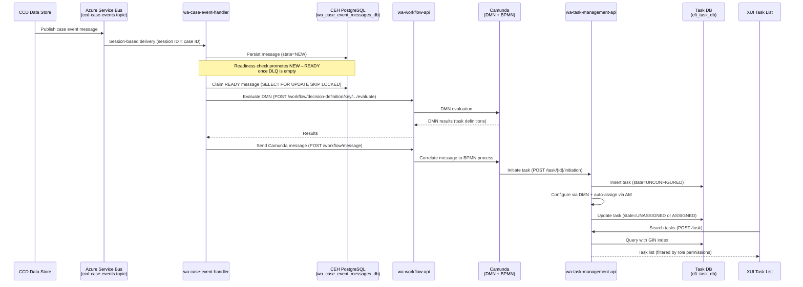

## TL;DR

- Work Allocation (WA) is the HMCTS platform that turns CCD case events into actionable caseworker tasks, surfaced in the XUI task list. It comprises two major functional areas: **Case Allocation** (linking users to cases long-term) and **Task Management** (creating and routing individual units of work).
- The pipeline: CCD publishes events to Azure Service Bus (ASB) -> `wa-case-event-handler` consumes and persists them -> Camunda DMN rules decide what tasks to create/cancel/reconfigure -> BPMN processes manage task lifecycle -> tasks are stored in PostgreSQL (the authoritative CFT task repository) and served via `wa-task-management-api`.
- Service teams onboard by providing jurisdiction-specific Camunda DMN tables (initiation, cancellation, configuration, permissions, completion, task-type) — no changes to WA platform code required.
- Task access is enforced via AM role assignments with 16 granular permissions — users can only see, claim, or complete tasks if their roles grant the required permissions for that action.
- Role categories partition users and tasks: `JUDICIAL`, `LEGAL_OPERATIONS`, `ADMIN`, `CTSC`, `ENFORCEMENT`.
- Supported jurisdictions: IA, WA, SSCS, Civil, Public Law, Private Law, Employment, ST CIC (with case types including asylum, benefit, CriminalInjuriesCompensation, generalapplication, and multiple ET variants).

## The Work Allocation model

Work Allocation consists of two complementary capabilities:

- **Case Allocation** — establishes a long-term link between an individual user and a specific case, conveying a level of access and responsibility. Case allocation creates *case roles* (e.g. "I am the caseworker for case 1234") and is a factor in task assignment decisions. Case allocations are managed via the "Roles and Access" tab on a case in XUI.
- **Task Management** — creates, routes, and manages individual units of work based on users' roles, locations, and authorisations. Tasks are the lowest level of granularity at which WA represents work.

Work Allocation decouples "something happened on a case" (a CCD event) from "someone needs to do work" (a task). A single case event may create multiple tasks, cancel existing ones, add warnings, or trigger reconfiguration — all driven by DMN rules that service teams author.

### End-to-end flow



### Key services

| Service | Port | Responsibility |
|---------|------|----------------|
| `wa-case-event-handler` | 8088 | Consumes ASB messages, persists for dedup/retry, evaluates DMN, sends Camunda messages |
| `wa-workflow-api` | 8099 | Thin proxy to Camunda: DMN evaluation + BPMN message correlation |
| `wa-task-management-api` | 8087 | Authoritative task store; CRUD, search, configuration, access control |
| `wa-task-monitor` | 8077 | Scheduled poller for unconfigured tasks; maintenance jobs |
| `wa-task-batch-service` | — | K8s CronJob: triggers batch jobs on `wa-task-monitor` |
| `wa-message-cron-service` | — | K8s CronJob: triggers `FIND_PROBLEM_MESSAGES` on `wa-case-event-handler` |

## How case events become tasks

### 1. Event ingestion (wa-case-event-handler)

CCD publishes every case event to the `ccd-case-events` Azure Service Bus topic. `wa-case-event-handler` subscribes using a **session-based** subscription where the session ID is the CCD case ID. This guarantees ordered, per-case processing.

Each message is persisted to the `wa_case_event_messages` table with state `NEW`. A background readiness consumer promotes messages to `READY` once the Dead Letter Queue is confirmed empty. A database message processor then claims `READY` messages using `SELECT ... FOR UPDATE SKIP LOCKED` for concurrent, non-blocking consumption (`CaseEventMessageRepository.java:17-52`).

The message payload (`EventInformation`) carries: `eventId`, `caseId`, `jurisdictionId`, `caseTypeId`, `previousStateId`, `newStateId`, `eventTimeStamp`, and optional `additionalData`.

### 2. DMN evaluation and handler fan-out

Every message passes through four ordered handlers:

| Order | Handler | DMN table key | Action |
|-------|---------|---------------|--------|
| 1 | `CancellationCaseEventHandler` | `wa-task-cancellation-{jurisdiction}-{caseType}` | Cancels matching tasks via `cancelTasks` Camunda message |
| 2 | `WarningCaseEventHandler` | `wa-task-cancellation-{jurisdiction}-{caseType}` | Adds warnings to tasks via `warnProcess` message |
| 3 | `ReconfigurationCaseEventHandler` | `wa-task-cancellation-{jurisdiction}-{caseType}` | Marks tasks for reconfiguration via `POST /task/operation` (MARK_TO_RECONFIGURE) |
| 4 | `InitiationCaseEventHandler` | `wa-task-initiation-{jurisdiction}-{caseType}` | Creates new tasks via `createTaskMessage` Camunda message |

All four handlers run against every message. Empty DMN results short-circuit — if the DMN returns nothing for a handler, it does nothing. Note that cancellation, warning, and reconfiguration share the same DMN table; the `action` column in the DMN result (`CANCEL`, `WARN`, `RECONFIGURE`) determines which handler acts.

DMN evaluation is performed by `wa-workflow-api` at `POST /workflow/decision-definition/key/{key}/tenant-id/{tenant-id}/evaluate` (`WorkflowApiClient.java:46`).

### 3. Camunda BPMN process (task creation)

For initiation, `wa-case-event-handler` sends a `createTaskMessage` to Camunda (via `wa-workflow-api` at `POST /workflow/message`) with process variables including:

- `taskId` — unique task identifier
- `caseId` — the originating case
- `taskState=unconfigured` — initial state
- `idempotencyKey` — MD5 of `eventInstanceId + taskId` to prevent duplicate task creation (`IdempotencyKeyGenerator.java:14`)
- `name`, `taskType`, `dueDate`, `workingDaysAllowed`, `jurisdiction`, `caseTypeId`

The Camunda BPMN process (deployed from `wa-standalone-task-bpmn`) receives this message and calls `wa-task-management-api` to initiate the task.

### 4. Task initiation and configuration (wa-task-management-api)

The exclusive endpoint `POST /task/{task-id}/initiation` (`ExclusiveTaskActionsController.java:68`) creates the task in `UNCONFIGURED` state, then immediately:

1. **Configures** via `ConfigureTaskService.configureCFTTask()` — reads DMN task-configuration rules to populate fields like title, work type, role category, and permissions.
2. **Auto-assigns** via `TaskAutoAssignmentService.autoAssignCFTTask()` — queries AM for role assignments with `SPECIFIC` grant type matching the `caseId` where the role has `own=true` and `autoAssignable=true`.

After configuration, the task transitions to either `UNASSIGNED` (no eligible assignee found) or `ASSIGNED` (auto-assigned to a matching role holder).

## Task states

Tasks progress through the following states (`CFTTaskState.java`):

```
UNCONFIGURED → CONFIGURED (configuration rules applied)
CONFIGURED → PENDING_AUTO_ASSIGN (auto-assignment logic invoked)
PENDING_AUTO_ASSIGN → UNASSIGNED (no eligible assignee) or ASSIGNED (auto-assigned)
UNASSIGNED → ASSIGNED (claim/assign)
ASSIGNED → UNASSIGNED (unclaim/unassign)
ASSIGNED or UNASSIGNED → COMPLETED (user/event completion)
ASSIGNED or UNASSIGNED → CANCELLED (user/event cancellation)
Any active state → TERMINATED (exclusive endpoint)
Any active state → PENDING_RECONFIGURATION (bulk reconfigure operation)
PENDING_RECONFIGURATION → UNASSIGNED or ASSIGNED (after reconfigure executes)
```

All states with their DB abbreviations: `UNCONFIGURED` (UCNF), `CONFIGURED` (CNF), `PENDING_AUTO_ASSIGN` (PA), `ASSIGNED` (A), `UNASSIGNED` (U), `COMPLETED` (C), `CANCELLED` (CAN), `TERMINATED` (T), `PENDING_RECONFIGURATION` (PR).

Active states are those NOT in `{TERMINATED, COMPLETED, CANCELLED}`.

## Task access control

Every user-facing endpoint on `wa-task-management-api` enforces permissions via AM role assignments:

1. The service fetches the user's role assignments from `am-role-assignment-service`.
2. CASE-type role assignments are filtered to those matching the task's `caseId`.
3. The required permission set depends on the action (e.g. `READ` for viewing, `CLAIM + OWN` for claiming, `MANAGE` for assigning to others).
4. If no matching role assignment grants the required permission, a 403 is returned and the attempt is logged to `sensitive_task_event_logs`.

Two elevated access tiers exist for service-to-service calls:

- **Privileged** (`wa_task_management_api`, `xui_webapp`, `ccd_case_disposer`) — can supply `CompletionOptions`, delete tasks by case.
- **Exclusive** (`wa_task_management_api`, `wa_task_monitor`, `wa_case_event_handler`, `wa_workflow_api`) — can initiate tasks, terminate tasks, run batch operations.

## Task permissions model

WA uses a granular permissions model (introduced in Release 3.5) with 16 permissions (`PermissionTypes.java`):

| Permission | Description |
|------------|-------------|
| `Read` | View the task |
| `Own` | Be the owner/assignee of the task |
| `Manage` | Manage the task (assign to others) |
| `Cancel` | Cancel the task |
| `Execute` | Execute the task (start working on it) |
| `Complete` | Complete any task |
| `CompleteOwn` | Complete only tasks assigned to you |
| `CancelOwn` | Cancel only tasks assigned to you |
| `Claim` | Claim an unassigned task |
| `Unclaim` | Unclaim a task assigned to you |
| `Assign` | Assign a task to another user |
| `Unassign` | Remove assignment from a task |
| `UnclaimAssign` | Unclaim and assign in one action |
| `UnassignClaim` | Unassign from another and claim |
| `UnassignAssign` | Unassign from one user and assign to another |

<!-- DIVERGENCE: Confluence Feature Overview says "Refer" permission was removed in R3.5, but wa-task-management-api:src/main/java/.../PermissionTypes.java still defines REFER("Refer", "refer") as an active enum value. Source wins — REFER still exists in code. -->

Permissions are configured per-role in the **Task Permission DMN** and returned as a union of all applicable role permissions in the task search response.

## Execution types

Each task has an execution type (`ExecutionType.java`) that determines how the UI presents it:

| Type | Label | Behaviour |
|------|-------|-----------|
| `MANUAL` | Manual | Task is carried out off-system; user must complete it explicitly in the task management UI |
| `CASE_EVENT` | Case Management Task | Task requires a CCD case event to be executed; UI opens the case |
| `BUILT_IN` | Built In | The application knows how to launch and complete this task based on its `formKey` |

## Task completion

Tasks can be completed through three mechanisms:

1. **UI-based (automatic)** — When a user submits a CCD event that is configured to complete the task, XUI identifies the task at event start, assigns it to the user if needed, and completes it after successful event submission. The order (submit event, then complete task) is deliberate: if the event fails, the task remains open; if task completion fails, the user can recover via manual completion.
<!-- CONFLUENCE-ONLY: Completion modes (auto, defaultYes, defaultNo, defaultNone) described in HLD for configuring whether to prompt user. not verified in source -->

2. **Manual** — User or supervisor explicitly marks the task as complete in the task management UI. Available for all tasks as a fallback.

3. **Callback** — Service code calls the task management API (recommended in `submitted` callback, not `aboutToSubmit`, to avoid completing a task when the event itself might fail).

## Work types and role categories

**Work types** group tasks into logical categories (e.g. "hearing_work", "upper_tribunal", "routine_work"). Every task must have exactly one work type, configured in the Task Configuration DMN. Work types are consistent across services and maintained as reference data within WA. Users see only work types relevant to their role in XUI filters.

**Role categories** partition both users and tasks into organisational groupings (`RoleCategory.java`):

| Category | Abbreviation | Description |
|----------|:---:|-------------|
| `JUDICIAL` | J | Judges (salaried and fee-paid) |
| `LEGAL_OPERATIONS` | L | Legal advisors, case officers |
| `ADMIN` | A | Administrative staff |
| `CTSC` | C | Courts and Tribunals Service Centre agents |
| `ENFORCEMENT` | E | Enforcement officers |

## Task search and the XUI task list

XUI queries tasks via `POST /task` with a body containing `search_parameters` and an optional `request_context`:

- `AVAILABLE_TASKS` — tasks the user can pick up (filters by permissions allowing Own/Claim).
- `ALL_WORK` — all tasks visible to the user (filters by Read permission).

Supported search parameter keys:

| Key | Type | Notes |
|-----|------|-------|
| `jurisdiction` | String list (IN) | e.g. `["ia", "sscs"]` |
| `location` | String list (IN) | ePIMMS location IDs |
| `state` | String list (IN) | e.g. `["assigned", "unassigned"]` |
| `user` | String list (IN) | IDAM user UUID |
| `case_id` | String list (IN) | CCD case references |
| `work_type` | String list (IN) | Work type IDs |
| `role_category` | String list (IN) | Role category filter |
| `task_type` | String list (IN) | Task type names |

Multiple parameters are ANDed; values within a single parameter are ORed. Pagination is supported via `first_result` and `max_results` query parameters (default max page size: 50). Results sorted by `due_date` descending; response includes `total_records`.

Production uses a GIN-index-backed SQL search path (toggled by LaunchDarkly flag `wa-task-search-gin-index`). The GIN index covers only `ASSIGNED` and `UNASSIGNED` tasks with `indexed=true`, meaning completed/cancelled/terminated tasks are not searchable via this path.

### XUI screens

Work Allocation surfaces in several XUI screens:

| Screen | Purpose | Access |
|--------|---------|--------|
| **My Work > My Tasks** | Tasks assigned to the current user | All WA users |
| **My Work > Available Tasks** | Unassigned tasks suitable for user based on role/location | All WA users |
| **My Work > My Cases** | Cases where user has an allocated case role | All WA users |
| **My Work > My Access** | Cases with active specific/challenged access grants | All WA users |
| **All Work** | Supervisor view: all tasks and case allocations for a team | Users with `task-supervisor` role |
| **Roles and Access** | Case-level tab showing allocated roles and allowing case allocation | Users with `case-allocator` role |

<!-- CONFLUENCE-ONLY: XUI screen breakdown from WA Service Glossary. not verified in source -->

## Reliability mechanisms

### Deduplication

- **ASB redelivery**: if a message ID already exists in the database, `wa-case-event-handler` increments `deliveryCount` rather than inserting a duplicate (`EventMessageReceiverService.java:79-83`).
- **Task-level**: the `idempotencyKey` Camunda process variable prevents duplicate BPMN process instances for the same event+task combination.

### Retry with backoff

Failed message processing retries with escalating delays: 5s, 15s, 30s, 60s, 5min, 15min, 30min, 1hr. After 8 retries, the message transitions to `UNPROCESSABLE` (`DatabaseMessageConsumer.java:39-52`). HTTP 400/403/404 from downstream services are non-retryable and immediately mark the message as `UNPROCESSABLE`.

### Ordered per-case processing

The database query for the next processable message ensures strict per-case event ordering. Messages with null `event_timestamp` or null `case_id` block their case queue until resolved via the `FIND_PROBLEM_MESSAGES` maintenance job.

## Delayed tasks

Tasks (and more complex workflows) can be configured with a `delayUntil` process variable that postpones the start of the process. This supports scenarios where a check is needed after a time limit — for example, verifying that a party has provided a response within a deadline, and creating a task for a caseworker to action if they haven't.

A delay timer is the first step in the standalone task workflow. During the delay period, the task can be cancelled by other case events (configured via the cancellation DMN). This is a common pattern: "create task X after N days unless event Y happens first".
<!-- CONFLUENCE-ONLY: Delayed task detail from HLD v1.6 section 2.5.6. not verified in source -->

## Date calculation and court calendars

WA calculates task due dates and `delayUntil` dates using working days. Services can configure custom non-working days (e.g. court-specific Christmas closures) by providing an HTTP endpoint returning a JSON list in the GOV.UK Bank Holiday format. The URL is configured in the service's DMN tables. Services wanting only standard UK bank holidays can use the government bank holiday API directly.
<!-- CONFLUENCE-ONLY: Court specific calendars feature from Feature Overview. not verified in source -->

## Onboarding a service team

To allocate tasks for a new jurisdiction or case type, a service team provides:

1. **Initiation DMN** (`wa-task-initiation-{jurisdiction}-{caseType}`) — maps `(eventId, postEventState)` to task definitions (task type, name, working days, process categories).
2. **Cancellation DMN** (`wa-task-cancellation-{jurisdiction}-{caseType}`) — maps `(event, state, fromState)` to actions: `CANCEL`, `WARN`, or `RECONFIGURE` with target task categories.
3. **Configuration DMN** — defines per-task-type field values (title, work type, role category, due date calculation). Uses FEEL expressions evaluated against a context of `task` (existing data) and `case` (CCD case data). Each rule identifies whether it runs on initial configuration only or also on reconfiguration.
4. **Permissions DMN** — defines which roles have which of the 16 granular permissions on each task type.
5. **Completion DMN** — maps case events to task completion (which events close which tasks).
6. **Task Type DMN** — provides the lookup list of task types for the task-type filter in XUI.
7. **BPMN deployment** — the generic `wa-standalone-task-bpmn` handles most cases; custom BPMN is rarely needed.

Services must also onboard to **Access Management** (role assignments) and **Reference Data** (staff/judicial/location data) before going live with WA.

The jurisdiction must be listed in `config.allowedJurisdictions` and the case type in `config.allowedCaseTypes` on `wa-task-management-api` (`application.yaml`). Current allowed jurisdictions: `ia, wa, sscs, civil, publiclaw, privatelaw, employment, st_cic`. Current allowed case types: `asylum, wacasetype, sscs, civil, generalapplication, care_supervision_epo, prlapps, et_englandwales, et_englandwales_listings, et_englandwales_multiple, et_scotland, et_scotland_listings, et_scotland_multiple, et_admin, privatelaw_exceptionrecord, benefit, CriminalInjuriesCompensation`.

## Design principles

The HLD (PDG-approved) establishes these architectural principles:

1. **The CFT task repository is the master store for tasks** — not Camunda. Camunda holds minimal data for process execution; the PostgreSQL `cft_task_db` is authoritative for CFT's view of tasks.
2. **All tasks exist within a BPMN process** — time-based escalations and reminders are features of the enclosing BPMN model, not the task itself. Standalone tasks use a reusable single-task process.
3. **All of a user's work is represented in the task UI** — users should not need to go to multiple places to find what they need to do.
4. **Minimal data from process to task** — only task type, case ID, and optionally assignee. Everything else is added by configuration rules post-creation.

<!-- CONFLUENCE-ONLY: Design principles from HLD - Task Management v1.6 section 2.3. not verified in source -->

## Release history

<!-- CONFLUENCE-ONLY: Release timeline from Work Allocation Home page. not verified in source -->

| Release | Date | Key Features |
|---------|------|--------------|
| R1 | June 2021 | MVP: case allocation, basic task management (IAC only) |
| R2 / R2.1 | July 2022 | Multi-service support, work type filters, cross role assignment, task reassignment |
| R3 | November 2022 | Challenged/specific access, global search, task reconfiguration, next hearing date |
| R3.5 | February 2023 | CTSC MVP, granular permissions (16 permissions model), CTSC role category |
| R4 | April 2023 | Full CTSC support, staff skills, task prioritisation, court calendars, task type filter, staff UI |
| R4.1 | July 2023 | MI reporting platform (PowerBI), task data extensions |

## See also

- [Architecture](architecture.md) — service map, database schemas, ASB configuration, and deployment topology
- [DMN Task Configuration](dmn-task-configuration.md) — explanation of all seven DMN table types and the date calculation engine
- [Task Lifecycle](task-lifecycle.md) — full state machine, permission enforcement, and reconfiguration detail
- [How-to: Onboard a Jurisdiction](../how-to/onboard-jurisdiction.md) — step-by-step guide for new service teams joining WA
- [Glossary](../reference/glossary.md) — definitions of WA-specific terms used across this documentation
