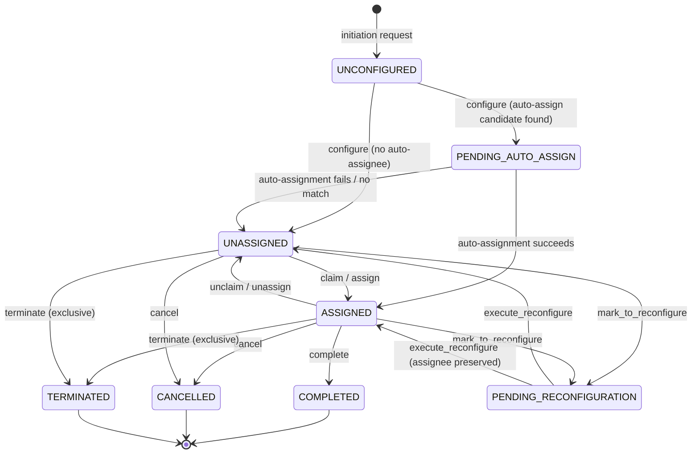

## TL;DR

- A WA task progresses through defined states — `UNCONFIGURED` → `CONFIGURED`/`UNASSIGNED` → `ASSIGNED` → `COMPLETED`/`CANCELLED`/`TERMINATED` — stored in the `cft_task_db` PostgreSQL schema. The CFT database is the single source of truth; Camunda holds only minimal process-management data.
- Task creation is triggered by CCD case events flowing through `wa-case-event-handler` → `wa-workflow-api` → Camunda BPMN → `wa-task-management-api` initiation endpoint. Event processing follows a strict handler order: **Cancel → Warn → Reconfigure → Initiate**.
- Every user action on a task (claim, assign, complete, cancel) is gated by role assignments fetched from `am-role-assignment-service`; the granular permission model defines 16 permission types including `READ`, `CLAIM`, `OWN`, `EXECUTE`, `MANAGE`, `ASSIGN`, `COMPLETE`, `CANCEL`, `COMPLETE_OWN`, `CANCEL_OWN`, plus compound assign variants.
- Cross-database consistency between CFT PostgreSQL and Camunda is maintained by a transactionality pattern: lock CFT rows, make all DB changes, issue a single Camunda API call, then commit.
- `wa-task-monitor` runs scheduled jobs to detect stuck tasks still in `UNCONFIGURED` state and re-trigger initiation, as well as handling termination and reconfiguration of stale tasks.
- Two tiers of service-level access exist beyond user roles: **privileged** (e.g. `xui_webapp`, `ccd_case_disposer`) and **exclusive** (e.g. `wa_task_monitor`, `wa_case_event_handler`) — enforced via S2S token identity.

## Task states

### Dual-database state model

WA maintains task state in two databases concurrently: the **CFT Task DB** (PostgreSQL, authoritative) and the **Camunda Task Repository** (process-management only). The CFT database is the single source of truth for all task data. Camunda holds only the minimal state needed to manage the surrounding BPMN process: whether the task is `Active`, `Historic Pending Terminate`, or `Historic`.

| Camunda State | Meaning | Transition trigger |
|---|---|---|
| `Active` | Task is in progress (user task element exists in BPMN) | Completion or process-engine deletion |
| `Historic Pending Terminate` | Camunda task completed/deleted; awaiting CFT cleanup | Termination job processes it |
| `Historic` | Fully terminated in both repositories | Purge (data retention) |

### CFT task states

The authoritative state enum is `CFTTaskState` (`CFTTaskState.java`). The following states are defined:

| State | DB Code | Description |
|-------|---------|-------------|
| `UNCONFIGURED` | `UCNF` | Task just created in Camunda; not yet enriched with DMN configuration data. |
| `PENDING_AUTO_ASSIGN` | `PA` | Transient state while the auto-assignment query runs against AM. |
| `CONFIGURED` | `CNF` | DMN configuration applied but task not yet surfaced for assignment. |
| `UNASSIGNED` | `U` | Fully configured task available in the work basket — no assignee. |
| `ASSIGNED` | `A` | A user has claimed or been assigned the task. |
| `PENDING_RECONFIGURATION` | `PR` | Marked for re-evaluation of DMN attributes (e.g. after case data change). |
| `COMPLETED` | `C` | Task finished successfully by user action or system completion. |
| `CANCELLED` | `CAN` | Task cancelled by user action or case-event-driven cancellation. |
| `TERMINATED` | `T` | Terminal state set by the exclusive terminate endpoint or error recovery. |

A task is considered **active** if its state is not `TERMINATED`, `COMPLETED`, or `CANCELLED` (`TaskResource:597`). Only `ASSIGNED` and `UNASSIGNED` tasks with `indexed=true` appear in the GIN-based search index used by production search queries.

## State transitions



### Key transition details

- **Claim** (`POST /task/{id}/claim`, `TaskActionsController:148`): requires the caller to hold `CLAIM+OWN` or `CLAIM+EXECUTE` or `ASSIGN+EXECUTE` or `ASSIGN+OWN` permissions. Sets state to `ASSIGNED`. Throws `ConflictException` (409) if the task is already assigned to a different user (`TaskManagementService:215`).
- **Assign** (`POST /task/{id}/assign`, `TaskActionsController:199`): the assigner needs `MANAGE`, `ASSIGN`, or `UNASSIGN_CLAIM` permission; the assignee needs `OWN` or `EXECUTE`. Both sets of role assignments are verified independently.
- **Unclaim** (`POST /task/{id}/unclaim`): sets state to `UNASSIGNED`; caller must be the current assignee or hold `UNASSIGN` permission (`TaskManagementService:272`).
- **Complete** (`POST /task/{id}/complete`, `TaskActionsController:234`): idempotent — if the task is already `COMPLETED` or `TERMINATED` with reason `completed`, no error is thrown and the Camunda call is skipped (`TaskManagementService:459`). The optional `completionOptions` body is restricted to privileged S2S clients.
- **Cancel** (`POST /task/{id}/cancel`, `TaskActionsController:283`): sets state to `CANCELLED`. If the Camunda cancellation call fails and no CFT task state exists in Camunda, the task transitions to `TERMINATED` instead (`TaskManagementService:424`).
- **Terminate** (`DELETE /task/{id}`, `ExclusiveTaskActionsController:113`): exclusive S2S access only. Used by the termination job and internal cleanup processes.

## Cross-database transactionality

Maintaining consistency between the CFT and Camunda databases is critical. The system uses the following transaction pattern for operations that affect both stores (complete, cancel):

1. **Lock** all affected task rows in the CFT database (pessimistic lock).
2. **Apply** all CFT DB changes (state update, audit columns, etc.).
3. **Single Camunda API call** — complete or escalate the task in Camunda. Only one call is made to ensure Camunda's internal transactionality provides atomicity.
4. **Commit** the CFT database transaction.

If the Camunda API call fails (e.g. the task was already deleted by a competing process), the CFT transaction is rolled back and the client receives an error. This provides the same guarantee as XA transactions without requiring a distributed transaction manager.

For **reconfiguration**, the pattern extends to lock all active tasks for a case atomically, since the set of tasks is inconsistent while some have been reconfigured and others have not.

<!-- CONFLUENCE-ONLY: transactionality pattern described in HLD - Task Repository v1.2 section 2.5.3; not explicitly documented as a code comment but implemented in TaskManagementService -->

## Task creation and configuration

### The initiation flow

1. A CCD case event is published to the Azure Service Bus `ccd-case-events` topic.
2. `wa-case-event-handler` consumes the message, persists it for deduplication, and calls `wa-workflow-api`.
3. `wa-workflow-api` evaluates Camunda DMN rules and correlates a message to the task BPMN process instance, which creates a Camunda task in `UNCONFIGURED` state.
4. The BPMN process calls `POST /task/{id}/initiation` on `wa-task-management-api` (exclusive S2S only, `ExclusiveTaskActionsController:68`).
5. `wa-task-management-api` validates required fields (`name`, `taskType`, `caseId` by default) then runs configuration.

### Configuration phase

`ConfigureTaskService.configureCFTTask(skeletonTask, taskToConfigure)` (`ConfigureTaskService:30`) applies DMN-derived values to the task. The service iterates all registered `TaskConfigurator` beans in order; the last configurator wins for overlapping keys because values are merged via `putAll` (`ConfigureTaskService:62-67`). Fields listed in `config.dmnConfigFieldsWithInternalDefaults` (default: `title`) are filled by internal logic unless overridden by DMN.

### Auto-assignment phase

After configuration, `TaskAutoAssignmentService.autoAssignCFTTask` queries `am-role-assignment-service` for `SPECIFIC` grant-type role assignments scoped to the task's `caseId` where the role has `own=true` and `autoAssignable=true` in the task's `TaskRoleResource` rows (`RoleAssignmentService:151`). If a matching role holder is found, the task moves directly to `ASSIGNED`; otherwise it settles in `UNASSIGNED`.

## Access control enforcement

### Role assignment verification

Every user-facing action on a task passes through `RoleAssignmentVerificationService.verifyRoleAssignments` (`RoleAssignmentVerificationService:40`). The flow:

1. `AccessControlService.getRoles(authToken)` calls IDAM to resolve the user ID, then fetches role assignments from `am-role-assignment-service` via `GET /am/role-assignments/actors/{user-id}` (`AccessControlService:30`).
2. CASE-type role assignments are filtered to those whose `caseId` attribute matches the task's case. Assignments without a `caseId` attribute are silently dropped (`RoleAssignmentVerificationService:58`).
3. The filtered assignments are joined against the task's `task_roles` table rows in the database query to determine if the user holds the required `PermissionTypes` for the action.
4. On failure, a `RoleAssignmentVerificationException` (HTTP 403) is thrown and the attempt is logged to `sensitive_task_event_logs` with a 90-day TTL.

### Permission types

The full set of granular permissions (`PermissionTypes` enum):

`READ`, `REFER`, `OWN`, `MANAGE`, `EXECUTE`, `CANCEL`, `COMPLETE`, `COMPLETE_OWN`, `CANCEL_OWN`, `CLAIM`, `UNCLAIM`, `ASSIGN`, `UNASSIGN`, `UNCLAIM_ASSIGN`, `UNASSIGN_CLAIM`, `UNASSIGN_ASSIGN`

These are stored per-task per-role in the `task_roles` table (added granularly in migration `V1.0.18`).

Note: `REFER` is retained for backward compatibility but is functionally unused.

### Search request context

The `POST /task` search endpoint accepts an optional `request_context` field (`RequestContext` enum) that determines which permission is applied during the search query:

| `request_context` value | Permission applied | UI usage |
|---|---|---|
| `ALL_WORK` | `MANAGE` | All Work tab (supervisor view) |
| `AVAILABLE_TASKS` | `CLAIM` + `OWN` | Available Tasks tab |
| _(absent)_ | `READ` | General search / case-level task list |

If `request_context` is present but null/empty/invalid, a 400 Bad Request is returned. The legacy `available_tasks_only` search parameter is deprecated and ignored when `request_context` is provided.

### Legacy permission equivalence

When migrating from the pre-granular model, the following mapping preserves existing user capabilities:

| Legacy permission | Equivalent granular set |
|---|---|
| `Manage` | `Manage` + `Unassign` + `Assign` + `Complete` |
| `Cancel` | `Cancel` |
| `Own` | `Own` + `Claim` |
| `Execute` | `Execute` + `Claim` |

### S2S tiered access

Beyond user-level permissions, the service enforces two tiers of service-to-service access checked via `ClientAccessControlService`:

| Tier | Clients (default config) | Capabilities |
|------|--------------------------|--------------|
| **Privileged** | `wa_task_management_api`, `xui_webapp`, `ccd_case_disposer` | Supply `completionOptions`, delete tasks by case |
| **Exclusive** | `wa_task_management_api`, `wa_task_monitor`, `wa_case_event_handler`, `wa_workflow_api` | Initiate tasks, terminate tasks, run bulk operations, add notes |

## The task monitor: detecting stuck tasks

`wa-task-monitor` (port 8077) is a job-runner service with no persistent database. It exposes a single endpoint (`POST /monitor/tasks/jobs`) triggered externally by `wa-task-batch-service` running as a Kubernetes CronJob.

### INITIATION job — recovering unconfigured tasks

The most important job for lifecycle reliability. It detects tasks that failed their initial configuration callback:

1. Queries Camunda `POST /task` for tasks with variable `cftTaskState = unconfigured` created within the last `camundaTimeLimit` minutes (default 120) (`InitiationJobService.java:118-136`).
2. For each task, fetches process variables via `GET /task/{id}/variables`.
3. Posts `InitiateTaskRequest(INITIATION, attributes)` to `POST /task/{id}/initiation` on `wa-task-management-api`.
4. Failures are caught per-task, logged, and collected in a `GenericJobReport`; the job continues with remaining tasks (`InitiationJobService.java:96-104`).

Configuration: `INITIATION_CAMUNDA_MAX_RESULTS` (default `100`), `INITIATION_TIME_LIMIT_FLAG` (default `true`), `INITIATION_TIME_LIMIT` (default `120` minutes).

The companion **TASK_INITIATION_FAILURES** job is diagnostic-only: it queries for tasks with `cftTaskState=unconfigured` and `createdBefore = now() - camundaTimeLimit` (older than expected), logs them as `WARN`, but does not re-initiate.

### TERMINATION job — cleaning up completed BPMN instances

1. Queries Camunda history (`POST /history/task`) for tasks with `cftTaskState = pendingTermination` that finished within the time window (`TerminationJobService.java:82-98`).
2. For each historic task, calls `DELETE /task/{id}` on `wa-task-management-api` passing the `deleteReason` from Camunda (`TerminationJobService.java:65-79`).

This ensures that tasks whose BPMN process completed (e.g. due to case-event-driven cancellation via `wa-workflow-api`) have their CFT database records moved to `TERMINATED` state.

### RECONFIGURATION job — applying pending reconfigurations

Does not interact with Camunda directly. Calls `POST /task/operation` on `wa-task-management-api` with operation `EXECUTE_RECONFIGURE`, selecting tasks whose `reconfigure_request_time` is within the configured window (default 2 hours, `ReconfigurationJobService.java:45-66`). The task-management-api re-evaluates DMN rules and updates task attributes.

#### Reconfiguration detail

When a task is reconfigured (as opposed to initially configured), only rows in the task configuration DMN with the **`Reconfigure` column set to `true`** are applied. This allows certain attributes (e.g. the original `dueDate`) to be immutable after creation while others (e.g. `priority`, `locationName`) are refreshed from current case data.

After reconfiguration, the auto-assignment logic re-runs:
1. Validates the existing assignee still has valid role assignments for the reconfigured task
2. If invalid, removes the assignee (task becomes `UNASSIGNED`)
3. If no assignee, attempts auto-assignment using the standard case-role query

Tasks in terminal states (`COMPLETED`, `CANCELLED`, `TERMINATED`) are never reconfigured.

### Other maintenance jobs

| Job name | Purpose |
|----------|---------|
| `MAINTENANCE_CAMUNDA_TASK_CLEAN_UP` | Deletes old Camunda process instances in non-prod environments only (blocked on `prod`) |
| `AD_HOC_PENDING_TERMINATION_TASKS` | Removes stale `cftTaskState` history variables from Camunda |
| `UPDATE_SEARCH_INDEX` | Sets `indexed=true` on tasks to include them in the GIN search index |
| `CLEANUP_SENSITIVE_LOG_ENTRIES` | Purges expired rows from `sensitive_task_event_logs` |
| `PERFORM_REPLICATION_CHECK` | Checks logical replication lag between primary and read replica |

## Event-driven cancellation and warnings

When a CCD case event is processed by `wa-case-event-handler`, the handlers execute in a strict order enforced by Spring `@Order` annotations:

1. **Cancel** (`@Order(1)`) — evaluates cancellation DMN rules, sends Camunda cancellation messages
2. **Warn** (`@Order(2)`) — evaluates warning rules, applies warning notes to tasks via a non-interrupting BPMN subprocess
3. **Reconfigure** (`@Order(3)`) — evaluates reconfiguration rules, marks tasks for reconfiguration
4. **Initiate** (`@Order(4)`) — evaluates initiation DMN rules, creates new tasks

This ordering ensures cancellation completes before initiation proceeds, avoiding scenarios where a task would be initiated and then immediately cancelled.

### Cancellation DMN configuration

Services configure event-driven cancellation using a DMN table with the following columns:

| Column | Description |
|--------|-------------|
| `FromState` | Regex matching the case state before the event (e.g. `State1\|State2`) |
| `Event` | Regex matching the CCD event ID (e.g. `Event1\|Event2`) |
| `ToState` | Regex matching the resulting case state (e.g. `.*` for any) |
| `Action` | One of `Cancel`, `Warn`, or `Reconfigure` |
| `Categories` | Comma-separated list of process categories (intersection/AND logic). Empty = all processes. |

**Process categories** are arbitrary flags applied to Camunda processes as process variables. Cancellation targets processes matching **all** listed categories (intersection, not union).

### Warnings

Warnings are applied via the same DMN table with `Action=Warn`. Additional columns `Code` and `Text` provide the warning content. Warnings are stored in the `task_notes` table with appropriate `note_type` and surfaced in the UI via the `has_warnings` flag on the task.

<!-- CONFLUENCE-ONLY: warning DMN columns (Code, Text) and process-category variable naming convention not verified in source -->

## Execution types

Each task has an `execution_type` that tells the UI how to launch and complete it. The `ExecutionType` enum (`ExecutionType.java`) defines:

| Code | Name | Description |
|------|------|-------------|
| `MANUAL` | Manual | The task is carried out manually and must be completed by the user in the task management UI. |
| `BUILT_IN` | Built In | The application knows how to launch and complete this task based on its `formKey` (e.g. specific access request approval). |
| `CASE_EVENT` | Case Management Task | The task requires a CCD case management event to be executed by the user. |

<!-- DIVERGENCE: Confluence HLD says the code is "CASE_MANAGEMENT" but wa-task-management-api:src/main/java/.../cft/enums/ExecutionType.java shows "CASE_EVENT". Source wins. -->

### Event completion mode

For `CASE_EVENT` tasks, the `eventCompletionMode` attribute (set during configuration) controls how the UI handles completion when a user submits a CCD event that matches the task's configured `completionEvents`:

| Mode | Behaviour |
|------|-----------|
| `auto` | Task completed automatically without prompt |
| `defaultYes` | User prompted; default is to complete the task |
| `defaultNo` | User prompted; default is not to complete |
| `defaultNone` | User prompted; no default selection |

<!-- CONFLUENCE-ONLY: eventCompletionMode behaviour described in HLD - Task Management v1.6 section 2.11; not verified as an enum in source -->

## Audit trail

Every state transition records:
- `last_updated_action` — the `TaskAction` enum value (e.g. `CLAIM`, `AUTO_ASSIGN`, `CONFIGURE`, `CANCEL`)
- `last_updated_user` — the user or service that performed the action
- `last_updated_timestamp` — when the transition occurred

These columns were added in migration `V1.0.21`. The `termination_process` column (added `V1.0.36`, extended `V1.0.38`) records the sub-type for terminal transitions. The `TerminationProcess` enum (`TerminationProcess.java`) defines the following values:

| Enum constant | Serialised value |
|---|---|
| `EXUI_USER_COMPLETION` | `EXUI_USER_COMPLETION` |
| `EXUI_CASE_EVENT_COMPLETION` | `EXUI_CASE-EVENT_COMPLETION` |
| `EXUI_USER_CANCELLATION` | `EXUI_USER_CANCELLATION` |
| `EXUI_CASE_EVENT_CANCELLATION` | `CASE_EVENT_CANCELLATION` |

Note: the serialised JSON values differ from the enum constant names (the completion value uses a hyphen: `CASE-EVENT`).

## Examples

### CFTTaskState enum

The authoritative set of task states and their compact database abbreviations:

```java
// Source: apps/wa/wa-task-management-api/src/main/java/uk/gov/hmcts/reform/wataskmanagementapi/cft/enums/CFTTaskState.java
public enum CFTTaskState {
    UNCONFIGURED("UNCONFIGURED", "UCNF"),     // created in Camunda; awaiting DMN configuration
    PENDING_AUTO_ASSIGN("PENDING_AUTO_ASSIGN", "PA"),  // transient: auto-assignment query running
    ASSIGNED("ASSIGNED", "A"),                // user has claimed or been assigned
    CONFIGURED("CONFIGURED", "CNF"),          // DMN applied; not yet released to queue
    UNASSIGNED("UNASSIGNED", "U"),            // available in work queue
    COMPLETED("COMPLETED", "C"),              // finished — terminal
    CANCELLED("CANCELLED", "CAN"),            // cancelled — terminal
    TERMINATED("TERMINATED", "T"),            // terminated — terminal
    PENDING_RECONFIGURATION("PENDING_RECONFIGURATION", "PR");  // marked for DMN re-evaluation

    private String value;        // e.g. "UNCONFIGURED"
    private String abbreviation; // e.g. "UCNF" — used in DB compact storage
}
```

### Task Management API: jurisdiction and S2S configuration

```yaml
// Source: apps/wa/wa-task-management-api/src/main/resources/application.yaml
config:
  # Jurisdictions permitted to use Work Allocation
  allowedJurisdictions: ${ALLOWED_JURISDICTIONS:ia,wa,sscs,civil,publiclaw,privatelaw,employment,st_cic}
  # Case types permitted to use Work Allocation
  allowedCaseTypes: ${ALLOWED_CASE_TYPES:asylum,wacasetype,sscs,civil,generalapplication,...}
  # S2S clients allowed to supply completionOptions or delete tasks by case
  privilegedAccessClients: ${TASK_MANAGEMENT_PRIVILEGED_CLIENTS:wa_task_management_api,xui_webapp,ccd_case_disposer}
  # S2S clients allowed to initiate/terminate tasks and run bulk operations
  exclusiveAccessClients: ${TASK_MANAGEMENT_EXCLUSIVE_CLIENTS:wa_task_management_api,wa_task_monitor,wa_case_event_handler,wa_workflow_api}
  # Mandatory fields that must be present on initiation requests
  initiationRequestRequiredFields: ${INITIATION_REQUEST_REQUIRED_FIELDS:name,taskType,caseId}
```

### Task Monitor job configuration

```yaml
// Source: apps/wa/wa-task-monitor/src/main/resources/application.yaml
job:
  initiation:
    camunda-max-results: ${INITIATION_CAMUNDA_MAX_RESULTS:100}   # max tasks per INITIATION run
    camunda-time-limit-flag: ${INITIATION_TIME_LIMIT_FLAG:true}  # apply time-window filter?
    camunda-time-limit: ${INITIATION_TIME_LIMIT:120}             # minutes lookback for unconfigured tasks
  termination:
    camunda-max-results: ${TERMINATION_CAMUNDA_MAX_RESULTS:100}
    camunda-time-limit: ${TERMINATION_TIME_LIMIT:120}
  reconfiguration:
    reconfigure_request_time_hours: ${RECONFIGURE_REQUEST_TIME_HOURS:2}  # hours before reconfiguration triggers
```

## See also

- [Task States](../reference/task-states.md) — authoritative reference for all state values, transitions, actions, and termination sub-types
- [Access Control](access-control.md) — detailed explanation of the permission model and how role assignments are evaluated
- [BPMN Workflows](bpmn-workflows.md) — the dual-state model and how Camunda task state relates to CFT task state
- [API: Task Management](../reference/api-task-management.md) — endpoint reference for claim, assign, complete, cancel, and batch operations
- [How-to: Debug Stuck Tasks](../how-to/debug-stuck-tasks.md) — recovering tasks stuck in `UNCONFIGURED` state
