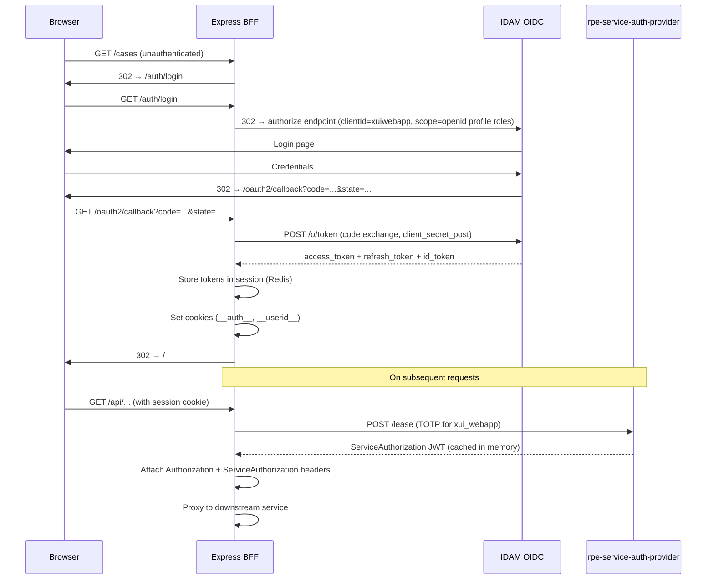
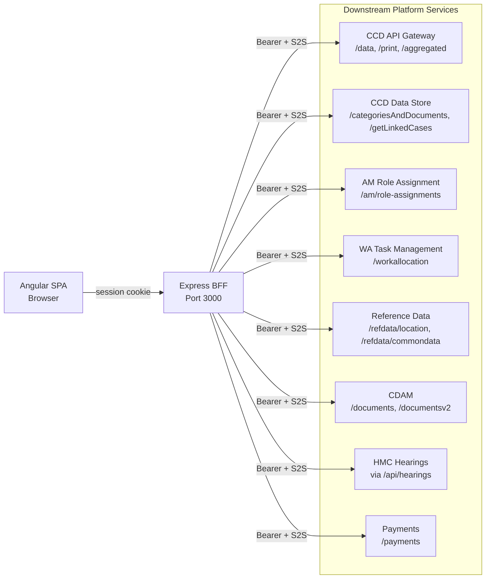

## TL;DR

- XUI apps follow a dual-layer pattern: an Angular SPA served by, and communicating exclusively through, a co-located Express/Node BFF running in the same container.
- Authentication is IDAM OIDC, handled entirely by `@hmcts/rpx-xui-node-lib` middleware which also manages S2S token exchange and session storage.
- Sessions are stored in Redis (Azure Cache for Redis, port 6380, TLS) in deployed environments; file-backed locally.
- The BFF proxies browser requests to downstream services (CCD, AM, WA, RD, Payments, CDAM, HMC) via `http-proxy-middleware`, injecting `Authorization` and `ServiceAuthorization` headers on every call. Proxy routes use prefix-based subtree forwarding and rely on downstream services for fine-grained access control.
- All three apps deploy to AKS (namespace `xui`) via Jenkins (preview/staging) and Flux (higher environments), using the `chart-nodejs` Helm base chart with Azure Cache for Redis and Terraform-provisioned shared infrastructure.
- The Angular SPA is a pure orchestration UI — it holds no case definitions, no business logic, and no direct service-to-service credentials. ExUI holds no persistent data of its own.

## The dual-layer pattern

Every XUI deployed application (Manage Cases, Manage Organisations, Approve Organisation) ships as a single Docker image containing:

1. **Angular SPA** — the static bundle served from the Express process at the root path.
2. **Express BFF** — the Node process listening on port 3000 (env `PORT`), which serves the SPA assets, handles authentication, and proxies all API calls to downstream platform services.

The BFF is built via `createApp()` (`api/application.ts:53`). Middleware is registered in a strict order:

1. Helmet + CSP (when `FEATURE_HELMET_ENABLED=true`) — `api/application.ts:57-93`
2. `cookieParser(SESSION_SECRET)` — `api/application.ts:95`
3. `getXuiNodeMiddleware()` (OIDC session + S2S) — `api/application.ts:110-111`
4. `initProxy(app)` (http-proxy-middleware rules) — `api/application.ts:113-114`, **before** body-parser to allow raw stream proxying
5. `bodyParser.json({limit:'5mb'})` + URL-encoded — `api/application.ts:116-117`
6. API routers (`/am`, `/api`, `/external`, `/workallocation`)
7. CSRF middleware
8. Static file serving + SPA catch-all

The SPA bootstraps by fetching `GET /external/config/ui` (unauthenticated) to obtain runtime configuration including the LaunchDarkly client ID, then loads user details from `GET /api/user/details` after authentication.

## Authentication flow: IDAM OIDC

Authentication is delegated to `@hmcts/rpx-xui-node-lib`, which exposes a singleton `xuiNode` that mounts session and auth middleware onto the Express router in a fixed order: session first, then auth (`xuiNode.class.ts:15`).



### Key configuration

| Setting | Value | Source |
|---------|-------|--------|
| IDAM client ID | `xuiwebapp` | `config/default.json:82` |
| S2S microservice name | `xui_webapp` | `config/default.json:116` |
| Discovery endpoint | `${SERVICES_IDAM_LOGIN_URL}/o/.well-known/openid-configuration` | `api/auth/index.ts:104` |
| Token auth method | `client_secret_post` | `api/auth/index.ts` |
| OAuth2 callback path | `/oauth2/callback` | `config/default.json:84` |
| SSO logout URL | `${idamWebUrl}/o/endSession` | `api/auth/index.ts` |

The node-lib's OIDC middleware (`openid.class.ts:138-143`) performs discovery at startup via `openid-client`'s `Issuer.discover()`. If IDAM is unreachable, an `idamCheck` at startup calls `process.exit(1)` (`api/application.ts:144`).

### S2S token caching

The S2S middleware (`s2s.class.ts:47-66`) generates a TOTP from the app secret using `otplib`, POSTs it to `rpe-service-auth-provider/lease`, and caches the returned JWT in memory keyed by microservice name. The token's `exp` claim is checked on each request; a new token is obtained only on expiry (`s2s.class.ts:68-74`).

## Session management (Redis)

In deployed environments, sessions are stored in Azure Cache for Redis:

| Parameter | Value |
|-----------|-------|
| Port | 6380 (TLS) |
| Key prefix | `activity:` |
| TTL (default) | 86400 seconds (24 hours) — `config/default.json` |
| TTL (preview override) | 6000 seconds — `values.yaml` |
| Connection secret | `secrets.rpx.webapp-redis6-connection-string` (aliased to `webapp-redis-connection-string`) |
| Feature gate | `FEATURE_REDIS_ENABLED=true` |

The node-lib's `RedisSessionStore` (`redisSessionStore.class.ts:17-51`) uses `redis` v3 client with `connect-redis` v4. It emits `redisStore.ClientReady` and `redisStore.ClientError` events propagated to `xuiNode` for BFF-level health checks.

For local development, a file-backed session store writes to `.sessions` or `/tmp/sessions`.

Session cookies:

- `__auth__` — the IDAM access token (set on successful auth callback)
- `__userid__` — the user's IDAM UID
- Session cookie name — `xui-webapp` (set by node-lib)

Session timeout is role-based: `getUserSessionTimeout` in the node-lib matches user roles against a `sessionTimeouts` array (regex patterns) configured in `config/default.json`. Default idle time is 480 minutes (8 hours); specific role patterns can override this.

## Proxy routing to downstream services

The BFF acts as a gateway, proxying browser requests to platform services. Proxy rules are registered in `api/proxy.config.ts:26` via `http-proxy-middleware` **before** `bodyParser` to preserve raw request streams (important for document uploads).

Every proxied route has `authInterceptor` prepended to its middleware chain (`api/lib/middleware/proxy.ts:119`), ensuring `Authorization` and `ServiceAuthorization` headers are attached.



### Key proxy routes

All proxy routes are prefix-based subtree proxies — any path suffix under the prefix is forwarded to the target service. The BFF does not constrain HTTP methods or validate payloads at the proxy boundary; downstream services are responsible for access control and request validation.

| Browser path | Target service | Config key | Notes |
|---|---|---|---|
| `/activity` | CCD API Gateway | `SERVICES_CCD_COMPONENT_API_PATH` | Rewritten to `/activity` |
| `/data`, `/print` | CCD API Gateway | `SERVICES_CCD_COMPONENT_API_PATH` | Subtree forwarded unchanged |
| `/data/internal/searchCases` | CCD API Gateway | `SERVICES_CCD_COMPONENT_API_PATH` | Intercepts ES response for jurisdiction filtering |
| `/aggregated` | CCD API Gateway | `SERVICES_CCD_COMPONENT_API_PATH` | Caches jurisdiction metadata |
| `/api/addresses` | CCD API Gateway | `SERVICES_CCD_COMPONENT_API_PATH` | Rewritten to `/addresses` |
| `/categoriesAndDocuments` | CCD Data Store | `SERVICES_CCD_DATA_STORE_API_PATH` | |
| `/documentData/caseref` | CCD Data Store | `SERVICES_CCD_DATA_STORE_API_PATH` | |
| `/getLinkedCases` | CCD Data Store | `SERVICES_CCD_DATA_STORE_API_PATH` | |
| `/documents` | DM Store | `SERVICES_DOCUMENTS_API_PATH` | Stream proxy (no body parsing) |
| `/documentsv2` | CDAM v2 | `SERVICES_DOCUMENTS_API_PATH_V2` | Rewritten to `/cases/documents`; stream proxy |
| `/hearing-recordings` | EM HRS | `SERVICES_EM_HRS_API_PATH` | |
| `/em-anno` | EM Annotation | `SERVICES_EM_ANNO_API_URL` | Rewritten to `/api` prefix |
| `/doc-assembly` | EM Doc Assembly | `SERVICES_EM_DOCASSEMBLY_API_URL` | Rewritten to `/api` prefix |
| `/api/markups`, `/api/redaction` | EM NPA (Markup) | `SERVICES_MARKUP_API_URL` | |
| `/icp` | EM ICP | `SERVICES_ICP_API_URL` | **WebSocket** (`ws: true`) |
| `/icp/sessions` | EM ICP | `SERVICES_ICP_API_URL` | Non-WS duplicate for REST calls |
| `/payments` | Payment API | `SERVICES_PAYMENTS_URL` | |
| `/api/refund` | Refunds API | `SERVICES_REFUNDS_API_URL` | Rewritten to `/refund` |
| `/api/notification` | Notifications API | `SERVICES_NOTIFICATIONS_API_URL` | Rewritten to `/notifications` |
| `/api/translation` | Translation Service | `SERVICES_TRANSLATION_API_URL` | Rewritten to `/translation` |
| `/refdata/location` | RD Location Ref | `SERVICES_LOCATION_REF_API_URL` | |
| `/refdata/commondata/lov/categories/CaseLinkingReasonCode` | RD Common Data | `SERVICES_PRD_COMMONDATA_API` | Specific path only |
| `/refdata/commondata/caseflags/service-id=:sid` | RD Common Data | `SERVICES_PRD_COMMONDATA_API` | Path param (not query string) |

<!-- Verified: Confluence "Proxy Configuration on Manage Case" notes /workallocation is NOT a proxy subtree. Confirmed in source: workAllocationRouter is mounted via app.use('/workallocation', workAllocationRouter) in api/application.ts:122, not via applyProxy(). -->

**Note:** The `/workallocation` path is *not* a transparent proxy. It is handled by a local Express router (`workAllocationRouter`) that makes server-side Axios calls to WA APIs and returns composed responses. Invalid subpaths under `/workallocation` fall through to the SPA catch-all.

### Header injection

The `setHeaders` function (`api/lib/proxy.ts`) attaches to every outbound request:

- `Authorization: Bearer <user-access-token>` — forwarded from the incoming request
- `ServiceAuthorization: Bearer <s2s-token>` — injected by node-lib S2S middleware
- `user-roles` — forwarded if present on the incoming request
- `Data-Store-Url`, `Role-Assignment-Url`, `hmctsDeploymentId` — conditionally forwarded when `enableHearingDataSourceHeaders=true`

### Dual proxy pattern

XUI uses two different mechanisms for downstream calls:

1. **`http-proxy-middleware`** — transparent stream proxy for browser-initiated calls (documents, CCD Gateway calls, etc.). The BFF does not parse request/response bodies.
2. **Axios (`api/lib/http`)** — used for server-side orchestration calls (role assignment lookups, user details enrichment, WA task operations). These calls are made by BFF route handlers that parse, transform, and compose responses before returning to the browser.

## Proxy security model

The proxy layer is permissive by design: it uses prefix-based subtree forwarding, meaning any path suffix, HTTP method, or payload under a proxied prefix is forwarded to the fixed downstream target. This architectural choice means:

- **Path pivoting** — an authenticated user can reach any endpoint on a proxied service by altering the URL suffix (the downstream service must enforce its own access control).
- **HTTP method freedom** — the proxy does not restrict methods. A DELETE to `/data/internal/anything` is forwarded to CCD API Gateway; the downstream returns 404/405/500 as appropriate.
- **No payload validation at proxy boundary** — structurally invalid JSON payloads are forwarded; downstream services handle validation.
- **Inbound auth headers** — client-supplied `Authorization`/`ServiceAuthorization` headers are *not* stripped. However, the `authInterceptor` overwrites them with server-generated values, so privilege escalation is not possible. If both client headers and session cookies are supplied, the server-generated headers take precedence.

<!-- CONFLUENCE-ONLY: The "Proxy Configuration on Manage Case" Confluence page documents proposed hardening work (per-prefix path allowlists, HTTP method restrictions, stripping inbound auth headers). As of this writing, these are proposals rather than implemented features. not verified in source -->

**Locally-handled routes** (not proxy surfaces): `/workallocation/*`, `/am/*`, `/api/*`, `/external/*` — these are served by Express routers that make server-side Axios calls with full request parsing.

## Security: CSP and CSRF

**Content Security Policy** — the node-lib's `csp()` middleware generates a `crypto.randomBytes(16)` nonce per request, sets it on `res.locals.cspNonce`, and injects it into `index.html` via template string replacement of `{{cspNonce}}` (`api/application.ts:50`). The Angular SPA reads the nonce from `<meta name="csp-nonce">` at bootstrap.

**CSRF** — `@dr.pogodin/csurf` sets an `XSRF-TOKEN` cookie with `httpOnly: false` so Angular can read it. Angular is configured (`app.module.ts:127-130`) to send the value back as the `X-XSRF-TOKEN` header on mutating requests. GET requests are excluded.

**Additional security headers** (when `FEATURE_HELMET_ENABLED=true`):

- `X-Content-Type-Options: nosniff`
- `X-Frame-Options: DENY`
- `Referrer-Policy: origin`
- `Cross-Origin-Resource-Policy: same-site`
- `X-Powered-By` removed
- `Strict-Transport-Security: max-age=28800000`
- `X-Robots-Tag: noindex`
- `Cache-Control: no-cache, no-store, max-age=0, must-revalidate, proxy-revalidate`

## Deployment and infrastructure

### Container image

All three apps use multi-stage Docker builds based on `hmctsprod.azurecr.io/base/node:20-alpine`. The final runtime stage contains only production node_modules for the API workspace, the compiled Angular bundle (`dist/browser/`), and the `config/` directory for `node-config`.

### Kubernetes deployment

| Parameter | Value |
|-----------|-------|
| Namespace | `xui` |
| Helm base chart | `chart-nodejs` (3.2.0) from `oci://hmctsprod.azurecr.io/helm` |
| Application port | 3000 |
| CPU requests / limits | 250m / 2000m |
| Memory requests / limits | 512Mi / 2048Mi |
| Autoscaling | Up to 16 replicas (target 80% CPU) |
| `NODE_OPTIONS` | `--max-old-space-size=8192` |
| `UV_THREADPOOL_SIZE` | 64 |

### Environments

All environments run on AKS (dual-cluster active/active or single-cluster depending on tier):

| Environment | Deployment mechanism | Image tags |
|---|---|---|
| Preview | Jenkins pipeline (PR builds) | `pr-*` |
| Demo | Flux | `pr-*` or `prod-*` |
| Perftest / ITHC | Flux | `pr-*` or `prod-*` |
| AAT (staging) | Jenkins (staging) + Flux | `prod-*` only |
| Production | Flux | `prod-*` only |

All environments use the `xui` namespace with app names: `xui-webapp`, `xui-mo-webapp`, `xui-ao-webapp`.

### Infrastructure-as-code

Terraform modules in each repo's `infrastructure/` directory provision Azure resources (Key Vaults, Application Insights, Azure Cache for Redis, networking). Shared infrastructure is in `rpx-shared-infrastructure`.

### Key Vault integration

Secrets are mounted from the `rpx` Key Vault at `/mnt/secrets/rpx` via `@hmcts/properties-volume`. Key secrets include:

| Secret name | Purpose |
|---|---|
| `mc-s2s-client-secret` | S2S TOTP secret for `xui_webapp` |
| `mc-idam-client-secret` | IDAM OAuth2 client secret |
| `webapp-redis6-connection-string` | Redis connection (aliased to `webapp-redis-connection-string`) |
| `launch-darkly-client-id` | LaunchDarkly SDK key |
| `system-user-name` / `system-user-password` | System user for background operations |
| `mc-session-secret` | Express session signing secret |
| `appinsights-instrumentationkey-mc` | App Insights instrumentation key |

### Monitoring and health checks

ExUI does not expose its own health endpoints. Instead, the Helm chart's liveness/readiness probes consume downstream service health endpoints (CCD Data Store, CCD Gateway, DM Store, EM Annotation, S2S, WA Task Management, AM Role Assignment, etc.). Application monitoring uses App Insights and Dynatrace.

<!-- CONFLUENCE-ONLY: Confluence "Service Operations Guide" states ExUI holds no persistent data of its own. Confirmed by architecture — sessions are in Redis, case data in CCD, documents in DM Store. not verified in source -->

### Shuttering

Individual jurisdictions can be shuttered (hidden from users) via the CCD UI Shuttering feature (LaunchDarkly flags). This only restricts the ExUI front end; it does not prevent programmatic access via APIs or citizen UIs.

## Examples

### Express middleware chain (`createApp`)

The following shows the exact middleware registration order from the BFF factory function. Proxy registration at step 4 must precede `bodyParser` at step 5 so that raw request streams are forwarded without being consumed.

```typescript
// Source: apps/xui/rpx-xui-webapp/api/application.ts

export async function createApp() {
  const app = express();

  // 1. Helmet + CSP (when FEATURE_HELMET_ENABLED=true)
  if (showFeature(FEATURE_HELMET_ENABLED)) {
    app.use(helmet(getConfigValue(HELMET)));
    const cspMiddleware = csp({ defaultCsp: SECURITY_POLICY, ...MC_CSP });
    app.use(cspMiddleware);
  }

  // 2. Cookie parser
  app.use(cookieParser(getConfigValue(SESSION_SECRET)));

  // 3. OIDC session + S2S middleware from @hmcts/rpx-xui-node-lib
  const xuiNodeMiddleware = await getXuiNodeMiddleware();
  app.use(xuiNodeMiddleware);

  // 4. http-proxy-middleware rules — BEFORE bodyParser to preserve raw streams
  initProxy(app);

  // 5. Body parser
  app.use(bodyParser.json({ limit: '5mb' }));
  app.use(bodyParser.urlencoded({ limit: '5mb', extended: true }));

  // 6. Route mounts
  app.use('/am', amRoutes);
  app.use('/api', routes);
  app.use('/external', openRoutes);
  app.use('/workallocation', workAllocationRouter);

  // 7. CSRF — cookie name XSRF-TOKEN, httpOnly:false so Angular can read it
  app.use(csrf({ cookie: { key: 'XSRF-TOKEN', httpOnly: false, secure: true, path: '/' }, ignoreMethods: ['GET'] }));

  // 8. Static assets + SPA catch-all with CSP nonce injection
  app.use(express.static(staticRoot, { index: false }));
  app.use('/*', (req, res) => {
    const html = injectNonce(indexHtmlRaw, res.locals.cspNonce);
    res.type('html').set('Cache-Control', 'no-store, max-age=0').send(html);
  });

  return app;
}
```

### Auth bootstrap: registering event callbacks and configuring the node-lib

```typescript
// Source: apps/xui/rpx-xui-webapp/api/auth/index.ts

// Called on successful login: sets __auth__ and __userid__ cookies, then redirects to /
xuiNode.on(AUTH.EVENT.AUTHENTICATE_SUCCESS, (req, res, next) => {
  const { user } = req.session.passport;
  res.cookie(getConfigValue(COOKIES_USER_ID), user.userinfo.uid, { sameSite: 'strict' });
  res.cookie(getConfigValue(COOKIES_TOKEN), user.tokenset.accessToken, { sameSite: 'strict' });
  if (!req.isRefresh) return res.redirect('/');
  next();
});

// node-lib options: session store (Redis in prod, file-store locally) + OIDC + S2S
const nodeLibOptions = {
  auth: {
    oidc: {
      clientID: 'xuiwebapp',
      discoveryEndpoint: 'https://idam.../o/.well-known/openid-configuration',
      callbackURL: '/oauth2/callback',
      scope: 'profile openid roles manage-user create-user search-user',
      tokenEndpointAuthMethod: 'client_secret_post',
      allowRolesRegex: 'caseworker',   // reject users without a matching role
      ssoLogoutURL: 'https://idam.../o/endSession',
      // ...
    },
    s2s: {
      microservice: 'xui_webapp',
      s2sEndpointUrl: 'http://rpe-service-auth-provider.../lease',
      s2sSecret: '<from AKS Key Vault>',
    },
  },
  session: showFeature(FEATURE_REDIS_ENABLED) ? redisStoreOptions : fileStoreOptions,
};

return xuiNode.configure(nodeLibOptions);
```

### Service URL resolution: config defaults

```json
// Source: apps/xui/rpx-xui-webapp/config/default.json (excerpt)
{
  "services": {
    "ccd": {
      "componentApi": "https://ccd-api-gateway-web-prod.service.core-compute-prod.internal",
      "dataApi": "http://ccd-data-store-api-prod.service.core-compute-prod.internal",
      "caseAssignmentApi": "http://aac-manage-case-assignment-prod.service.core-compute-prod.internal"
    },
    "idam": {
      "idamClientID": "xuiwebapp",
      "idamLoginUrl": "https://hmcts-access.service.gov.uk",
      "oauthCallbackUrl": "/oauth2/callback"
    }
  },
  "microservice": "xui_webapp",
  "feature": {
    "helmetEnabled": true,
    "redisEnabled": false,
    "oidcEnabled": false,
    "secureCookieEnabled": true
  }
}
```

## See also

- [BFF Pattern](bff-pattern.md) — detailed walkthrough of Express middleware ordering, proxy configuration, auth injection, and error handling
- [Session Management](session-management.md) — OIDC login flow, Redis session store, role-based timeout durations, and client-side idle detection
- [Feature Flags](feature-flags.md) — how BFF config flags and LaunchDarkly client-side flags complement the architecture
- [How-to: Configure for New Service](../how-to/configure-for-new-service.md) — step-by-step guide to adding a downstream service proxy
- [Reference: Config Schema](../reference/config-schema.md) — full reference for `config/default.json` keys, feature flags, and env-var mappings
- [Reference: Downstream Services](../reference/downstream-services.md) — complete catalogue of downstream services by domain
- [Glossary](../reference/glossary.md) — definitions of BFF, CDAM, S2S, subtree proxy, and other key terms
