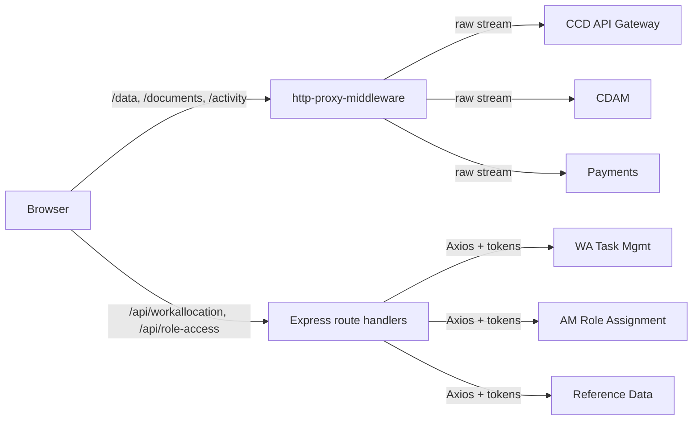

## TL;DR

- XUI's Backend-for-Frontend (BFF) is an Express/Node.js server co-located with the Angular SPA in a single container, listening on port 3000 and proxying all browser requests to downstream HMCTS services.
- Middleware ordering is critical: Helmet/CSP, cookie parser, OIDC session (`@hmcts/rpx-xui-node-lib`), `http-proxy-middleware` proxies, then `bodyParser` — proxies must register before body parsing to forward raw streams.
- All authenticated routes pass through `authInterceptor` (a thin wrapper over `xuiNode.authenticate`), which injects `Authorization` and `ServiceAuthorization` headers.
- Downstream service URLs are resolved via `node-config` from `config/default.json`, overridden per-environment by env vars mapped in `config/custom-environment-variables.json`.
- Two proxy modes coexist: `http-proxy-middleware` for transparent pass-through to CCD API Gateway, documents, payments, etc.; direct Axios calls with explicit token injection for WA, AM, and reference data services.
- Error handling uses Express error middleware plus Axios response interceptors that log timing and forward AppInsights traces.

## Express application bootstrap

The process entry point is `api/server.ts`, which calls `createApp()` from `api/application.ts` and starts listening. `createApp()` is the factory that assembles the entire middleware chain and returns the Express application.

The mount order in `api/application.ts:57–144` is:

1. **Helmet + CSP** (lines 57–93) — when `FEATURE_HELMET_ENABLED=true`. The BFF uses `@hmcts/rpx-xui-node-lib`'s `csp()` factory, which generates a `crypto.randomBytes(16)` nonce per request and exposes it on `res.locals.cspNonce`. The nonce is injected server-side into `index.html` via string replacement of `{{cspNonce}}`.
2. **Cookie parser** (line 95) — `cookieParser(SESSION_SECRET)`.
3. **OIDC/session middleware** (lines 110–111) — `getXuiNodeMiddleware()` mounts the composed router from `rpx-xui-node-lib`.
4. **Proxy middleware** (lines 113–114) — `initProxy(app)` registers all `http-proxy-middleware` rules.
5. **Body parser** (lines 116–117) — `bodyParser.json({limit:'5mb'})` and `urlencoded`. Must come *after* proxy registration so proxied requests can forward raw streams.
6. **Route mounts** — `/am`, `/api`, `/external`, `/workallocation`, CSRF middleware, static file serving, and the SPA catch-all.

## Route structure

Routes are split across several files:

| File | Mount point | Auth required |
|------|-------------|---------------|
| `api/routes.ts` | `/api/*` | Yes (via `authInterceptor` at line 46) |
| `api/openRoutes.ts` | `/external/*` | No |
| `api/workAllocation/routes.ts` | `/workallocation/*` | Yes |
| `api/application.ts` (inline) | `/am` | Yes |

Exceptions to authentication under `/api/*`: `/api/healthCheck`, `/api/monitoring-tools`, and `/api/configuration` are declared before `authInterceptor` at `api/routes.ts:26–43`.

The `/external` open routes expose only `GET /external/configuration-ui` and `GET /external/config/ui` — the Angular SPA fetches these at bootstrap to obtain runtime config (including the LaunchDarkly client ID) before any user authentication occurs.

## Proxy configuration

`api/proxy.config.ts` defines all `http-proxy-middleware` proxy rules via the `initProxy(app)` function (`proxy.config.ts:26`). The helper `applyProxy(app, config, modifyBody)` in `api/lib/middleware/proxy.ts:69` creates each proxy instance.

Key design decisions:

- **Auth injection**: `authInterceptor` is prepended to every proxied route's middleware chain (`api/lib/middleware/proxy.ts:119`), ensuring `Authorization` and `ServiceAuthorization` headers are set before forwarding.
- **Body streaming**: `selfHandleResponse` is `true` only when an `onRes` handler is provided and the source is not `/documents` (which uses stream response directly).
- **URL rewriting**: Each proxy entry specifies `rewrite:false` (preserve original path) or `rewriteUrl` (string or function) to remap paths to the downstream API's expected shape.
- **WebSocket support**: The `/icp` proxy to `SERVICES_ICP_API_URL` sets `ws:true` for in-court presentation streaming (`proxy.config.ts:99–103`).

### Proxied routes

| Source path | Target config key | Notes |
|---|---|---|
| `/activity` | `SERVICES_CCD_COMPONENT_API_PATH` | rewriteUrl `/activity` |
| `/documents` | `SERVICES_DOCUMENTS_API_PATH` | custom onReq/onRes for CDAM; stream response |
| `/hearing-recordings` | `SERVICES_EM_HRS_API_PATH` | |
| `/documentsv2` | `SERVICES_DOCUMENTS_API_PATH_V2` | rewriteUrl `/cases/documents{path}` |
| `/data/internal/searchCases` | `SERVICES_CCD_COMPONENT_API_PATH` | custom Elastic response handler |
| `/print`, `/data` (except searchCases) | `SERVICES_CCD_COMPONENT_API_PATH` | filter excludes searchCases |
| `/api/addresses` | `SERVICES_CCD_COMPONENT_API_PATH` | rewriteUrl `/addresses{path}` |
| `/aggregated` | `SERVICES_CCD_COMPONENT_API_PATH` | onReq/onRes for jurisdiction cache |
| `/icp` | `SERVICES_ICP_API_URL` | WebSocket (`ws:true`) |
| `/icp/sessions` | `SERVICES_ICP_API_URL` | separate non-WS entry for session mgmt |
| `/em-anno` | `SERVICES_EM_ANNO_API_URL` | rewriteUrl `/api{path}` |
| `/doc-assembly` | `SERVICES_EM_DOCASSEMBLY_API_URL` | rewriteUrl `/api{path}` |
| `/api/markups`, `/api/redaction` | `SERVICES_MARKUP_API_URL` | |
| `/payments` | `SERVICES_PAYMENTS_URL` | |
| `/api/refund` | `SERVICES_REFUNDS_API_URL` | rewriteUrl `/refund{path}` |
| `/api/notification` | `SERVICES_NOTIFICATIONS_API_URL` | rewriteUrl `/notifications{path}` |
| `/refdata/location` | `SERVICES_LOCATION_REF_API_URL` | |
| `/refdata/commondata/lov/categories/CaseLinkingReasonCode` | `SERVICES_PRD_COMMONDATA_API` | |
| `/refdata/commondata/caseflags/service-id=:sid` | `SERVICES_PRD_COMMONDATA_API` | |
| `/categoriesAndDocuments` | `SERVICES_CCD_DATA_STORE_API_PATH` | |
| `/documentData/caseref` | `SERVICES_CCD_DATA_STORE_API_PATH` | |
| `/getLinkedCases` | `SERVICES_CCD_DATA_STORE_API_PATH` | |
| `/api/translation` | `SERVICES_TRANSLATION_API_URL` | rewriteUrl `/translation{path}` |

## Downstream service URL resolution

All downstream URLs are resolved through `node-config` (the `config` npm package):

1. **`config/default.json`** — declares every service URL with production-internal defaults (e.g. `http://ccd-data-store-api-prod.service.core-compute-prod.internal`).
2. **`config/custom-environment-variables.json`** — maps environment variable names to config paths. Example: `SERVICES_CCD_DATA_STORE_API_PATH` overrides `services.ccd.dataApi`.
3. **`api/configuration/references.ts`** — exports typed string constants for each config path (e.g. `SERVICES_CCD_DATA_STORE_API_PATH = 'services.ccd.dataApi'`).
4. **`api/configuration/index.ts`** — exposes `getConfigValue<T>(ref)` wrapper that calls `config.get(ref)`.

In deployed environments, `NODE_ENV` is always `production` — the only checked-in config file is `default.json`. Environment-specific overrides arrive via Helm `values.*.template.yaml` which set the corresponding env vars.

AKS Key Vault secrets are mounted at runtime by `@hmcts/properties-volume` and merged into the config object at `configuration/index.ts:6–7` (`propertiesVolume.addTo(config)`). Secret paths follow `secrets.rpx.*` — for example `secrets.rpx.mc-s2s-client-secret`, `secrets.rpx.mc-idam-client-secret`.

### Feature flags via node-config

Boolean feature flags live under `feature.*` in `default.json` with env var overrides. All flag env vars require `__format: "json"` — they must be set as `"true"` or `"false"` strings:

| Flag | Config path | Default |
|------|-------------|---------|
| `FEATURE_HELMET_ENABLED` | `feature.helmetEnabled` | `true` |
| `FEATURE_REDIS_ENABLED` | `feature.redisEnabled` | `false` |
| `FEATURE_OIDC_ENABLED` | `feature.oidcEnabled` | `false` |
| `FEATURE_SECURE_COOKIE_ENABLED` | `feature.secureCookieEnabled` | `true` |
| `FEATURE_WORKALLOCATION_ENABLED` | `feature.workAllocationEnabled` | `false` |
| `FEATURE_ACCESS_MANAGEMENT_ENABLED` | `feature.accessManagementEnabled` | `true` |

## Auth-interceptor middleware chain

Authentication is handled almost entirely by `@hmcts/rpx-xui-node-lib`. The BFF's own code is minimal:

### `rpx-xui-node-lib` middleware composition

The `XuiNode` class (`rpx-xui-node-lib:src/common/models/xuiNode.class.ts:7`) orchestrates middleware in a fixed order: `['session', 'auth']` (line 15). Calling `xuiNode.configure(options)` dynamically imports each layer and calls `configure()` on its sub-keys:

```
xuiNode.configure({
  session: { redisStore: { ... } },   // or fileStore for local dev
  auth:    { oidc: { ... }, s2s: { ... } }
})
```

Each layer mounts its Router internally. If any middleware exposes an `authenticate` method, it is promoted to `xuiNode.authenticate` — the per-request guard BFFs use (`xuiNode.class.ts:88–91`).

The library's responsibilities (from its design spec) include: session creation, initiating OIDC authentication, issuing and storing session tokens in the session store, checking requests for valid tokens, session renewal, session termination (logout), and S2S token lifecycle management.

#### Session store

Sessions are stored in Azure Cache for Redis in deployed environments. The consuming application creates its own Redis instance and passes the URL, secret, and session secret into the library via `session.redisStore` configuration. For local development and test environments, a file-based store (`session.fileStore`) can be substituted.

The library handles the race condition of multiple load-balanced instances sharing a Redis backend — the connection is initialised at application startup through `configure()` so that subsequent requests from either instance resolve correctly.

#### Event callbacks

The library emits lifecycle events that consuming BFFs can subscribe to:

- `sessionCreate(sessionId)` — fired when a session is created (before authentication completes)
- `verify(sessionId)` — fired during authentication to allow role/access checks
- `setTTL(sessionId)` — fired after authentication to allow the BFF to configure session expiry
- `sessionTimeout(sessionId)` — fired before session timeout; session can be extended by calling `renewSession()`
<!-- CONFLUENCE-ONLY: not verified in source -->

### OIDC flow

The `OpenID` class (`rpx-xui-node-lib:src/auth/oidc/models/openid.class.ts:24`) wraps `openid-client` and Passport:

1. At startup, performs OIDC discovery against `${SERVICES_IDAM_LOGIN_URL}/o/.well-known/openid-configuration`.
2. Registers routes: `GET /auth/login`, `GET /oauth2/callback`, `GET /auth/logout`, `GET /auth/isAuthenticated`, `GET /auth/keepalive`.
3. On each request, `setHeaders` injects `Authorization: Bearer <accessToken>` and `user-roles: <comma-joined-roles>` (`strategy.class.ts:450–464`).
4. Token refresh is handled by `keepAliveHandler` which calls `client.refresh(refreshToken)` silently.

### S2S token exchange

The `S2SAuth` class (`rpx-xui-node-lib:src/auth/s2s/s2s.class.ts:11`) acquires service-to-service tokens:

1. On each request, checks an in-memory token cache keyed by microservice name.
2. On cache miss, generates a TOTP via `otplib.authenticator.generate(s2sSecret)` and POSTs to the S2S lease endpoint (`POST <s2sEndpointUrl>` with `{ microservice, oneTimePassword }`).
3. Sets `req.headers.ServiceAuthorization = 'Bearer <token>'` (`s2s.class.ts:52`).
4. Token is cached in-memory until its JWT `exp` claim expires.

### The `authInterceptor` in the BFF

`api/lib/middleware/auth.ts:5` exports `authInterceptor` as a thin re-export of `xuiNode.authenticate`. This is applied:

- Globally to all `/api/*` routes at `api/routes.ts:46`.
- Per-route on every proxy via `applyProxy`'s middleware array (`api/lib/middleware/proxy.ts:119`).

### Header forwarding for downstream calls

`api/lib/proxy.ts:setHeaders` attaches to direct Axios calls:

- `Authorization` — forwarded from the incoming request.
- `ServiceAuthorization` — S2S token from `rpx-xui-node-lib`.
- `user-roles` — forwarded if present.
- `content-type`, `accept` — set to `application/json`.
- Hearing data-source headers (`Data-Store-Url`, `Role-Assignment-Url`, `hmctsDeploymentId`) — forwarded only when `services.hearings.enableHearingDataSourceHeaders=true`.

Additionally, `api/lib/http/index.ts:5–8` adds `hmcts-deployment-id` globally to all Axios requests when the `PREVIEW_DEPLOYMENT_ID` env var is set.

## Error handling

Error handling operates at two levels:

### Axios response interceptors

`api/lib/interceptors.ts` attaches request/response interceptors to the shared Axios instance. Response interceptors:

- Log timing data for every downstream call.
- Forward trace data to AppInsights for custom event tracking.
- Propagate HTTP error status codes back to the Express response.

### Express error middleware

The Express error handler (registered after all routes in `application.ts`) catches unhandled errors from route handlers and proxy failures. Errors from `http-proxy-middleware` are surfaced via the proxy's `onError` callback (`api/lib/middleware/proxy.ts:115`), which calls `onProxyError`. This handler sends `res.status(500)` with a body containing `{ error: "Error when connecting to remote server", status: 504 }` — note the mismatch between the HTTP status code (500) and the body's `status` field (504). This is a known inconsistency.

### CSRF protection

CSRF uses `@dr.pogodin/csurf`:

- Cookie name: `XSRF-TOKEN` with `httpOnly: false` (so Angular's `HttpClient` can read it).
- Angular sends the token back as header `X-XSRF-TOKEN` (configured in `app.module.ts:127–130`).
- GET requests are exempt.
- Cookie attributes: `sameSite: 'strict'`, `secure: true` (set by `rpx-xui-node-lib:strategy.class.ts:559–577`).

## Dual proxy pattern

The BFF uses two distinct patterns for downstream communication:



1. **Transparent proxy** (`http-proxy-middleware`) — for CCD API Gateway, documents, payments, annotation, and other services where the browser needs a direct pass-through. The BFF adds auth headers but does not parse or transform the body.

2. **Server-side Axios calls** — for work allocation, access management, reference data, and user details where the BFF needs to aggregate, transform, or cache responses before returning them to the Angular client. These use the singleton Axios instance from `api/lib/http/index.ts` with tokens set explicitly by `setHeaders`.

## Security model and hardening considerations

The proxy layer's security posture relies on a combination of server-side auth injection and downstream enforcement:

### Auth header injection

All proxied requests pass through `authInterceptor` before reaching `http-proxy-middleware`. The BFF generates `Authorization` and `ServiceAuthorization` headers server-side from the user's session and the S2S token cache. Client-supplied `Authorization` or `ServiceAuthorization` headers from the browser are **not stripped** — however, the server-side middleware overwrites them before forwarding. If a client supplies fake auth headers without a valid session cookie, the request is rejected at the session-validation stage.

<!-- CONFLUENCE-ONLY: not verified in source -->
<!-- Confluence "Proxy Configuration on Manage Case" states that client-supplied Authorization headers can alter behaviour (e.g. cause 401 when combined with valid session cookie), though they cannot enable privilege escalation. -->

### Subtree proxying risk

The current proxy configuration uses **prefix-based subtree forwarding**: any path suffix under a mounted prefix (e.g. `/data/*`) is forwarded to the downstream service. This means:

- An authenticated user can reach endpoints on a downstream service that the UI never calls, by crafting a path suffix.
- HTTP methods are not restricted at the BFF boundary — a DELETE to `/data/internal/anything` will be forwarded.
- Payload validation is inconsistent: some invalid JSON payloads cause downstream 500s rather than clean 400 rejections.

The downstream services (CCD API Gateway, CDAM, Payments, etc.) enforce their own RBAC and input validation. The BFF does not duplicate that enforcement. This is by design, but it increases reliance on downstream robustness.

### Known route duplication

`api/routes.ts` currently mounts several sub-routers twice due to apparent copy-paste:

- `/am` — `accessManagementRouter` registered at lines 50 and 54
- `/role-access` — `roleAccessRouter` registered at lines 52 and 56
- `/locations` — `locationsRouter` registered at lines 58 and 66

This causes duplicate middleware execution for matching requests. It is a known issue flagged for cleanup.

## Technical debt: dual proxy abstractions

The BFF contains two coexisting proxy abstractions that serve overlapping purposes:

| Module | Purpose | Pattern |
|--------|---------|---------|
| `api/lib/middleware/proxy.ts` | Modern `http-proxy-middleware` wrapper (`applyProxy`) | Forwards raw streams, auth injected via middleware chain |
| `api/lib/proxy.ts` | Legacy Axios-based proxy helpers (`get`, `put`, `post`) | Parses request body, makes Axios call to CCD Component API, returns response |

The legacy `api/lib/proxy.ts` is marked with a `TODO: remove this entire file in favour of middleware/proxy.ts` comment (line 6), with a follow-up note that this requires investigation (EXUI-3967). The legacy helper is still actively used by some route handlers that need to modify or inspect the response before returning it.

Additionally, `api/lib/middleware/proxy.ts` contains `console.log` statements (lines 59, 63) in the `buildPathRewrite` function that bypass the structured `log4jui` logger — another known cleanup item.

### Work allocation route method specificity

The `/workallocation/*` routes (handled locally, not proxied) use `router.use` for most handlers rather than explicit HTTP method verbs (`router.get`, `router.post`, etc.). This means any HTTP method will match a defined route path:

```
router.use('/task/:taskId/:action', postTaskAction);
router.use('/task/:taskId', getTask);
router.use('/caseworker/search', searchCaseWorker);
```

While functionally this works because the handlers only process the expected method, it weakens the route contract — a `DELETE /workallocation/task/123` would match and invoke `getTask` rather than returning 404/405. This is flagged as a hardening item.

## Examples

### Express application bootstrap (`createApp`)

```typescript
// Source: apps/xui/rpx-xui-webapp/api/application.ts

export async function createApp() {
  const app = express();

  if (showFeature(FEATURE_HELMET_ENABLED)) {
    app.use(helmet(getConfigValue(HELMET)));
    app.use(helmet.noSniff());
    app.use(helmet.frameguard({ action: 'deny' }));
    // CSP nonce injected per-request; placeholder {{cspNonce}} replaced in index.html
    const cspMiddleware = csp({ defaultCsp: SECURITY_POLICY, ...MC_CSP });
    app.use(cspMiddleware);
  }

  app.use(cookieParser(getConfigValue(SESSION_SECRET)));

  // OIDC session + S2S middleware from rpx-xui-node-lib
  const xuiNodeMiddleware = await getXuiNodeMiddleware();
  app.use(xuiNodeMiddleware);

  // Proxy rules MUST be registered before bodyParser to allow raw stream forwarding
  initProxy(app);

  app.use(bodyParser.json({ limit: '5mb' }));
  app.use(bodyParser.urlencoded({ limit: '5mb', extended: true }));

  app.use('/am', amRoutes);
  app.use('/api', routes);
  app.use('/external', openRoutes);
  app.use('/workallocation', workAllocationRouter);

  app.use(csrf({ cookie: { key: 'XSRF-TOKEN', httpOnly: false, secure: true, path: '/' }, ignoreMethods: ['GET'] }));
  app.use(express.static(staticRoot, { index: false }));
  app.use('/*', (req, res) => {
    const html = injectNonce(indexHtmlRaw, res.locals.cspNonce);
    res.type('html').set('Cache-Control', 'no-store, max-age=0').send(html);
  });

  return app;
}
```

### Auth interceptor (`authInterceptor`)

```typescript
// Source: apps/xui/rpx-xui-webapp/api/lib/middleware/auth.ts

import { xuiNode } from '@hmcts/rpx-xui-node-lib';
import { RequestHandler } from 'express';

// Thin re-export of xuiNode.authenticate; applied to every authenticated route and proxy
const authInterceptor: RequestHandler = xuiNode.authenticate as unknown as RequestHandler;

export default authInterceptor;
```

### Configuring the node-lib and registering auth event callbacks

```typescript
// Source: apps/xui/rpx-xui-webapp/api/auth/index.ts

xuiNode.on(AUTH.EVENT.AUTHENTICATE_SUCCESS, successCallback);
xuiNode.on(AUTH.EVENT.AUTHENTICATE_FAILURE, failureCallback);

export const getXuiNodeMiddleware = async () => {
  const options: AuthOptions = {
    allowRolesRegex: getConfigValue(LOGIN_ROLE_MATCHER),
    authorizationURL: `${idamWebUrl}/login`,
    callbackURL: getConfigValue(SERVICES_IDAM_OAUTH_CALLBACK_URL),
    clientID: getConfigValue(SERVICES_IDAM_CLIENT_ID),
    clientSecret: getConfigValue(IDAM_SECRET),
    discoveryEndpoint: `${idamWebUrl}/o/.well-known/openid-configuration`,
    responseTypes: ['code'],
    scope: 'profile openid roles manage-user create-user search-user',
    sessionKey: 'xui-webapp',
    tokenEndpointAuthMethod: 'client_secret_post',
    ssoLogoutURL: `${idamWebUrl}/o/endSession`,
    // ...
  };

  const nodeLibOptions = {
    auth: { oidc: options, s2s: { microservice: 'xui_webapp', s2sEndpointUrl: `${s2sPath}/lease`, s2sSecret } },
    session: showFeature(FEATURE_REDIS_ENABLED) ? redisStoreOptions : fileStoreOptions,
  };

  return xuiNode.configure(nodeLibOptions);
};
```

### Proxy rule registration (`proxy.config.ts`)

```typescript
// Source: apps/xui/rpx-xui-webapp/api/proxy.config.ts

export const initProxy = (app: Express) => {
  // Simple rewrite: /activity → CCD API Gateway /activity
  applyProxy(app, {
    rewrite: true,
    rewriteUrl: '/activity',
    source: ['/activity'],
    target: getConfigValue(SERVICES_CCD_COMPONENT_API_PATH),
  });

  // Function rewrite: /documentsv2/… → CDAM /cases/documents/…
  applyProxy(app, {
    rewrite: true,
    rewriteUrl: (path: string) => '/cases/documents' + (path === '/' ? '' : path),
    source: '/documentsv2',
    target: getConfigValue(SERVICES_DOCUMENTS_API_PATH_V2),
  }, false);

  // Filter: /data and /print, but NOT /data/internal/searchCases (handled separately)
  applyProxy(app, {
    filter: ['!/data/internal/searchCases'],
    rewrite: false,
    source: ['/print', '/data'],
    target: getConfigValue(SERVICES_CCD_COMPONENT_API_PATH),
  });

  // WebSocket proxy for In-Court Presentation
  applyProxy(app, {
    rewrite: false,
    source: '/icp',
    target: getConfigValue(SERVICES_ICP_API_URL),
    ws: true,
  });
};
```

### `ProxyConfig` interface

```typescript
// Source: apps/xui/rpx-xui-webapp/api/lib/middleware/proxy.ts

export interface ProxyConfig {
  source: string | string[];    // browser-facing path prefix(es)
  target: string;               // downstream service base URL
  rewrite?: boolean;            // false = pass original path through unchanged
  rewriteUrl?: string | ((path: string, req: any) => string);
  filter?: string | string[];   // exclusion filters (prefix with '!' to negate)
  middlewares?: any[];          // extra middleware before proxy (e.g. bodyParser.json())
  onReq?: (proxyReq: any, req: any, res: any) => void;
  onRes?: (responseBody: string | any, req: any, res: any) => any;
  ws?: boolean;                 // enable WebSocket proxying
}
```

## See also

- [Architecture](architecture.md) — deployment topology, Kubernetes configuration, and the broader security model
- [Session Management](session-management.md) — OIDC login flow, Redis session store, role-based idle timeout, and client-side keepalive
- [How-to: Configure for New Service](../how-to/configure-for-new-service.md) — step-by-step guide to adding a new proxy route
- [Reference: Config Schema](../reference/config-schema.md) — complete reference for `config/default.json`, env vars, feature flags, and Key Vault secrets
- [Reference: Shared Libraries](../reference/shared-libraries.md) — `@hmcts/rpx-xui-node-lib` API reference
- [Glossary](../reference/glossary.md) — definitions of BFF, `applyProxy`, `authInterceptor`, S2S, and subtree proxy

## Glossary

| Term | Definition |
|------|-----------|
| BFF | Backend-for-Frontend — the Express/Node.js layer co-located with the Angular SPA that handles auth, proxying, and server-side orchestration |
| S2S | Service-to-service authentication via TOTP tokens obtained from `rpe-service-auth-provider` |
| `authInterceptor` | Express middleware (`xuiNode.authenticate`) that validates session and injects `Authorization` + `ServiceAuthorization` headers |
| `node-config` | The `config` npm package used to resolve configuration from JSON files and environment variables |
| CSP nonce | A per-request `crypto.randomBytes(16)` value injected into the HTML and CSP header to allow inline scripts |
| Subtree proxy | A prefix-based proxy mount (`app.use('/path', proxy)`) that forwards all requests under that path prefix to a downstream service regardless of the specific path suffix or HTTP method |
| `applyProxy` | The wrapper function in `api/lib/middleware/proxy.ts` that creates and mounts an `http-proxy-middleware` instance with auth, path rewriting, and error handling |
