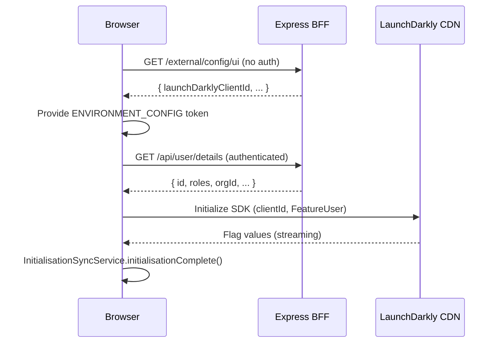

## TL;DR

- XUI uses two layers of feature flags: **server-side BFF flags** (env-var-driven booleans in `node-config`) and **client-side LaunchDarkly flags** (streamed to the Angular SPA via the `launchdarkly-js-client-sdk`).
- The LD client ID is a server-side secret (`secrets.rpx.launch-darkly-client-id`), passed to the SPA at bootstrap via `/external/config/ui` — never embedded in the Angular bundle.
- LD initialisation in Angular is user-scoped: `FeatureUser` is keyed by user ID with `roles` and `orgId`, enabling targeted rollouts and LD segment-based evaluation (e.g. "judicial" vs "solicitors").
- Service message banners are a key multivariate LD use case — JSON arrays of role-scoped, date-bounded messages displayed per-app (`mc-service-messages-dates`, `mo-service-messages-dates`, `qm-service-messages`).
- The `LaunchDarklyService` in `@hmcts/rpx-xui-common-lib` provides an abstraction layer that enables future replacement of LD without app-level changes.
- There is an active plan to **migrate away from LaunchDarkly** toward static config and potentially Azure App Configuration, driven by reliability concerns and cost. No migration code has landed yet.

## Two-tier flag architecture

XUI operates a dual-layer feature-flag system:

1. **Server-side BFF flags** — static booleans evaluated at process start. These are declared in `config/default.json` under the `feature.*` key namespace and overridden via Helm-injected environment variables. They control infrastructure-level behaviours (Redis, Helmet, OIDC mode, compression) that must be resolved before any request is served.

2. **Client-side LaunchDarkly flags** — dynamically evaluated per-user in the browser. These control UI feature visibility, route guards, and CCD toolkit configuration. They stream updates in real-time via the LD SDK's EventSource connection.

The BFF does **not** run a server-side LD SDK (`launchdarkly-node-server-sdk`). All LD evaluation happens client-side in Angular using `launchdarkly-js-client-sdk: 3.8.1` (webapp pins this version; common-lib declares `^3.3.0` as a peer dependency).

### Purpose and CI/CD philosophy

Feature flags support trunk-based development by allowing incomplete features to be deployed but hidden until activated. This avoids long-lived feature branches and painful merges. Features like Query Management were built incrementally behind flags, enabling staged rollout per-environment and per-user-segment without redeployment.

## Server-side BFF flags

All BFF flags live under `feature.*` in `config/default.json:155-173` and are accessed via `showFeature(ref)` from `api/configuration/index.ts`. They are set as JSON-encoded boolean strings (`"true"` / `"false"`) because `custom-environment-variables.json` declares `__format: "json"` for each.

| Flag key (config path) | Env var | Default | Purpose |
|---|---|---|---|
| `feature.appInsightsEnabled` | `FEATURE_APP_INSIGHTS_ENABLED` | `true` | Application Insights telemetry |
| `feature.helmetEnabled` | `FEATURE_HELMET_ENABLED` | `true` | Security headers (CSP, HSTS) |
| `feature.secureCookieEnabled` | `FEATURE_SECURE_COOKIE_ENABLED` | `true` | Secure flag on session cookies |
| `feature.redisEnabled` | `FEATURE_REDIS_ENABLED` | `false` | Redis session store (file-store fallback) |
| `feature.oidcEnabled` | `FEATURE_OIDC_ENABLED` | `false` | OIDC auth mode (vs legacy OAuth2) |
| `feature.workAllocationEnabled` | `FEATURE_WORKALLOCATION_ENABLED` | `false` | WA task-management routes |
| `feature.accessManagementEnabled` | `FEATURE_ACCESS_MANAGEMENT_ENABLED` | `true` | AM role-assignment integration |
| `feature.substantiveRoleEnabled` | `FEATURE_SUBSTANTIVE_ROLE_ENABLED` | `true` | Substantive role filtering |
| `feature.jrdELinksV2Enabled` | `FEATURE_JRD_E_LINKS_V2_ENABLED` | `true` | JRD eLinks v2 judicial ref |
| `feature.termsAndConditionsEnabled` | `FEATURE_TERMS_AND_CONDITIONS_ENABLED` | `false` | T&C acceptance flow |
| `feature.compressionEnabled` | `FEATURE_COMPRESSION_ENABLED` | `false` | Response compression middleware |
| `feature.docsEnabled` | `FEATURE_DOCS_ENABLED` | `false` | Swagger UI at `/api/docs` |
| `feature.proxyEnabled` | `FEATURE_PROXY_ENABLED` | `false` | Legacy proxy mode |
| `feature.lauSpecificChallengedEnabled` | `FEATURE_LAU_SPECIFIC_CHALLENGED_ENABLED` | `false` | LAU challenged-access audit |
| `feature.queryIdamServiceOverride` | `FEATURE_QUERY_IDAM_SERVICE_OVERRIDE` | `true` | IDAM issuer override at startup |

These flags default to safe production values in `default.json`. Deployed environments override them via Helm `values.*.template.yaml` — there are no per-environment JSON config files (`api/configuration/references.ts:119-136`).

## LaunchDarkly client-side integration

### Bootstrap flow

The LD client ID flows from server to client through a deliberate indirection:



1. `src/main.ts:15-21` fetches `/external/config/ui/` and provides the response as `ENVIRONMENT_CONFIG`, which includes `launchDarklyClientId`.
2. After user details load from `/api/user/details`, `AppComponent.initializeFeature()` constructs a `FeatureUser` (keyed by user ID, with `roles` and `orgId`) and calls `featureService.initialize(featureUser, ldClientId)` (`app.component.ts:167-180`).
3. `InitialisationSyncService` (a `BehaviorSubject`-based coordinator) fires `initialisationComplete()`, unblocking `AppConfig` subscriptions to LD-backed values (`initialisation-sync-service.ts`).

### FeatureUser context model

The `FeatureUser` type is defined in `@hmcts/rpx-xui-common-lib`:

```typescript
export class LoggedInFeatureUser {
  public key: string;        // user ID — becomes the LD user key
  [key: string]: any;
  public roles: string[];    // IDAM roles — used for LD segment evaluation
  public orgId: string;      // organisation ID — enables org-targeted rollouts
}

export type FeatureUser = AnonymousFeatureUser | LoggedInFeatureUser;
```

The LD SDK is initialised with `{ kind: 'user', ...user }` as the `LDContext` and `{ useReport: true }` as a client option. The `useReport` flag causes the SDK to use HTTP REPORT instead of GET for flag evaluations, avoiding encoding user context in URLs (which could be logged in server access logs).

<!-- CONFLUENCE-ONLY: Confluence (KT session 2025-08-12) states that "Roles and role assignments are sent to LaunchDarkly during login to allow context-based toggling" and that LD "supports segments (e.g. judicial vs solicitors) determined by user roles passed at login." This is consistent with FeatureUser.roles being set from IDAM user details, but server-side LD segment configuration is not verifiable in source code. -->

### Key Angular wiring

- `app.module.ts:114` — `{ provide: FeatureToggleService, useClass: LaunchDarklyService }` makes LD the concrete feature service for the entire app.
- `McLaunchDarklyService` (`src/app/shared/services/mc-launch-darkly-service.ts`) extends `LaunchDarklyService` with a singleton guard — it uses Angular's `inject()` with `{ skipSelf: true }` to throw on second injection, preventing duplicate LD client instances.
- CSP explicitly allows `*.launchdarkly.com` in `connect-src` (`api/interfaces/csp-config.ts:29`) for the streaming EventSource connection.

### Consuming flags in Angular

The `FeatureToggleService` abstract class (in `@hmcts/rpx-xui-common-lib`) exposes:

| Method | Signature | Use case |
|---|---|---|
| `isEnabled` | `(feature: string, defaultValue?: boolean): Observable<boolean>` | Simple on/off toggles |
| `getValue<T>` | `(feature: string, defaultValue: T): Observable<T>` | Multi-variate flags (arrays, strings, JSON objects); emits default first, then real value |
| `getValueOnce<T>` | `(feature: string, defaultValue: T): Observable<R>` | Single emission from LD SDK directly — used only in Guards to avoid multiple re-evaluations |
| `getValueSync<T>` | `(feature: string, defaultValue: T): R` | Synchronous read — only safe after LD is ready |
| `getArray<T>` | `(feature: string): Observable<T[]>` | Convenience wrapper for array flags (default `[]`) |

The `getValue` method always emits its default value first via a `BehaviorSubject`, then emits the real LD value once the client is ready. Subsequent LD changes stream automatically via `client.on('change:<feature>')`.

### Structural directives

Two structural directives exist for template-level flag gating:

1. **`*xuilibFeatureToggle`** (from `@hmcts/rpx-xui-common-lib`) — subscribes to `FeatureToggleService.isEnabled()` and reactively shows/hides content as the LD flag value changes. This is the preferred approach for LD-backed flags.

2. **`*exuiFeatureToggle`** (from `rpx-xui-webapp`) — reads from `AppConfigService.getFeatureToggle()` (BFF-provided static config). Evaluates once at `ngOnInit` and does not react to changes. Used for BFF-level feature gating in templates.

### Route-level gating

`FeatureToggleGuard` (from `@hmcts/rpx-xui-common-lib`) checks the route's `data.needsFeaturesEnabled` array using `getValueOnce<boolean>`. It supports an `expectFeatureEnabled` flag (default `true`) — when set to `false`, the route is enabled only when the feature is *disabled*. On failure it redirects to `data.featureDisabledRedirect`.

## Client-side flag naming conventions

LD flags in XUI follow these naming patterns:

| Prefix | Pattern | Examples |
|---|---|---|
| `mc-` | Manage Cases UI feature | `mc-cookie-banner-enabled`, `mc-cdam-exclusion-list`, `mc-service-messages-dates` |
| `mo-` | Manage Organisations feature | `mo-service-messages-dates` |
| `qm-` | Query Management scoped | `qm-service-messages` |
| `feature-` | Platform/cross-cutting feature | `feature-global-search`, `feature-refunds` |
| domain-specific | Jurisdictional/service scoping | `icp-enabled`, `icp-jurisdictions`, `wa-landing-page-roles` |
| service-specific | Multi-followup/service toggle | `enable-service-specific-multi-followups` |

### Flag value types

LD flags in XUI can be:

- **Boolean** — simple on/off toggles (most common).
- **String** — multi-variate string values (e.g. release version identifiers like `WorkAllocationRelease2`).
- **JSON arrays** — used for service messages, jurisdiction lists, and WA service configuration.
- **JSON objects** — previously used for complex configs like navigation menu items, but **being phased out** in favour of static code config due to maintenance complexity and lack of version control.

## Service message banners (multivariate flag use case)

Service message banners are the most complex LD flag pattern in XUI. They demonstrate how LD's multivariate JSON capability is used for runtime-configurable, role-scoped, date-bounded notifications.

### Flag keys per application

| Application | Flag key | Component |
|---|---|---|
| Manage Cases | `mc-service-messages-dates` | `xuilib-service-messages` in app-header |
| Manage Organisations | `mo-service-messages-dates` | `xuilib-service-messages` in app-header |
| Query Management | `qm-service-messages` | Inline in query-management-container |

<!-- DIVERGENCE: Confluence (page 1454906347 "Service Message Banners") says the flag keys are `mc-service-messages`, `mo-service-messages`, `ao-service-messages`. Source shows the current keys are `mc-service-messages-dates`, `mo-service-messages-dates`, `qm-service-messages`. The `-dates` suffix was added when start/end date fields were introduced (EXUI-1079). Source wins. -->

### Message data shape

Each flag's value is a `ServiceMessages[]` array:

```typescript
interface ServiceMessages {
  index: number;        // unique message identifier
  roles: string;        // regex pattern matched against user roles
  message_en: string;   // English banner text (HTML allowed, no <script>/<link>)
  message_cy: string;   // Welsh translation
  begin?: string;       // ISO date string — message activates after this time
  end?: string;         // ISO date string — message deactivates after this time
}
```

<!-- DIVERGENCE: Confluence (page 1454906347) describes the original design as a flat `{ role: message }` object. Source shows the current implementation uses a structured array with `index`, `roles`, `message_en`, `message_cy`, `begin`, `end` fields. Source wins. -->

### Filtering logic

The `ServiceMessagesComponent` (`@hmcts/rpx-xui-common-lib`) filters messages by:

1. **Role matching** — each message's `roles` field is compiled as a `RegExp` and tested against the user's IDAM roles.
2. **Date bounds** — `begin` and `end` are parsed as dates; the message is shown only if now is between them (missing bounds are treated as unbounded).
3. **Hidden banners** — previously dismissed messages (tracked by `message_en` in a browser cookie) are excluded.

### Requesting a service message

Requests come via the `#exui-support` Slack channel and should specify: affected roles, English text, Welsh translation, start date/time, and end date/time. The XUI support team then configures the LD variation directly in the LaunchDarkly UI.

<!-- CONFLUENCE-ONLY: not verified in source -->

<!-- DIVERGENCE: Confluence (page 1454906347) says hidden banners are stored in `sessionStorage`, cleared on logout. Source shows they are now stored in a browser cookie (`document.cookie`) using `SameSite=Lax`, read back by parsing `document.cookie`. Source wins. -->

## Jurisdictional feature patterns

Several XUI features are jurisdiction-scoped — they activate only for certain case types or service areas. This is implemented in two ways:

### Config-driven jurisdiction lists

`config/default.json` defines comma-separated jurisdiction strings that control which downstream services are consulted:

- **`services.hearings.hearingsJurisdictions`** — value: `SSCS,PRIVATELAW,CIVIL,IA`. Determines which jurisdictions show hearings tab and which per-jurisdiction hearing APIs (`services.hearings.{sscs,privatelaw,civil,ia,employment}.serviceApi`) are wired. This is overridden by the env var `HEARINGS_JURISDICTIONS`.
- Per-jurisdiction hearing API URLs (e.g. `services.hearings.sscs.serviceApi`) are individually configurable, allowing selective rollout.

### LD-driven jurisdiction arrays

Some flags return arrays of jurisdiction identifiers from LaunchDarkly:

- **`icp-jurisdictions`** — controls which jurisdictions see the In-Court Presentation feature; consumed by `AppConfig` (`ccd-case.config.ts`).
- **`wa-landing-page-roles`** — controls which roles see the Work Allocation landing page (`app.constants.ts:6`).

This pattern allows jurisdiction-scoped features to be toggled per-environment or per-user-segment without code deployment.

### Default fallbacks (WA service configuration)

`LaunchDarklyDefaultsConstants.getWaServiceConfig(env)` provides environment-specific WA service configuration as a fallback when LD has not yet initialised or is unreachable. The environment is determined by `EnvironmentService.getDeploymentEnv()`, which inspects `window.location.hostname`:

| Hostname pattern | Environment |
|---|---|
| `manage-case.platform.hmcts.net` | `PROD` |
| `manage-case.aat.platform.hmcts.net` | `AAT` |
| `manage-case.perftest.platform.hmcts.net` | `PERFTEST` |
| `manage-case.ithc.platform.hmcts.net` | `ITHC` |
| `*.demo.platform.hmcts.net` | `DEMO` |
| `*.preview.platform.hmcts.net` | `PREVIEW` |
| `localhost` | `LOCAL` |
| Default (unrecognised) | `PROD` |

The WA default configs define case-type-to-service mappings (e.g. `Asylum`/`Bail` -> `IA`, `CIVIL`/`GENERALAPPLICATION` -> `CIVIL`). PROD defaults are more conservative than TEST/DEMO defaults. The DEMO environment includes a special QM-aware config with additional case types like `CaseViewCallbackMessages2`.

## Race conditions and initialisation ordering

There is a known race condition between CCD toolkit initialisation and LD readiness. The CCD toolkit (`@hmcts/ccd-case-ui-toolkit`) needs certain LD-backed config values (e.g. `icp-enabled`, `mc-cdam-exclusion-list`) before rendering case views. `InitialisationSyncService` partially mitigates this by blocking `AppConfig`'s LD subscriptions until `initialisationComplete()` is called, but the CCD toolkit may still start rendering with default values if LD is slow (`launch-darkly-defaults.constants.ts:5-7`).

## Reliability and error handling

The `LaunchDarklyService` in common-lib handles LD failures gracefully:

```typescript
this.client.on('error', (err: any) => {
    console.error('LaunchDarkly client network error:', err);
    // Allow the app to proceed by emitting true, so subscribers are not blocked
    this.ready.next(true);
});
```

This means that when LD is unreachable (network error, Zscaler blocking, vendor outage), the app proceeds with default values rather than hanging indefinitely. The `getValue` method emits its `defaultValue` via the `BehaviorSubject` before LD responds, providing an immediate fallback.

### Known reliability issues

- **Vendor outage** — a LaunchDarkly platform bug caused a production outage affecting flag evaluation.
- **Network appliance blocking** — DWP's Zscaler proxy misconfiguration blocked LD connections for thousands of users. Because LD calls originate from the browser (not the BFF), corporate proxies and network appliances on the user's network path can interfere.
- **Slow initialisation** — users with poor network connections may experience delayed flag evaluation, causing UI elements to flash between states.

<!-- CONFLUENCE-ONLY: not verified in source -->

## Future direction: LD deprecation

There is an active plan to reduce and eventually replace LaunchDarkly in XUI, documented in Confluence ("Approach to moving away from Launch Darkly"). The motivations are:

1. **Reliability** — production incidents caused by LD unavailability.
2. **Cost** — substantial annual licensing cost shared across HMCTS.
3. **Complexity** — JSON-valued flags (e.g. the original navigation menu theming) proved hard to maintain and were not version-controlled.

The proposed migration path:

- **Short-term**: Migrate most flags to static config in code (already done for navigation themes).
- **Long-term**: Replace LD with **Azure App Configuration** for flags that still need runtime toggling without redeployment. A Node-lib wrapper using Azure Pub/Sub would push config updates to the frontend.
- **Abstraction layer**: The `FeatureToggleService` abstract class in `@hmcts/rpx-xui-common-lib` already provides the indirection needed — only `LaunchDarklyService` would need to be replaced with an Azure App Configuration implementation.

As of this writing, **no Azure App Configuration code has been written** — the existing codebase still uses LD exclusively for all client-side flags.

<!-- CONFLUENCE-ONLY: not verified in source -->

## Examples

### `LaunchDarklyService`: initialisation and flag consumption

```typescript
// Source: apps/xui/rpx-xui-common-lib/projects/exui-common-lib/src/lib/services/feature-toggle/launch-darkly.service.ts

@Injectable({ providedIn: 'root' })
export class LaunchDarklyService implements FeatureToggleService {
  private client: LDClient;
  private readonly ready: BehaviorSubject<boolean> = new BehaviorSubject<boolean>(false);
  private readonly features: Record<string, BehaviorSubject<any>> = {};

  public initialize(user: FeatureUser = { anonymous: true }, clientId: string): void {
    this.ready.next(false);
    const context: LDContext = { kind: 'user', ...user };
    // useReport: true sends user context via POST, not in URL (security measure for role data)
    this.client = initialize(clientId, context, { useReport: true });
    this.client.on('ready', () => {
      this.client.identify(context).then(() => this.ready.next(true));
    });
    this.client.on('error', (err: any) => {
      console.error('LaunchDarkly client network error:', err);
      this.ready.next(true);   // allow app to proceed with defaults on LD failure
    });
  }

  // Always emits the defaultValue first, then the real LD value; re-emits on flag changes
  public getValue<R>(feature: string, defaultValue: R): Observable<R> {
    if (!this.features.hasOwnProperty(feature)) {
      this.features[feature] = new BehaviorSubject<R>(defaultValue);
      this.ready.pipe(
        filter((ready) => ready),
        map(() => this.client.variation(feature, defaultValue))
      ).subscribe((value) => {
        this.features[feature].next(value);
        this.client.on(`change:${feature}`, (val: R) => this.features[feature].next(val));
      });
    }
    return this.features[feature].pipe(distinctUntilChanged());
  }

  // Single emission directly from LD — use only in Guards to avoid subscription leaks
  public getValueOnce<R>(feature: string, defaultValue: R): Observable<R> {
    return this.ready.pipe(
      filter((ready) => ready),
      map(() => this.client.variation(feature, defaultValue))
    );
  }
}
```

### Angular bootstrap: fetching the LD client ID from the BFF

```typescript
// Source: apps/xui/rpx-xui-webapp/src/main.ts

// Fetch runtime config (including launchDarklyClientId) before bootstrapping
fetch('/external/config/ui/')
  .then(async (res) => (await res.json()) || {})
  .then((config) =>
    platformBrowserDynamic([
      { provide: ENVIRONMENT_CONFIG, useValue: config },
      { provide: CSP_NONCE, useValue: nonce },
    ]).bootstrapModule(AppModule)
  );
```

### Registering `LaunchDarklyService` as `FeatureToggleService` in the app module

```typescript
// Source: apps/xui/rpx-xui-webapp/src/app/app.module.ts (excerpt)

@NgModule({
  providers: [
    { provide: FeatureToggleService, useClass: LaunchDarklyService },
    // ...
  ]
})
export class AppModule {}
```

### Initialising LD after user login (FeatureUser with roles)

```typescript
// Source: apps/xui/rpx-xui-webapp/src/app/containers/app/app.component.ts

public initializeFeature(userInfo: UserInfo, ldClientId: string) {
  if (userInfo) {
    const featureUser: FeatureUser = {
      key: userInfo.id || userInfo.uid,   // IDAM user ID becomes the LD user key
      roles: userInfo?.roles,             // roles sent to LD for segment targeting
      orgId: '-1',
    };
    this.featureService.initialize(featureUser, ldClientId);
  }
}
```

### `*xuilibFeatureToggle` structural directive (LD-backed, reactive)

```typescript
// Source: apps/xui/rpx-xui-common-lib/projects/exui-common-lib/src/lib/directives/feature-toggle/feature-toggle.directive.ts

@Directive({ selector: '[xuilibFeatureToggle]', standalone: false })
export class FeatureToggleDirective implements OnDestroy {
  @Input() public set xuilibFeatureToggle(feature: string) {
    this.subscription = this.service.isEnabled(feature).subscribe(enabled => {
      if (enabled) {
        this.viewContainer.createEmbeddedView(this.templateRef);
      } else {
        this.viewContainer.clear();
      }
    });
  }
}
```

Template usage:

```html
<div *xuilibFeatureToggle="'mc-my-feature-enabled'">
  Feature content shown reactively when the LD flag is true
</div>
```

### `*exuiFeatureToggle` directive (BFF config-based, evaluated once)

```typescript
// Source: apps/xui/rpx-xui-webapp/src/app/directives/feature-toggle/feature-toggle.directive.ts

@Directive({ selector: '[exuiFeatureToggle]', standalone: false })
export class FeatureToggleDirective implements OnInit {
  @Input() public exuiFeatureToggle: string;

  public ngOnInit() {
    const config = this.appConfigService.getFeatureToggle() || {};
    if (!config[this.exuiFeatureToggle] || config[this.exuiFeatureToggle].isEnabled) {
      this.viewContainer.createEmbeddedView(this.templateRef);
    }
  }
}
```

### `FeatureToggleGuard`: route-level gating

```typescript
// Source: apps/xui/rpx-xui-common-lib/projects/exui-common-lib/src/lib/services/feature-toggle/feature-toggle.guard.ts

@Injectable({ providedIn: 'root' })
export class FeatureToggleGuard {
  public canActivate(route: ActivatedRouteSnapshot): Observable<boolean | UrlTree> {
    return combineLatest([
      ...(route.data.needsFeaturesEnabled as string[]).map(
        feature => this.featureToggleService.getValueOnce<boolean>(feature, true)
      )
    ]).pipe(
      map(statuses => statuses.every(s => s)),
      map(status =>
        (route.data.expectFeatureEnabled !== false && status) ||
        (route.data.expectFeatureEnabled === false && !status) ||
        this.router.parseUrl(route.data.featureDisabledRedirect as string)
      )
    );
  }
}
```

Route definition using the guard:

```typescript
// Source: apps/xui/rpx-xui-webapp/src/app/app.routes.ts (excerpt)

{
  path: 'search',
  canActivate: [AuthGuard, AcceptTermsGuard, FeatureToggleGuard],
  loadChildren: () => import('../search/search.module').then((m) => m.SearchModule),
  data: {
    needsFeaturesEnabled: ['feature-global-search'],
    featureDisabledRedirect: '/',
  },
},
```

## See also

- [How-to: Add a Feature Flag](../how-to/add-feature-flag.md) — step-by-step guide for adding both LaunchDarkly and BFF config flags
- [Session Management](session-management.md) — how LaunchDarkly initialisation relates to session lifecycle and CCD toolkit initialisation ordering
- [Reference: Config Schema](../reference/config-schema.md) — full reference for BFF feature flag keys, env-var mappings, and LD flag catalogue
- [Reference: Shared Libraries](../reference/shared-libraries.md) — `LaunchDarklyService`, `FeatureToggleService`, and `FeatureToggleGuard` API reference
- [Glossary](../reference/glossary.md) — definitions of LaunchDarkly, `FeatureToggleService`, `FeatureUser`, `FeatureToggleGuard`, and `*xuilibFeatureToggle`
