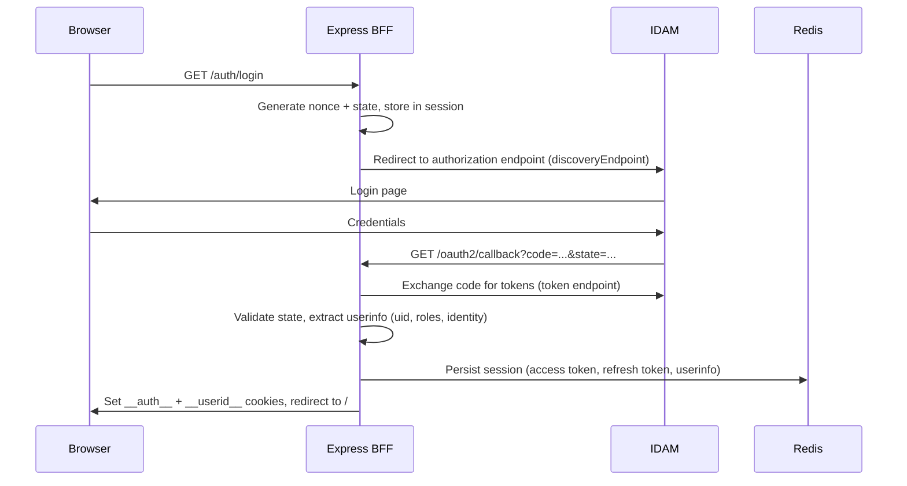
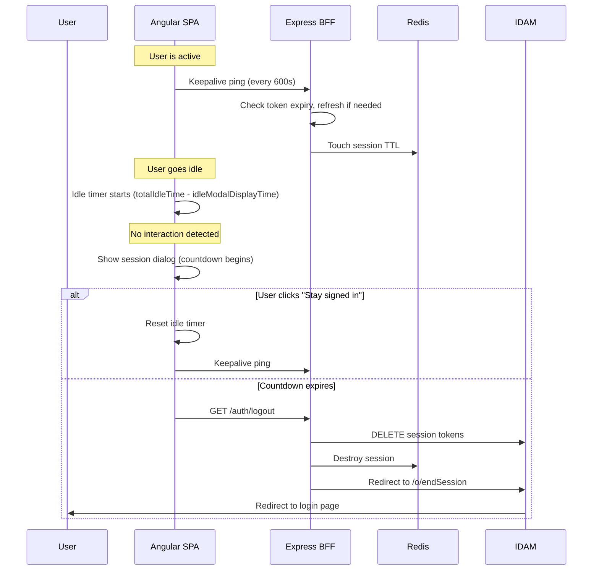

## TL;DR

- XUI sessions follow an OIDC lifecycle: IDAM login, token exchange, Redis-backed Express session, idle timeout notification, and re-authentication on expiry.
- `@hmcts/rpx-xui-node-lib` handles the server-side session (OIDC via `openid-client` + Passport, S2S token exchange, Redis session store, CSRF protection).
- `@hmcts/rpx-xui-common-lib` provides the client-side `TimeoutNotificationsService` and `xuilib-session-dialog` component that warn users before session expiry.
- Session timeout durations are role-based: the BFF's `sessionTimeouts` array defines entries with a `pattern` (regex) matched against user roles, with `totalIdleTime` and `idleModalDisplayTime` stored in **minutes** in config. The Angular app converts to milliseconds before passing to the timeout service.
- The keepalive mechanism works by the Angular `Keepalive` pinging `GET /auth/keepalive` every 600 seconds; the BFF's global `keepAliveHandler` middleware checks token expiry on every request and silently refreshes via the OIDC refresh token when expired.
- Both SSO and non-SSO users are subject to the same role-based timeout logic (confirmed EXUI-4123, March 2026).

## Login flow

The OIDC login flow proceeds as follows:



The BFF is the OIDC relying party. It calls `xuiNode.configure({ session: {...}, auth: { oidc: {...}, s2s: {...} } })` at startup (`rpx-xui-webapp:api/auth/index.ts`). The `XuiNode` class enforces load order: session middleware is always mounted before auth (`rpx-xui-node-lib:src/common/models/xuiNode.class.ts:15`).

After successful OIDC token exchange, the `verifyLogin` method checks the user's roles against `allowRolesRegex` (configured as `loginRoleMatcher` in `config/default.json`, defaulting to `"caseworker"`). If no role matches the regex, the user is immediately logged out -- this prevents non-caseworker users from accessing Manage Cases (`rpx-xui-node-lib:src/auth/models/strategy.class.ts:510`).

Key configuration:

| Parameter | Value | Source |
|---|---|---|
| Client ID | `xuiwebapp` | `config/default.json:82` |
| Discovery endpoint | `${SERVICES_IDAM_LOGIN_URL}/o/.well-known/openid-configuration` | `api/auth/index.ts:104` |
| Callback URL | `/oauth2/callback` | `config/default.json:84` |
| Token auth method | `client_secret_post` | `api/auth/index.ts` |
| SSO logout URL | `${idamWebUrl}/o/endSession` | `api/auth/index.ts` |

On successful authentication, the `AUTHENTICATE_SUCCESS` event fires. The BFF's `successCallback` sets two cookies (`__auth__` for the access token, `__userid__` for the user ID) and redirects to `/` (`rpx-xui-webapp:api/auth/index.ts:38-53`).

## Token exchange and S2S

Alongside the user-facing OIDC flow, the BFF obtains a Service-to-Service (S2S) token from `rpe-service-auth-provider`. The `S2SAuth` middleware:

1. Generates a TOTP from the S2S secret using `otplib.authenticator.generate(s2sSecret)`.
2. POSTs `{ microservice: "xui_webapp", oneTimePassword }` to the S2S lease endpoint.
3. Caches the returned JWT in memory, keyed by microservice name, until its `exp` claim expires (`rpx-xui-node-lib:src/auth/s2s/s2s.class.ts:86-99`).
4. Sets `req.headers.ServiceAuthorization = 'Bearer <token>'` on every downstream request (`s2s.class.ts:52`).

Both `Authorization` (user bearer token) and `ServiceAuthorization` (S2S token) headers are forwarded to downstream services on every proxied call.

## Redis session store

In deployed environments, sessions are stored in Azure Redis Cache. The `RedisSessionStore` class uses `connect-redis` v4 with `redis` v3 client (`rpx-xui-node-lib:src/session/models/redisSessionStore.class.ts`).

Configuration (from `rpx-xui-webapp:config/default.json`):

| Key | Value |
|---|---|
| Session name | `xui-webapp` |
| Redis port | 6380 |
| Redis prefix | `activity:` |
| Redis TTL | 86400 (24 hours) |
| Connection string | From `secrets.rpx.webapp-redis-connection-string` |

When `FEATURE_REDIS_ENABLED=true` (set via Helm values in deployed environments), the BFF uses Redis. Locally, it falls back to `FileSessionStore` writing to `.sessions` or `/tmp/sessions`.

The session store emits `redisStore.ClientReady` and `redisStore.ClientError` events that propagate up through `XuiNode` to the BFF for health monitoring.

## Session timeout: server-side calculation

The BFF computes per-user timeout durations using `getUserSessionTimeout(userRoles, sessionTimeouts)` from `rpx-xui-node-lib:src/common/util/userTimeout.ts:140`. This function:

1. Sorts the user's roles alphabetically (to ensure deterministic matching).
2. Iterates the `sessionTimeouts` array in declaration order.
3. Returns the first entry whose `pattern` (a regex string) matches any of the user's roles.
4. Falls back to `DEFAULT_SESSION_TIMEOUT` (`totalIdleTime: 480`, `idleModalDisplayTime: 10` -- values in minutes).

The result is returned to the Angular frontend as part of the `GET /api/user/details` response (`rpx-xui-webapp:api/user/index.ts:49`). This applies uniformly to both SSO users (federated via IDAM) and standard IDAM-authenticated users.

The `sessionTimeouts` config is an array of `RoleGroupSessionTimeout` objects. Values are in **minutes** (the Angular app converts to milliseconds at runtime via `totalIdleTime * 60 * 1000`):

```json
[
  { "pattern": "-dwpresponsewriter", "totalIdleTime": 30, "idleModalDisplayTime": 3 },
  { "pattern": "-homeoffice", "totalIdleTime": 240, "idleModalDisplayTime": 3 },
  { "pattern": "-solicitor", "totalIdleTime": 50, "idleModalDisplayTime": 10 },
  { "pattern": ".", "totalIdleTime": 480, "idleModalDisplayTime": 10 }
]
```

The last entry with pattern `"."` acts as the catch-all default (480 minutes = 8 hours for internal users such as caseworkers and judiciary).

**Deployed timeout summary** (from `rpx-xui-webapp:config/default.json`):

| Role pattern | Total idle time | Modal display time | Effective idle (before modal) |
|---|---|---|---|
| `-dwpresponsewriter` | 30 min | 3 min | 27 min |
| `-homeoffice` | 240 min (4 hr) | 3 min | 237 min |
| `-solicitor` | 50 min | 10 min | 40 min |
| `.` (catch-all / caseworkers) | 480 min (8 hr) | 10 min | 470 min |

<!-- DIVERGENCE: Confluence (page 1211990378) says solicitors get 60 minutes and DWP/Home Office get 15 minutes. Source (rpx-xui-webapp:config/default.json:195-216) shows solicitors get 50 minutes, DWP gets 30 minutes, and Home Office gets 240 minutes. Source wins. -->

**Information Assurance design intent** (from Confluence): The original IA recommendation was 8 hours for internal users, 1 hour for solicitors, and 15 minutes for DWP/Home Office. Deployed values differ as shown above, reflecting operational adjustments made since the original design.

### Timeout selection algorithm

The algorithm iterates the `sessionTimeouts` array **in declaration order** and returns the **first match** (not the lowest value). Priority is determined by array position: more specific patterns must appear before the catch-all `"."` entry.

<!-- DIVERGENCE: Confluence (page 1211990378) says "take the timeout with the lowest value" when multiple roles match. Source (rpx-xui-node-lib:src/common/util/userTimeout.ts:140-150) iterates in order and returns the first match. Source wins. -->

## Timeout notification: client-side

The Angular SPA uses `TimeoutNotificationsService` from `@hmcts/rpx-xui-common-lib` to detect idle users and display a warning dialog before automatic sign-out.

### TimeoutNotificationsService

This service wraps `@ng-idle/core` (`Idle`) and `@ng-idle/keepalive` (`Keepalive`). It is `providedIn: 'root'` and exposes a single observable via `notificationOnChange()`.

**Unit conversion chain**:

1. `config/default.json` stores `totalIdleTime` and `idleModalDisplayTime` in **minutes**.
2. The BFF returns these minute-values to the Angular app via `GET /api/user/details` (`rpx-xui-webapp:api/user/index.ts:49`).
3. `AppComponent.initTimeoutNotificationService()` converts minutes to milliseconds: `totalIdleTime * 60 * 1000` and `idleModalDisplayTime * 60 * 1000` (`rpx-xui-webapp:src/app/containers/app/app.component.ts:334-337`).
4. `TimeoutNotificationsService.initialise()` receives milliseconds and converts to seconds internally for `@ng-idle/core`.

**Initialisation** (after conversion by AppComponent):

```typescript
this.timeoutNotificationsService.initialise({
  idleModalDisplayTime: 600000,  // ms (10 minutes, from config value 10)
  totalIdleTime: 28800000,       // ms (480 minutes = 8 hours, from config value 480)
  keepAliveInSeconds: 600,       // optional, defaults to 600
  idleServiceName: 'idleSession'
});
```

The service converts both time values from milliseconds to seconds internally:
- `Idle.setIdle()` = `Math.floor(totalIdleTime / 1000) - (idleModalDisplayTime / 1000)` seconds -- the silent idle period before the warning appears.
- `Idle.setTimeout()` = `idleModalDisplayTime / 1000` seconds -- the countdown duration shown in the dialog.

**Important**: `idleModalDisplayTime` is a portion of `totalIdleTime`, not additive. With a default caseworker config (`totalIdleTime=480`, `idleModalDisplayTime=10` minutes), the user is idle for 470 minutes silently, then sees the dialog for 10 minutes, then is signed out at 480 minutes total.

**Events emitted** via `notificationOnChange()`:

| Event type | Trigger | Payload |
|---|---|---|
| `sign-out` | `idle.onTimeout` | -- |
| `countdown` | `idle.onTimeoutWarning` | Human-readable string (e.g. "2 minutes", "45 seconds") |
| `keep-alive` | `keepalive.onPing` | -- |

Countdown text uses `"<n> minutes"` (via `Math.ceil`) when remaining seconds > 60, and `"<n> seconds"` otherwise, with `distinctUntilChanged` to avoid redundant emissions (`timeout-notifications.service.ts:88-92`).

**Interrupt sources**: `DocumentInterruptSource` and `WindowInterruptSource` on `"mousedown keydown DOMMouseScroll mousewheel touchstart touchmove scroll"` (`timeout-notifications.service.ts:62, 80-82`). Any of these resets the idle timer.

### Session dialog component

`HmctsSessionDialogComponent` (selector `xuilib-session-dialog`) is a presentational component that renders a GOV.UK-styled modal dialog with `aria-modal="true"`. It:

- Projects content via `<ng-content>` -- the consuming app provides the countdown text, "Stay signed in" button, and "Sign out" link.
- Emits a `(close)` event when the user signals they want to stay signed in.
- Does **not** call `TimeoutNotificationsService.reset()` itself -- the consuming app must do this in its close handler.
- Visibility is controlled by the parent (typically `*ngIf="isVisible"`); there is no built-in show/hide mechanism.

### Keepalive mechanism

The keepalive mechanism has two parts:

**Route**: `GET /auth/keepalive` is registered by `rpx-xui-node-lib` and uses `authRouteHandler`, which simply returns `req.isAuthenticated()` -- a boolean confirming the session is still valid (`rpx-xui-node-lib:src/auth/auth.constants.ts:12`).

**Middleware**: `OpenID.keepAliveHandler` is registered as **global middleware** via `this.router.use(this.keepAliveHandler)` (`rpx-xui-node-lib:src/auth/models/strategy.class.ts:541`). It runs on every incoming request (not just `/auth/keepalive`) and performs the token refresh logic:

1. Checks if `req.session.passport.user` exists and `req.isAuthenticated()`.
2. Decodes the JWT access token and checks if `exp` claim is in the past (`isTokenExpired`).
3. If expired, calls `client.refresh(refreshToken)` to obtain new tokens silently (`rpx-xui-node-lib:src/auth/oidc/models/openid.class.ts:104`).
4. Updates the session with new token set.
5. On success, emits `auth.authenticate.success` with `req.isRefresh = true` so the BFF can distinguish refreshes from fresh logins (updating cookies without redirecting).

The `Keepalive` interval in the Angular service defaults to 600 seconds, sending periodic pings to `/auth/keepalive`. This request hits the global middleware, triggering token refresh if needed, and the route handler confirms authentication status. Together, this prevents Redis session expiry during active use.

## Lifecycle sequence



## LaunchDarkly and timeout behaviour

LaunchDarkly does not directly gate the timeout-notification mechanism itself. The `TimeoutNotificationsService` operates independently of feature flags. However, LaunchDarkly plays a role in the broader session context:

1. **Feature flag infrastructure**: `LaunchDarklyService` (from `@hmcts/rpx-xui-common-lib`) is registered as the concrete `FeatureToggleService` in all XUI apps (`rpx-xui-webapp:src/app/app.module.ts:114`). The LD client ID is a server-side secret injected at bootstrap via `/external/config/ui`.

2. **Conditional UI gating**: Service teams can use LD flags (via `FeatureToggleGuard` or `[xuilibFeatureToggle]` directive) to conditionally enable or disable features that affect session-adjacent behaviour -- for example, gating access to routes that require specific role-based timeout configurations.

3. **Initialisation coordination**: `InitialisationSyncService` ensures LD is initialised before CCD toolkit configuration proceeds. This prevents race conditions where session-dependent config (like timeout values derived from user roles) might be consumed before LD has resolved.

4. **CSP allowlisting**: `connect-src` explicitly allows `*.launchdarkly.com` for the streaming connection that delivers real-time flag updates (`rpx-xui-node-lib:src/common/util/contentSecurityPolicy.ts:29`).

5. **Reliability concern**: LaunchDarkly is initialised during login using user roles and role assignments as context for segment-based toggling. If LaunchDarkly is unavailable (vendor outage or network misconfiguration such as DWP's Zscaler blocking LD domains), Expert UI can fail to render. The team's stated direction (Aug 2025 KT) is to migrate most flags to static config in code and retain LD only for limited high-value use cases.
<!-- CONFLUENCE-ONLY: not verified in source -->

## CSRF protection

The session management library enables CSRF protection by default (`useCSRF: true`). The implementation uses `@dr.pogodin/csurf` middleware (`rpx-xui-node-lib:src/auth/models/strategy.class.ts:559-577`):

1. On every response, a `XSRF-TOKEN` cookie is set with `sameSite: 'strict'` and `secure: true`.
2. On incoming requests, the CSRF token is extracted from (in priority order): `req.body._csrf`, `req.query._csrf`, `csrf-token` header, `xsrf-token` header, `x-csrf-token` header, `x-xsrf-token` header, or the `XSRF-TOKEN` cookie.
3. Angular's `HttpClient` automatically reads the `XSRF-TOKEN` cookie and sends it back as the `X-XSRF-TOKEN` header on mutating requests.

This protects all POST/PUT/DELETE endpoints against cross-site request forgery.

## Expired login link handling

When an OIDC callback arrives with a mismatched or missing `state` parameter (e.g., a user bookmarks the `/oauth2/callback` URL, or their session expires between initiating login and completing it), the BFF redirects to `/expired-login-link` (`rpx-xui-node-lib:src/auth/auth.constants.ts:16`). This gives the Angular app a chance to display a user-friendly "your login link has expired" page rather than a cryptic error. The same redirect applies when `nonce mismatch` or `state mismatch` errors occur during the Passport callback verification.

## Logout

Logout (`GET /auth/logout`) performs a multi-step teardown:

1. DELETEs access and refresh tokens against `logoutURL/session/<token>` using Basic auth (Base64-encoded `clientID:clientSecret`) (`rpx-xui-node-lib:src/auth/models/strategy.class.ts:217-271`).
2. Calls `req.logout()` (Passport session teardown).
3. Destroys the Express session (removes from Redis).
4. Redirects the browser to `ssoLogoutURL?post_logout_redirect_uri=<host>` for OIDC RP-initiated logout at IDAM.

If the `noredirect` query parameter is present on the logout request, a `200` JSON response `{ message: "You have been logged out!" }` is returned instead of redirecting -- this supports programmatic logout from API clients.

## Design rationale and history

The session management design was driven by Information Assurance requirements (circa 2020, EUI-1049):

- Different user groups require different idle timeouts to balance security and usability.
- The session library was designed to support **both** OAuth 2 and OIDC protocols simultaneously, allowing gradual migration via a feature toggle (`FEATURE_OIDC_ENABLED`). All deployed environments now use OIDC.
- The library was architected to handle load-balanced multi-instance deployments: Redis ensures session affinity is not required, and the S2S token cache is per-process (acceptable because S2S tokens are short-lived and cheap to regenerate).
<!-- CONFLUENCE-ONLY: not verified in source -->
- The original design included a `sessionTimeout` callback for pre-timeout notification at the server layer, but the implemented architecture moved all timeout UX to the Angular client, with the server only responsible for session TTL via Redis.

## Examples

### BFF auth bootstrap: session store options and node-lib configuration

```typescript
// Source: apps/xui/rpx-xui-webapp/api/auth/index.ts

const baseStoreOptions = {
  cookie: {
    httpOnly: true,
    sameSite: 'Lax',
    secure: showFeature(FEATURE_SECURE_COOKIE_ENABLED),
  },
  name: 'xui-webapp',
  resave: false,
  saveUninitialized: false,
  secret: getConfigValue(SESSION_SECRET),
};

// Redis store (used when FEATURE_REDIS_ENABLED=true in deployed environments)
const redisStoreOptions = {
  redisStore: {
    ...baseStoreOptions,
    redisStoreOptions: {
      redisCloudUrl: getConfigValue(REDIS_CLOUD_URL),   // from AKS Key Vault
      redisKeyPrefix: getConfigValue(REDIS_KEY_PREFIX), // 'activity:'
      redisTtl: getConfigValue(REDIS_TTL),              // 86400 (24h)
    },
  },
};

// File store (fallback for local dev)
const fileStoreOptions = {
  fileStore: {
    ...baseStoreOptions,
    fileStoreOptions: {
      filePath: getConfigValue(NOW) ? '/tmp/sessions' : '.sessions',
    },
  },
};

const nodeLibOptions = {
  auth: { oidc: options, s2s: { microservice: 'xui_webapp', /* ... */ } },
  session: showFeature(FEATURE_REDIS_ENABLED) ? redisStoreOptions : fileStoreOptions,
};
return xuiNode.configure(nodeLibOptions);
```

### Session timeout configuration (`config/default.json`)

```json
// Source: apps/xui/rpx-xui-webapp/config/default.json

"sessionTimeouts": [
  { "pattern": "-dwpresponsewriter", "totalIdleTime": 30,  "idleModalDisplayTime": 3  },
  { "pattern": "-homeoffice",        "totalIdleTime": 240, "idleModalDisplayTime": 3  },
  { "pattern": "-solicitor",         "totalIdleTime": 50,  "idleModalDisplayTime": 10 },
  { "pattern": ".",                  "totalIdleTime": 480, "idleModalDisplayTime": 10 }
],
"redis": {
  "port": 6380,
  "tls": true,
  "prefix": "activity:",
  "ttl": 86400
}
```

Values are in **minutes**. The catch-all `"."` pattern gives caseworkers 8 hours (480 min) with a 10-minute warning modal. The Angular app converts to milliseconds before passing to `TimeoutNotificationsService`.

### `TimeoutNotificationsService`: initialisation and event wiring

```typescript
// Source: apps/xui/rpx-xui-common-lib/projects/exui-common-lib/src/lib/services/timeout-notifications/timeout-notifications.service.ts

@Injectable({ providedIn: 'root' })
export class TimeoutNotificationsService {
  constructor(private readonly idle: Idle, private readonly keepalive: Keepalive) {}

  public initialise(config: TimeoutNotificationConfig): void {
    const { idleServiceName, idleModalDisplayTime, totalIdleTime } = config;

    // Convert ms → seconds for @ng-idle
    this.idle.setTimeout(this.millisecondsToSeconds(idleModalDisplayTime));
    this.idle.setIdle(
      this.millisecondsToSeconds(totalIdleTime) - this.millisecondsToSeconds(idleModalDisplayTime)
    );
    this.idle.setIdleName(idleServiceName);

    // Any of these user actions resets the idle timer
    this.idle.setInterrupts([
      new DocumentInterruptSource('mousedown keydown DOMMouseScroll mousewheel touchstart touchmove scroll'),
      new WindowInterruptSource('mousedown keydown DOMMouseScroll mousewheel touchstart touchmove scroll'),
    ]);

    // Events emitted via notificationOnChange()
    this.idle.onTimeout.subscribe(() => this.eventEmitter.next({ eventType: 'sign-out' }));
    this.idle.onTimeoutWarning.pipe(
      map(sec => (sec > 60) ? Math.ceil(sec / 60) + ' minutes' : sec + ' seconds'),
      distinctUntilChanged()
    ).subscribe((countdown) => this.eventEmitter.next({ eventType: 'countdown', readableCountdown: countdown }));

    // Keepalive pings /auth/keepalive every 600 seconds
    this.keepalive.interval(config.keepAliveInSeconds || 600);
    this.keepalive.onPing.subscribe(() => this.eventEmitter.next({ eventType: 'keep-alive' }));
  }
}
```

`AppComponent` calls `initTimeoutNotificationService(idleModalDisplayTime, totalIdleTime)` after loading user details, converting the minute-values from `GET /api/user/details` to milliseconds:

```typescript
// Source: apps/xui/rpx-xui-webapp/src/app/containers/app/app.component.ts (excerpt)

this.timeoutNotificationsService.initialise({
  idleModalDisplayTime: idleModalDisplayTime * 60 * 1000,  // minutes → ms
  totalIdleTime: totalIdleTime * 60 * 1000,                // minutes → ms
  keepAliveInSeconds: 600,
  idleServiceName: 'idleSession',
});
```

## See also

- [Architecture](architecture.md) — Redis session configuration, OIDC auth flow sequence diagram, and Key Vault secrets
- [BFF Pattern](bff-pattern.md) — how `authInterceptor`, S2S token caching, and CSRF protection fit into the middleware chain
- [Feature Flags](feature-flags.md) — how LaunchDarkly initialisation interacts with session lifecycle and CCD toolkit setup
- [Reference: Config Schema](../reference/config-schema.md) — session timeout entries, Redis config keys, and feature flag env vars
- [Reference: Shared Libraries](../reference/shared-libraries.md) — `@hmcts/rpx-xui-node-lib` and `@hmcts/rpx-xui-common-lib` API reference
- [Glossary](../reference/glossary.md) — definitions of S2S, `XuiNode`, `sessionTimeouts`, `TimeoutNotificationsService`
