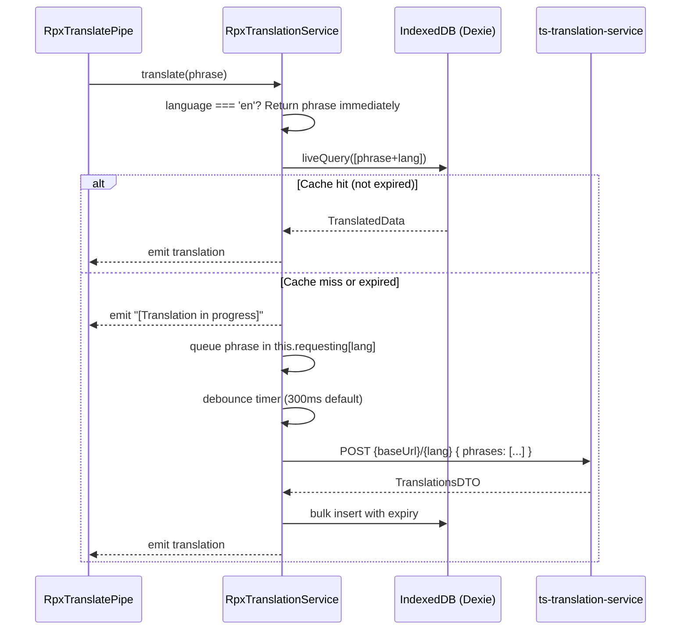

## TL;DR

- `rpx-xui-translation` is the Angular library that delivers Welsh (cy) language support across all XUI web apps and the `ccd-case-ui-toolkit`.
- Exposes `RpxTranslatePipe` (`rpxTranslate`) for template-level phrase translation, backed by `RpxTranslationService`.
- Phrases are fetched from the backend `ts-translation-service` via debounced batch HTTP POST and cached in IndexedDB (Dexie) with a 24-hour TTL.
- English is a short-circuit — no HTTP or DB lookup occurs when the active language is `'en'`.
- Language preference is persisted in the `exui-preferred-language` cookie; the toggle is gated behind the `welsh-language` LaunchDarkly feature flag.
- Translation management (CSV export/upload of phrase dictionaries) is performed through `ccd-admin-web` by users with the appropriate roles.

## Scope and feature rollout

Welsh translation targets **external / solicitor users** of Manage Cases. The language toggle is controlled by the `welsh-language` LaunchDarkly feature flag (`*xuilibFeatureToggle="'welsh-language'"` in templates). When the flag is off, the toggle button is hidden and the service operates in English-only mode.

The toggle appears in two locations: the **phase banner** (top of page) and the **global footer**. Both render a button showing "Cymraeg" when in English mode, or "English" when in Welsh mode (`phase-banner.component.html`, `hmcts-global-footer.component.html`).

A **Welsh advisory banner** is shown when the user switches to Welsh, informing them that some screens have not yet been translated:

> "Nid yw rhai sgriniau yn y gwasanaeth hwn wedi'u cyfieithu i'r Gymraeg eto ac maent ar hyn o bryd yn cynnwys testun Saesneg."
>
> (Some screens in this service have not yet been translated into Welsh and currently contain English text.)

### Features with Welsh support (MVP)

| Area | Implementation layer |
|------|---------------------|
| Create a case | `ccd-case-ui-toolkit` |
| Case details tab | Mostly toolkit, some EXUI |
| Find a case | `ccd-case-ui-toolkit` |
| Share a Case | Part toolkit, part common-lib, some EXUI |
| Case list | `ccd-case-ui-toolkit` |
| Respondent Journey (Select Organisation) | `ccd-case-ui-toolkit` |
| Notice of Change | EXUI |
| Headers / menus | EXUI and common-lib |
| Footers | EXUI and common-lib |
| Privacy / Cookies policy | EXUI |
| Error messages | `ccd-case-ui-toolkit` |
| Banners (advisory) | EXUI |

<!-- CONFLUENCE-ONLY: not verified in source -->
### Currently out of scope for Welsh

Work Allocation, Hearings (including JOH view), Global Search, Case Access Management, internal HMCTS staff users, Judicial Office Holder users, Fee & Pay / payment components, and Evidence / document management are not yet covered by Welsh translation. Manage Organisations and Approve Organisation are on the roadmap (Welsh 2).

## The Angular pipe: `rpxTranslate`

The pipe is the primary consumer-facing API. In templates it looks like:

```html
{{ 'Case created' | rpxTranslate }}
{{ 'Hello %NAME%' | rpxTranslate:replacements }}
```

`RpxTranslatePipe` is declared as `@Pipe({ name: 'rpxTranslate', pure: false })` (`rpx-translate.pipe.ts:7`). It is impure because the translated value arrives asynchronously — when the language changes or when the HTTP response lands. Internally it wraps Angular's `AsyncPipe`, constructed with the injected `ChangeDetectorRef` (`rpx-translate.pipe.ts:17-18`).

The `transform()` method dispatches to one of three service methods depending on the arguments supplied (`rpx-translate.pipe.ts:22-34`):

| Arguments | Service method called |
|-----------|---------------------|
| phrase only | `getTranslation$(phrase)` |
| phrase + `replacements` | `getTranslationWithReplacements$(phrase, replacements)` |
| phrase + `null` + `yesOrNoValue` | `getTranslationWithYesOrNo$(phrase, yesOrNoValue)` |

The pipe returns `null` for falsy or whitespace-only input and calls `asyncPipe.ngOnDestroy()` on destruction to prevent subscription leaks (`rpx-translate.pipe.ts:39-41`).

**Important:** The pipe is not standalone — it must be imported through `RpxTranslationModule`, not as a standalone component import (`rpx-translate.pipe.ts:9`). Because it is impure, Angular invokes `transform()` on every change-detection cycle. The service returns stable `BehaviorSubject`-backed observables per phrase, so re-render cost remains low, but callers should avoid constructing new `replacements` objects inline in templates.

## The translation service

`RpxTranslationService` orchestrates phrase lookup, caching, and batch fetching. Its lifecycle for a single phrase:



### English short-circuit

When `language === 'en'`, `translate()` immediately emits `{ translation: phrase }` without any HTTP or DB lookup (`rpx-translation.service.ts:105-106`). This means the English source text in templates is always the passthrough value.

### Debounced batch loading

The service does not issue one HTTP request per phrase. Instead, it accumulates phrases into a per-language queue (`this.requesting[lang]`) and resets a `timer(config.debounceTimeMs)` on each new addition (`rpx-translation.service.ts:172-177`). When the timer fires, all queued phrases are sent in a single `POST {baseUrl}/{lang}` with body `{ phrases: string[] }` (`rpx-translation.service.ts:179-183`). The default debounce is 300ms (`rpx-translation.config.ts:17`).

While the fetch is in flight, the pipe displays `'${phrase} [Translation in progress]'` as a placeholder, and also sets `yes: 'Yes [Translation in progress]'` and `no: 'No [Translation in progress]'` (`rpx-translation.service.ts:117-121`).

### The `shouldTranslate` guard

Before queuing a phrase for translation, the service checks (`rpx-translation.service.ts:132-143`):

- Phrase must contain at least one alphabetic character.
- Phrase must not already contain `[Translation in progress]` (prevents re-queuing).
- Phrase must not consist solely of a `${key}` placeholder.

### Response handling

The `ts-translation-service` API returns a `TranslationsDTO` object: `{ translations: { [from: string]: string | TranslatedData } }` (`rpx-translation.service.ts:14-16`). Plain strings are normalised into `{ translation: string }` before storage. On HTTP error, the service falls back to emitting the original English phrase — unless `config.testMode` is `true`, in which case it returns `'[Test translation for <phrase>]'` to help developers confirm the pipe is wired correctly (`rpx-translation.service.ts:199-205`).

## IndexedDB caching via Dexie

Translations are persisted in an IndexedDB database named `RpxTranslations` with a single object store `translations` indexed on the composite key `[phrase+lang]` (`db.ts:27-37`).

Each row stores:

| Field | Type | Purpose |
|-------|------|---------|
| `phrase` | `string` | Original English text |
| `lang` | `RpxLanguage` | Target language (`'cy'`) |
| `translation` | `TranslatedData` | `{ translation, yesOrNoField?, yes?, no? }` |
| `validity` | ISO string | Expiry timestamp, computed as `now + config.validity` |

On lookup, if the row exists but is expired, it is deleted and a fresh fetch is triggered (`rpx-translation.service.ts:113-115`). The `validity` duration is specified per-app via `RpxTranslationConfig.validity` (a luxon `Duration`-compatible object) and has no library-level default.

The `db.ts` module exports a singleton `db` instance (`db.ts:39`), meaning all service instances within a browser tab share the same IndexedDB connection. Dexie's `liveQuery` is used so that the pipe reactively re-emits if the underlying DB row is updated by another tab or service worker.

## Placeholder replacements

When a phrase contains dynamic values (e.g. `'Case #%CASEREFERENCE% has been updated'`), the service splits it into translatable segments and literal replacement values via `splitPhraseIntoComponents()` (`rpx-translation.service.ts:68-76`). Each text segment is translated independently, then the segments and literals are reassembled.

Placeholder syntax is `%KEYNAME%` — percent-wrapped, case-sensitive. The `Replacements` type is `{ [key: string]: string }`.

A `matchCase` helper mirrors capitalisation from the input onto translated yes/no values — it checks only the first character (`match-case.helper.ts:6-9`).

## Module wiring

Consuming apps wire translation support via:

```typescript
RpxTranslationModule.forRoot({
  baseUrl: '/api/translation',   // relative URL, proxied by the Node BFF
  debounceTimeMs: 300,
  validity: { days: 1 },         // luxon Duration spec
  testMode: false
})
```

All three XUI apps use identical configuration: `baseUrl: '/api/translation'`, `debounceTimeMs: 300`, `validity: { days: 1 }`, `testMode: false` (`rpx-xui-webapp/src/app/app.module.ts:84-91`, `rpx-xui-manage-organisations/src/app/app.module.ts:90-97`, `rpx-xui-approve-org/src/app/app.module.ts:78-85`).

- `forRoot()` provides `RpxTranslationConfig` and `RpxTranslationService` as singletons (`rpx-translation.module.ts:10-20`).
- `forChild()` re-exports `RpxTranslatePipe` without re-providing the service — used by lazy-loaded feature modules and the `ccd-case-ui-toolkit` (e.g. `headers.module.ts`, `footers.module.ts`, `tabs.module.ts`, `form.module.ts`, `alert.module.ts`).
- The module declares `provideHttpClient(withInterceptorsFromDi())`, so the library picks up DI-registered HTTP interceptors (e.g. auth headers added by the consuming app).

### Node-layer proxy

The Angular library issues requests to `/api/translation/{lang}` — a relative path that hits the co-located Express BFF. The BFF rewrites and proxies these to `ts-translation-service`:

```typescript
// rpx-xui-webapp/api/proxy.config.ts
applyProxy(app, {
  rewrite: true,
  rewriteUrl: (path) => '/translation' + (path === '/' ? '' : path),
  source: '/api/translation',
  target: getConfigValue(SERVICES_TRANSLATION_API_URL),
});
```

The `SERVICES_TRANSLATION_API_URL` resolves via `config/default.json`:

```json
"translation": "http://ts-translation-service-prod.service.core-compute-prod.internal"
```

So a browser request to `POST /api/translation/cy` becomes `POST http://ts-translation-service-prod.../translation/cy` at the backend.

### Language persistence

The user's preferred language is read from and written to the cookie `exui-preferred-language` with `SameSite=Strict` (`rpx-translation.service.ts:221-222`). Setting `service.language = 'cy'` triggers re-translation of all known phrases by iterating every phrase in the `this.phrases` map and calling `translate()` again (`rpx-translation.service.ts:41`).

## The `translatedMarkdown` structural directive

For service-supplied content that includes pre-translated Welsh markdown (e.g. qualifying questions from LaunchDarkly feature config), the `ccd-case-ui-toolkit` provides a structural directive `*translatedMarkdown`:

```html
<ng-container *translatedMarkdown="dataItem; let content">
  <markdown [data]="content"></markdown>
</ng-container>
```

The directive (`welsh-translated-markdown.directive.ts`) subscribes to `RpxTranslationService.language$` and reactively selects either:
- `dataItem.markdown_cy` — if the UI language is Welsh and the field exists
- `dataItem.markdown` — otherwise (English fallback)

This pattern is used for content objects that carry both languages inline (e.g. Query Management qualifying questions), avoiding round-trips to `ts-translation-service` for pre-translated bulk content.

## Translation management workflow

<!-- CONFLUENCE-ONLY: not verified in source -->
Welsh translations are managed through `ccd-admin-web`:

1. Untranslated English phrases are stored in `ts-translation-service` when first requested.
2. Admin users with appropriate roles can export the current translation dictionary as a **CSV file** from `ccd-admin-web`.
3. The CSV is sent to the **Welsh Language Unit (WLU)** for professional translation.
4. The completed CSV is uploaded back through `ccd-admin-web`, updating the dictionary.
5. Once uploaded, subsequent requests for those phrases return the Welsh translation.

CCD definition text (field labels, hints, event names) is the primary source of translatable phrases for case-type-specific content. Static UI text (headers, footers, error messages) is baked into the Angular templates and sent for translation via the same pipe mechanism.

## Performance considerations

<!-- CONFLUENCE-ONLY: not verified in source -->
- Each use of `rpxTranslate` creates an observable per phrase. On large pages with many translated strings, this can be performance-heavy due to the number of active subscriptions and change-detection cycles.
- The `shouldTranslate` guard prevents sending non-translatable content (pure numbers, placeholders, already-in-progress phrases) to the API, reducing unnecessary requests.
- The debounce window (300ms) batches phrases from a single change-detection cycle into one HTTP POST, but rapid page transitions can still generate multiple batches.

## Operational constraints

### Do not translate browser-native elements

Browser-rendered elements such as file input labels ("Choose file", "No file chosen") must **not** be sent through the Welsh language API. Attempting to translate these via `rpxTranslate` caused a production rollback (EXUI-1832). Browser-native text must be localised by setting the browser's own language to Welsh, not by overriding the DOM text.

### Character encoding

Welsh text uses characters (e.g. circumflex vowels: a, e, i, o, u, w, y) that are in Unicode but not in ISO Latin-1 or ASCII. The translation service and database must handle UTF-8 throughout. Character encoding issues can arise when:
- Data passes through systems that assume ISO Latin-1 or Windows-1252
- Copy-paste from Word introduces "smart quotes" (Windows-1252 characters 0x80-0x9F) that are not valid in ISO Latin-1

The system expects UTF-8 end-to-end; any intermediate layer that transcodes to a narrower charset will corrupt Welsh diacritical marks.

## Examples

### `RpxTranslatePipe` implementation

```typescript
// Source: apps/xui/rpx-xui-translation/projects/rpx-xui-translation/src/lib/rpx-translate.pipe.ts

@Pipe({
  name: 'rpxTranslate',
  pure: false,      // impure: re-runs on every change-detection cycle (async result lands asynchronously)
  standalone: false // must be imported through RpxTranslationModule, not as standalone
})
export class RpxTranslatePipe implements PipeTransform, OnDestroy {
  private asyncPipe: AsyncPipe;

  constructor(private translationService: RpxTranslationService, changeDetectorRef: ChangeDetectorRef) {
    this.asyncPipe = new AsyncPipe(changeDetectorRef);
  }

  public transform<T = string>(value: T, replacements?: Replacements | null, yesOrNoValue?: string): T | null {
    if (value && typeof value === 'string' && value.toString().trim()) {
      let o: Observable<string>;
      if (replacements) {
        o = this.translationService.getTranslationWithReplacements$(value, replacements);
      } else if (yesOrNoValue) {
        o = this.translationService.getTranslationWithYesOrNo$(value, yesOrNoValue);
      } else {
        o = this.translationService.getTranslation$(value);
      }
      return this.asyncPipe.transform<string>(o) as unknown as T;
    }
    return null;
  }

  public ngOnDestroy(): void {
    this.asyncPipe.ngOnDestroy();  // prevent subscription leaks
  }
}
```

Template usage:

```html
{{ 'Case created' | rpxTranslate }}
{{ 'Hello %NAME%' | rpxTranslate:{ NAME: caseHolderName } }}
```

### `RpxTranslationModule` — `forRoot` and `forChild`

```typescript
// Source: apps/xui/rpx-xui-translation/projects/rpx-xui-translation/src/lib/rpx-translation.module.ts

@NgModule({
  declarations: [RpxTranslatePipe],
  exports: [RpxTranslatePipe],
  providers: [provideHttpClient(withInterceptorsFromDi())]
})
export class RpxTranslationModule {
  // forRoot: call once at app root to provide the service singleton + config
  public static forRoot(config: RpxTranslationConfig): ModuleWithProviders<RpxTranslationModule> {
    return {
      ngModule: RpxTranslationModule,
      providers: [
        { provide: RpxTranslationConfig, useValue: config },
        RpxTranslationService,
      ]
    };
  }

  // forChild: use in lazy-loaded modules — re-exports the pipe without re-providing the service
  public static forChild(): ModuleWithProviders<RpxTranslationModule> {
    return { ngModule: RpxTranslationModule };
  }
}
```

### App module wiring (all three XUI apps use identical config)

```typescript
// Source: apps/xui/rpx-xui-webapp/src/app/app.module.ts

@NgModule({
  imports: [
    RpxTranslationModule.forRoot({
      baseUrl: '/api/translation',  // relative URL; BFF proxies to ts-translation-service
      debounceTimeMs: 300,          // batch window: phrases accumulated over 300ms per request
      validity: { days: 1 },        // IndexedDB cache TTL (luxon Duration spec)
      testMode: false,              // when true, HTTP errors return '[Test translation for …]'
    }),
    // ...
  ],
})
export class AppModule {}
```

## See also

- [BFF Pattern](bff-pattern.md) — how the `/api/translation` proxy route rewrites requests to `ts-translation-service`
- [Feature Flags](feature-flags.md) — how the `welsh-language` LaunchDarkly flag gates the language toggle in templates
- [Case UI Toolkit](case-ui-toolkit.md) — how `RpxTranslationModule.forChild()` is used inside the toolkit's `PaletteModule` and `CaseEditorModule`
- [Reference: Shared Libraries](../reference/shared-libraries.md) — `rpx-xui-translation` public API, configuration options, and versioning notes
- [Glossary](../reference/glossary.md) — definitions of `RpxTranslatePipe`, `ts-translation-service`, and `rpx-xui-translation`

## Glossary

| Term | Definition |
|------|-----------|
| `RpxLanguage` | Union type `'en' \| 'cy'` representing supported languages |
| `TranslatedData` | Object shape `{ translation: string; yesOrNoField?: boolean; yes?: string; no?: string }` returned by the API |
| `ValidityDurationSpec` | Luxon `Duration`-compatible config object controlling cache TTL |
| `WLU` | Welsh Language Unit — the professional translation team that provides Welsh text for the dictionary |
| `testMode` | Config flag that, when `true`, causes HTTP errors to return `[Test translation for <phrase>]` instead of the original English (useful in development) |
