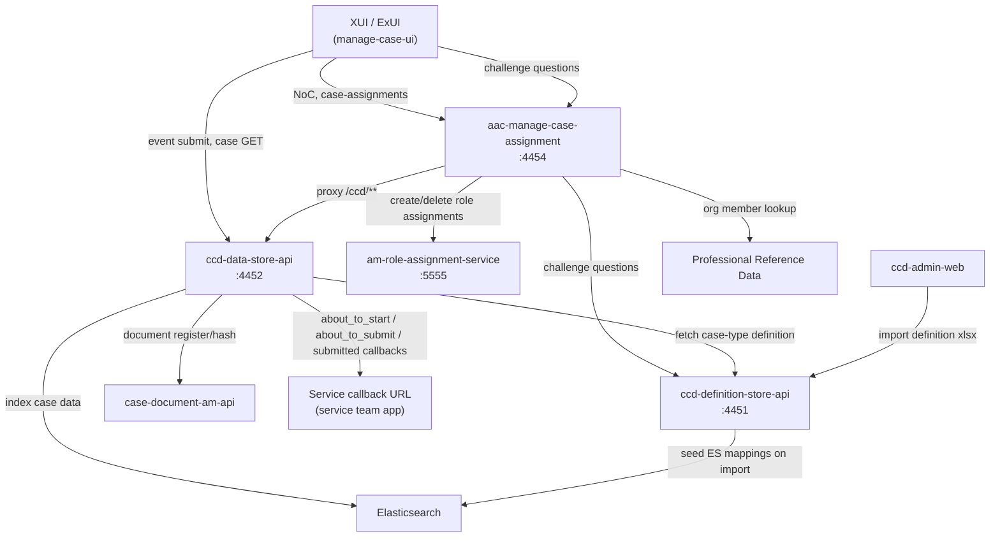
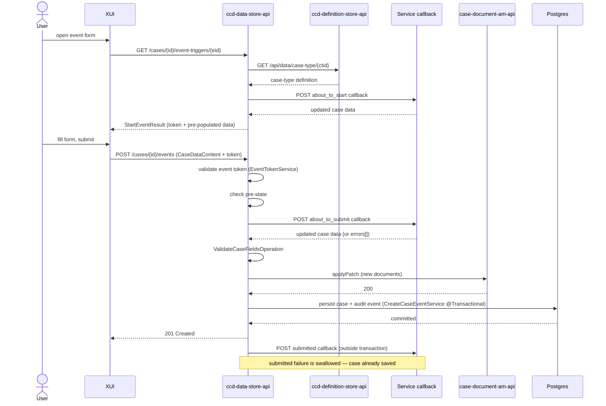
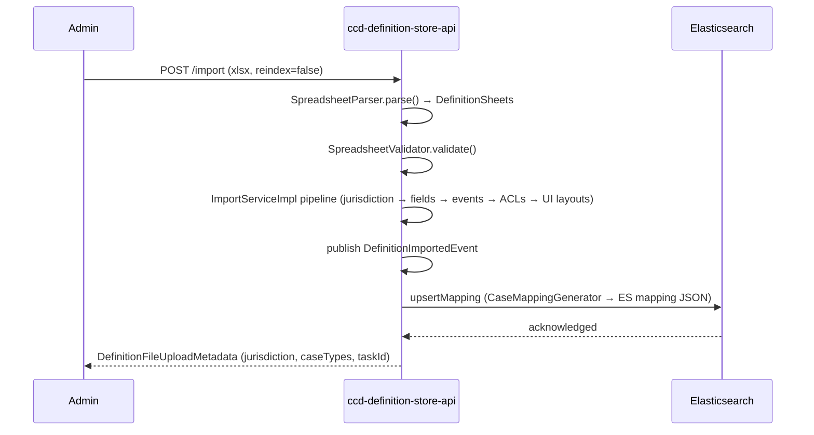

# CCD Architecture

## TL;DR

- CCD is composed of six runtime services: `ccd-data-store-api` (case persistence + event processing), `ccd-definition-store-api` (case-type schema), `aac-manage-case-assignment` (Notice of Change + role assignment), `am-role-assignment-service` (AMRAS, role storage), `case-document-am-api` (CDAM, document management), and `ccd-admin-web` (admin UI). XUI is the primary user-facing caller.
- `ccd-data-store-api` owns the event lifecycle: start-event (`about_to_start` callback) → submit-event (`about_to_submit` callback + DB persist + `submitted` callback).
- `ccd-definition-store-api` stores case-type schemas; on import it seeds Elasticsearch index mappings via `DefinitionImportedEvent`.
- `aac-manage-case-assignment` sits between XUI and data-store/AMRAS for Notice of Change (NoC) and intra-org case assignment; it also acts as a reverse proxy for `/ccd/**` routes.
- Decentralised deployment: `ccd-data-store-api` can route persistence for specific case-type prefixes to an external service via `/ccd-persistence/*` endpoints, controlled by `ccd.decentralised.case-type-service-urls`.

---

## Component map



---

## Services

### ccd-data-store-api (`:4452`)

The persistence and event-processing core. Owns:

| Responsibility | Key endpoint |
|---|---|
| Event lifecycle (start + submit) | `GET /cases/{id}/event-triggers/{eid}`, `POST /cases/{id}/events` |
| Case creation | `POST /case-types/{ctid}/cases` |
| Case GET | `GET /cases/{id}` |
| ES search | `POST /searchCases`, `POST /globalSearch` |
| Supplementary data | `POST /cases/{id}/supplementary-data` |
| Document metadata | `GET /cases/{id}/documents/{docId}` |
| Audit history | `GET /cases/{id}/events` |

Reads case-type definitions from `ccd-definition-store-api` at request time. Registers documents with CDAM via `CaseDocumentAmApiClient` Feign client. Routes reads/writes for decentralised case types via `DelegatingCaseDetailsRepository` → `ServicePersistenceClient`.

### ccd-definition-store-api (`:4451`)

Stores case-type schemas (fields, events, ACLs, UI layouts). Exposed via:

| Endpoint | Purpose |
|---|---|
| `POST /import` | Import Excel definition; seeds ES mappings |
| `GET /api/data/case-type/{id}` | Full case-type definition (consumed by data-store) |
| `GET /api/display/search-input-definition/{id}` | Search input fields |
| `GET /api/display/challenge-questions/case-type/{ctid}/question-groups/{id}` | NoC challenge questions |

On each import, `ImportServiceImpl` publishes `DefinitionImportedEvent`; either `SynchronousElasticDefinitionImportListener` or `AsynchronousElasticDefinitionImportListener` handles it, calling `HighLevelCCDElasticClient.upsertMapping()` (or creating a new index on `reindex=true`). Index names follow `config.getCasesIndexNameFormat()` applied to the lowercase case-type ID, e.g. `divorce_case_cases-000001`.

### aac-manage-case-assignment (`:4454`)

Owns Notice of Change (NoC) and intra-org case assignment. Also acts as a Spring Cloud Gateway reverse proxy: routes under `/ccd/**` are forwarded to `ccd-data-store-api` (`ccd.data-store.allowed-urls` controls allowed paths).

| Path prefix | Purpose |
|---|---|
| `GET/POST /noc/*` | NoC flow (questions, verify, apply decision) |
| `POST/GET/DELETE /case-assignments` | Intra-org case sharing (conditionally enabled) |
| `POST/GET/DELETE /case-users` | AMRAS-backed role add/remove |
| `/ccd/**` | Reverse-proxy to data-store |

Downstream: calls data-store (Feign), definition-store (Feign), AMRAS (RestTemplate at `${role.assignment.api.host}/am/role-assignments`), PRD (Feign), and IDAM for system-user tokens.

### am-role-assignment-service (`:5555`)

Stores case-level role assignments. AAC calls three endpoints:

| Endpoint | Purpose |
|---|---|
| `POST /am/role-assignments` | Create role assignments |
| `POST /am/role-assignments/query` | Query assignments by case/user |
| `POST /am/role-assignments/query/delete` | Delete by query |

Data-store reads role assignments from AMRAS to enforce access control at case-read time.

### case-document-am-api (CDAM)

Manages document access tokens. Data-store calls `CaseDocumentAmApiClient.applyPatch(CaseDocumentsMetadata)` during event submission to register new documents and bind them to a case reference. The `attachDocumentEnabled` feature flag in data-store gates this call.

### ccd-admin-web

Browser-based admin UI. Uploads definition Excel files to `ccd-definition-store-api POST /import`. No direct runtime role in event processing.

---

## Event submission sequence

A typical event submission (existing case, human user via XUI):



Key implementation points:
- `about_to_start` fires in `DefaultStartEventOperation.triggerStartForCase()` before the event token is issued.
- `about_to_submit` fires inside `CreateCaseEventService.createCaseEvent()` within the `@Transactional` boundary (`CreateCaseEventService.java:235`).
- `submitted` fires in `DefaultCreateEventOperation` after `CreateCaseEventService` returns; `CallbackException` is caught and logged, not re-thrown (`DefaultCreateEventOperation.java:100-104`).
- Callbacks use HTTP POST via Spring `RestTemplate` with S2S + user JWT headers; retried up to 3 times (T+1s, T+3s) unless `retriesTimeout=[0]` (`CallbackService.java:75`).

---

## Decentralised vs central deployment

CCD supports two persistence shapes:

| Shape | How it works |
|---|---|
| **Central** | Data-store persists case data to its own Postgres (`case_data` table). All case types not matched by `ccd.decentralised.case-type-service-urls`. |
| **Decentralised** | Data-store routes to an external service via `POST /ccd-persistence/cases` (and companion GET/history endpoints). Enabled per case-type prefix in config. |

`PersistenceStrategyResolver` reads `ccd.decentralised.case-type-service-urls` (a map of `caseTypeIdPrefix → baseUrl`) at startup. Prefix matching is longest-match, case-insensitive. Template URLs may contain one `%s` placeholder for PR-number suffixes (preview environments).

`DelegatingCaseDetailsRepository.save()` checks `resolver.isDecentralised(caseDetails)`; if true it calls `ServicePersistenceClient`, which:
1. Posts `POST /ccd-persistence/cases` with `Idempotency-Key` header.
2. Validates the returned `reference`, `caseTypeId`, and `jurisdiction` match (`ServicePersistenceClient.java:131-163`).
3. Injects the internal CCD `id` (unknown to the external service) onto the returned object.

Decentralised cases **skip** `about_to_submit` and `submitted` callbacks (`CallbackInvoker.java:98-99, 123-125`). All other lifecycle steps (definition lookup, access control, audit) remain in data-store.

Example config (from `application.properties:203-206`):
```properties
ccd.decentralised.case-type-service-urls[PCS_PR_]=https://pcs-api-pr-%s.preview.platform
```

This routes all case types whose ID starts with `PCS_PR_` to the PCS preview environment, substituting the suffix for `%s`.

---

## Definition import and ES seeding



With `reindex=true`: definition-store sets the current index read-only, creates a new incremented index (e.g. `-000002`), reindexes data asynchronously, then atomically flips the alias. On failure it removes the new index and restores writes on the old one (`ElasticDefinitionImportListener.java:73-143`).

---

## See also

- [`docs/ccd/explanation/event-lifecycle.md`](event-lifecycle.md) — detailed callback phases and error handling
- [`docs/ccd/explanation/decentralised-ccd.md`](decentralised-ccd.md) — decentralised persistence deep-dive
- [`docs/ccd/explanation/notice-of-change.md`](notice-of-change.md) — NoC protocol detail
- [`docs/ccd/reference/endpoints.md`](../reference/endpoints.md) — full endpoint reference
