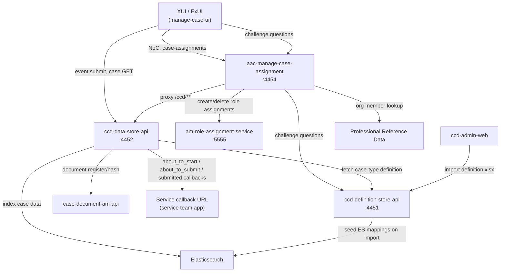
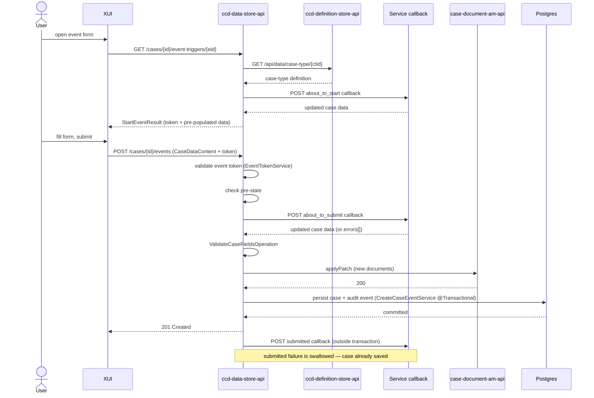
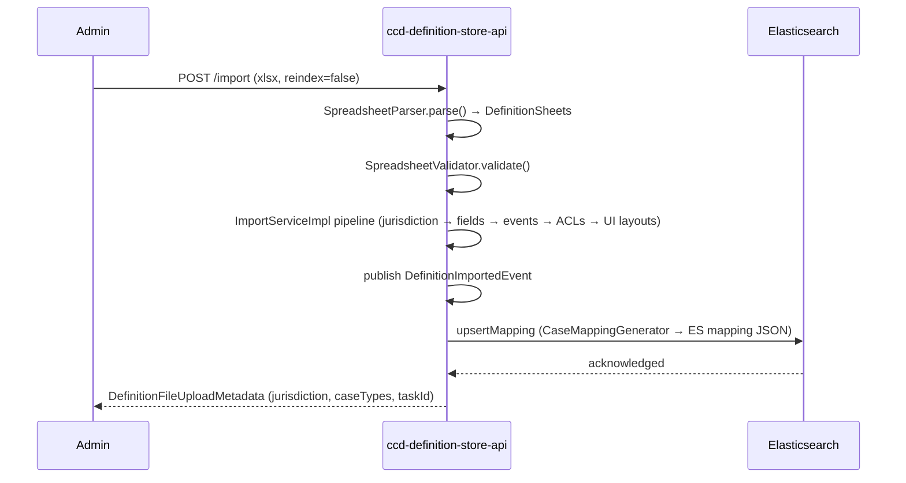

# CCD Architecture

## TL;DR

- CCD is composed of six runtime services: `ccd-data-store-api` (case persistence + event processing + access-control gateway), `ccd-definition-store-api` (case-type schema), `aac-manage-case-assignment` (Notice of Change + role assignment + reverse proxy), `am-role-assignment-service` (AMRAS, role storage), `case-document-am-api` (CDAM, document management), and `ccd-admin-web` (admin UI). XUI is the primary user-facing caller.
- `ccd-data-store-api` owns the event lifecycle: start-event (`about_to_start` callback) → submit-event (`about_to_submit` callback + DB persist + `submitted` callback). For decentralised case types it acts as a **Case Data Gateway and Access Control plane**, delegating mutable state to the owning service.
- `ccd-definition-store-api` stores case-type schemas; on import it seeds Elasticsearch index mappings via `DefinitionImportedEvent`.
- `aac-manage-case-assignment` sits between XUI and data-store/AMRAS for Notice of Change (NoC) and intra-org case assignment; it also acts as a Spring Cloud Gateway reverse proxy for `/ccd/**` routes (data-store passthrough + a definition-store challenge-questions allow-list).
- Decentralised deployment: `ccd-data-store-api` can route persistence for specific case-type prefixes to an external service via `/ccd-persistence/*` endpoints, controlled by `ccd.decentralised.case-type-service-urls`. Decentralised cases keep only an immutable "case pointer" row locally; `about_to_submit` and `submitted` callbacks are suppressed.
- Decentralised search bypasses CCD's Postgres entirely — the owning service indexes its own DB into Elasticsearch (typically via a service-team Logstash on a purpose-built view); CCD only proxies the search query.

---

## Component map



---

## Services

### ccd-data-store-api (`:4452`)

The persistence and event-processing core. With decentralisation it has evolved into a **Case Data Gateway and Access Control Plane** — a unified API endpoint that abstracts the underlying persistence model from clients while enforcing fine-grained security across the estate.

Owns:

| Responsibility | Key endpoint |
|---|---|
| Event lifecycle (start + submit) | `GET /cases/{id}/event-triggers/{eid}`, `POST /cases/{id}/events` |
| Case creation | `POST /case-types/{ctid}/cases` |
| Case GET | `GET /cases/{id}` |
| ES search | `POST /searchCases`, `POST /globalSearch` |
| Supplementary data | `POST /cases/{id}/supplementary-data` |
| Document metadata | `GET /cases/{id}/documents/{docId}` |
| Audit history | `GET /cases/{id}/events` |

Reads case-type definitions from `ccd-definition-store-api` at request time. Registers documents with CDAM via `CaseDocumentAmApiClient` Feign client. Routes reads/writes for decentralised case types via `DelegatingCaseDetailsRepository` → `ServicePersistenceClient`.

Gateway responsibilities (per the HLD):
- **Filtering reads:** dynamically removes fields the user is not permitted to read before returning case data, regardless of whether the data came from local Postgres or a decentralised service.
- **Validating writes:** verifies create/update/delete permissions for every field being modified before persisting (or delegating).
- **Routing:** inspects the case type to decide between local Postgres and a decentralised service.
- **Case-identity management:** maintains a lightweight 'pointer' row in `case_data` for every case (whether centralised or decentralised), keyed by the immutable 16-digit case reference.

### ccd-definition-store-api (`:4451`)

Stores case-type schemas (fields, events, ACLs, UI layouts). Exposed via:

| Endpoint | Purpose |
|---|---|
| `POST /import` | Import Excel definition; seeds ES mappings |
| `GET /api/data/case-type/{id}` | Full case-type definition (consumed by data-store) |
| `GET /api/display/search-input-definition/{id}` | Search input fields |
| `GET /api/display/challenge-questions/case-type/{ctid}/question-groups/{id}` | NoC challenge questions |

On each import, `ImportServiceImpl` publishes `DefinitionImportedEvent`; either `SynchronousElasticDefinitionImportListener` or `AsynchronousElasticDefinitionImportListener` handles it, calling `HighLevelCCDElasticClient.upsertMapping()` (or creating a new index on `reindex=true`). Index names follow `config.getCasesIndexNameFormat()` applied to the lowercase case-type ID, e.g. `divorce_case_cases-000001`.

### aac-manage-case-assignment (`:4454`)

Owns Notice of Change (NoC) and intra-org case assignment. Also acts as a Spring Cloud Gateway reverse proxy: requests under `/ccd/**` are stripped of the prefix and forwarded to `ccd-data-store-api`, after passing through the `AllowedRoutesFilter` and `ValidateClientFilter` filters.

| Path prefix | Purpose |
|---|---|
| `GET/POST /noc/*` | NoC flow (questions, verify, apply decision) |
| `POST/GET/DELETE /case-assignments` | Intra-org case sharing (conditionally enabled) |
| `POST/GET/DELETE /case-users` | AMRAS-backed role add/remove |
| `/ccd/**` | Reverse-proxy (data-store + a narrow definition-store allow-list) |

`AllowedRoutesFilter` permits paths matching either `ccd.data-store.allowed-urls` (defaults: `/searchCases.*`, `/internal/searchCases.*`, `/internal/cases.*`) or `ccd.definition-store.allowed-urls` (default: `/api/display/challenge-questions.*`). `ValidateClientFilter` rejects callers other than `xui_webapp` (`ccd.data-store.allowed-service`).

Downstream: calls data-store (Feign), definition-store (Feign), AMRAS (RestTemplate at `${role.assignment.api.host}/am/role-assignments`), PRD (Feign), and IDAM for system-user tokens.

### am-role-assignment-service (`:5555`)

Stores case-level role assignments. AAC calls three endpoints:

| Endpoint | Purpose |
|---|---|
| `POST /am/role-assignments` | Create role assignments |
| `POST /am/role-assignments/query` | Query assignments by case/user |
| `POST /am/role-assignments/query/delete` | Delete by query |

Data-store reads role assignments from AMRAS to enforce access control at case-read time.

### case-document-am-api (CDAM)

Manages document access tokens. Data-store calls `CaseDocumentAmApiClient.applyPatch(CaseDocumentsMetadata)` during event submission to register new documents and bind them to a case reference. The `attachDocumentEnabled` feature flag in data-store gates this call.

### ccd-admin-web

Browser-based admin UI. Uploads definition Excel files to `ccd-definition-store-api POST /import`. No direct runtime role in event processing.

### Deprecated / pending decommissioning

Two services appear in older deployment diagrams and Confluence references but are not authoritative for new development; they are listed in the HLD CCD 5.0 roadmap as planned for decommissioning:

- **`ccd-user-profile-api`** — predates IDAM. Stored users, roles, and jurisdictions; this information is now derived from IdAM roles. Still deployed alongside data-store but expected to be removed.
- **`ccd-api-gateway-web`** — historic Reform API gateway sitting in front of CCD. XUI talks directly to data-store / AAC for new work.

The HLD also flags `ccd-admin-web` for eventual decommissioning once the definition-import workflow moves into a more modern surface.
<!-- CONFLUENCE-ONLY: the decommissioning roadmap is per HLD CCD 5.0 §8.1; no source-level deprecation markers present. -->

---

## Event submission sequence

A typical event submission (existing case, human user via XUI):



Key implementation points:
- `about_to_start` fires in `DefaultStartEventOperation.triggerStartForCase()` before the event token is issued.
- `about_to_submit` fires inside `CreateCaseEventService.createCaseEvent()` within the `@Transactional` boundary (`CreateCaseEventService.java:235`).
- `submitted` fires in `DefaultCreateEventOperation` after `CreateCaseEventService` returns; `CallbackException` is caught and logged, not re-thrown (`DefaultCreateEventOperation.java:100-104`).
- Callbacks use HTTP POST via Spring `RestTemplate` with S2S + user JWT headers; retried up to 3 times (T+1s, T+3s) unless `retriesTimeout=[0]` (`CallbackService.java:75`).

---

## Decentralised vs central deployment

CCD supports two persistence shapes:

| Shape | How it works |
|---|---|
| **Central** | Data-store persists case data to its own Postgres (`case_data` table). All case types not matched by `ccd.decentralised.case-type-service-urls`. |
| **Decentralised** | Data-store stores only an immutable "case pointer" row locally and delegates mutable state to an external service via `POST /ccd-persistence/cases` (and companion GET/history endpoints). Enabled per case-type prefix in config. |

`PersistenceStrategyResolver` reads `ccd.decentralised.case-type-service-urls` (a map of `caseTypeIdPrefix → baseUrl`) at startup. Prefix matching is longest-match, case-insensitive. Template URLs may contain one `%s` placeholder, replaced with the suffix of the case-type ID after the matched prefix (commonly used for PR-number suffixes in preview environments).

`DelegatingCaseDetailsRepository.save()` checks `resolver.isDecentralised(caseDetails)`; if true it calls `ServicePersistenceClient`, which:
1. Posts `POST /ccd-persistence/cases` with `Idempotency-Key` header.
2. Validates the returned `reference`, `caseTypeId`, and `jurisdiction` match (`ServicePersistenceClient.java:131-163`).
3. Injects the internal CCD `id` (unknown to the external service) onto the returned object.

Decentralised cases **skip** `about_to_submit` and `submitted` callbacks (`CallbackInvoker.java:97-99, 123-125`). The new `submitEvent` persistence call replaces them — the owning service now controls the transaction, so a single delegated event suffices. All other lifecycle steps (definition lookup, access control enforcement, audit, and `about_to_start`/`mid_event` callbacks) remain in data-store.

Example config (from `application.properties:203-206`):
```properties
ccd.decentralised.case-type-service-urls[PCS_PR_]=https://pcs-api-pr-%s.preview.platform
```

This routes all case types whose ID starts with `PCS_PR_` to the PCS preview environment, substituting the suffix for `%s`.

### The case-pointer row

For every decentralised case, the `case_data` table holds a minimal "pointer" record that acts as a routing key linking the 16-digit case reference to a case type. `CasePointerRepository.persistCasePointerAndInitId()` writes the pointer in a separate transaction (`@Transactional(propagation = REQUIRES_NEW)`) so it is committed before the delegated event submission begins.

Pointer rows differ from full case rows:

| Column | Centralised value | Pointer value | Source |
|---|---|---|---|
| `id` | Internal PK | Unchanged | `CasePointerRepository.java:39-53` |
| `reference` | 16-digit public reference | Unchanged | |
| `case_type_id` | Case type | Unchanged (used for routing) | |
| `state` | Current state | Empty string `''` | `CasePointerRepository.java:47` |
| `data` | JSONB payload | Empty object `{}` | `CasePointerRepository.java:41` |
| `data_classification` | JSONB | Empty object `{}` | `CasePointerRepository.java:42` |
| `security_classification` | Per-case value | Hard-coded `RESTRICTED` (failsafe placeholder) | `CasePointerRepository.java:43` |
| `last_modified` | Last write timestamp | `NULL` | `CasePointerRepository.java:44` |
| `last_state_modified_date` | Last state change | `NULL` | `CasePointerRepository.java:45` |
| `version` | Optimistic-lock counter | Tracks last-processed remote `revision` for derived data (Case Links, resolvedTTL) | |
| `resolved_ttl` | TTL for retain & dispose | Service-configured value, OR a 1-year default to clean up dangling pointers | `CasePointerRepository.java:48-51` |
| `supplementary_data` | JSONB | `NULL` (managed by service) | <!-- CONFLUENCE-ONLY: not verified in source --> |

The 1-year default `resolvedTTL` exists so that if CCD crashes between pointer creation and the subsequent service call, the dangling pointer is eventually swept up by retain & dispose.

### Concurrency: revision and the SynchronisedCaseProcessor

The decentralised service is the source of truth, so the Confluence HLD specifies a new always-incrementing **revision** number, owned by services and exchanged with CCD on every read/write. (Distinct from CCD's existing `version` column — services aren't required to bump `version` on every event, but they must bump `revision`.)

If a service detects a concurrent-update conflict, it is responsible for returning HTTP `409 Conflict`; CCD propagates this to the user.

Because multiple concurrent events can now succeed and arrive at CCD interleaved, derived data CCD still keeps locally (Case Links, resolvedTTL) is updated through the `SynchronisedCaseProcessor`, which combines pessimistic locking with a stale-update guard: an update is only applied if the incoming revision is greater than the last-processed revision recorded on the pointer.
<!-- CONFLUENCE-ONLY: SynchronisedCaseProcessor mechanism described in HLD; class location not searched in source. -->

### Search for decentralised cases

For centralised case types, data-store streams to Logstash → Elasticsearch. For decentralised case types, **CCD does not index case data at all** — the owning service runs its own Logstash indexer (typically against a purpose-built database view) into the shared Elasticsearch cluster, and the data-store `searchCases` endpoint simply forwards queries. This is the only supported search mechanism for decentralised cases.
<!-- CONFLUENCE-ONLY: indexing topology described in HLD CCD 5.0 section 1.2.3; not directly verifiable in ccd-data-store-api source. -->

### ServicePersistenceAPI contract notes

The Confluence LLD pins down behaviour the source merely implements:

- The `Idempotency-Key` header is a UUID derived by hashing the CCD start-event token. Services must use it to deduplicate first vs replayed requests: 201 on first, 200 on replay with an *identical* response body sourced from event history.
- CCD does **not** retry on failure (unlike standard `about_to_submit`/`submitted` callbacks). Upstream clients may retry on ambiguous responses (timeout, 5xx).
- Services must return 4xx for unrecognised case types (so CCD can clean up the dangling pointer); 422 for validation failures (with a non-empty `errors` array); 409 for concurrency conflicts.
- The request body (`DecentralisedCaseEvent`) carries `case_details_before`, `case_details`, `event_details`, plus three CCD-computed fields services must persist: `internal_case_id` (the pointer's `id`, used as the ES primary key), `resolved_ttl` (CCD-authoritative — services must update via events, not direct mutation), and `start_revision`/`merge_revision` (for service-side optimistic locking).
<!-- CONFLUENCE-ONLY: the wire-format field names and 4xx/422 status semantics are defined in the LLD; the Java types in ccd-data-store-api confirm the shape but do not enforce service-side compliance. -->

See [`docs/ccd/explanation/decentralised-ccd.md`](decentralised-ccd.md) for a full walkthrough.

---

## Definition import and ES seeding



With `reindex=true`: definition-store sets the current index read-only, creates a new incremented index (e.g. `-000002`), reindexes data asynchronously, then atomically flips the alias. On failure it removes the new index and restores writes on the old one (`ElasticDefinitionImportListener.java:73-143`).

---

## See also

- [`docs/ccd/explanation/event-lifecycle.md`](event-lifecycle.md) — detailed callback phases and error handling
- [`docs/ccd/explanation/decentralised-ccd.md`](decentralised-ccd.md) — decentralised persistence deep-dive
- [`docs/ccd/explanation/notice-of-change.md`](notice-of-change.md) — NoC protocol detail
- [`docs/ccd/reference/endpoints.md`](../reference/endpoints.md) — full endpoint reference
