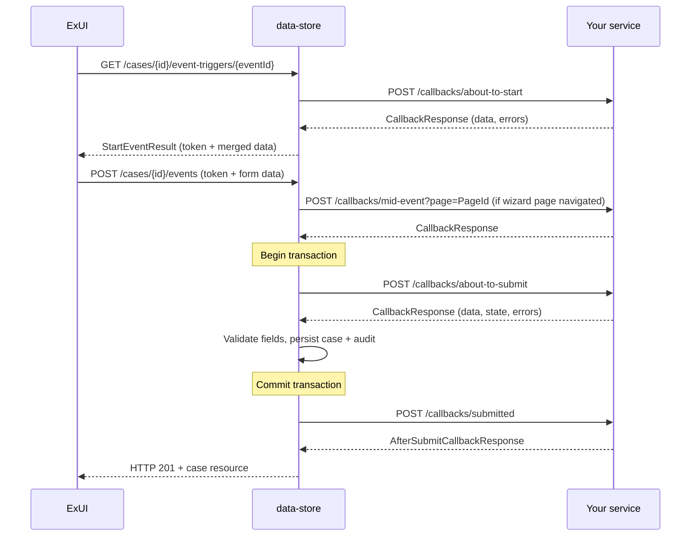

# Callbacks

## TL;DR

- CCD callbacks are synchronous HTTP POST requests data-store fires at your service at key points in an event lifecycle: `about_to_start`, `about_to_submit`, `mid_event`, `submitted`, and `get_case`.
- Your service receives a `CallbackRequest` (current case data + before-snapshot + event ID) and must return a `CallbackResponse` (optionally mutated data, errors, warnings).
- Non-empty `errors` causes data-store to return HTTP 422 and abort the event. Non-empty `warnings` causes a confirmation prompt unless `ignore_warning=true`.
- All callback calls carry `ServiceAuthorization` (S2S) and `Authorization` (user JWT) headers — validate both.
- Data-store retries callbacks up to 3 times (T+1 s, T+3 s) unless the event sets `retriesTimeout=[0]`.
- `submitted` fires after the database transaction commits; its failure is swallowed — the case save is not rolled back.
- In decentralised mode the service owns persistence via `/ccd-persistence/*`; `about_to_submit` and `submitted` callbacks are skipped.

---

## Callback types

| Type | When fired | Can mutate data | Failure aborts save |
|---|---|---|---|
| `about_to_start` | On GET event-trigger (before form renders) | Yes — merged into start result | Yes (422) |
| `mid_event` | On page navigation within a multi-page form | Yes | Yes (422) |
| `about_to_submit` | Inside the DB transaction, after data merge | Yes | Yes (422 + rollback) |
| `submitted` | After transaction commits | No (response is notification metadata) | No — swallowed |
| `get_case` | On case retrieval | Yes — shapes visible data | Yes (422) |

`mid_event` URL is taken from the `WizardPage` definition, not the event — one URL per wizard page (`CallbackInvoker.java:182`).  
`get_case` URL is on `CaseTypeDefinition`, not on any event (`CallbackInvoker.java:148`).

---

## Request shape

Data-store POSTs `CallbackRequest` JSON to your endpoint:

```json
{
  "case_details": {
    "id": 1234567890123456,
    "case_type_id": "NFD",
    "jurisdiction": "DIVORCE",
    "state": "AwaitingPayment",
    "data": { "applicant1FirstName": "Jane", "...": "..." },
    "data_classification": { "applicant1FirstName": "PUBLIC" },
    "security_classification": "PUBLIC",
    "created_date": "2024-01-15T10:30:00.000Z",
    "last_modified": "2024-01-15T10:30:00.000Z"
  },
  "case_details_before": {
    "...": "previous snapshot — null for about_to_start"
  },
  "event_id": "caseworker-confirm-service",
  "ignore_warning": false
}
```

`case_details_before` is `null` for `about_to_start`. Both `case_details` and `case_details_before` are present for `about_to_submit`, `mid_event`, and `submitted`.

---

## Response shape

### `about_to_start`, `mid_event`, `about_to_submit`

Return `CallbackResponse`:

```json
{
  "data": {
    "applicant1FirstName": "Jane",
    "someComputedField": "computed value"
  },
  "data_classification": {
    "someComputedField": "PUBLIC"
  },
  "security_classification": "PUBLIC",
  "state": "AwaitingHWFDecision",
  "errors": [],
  "warnings": ["Document may be missing — proceed?"],
  "error_message_override": null
}
```

- `data` — the full or partial updated case fields. Data-store merges this back into the case.
- `state` — optional; overrides the event's configured post-state if set.
- `errors` — non-empty list triggers HTTP 422 from data-store, event is aborted.
- `warnings` — non-empty list prompts the user for confirmation; blocked if `ignore_warning=false` in the request.
- `error_message_override` — replaces the default error message shown to the user (`CallbackService.java:191-205`).

### `submitted`

Return `AfterSubmitCallbackResponse` — a different, simpler shape used only for surfacing a confirmation message in ExUI:

```json
{
  "confirmation_header": "# Application submitted",
  "confirmation_body": "The case has been updated successfully."
}
```

This response has no effect on case data or state.

---

## Error and warning semantics

`CallbackService.validateCallbackErrorsAndWarnings()` (`CallbackService.java:191`) applies this logic:

1. If `errors` is non-empty → throw `ApiException` (HTTP 422). Event is aborted.
2. If `warnings` is non-empty **and** `ignore_warning=false` → throw `ApiException` (HTTP 422). ExUI re-presents the form with a "proceed anyway?" prompt.
3. If `warnings` is non-empty **and** `ignore_warning=true` → proceed; warnings are surfaced as informational messages.

Your service should return errors in `errors`, never throw HTTP 5xx for business-logic failures — a 5xx from a callback causes data-store to retry, then propagate a generic error to the user.

---

## Authentication

Every callback request carries two headers (`CallbackService.java:140`):

| Header | Value |
|---|---|
| `ServiceAuthorization` | S2S JWT identifying data-store as the calling service |
| `Authorization` | User JWT of the person triggering the event |

Validate the `ServiceAuthorization` token against your service's allowed S2S services list. The `Authorization` header can be forwarded to downstream IDAM-secured services (e.g. doc-assembly, CDAM).

An additional `Client-Context` header is forwarded from the original caller and must be echoed back in the response if present (`CallbackService.java:207-248`).

---

## Retry behaviour

Data-store uses `@Retryable` on `CallbackService.send()` (`CallbackService.java:75`):

- **Max attempts**: 3
- **Backoff**: initial delay 1 s, multiplier 3 — retries fire at T+1 s and T+4 s (multiplier=3, initial=1000 ms)
- **Disabled per-event**: set `retriesTimeout=[0]` on the event definition; data-store switches to `sendSingleRequest()` (`CallbackInvoker.java:76-83`)

HTTP timeouts are configured via application properties `http.client.connection.timeout` and `http.client.read.timeout` (`RestTemplateConfiguration.java:48-52`). Your service must respond within the read timeout or data-store will retry.

Design your callbacks to be idempotent — retries are transparent to your service.

---

## Wiring callbacks with ccd-config-generator SDK

In the SDK, callbacks are Java lambdas typed as `AboutToStart<T,S>`, `AboutToSubmit<T,S>`, `Submitted<T,S>`, or `MidEvent<T,S>`. The callback host URL is set once on the case type:

```java
// NoFaultDivorce.java:38 (nfdiv pattern)
configBuilder.setCallbackHost(System.getenv("CASE_API_URL"));
```

Each event wires its callbacks fluently:

```java
configBuilder.event(CASEWORKER_CONFIRM_SERVICE)
    .forStates(AwaitingServiceConsideration)
    .name("Confirm service")
    .aboutToSubmitCallback(this::aboutToSubmit)  // Event.java:40
    .submittedCallback(this::submitted);          // Event.java:41
```

Mid-event callbacks attach per wizard page:

```java
eventBuilder.fields()
    .page("ServiceDetails", this::midEvent)   // FieldCollection.java:495
    .field(CaseData::getServiceMethod);
```

The SDK generates the webhook URL as `<host>/callbacks/about-to-submit` etc. and writes it into the CCD definition.

### Callback method signatures (SDK)

| Callback type | Method signature | Return type |
|---|---|---|
| `aboutToStart` | `(CaseDetails<T,S> details)` | `AboutToStartOrSubmitResponse<T,S>` |
| `aboutToSubmit` | `(CaseDetails<T,S> details)` | `AboutToStartOrSubmitResponse<T,S>` |
| `midEvent` | `(CaseDetails<T,S> details, CaseDetails<T,S> detailsBefore)` | `AboutToStartOrSubmitResponse<T,S>` |
| `submitted` | `(CaseDetails<T,S> details, CaseDetails<T,S> detailsBefore)` | `SubmittedCallbackResponse` |

Return errors via the response builder, not exceptions:

```java
// SystemRequestNoticeOfChange.java:105-108 pattern
return AboutToStartOrSubmitResponse.<CaseData, State>builder()
    .errors(List.of("Cannot apply NoC to offline case"))
    .build();
```

### Mutually exclusive: webhook vs decentralised

`aboutToSubmitCallback` / `submittedCallback` and `submitHandler` (decentralised) are mutually exclusive. Setting both throws `IllegalStateException` at startup (`Event.java:188-199`).

---

## Decentralised mode

In decentralised mode, data-store routes persistence to the service's own database via `/ccd-persistence/*` (Feign, with S2S auth). The key differences:

- `about_to_submit` and `submitted` callbacks are **not fired** (`CallbackInvoker.java:98-99, 123-125`). Business logic runs inside `submitHandler` instead.
- The service implements `POST /ccd-persistence/cases` (and related endpoints) — this is handled automatically by the `decentralised-runtime` module's `ServicePersistenceController`.
- Data-store sends an `Idempotency-Key` UUID header on every `POST /ccd-persistence/cases` call (`ServicePersistenceAPI.java:46`). Your service must honour it — identical key = same response.
- Config maps case-type ID prefixes to service base URLs: `ccd.decentralised.case-type-service-urls[PCS_PR_]=https://pcs-api-pr-%s.preview.platform` (`application.properties:203-206`).

The `submitHandler` lambda receives an `EventPayload` (deserialised domain object) and runs entirely within the service process — no HTTP round-trip to CCD for business logic.

---

## Event lifecycle sequence (conventional mode)



---

## Gotchas

- `submitted` callback failure is caught and logged, not re-thrown (`DefaultCreateEventOperation.java:100-104`). Do not rely on it for data mutations.
- Retry config (`retriesTimeout` values in the event definition spreadsheet) was intentionally discarded in RDM-4316 (`CallbackService.java:42`). Retry is application-property-only.
- `mid_event` URL is on the `WizardPage`, not the event — you get one URL per page, with `?page=<pageId>` appended.
- In decentralised mode, the external service must return `revision`, `version`, and `securityClassification`; missing any throws `ServiceException` (`ServicePersistenceClient.java:132-143`).
- Notification dispatch should always be in `submitted`, not `aboutToSubmit` — separates data mutation from side-effects and avoids re-sending on retry.

---

## See also

- [Event model](event-model.md) — how events orchestrate the callback sequence
- [Implement a callback](../how-to/implement-a-callback.md) — step-by-step SDK wiring and handler guide
- [Callback contract reference](../reference/callback-contract.md) — full request/response field reference

## Example

<!-- source: libs/ccd-config-generator/test-projects/e2e/src/main/java/uk/gov/hmcts/divorce/sow014/nfd/CaseworkerAddNote.java:44-84 -->
```java
// from libs/ccd-config-generator/test-projects/e2e/src/main/java/uk/gov/hmcts/divorce/sow014/nfd/CaseworkerAddNote.java

// Wiring the aboutToSubmit callback on the event builder:
new PageBuilder(configBuilder
    .event(CASEWORKER_ADD_NOTE)
    .forAllStates()
    .name("Add note")
    .aboutToSubmitCallback(this::aboutToSubmit)   // wired here
    .grant(CREATE_READ_UPDATE, CASE_WORKER, SOLICITOR, JUDGE))
    .page("addCaseNotes")
    .optional(CaseData::getNote);

// The callback method itself:
public AboutToStartOrSubmitResponse<CaseData, State> aboutToSubmit(
    final CaseDetails<CaseData, State> details,
    final CaseDetails<CaseData, State> beforeDetails
) {
    var caseData = details.getData();
    final User caseworkerUser = idamService.retrieveUser(request.getHeader(AUTHORIZATION));
    // ... persist side-effects ...
    return AboutToStartOrSubmitResponse.<CaseData, State>builder()
        .data(caseData)
        .build();
}
```
