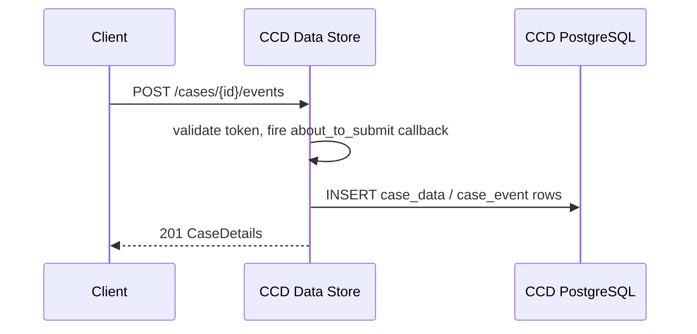
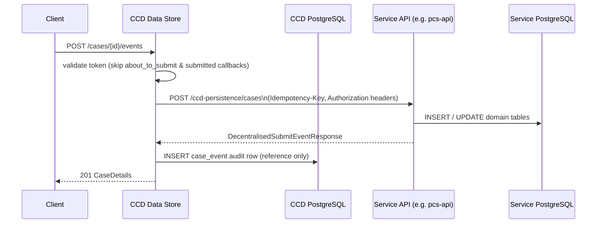
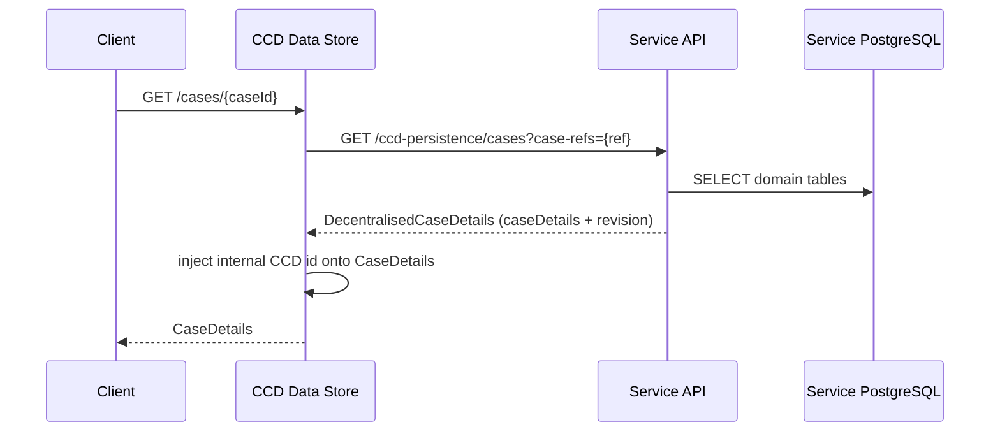

# Decentralisation

## TL;DR

- In decentralised mode a service owns case data in its own database; CCD data-store delegates reads and writes to the service via `/ccd-persistence/*` endpoints instead of writing to its own schema.
- Routing is configured with `ccd.decentralised.case-type-service-urls` — a prefix map from case type ID to base URL (`application.properties:203-206`).
- The service gets these endpoints for free by setting `ccd { decentralised = true }` in its Gradle build; the `decentralised-runtime` SDK module injects `ServicePersistenceController` automatically.
- Events are typed Java handlers (`Submit<T,S>`) rather than HTTP webhook callbacks; `aboutToSubmit` and `submitted` callbacks are skipped for decentralised case types.
- PCS (Possession Claims Service) is the canonical production example: `apps/pcs/pcs-api`.

## Why decentralisation exists

Standard CCD persists every case as a JSONB blob in CCD's own PostgreSQL schema. That works well for services whose data model is stable and whose access patterns fit CCD's generic queries. Some services need something different:

- **Data sovereignty** — the service team owns and migrates their own schema without coupling to CCD's release train.
- **Schema evolution** — a typed relational model (with Flyway migrations) is easier to evolve than a shared JSONB column.
- **Performance** — the service can use optimised queries, indexes, and read models instead of the generic CCD data table.
- **Domain logic at persist time** — the `Submit<T,S>` handler runs inside the service's own transaction, so domain invariants are enforced in one place.

## Architecture: central vs decentralised

### Central (standard) persistence



### Decentralised persistence



### Decentralised read



## How CCD routes to a decentralised service

`PersistenceStrategyResolver` (`PersistenceStrategyResolver.java:27`) loads `ccd.decentralised.case-type-service-urls` at startup — a map of case type ID prefix to base URL. Prefix matching is case-insensitive (keys are lowercased at load time, `PersistenceStrategyResolver.java:63-75`). The longest matching prefix wins.

Example configuration:

```properties
# application.properties (ccd-data-store-api)
ccd.decentralised.case-type-service-urls[PCS]=https://pcs-api.platform.hmcts.net
# Preview PR environments use a %s placeholder for the PR suffix
ccd.decentralised.case-type-service-urls[PCS_PR_]=https://pcs-api-pr-%s.preview.platform
```

`DelegatingCaseDetailsRepository.set()` (`DelegatingCaseDetailsRepository.java:46`) checks `resolver.isDecentralised(caseDetails)` on every write — if true it throws `UnsupportedOperationException` (decentralised case pointers are immutable in CCD's database). For reads, `findAndDelegate()` routes to `ServicePersistenceClient.getCase()` when the local pointer's case type is decentralised. Event submissions bypass this repository entirely and go directly through `ServicePersistenceClient.createEvent()`.

## The `/ccd-persistence` contract

CCD data-store acts as the **client**; the service acts as the **server**. The Feign interface `ServicePersistenceAPI` (`ServicePersistenceAPI.java`) declares the full contract:

| Endpoint | Purpose | Notable headers |
|---|---|---|
| `POST /ccd-persistence/cases` | Submit create or update event | `Idempotency-Key` (UUID), `Authorization` |
| `GET /ccd-persistence/cases?case-refs=` | Fetch one or more cases by reference | — |
| `POST /ccd-persistence/cases/{ref}/supplementary-data` | Update supplementary data | — |
| `GET /ccd-persistence/cases/{ref}/history` | Full audit event list | — |
| `GET /ccd-persistence/cases/{ref}/history/{eventId}` | Single audit event | — |

Key constraints enforced by `ServicePersistenceClient`:

- The service must return `revision`, `version`, and `securityClassification`; any missing field throws `ServiceException` (`ServicePersistenceClient.java:132-143`).
- The returned `reference`, `caseTypeId`, and `jurisdiction` must match what CCD sent — mismatch throws `ServiceException` (`ServicePersistenceClient.java:131-163`).
- The `Idempotency-Key` header on `POST /ccd-persistence/cases` must be honoured: repeated calls with the same key must return the same response (`ServicePersistenceAPI.java:46` javadoc).
- CCD's internal numeric `id` is **not** sent to the service; it is injected onto the returned object after retrieval (`ServicePersistenceClient.java:54, 108`).

## Callback differences for decentralised case types

Decentralised case types skip `aboutToSubmit` and `submitted` HTTP callbacks entirely (`CallbackInvoker.java:98-99, 123-125`). Domain logic that would have gone in those webhooks is instead implemented as a typed `Submit<T,S>` handler running inside the service's own transaction.

`CreateCaseEventService` bypasses `saveCaseDetails` for decentralised cases and calls `DecentralisedCreateCaseEventService.submitDecentralisedEvent()` instead (`CreateCaseEventService.java:284`).

Audit history for decentralised cases is loaded by `DecentralisedAuditEventLoader` (rather than `LocalAuditEventLoader`), which calls `GET /ccd-persistence/cases/{ref}/history` on the service.

## Implementing a decentralised service with the SDK

The `ccd-config-generator` SDK's `decentralised-runtime` module provides everything a service needs.

### 1. Enable decentralised mode in Gradle

```groovy
// build.gradle
ccd {
    decentralised = true
    runtimeIndexing = true   // re-index CCD config at startup
}
```

Setting `decentralised = true` pulls in the `decentralised-runtime` dependency and wires `ServicePersistenceController` automatically (`build.gradle:98-102` in pcs-api). The service does **not** write this controller itself.

### 2. Implement `CaseView`

```java
@Component
public class PCSCaseView implements CaseView<PCSCase, State> {

    @Override
    public PCSCase getCase(CaseViewRequest<State> request) {
        // load from your own repository
        PcsCaseEntity entity = pcsCaseRepository
            .findByCaseReference(request.caseRef());
        PCSCase pcsCase = assembleFromEntity(entity);
        pcsCase.setSearchCriteria(new SearchCriteria()); // feeds GlobalSearch
        return pcsCase;
    }
}
```

`PCSCaseView.java:82` shows the production implementation. `CaseProjectionService` (inside `decentralised-runtime`) calls this bean when CCD requests a case read.

### 3. Define decentralised events

Use `configureDecentralised(DecentralisedConfigBuilder)` rather than `configure(ConfigBuilder)`:

```java
@Override
public void configureDecentralised(DecentralisedConfigBuilder<PCSCase, State, UserRole> builder) {
    builder.decentralisedEvent("createPossessionClaim", this::handleCreate)
        .name("Create possession claim")
        .fields()
        // ... field configuration
        ;
}

private SubmitResponse<State> handleCreate(EventPayload<PCSCase, State> payload) {
    // persist to your own DB inside this handler
    pcsService.createClaim(payload.caseReference(), payload.caseData());
    return SubmitResponse.defaultResponse();
}
```

`EventPayload` is a Java record (`EventPayload.java:7`) carrying `caseReference`, `caseData`, and `urlParams`. `SubmitResponse.defaultResponse()` is the no-op variant when the service handles persistence internally and has nothing to signal back.

`submitHandler` and `aboutToSubmitCallback` are mutually exclusive — setting both throws `IllegalStateException` (`Event.java:196-203`).

### 4. Configure CCD routing (env var)

```bash
# In CCD data-store deployment
CCD_DECENTRALISED_CASE-TYPE-SERVICE-URLS_PCS=http://pcs-api:4550
```

The env var key maps to `ccd.decentralised.case-type-service-urls[PCS]`. For preview PR environments pcs-api uses a `%s` template suffix (`application.properties:203-206`).

### 5. Database migrations

`DecentralisedDataConfiguration` (`@AutoConfiguration`) runs SDK Flyway migrations from `classpath:dataruntime-db/migration` in schema `ccd` before the service's own migrations (`DecentralisedDataConfiguration.java:17-50`). If the service defines its own `FlywayMigrationStrategy` bean the SDK migrations will not run automatically (`@ConditionalOnMissingBean`).

## Supplementary data

Supplementary data updates also route through the decentralised service. `DelegatingSupplementaryDataUpdateOperation` sends `POST /ccd-persistence/cases/{ref}/supplementary-data` to the service rather than updating the local JSONB column.

## Preview environment support

The `%s` placeholder in `ccd.decentralised.case-type-service-urls` is replaced with the case type ID suffix at routing time (`PersistenceStrategyResolver.java:171, 175`). Combined with `CASE_TYPE_SUFFIX` (appended to case type ID and name, `CaseType.java:44-48`), this allows each PR to get its own isolated case type routed to its own preview deployment.

## Example

### `CaseView` implementation — PCS production reference

```java
// from apps/pcs/pcs-api/src/main/java/uk/gov/hmcts/reform/pcs/ccd/PCSCaseView.java
@Component
@AllArgsConstructor
public class PCSCaseView implements CaseView<PCSCase, State> {

    private final PcsCaseRepository pcsCaseRepository;
    // ...

    @Override
    public PCSCase getCase(CaseViewRequest<State> request) {
        long caseReference = request.caseRef();
        State state = request.state();

        PCSCase pcsCase = getSubmittedCase(caseReference);

        // ... enrich view fields ...

        // Required for Global Search indexing
        pcsCase.setSearchCriteria(new SearchCriteria());

        return pcsCase;
    }

    private PcsCaseEntity loadCaseData(long caseRef) {
        return pcsCaseRepository.findByCaseReference(caseRef)
            .orElseThrow(() -> new CaseNotFoundException(caseRef));
    }
}
```

<!-- source: apps/pcs/pcs-api/src/main/java/uk/gov/hmcts/reform/pcs/ccd/PCSCaseView.java:54-97 -->

## See also

- [Decentralise a service](../how-to/decentralise-a-service.md) — step-by-step guide to enabling decentralised mode
- [Decentralised callbacks reference](../reference/decentralised-callbacks.md) — `/ccd-persistence` contract and response field reference
- [Architecture](architecture.md) — where decentralised services fit in the broader CCD runtime topology
