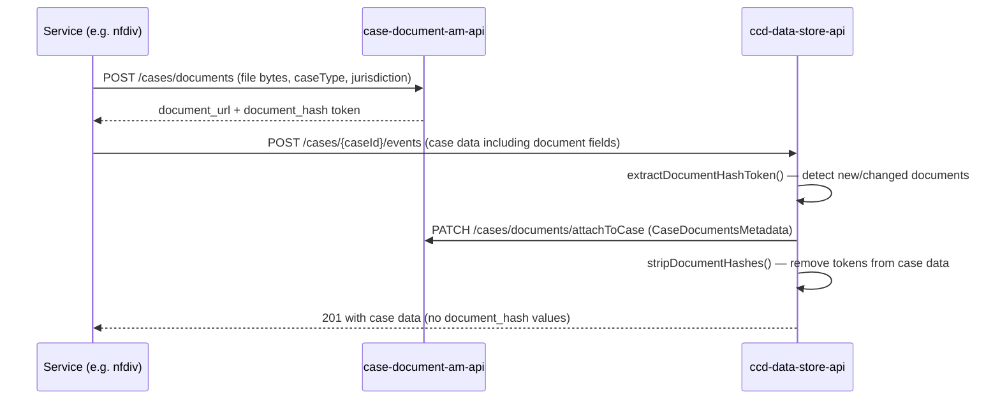

# Documents and CDAM

## TL;DR

- CCD documents are stored in the **Case Document Access Management API** (CDAM, `ccd-case-document-am-api`), not directly in the case data table.
- Each document field in case data is a JSON object with `document_url`, `document_binary_url`, and a transient `document_hash` token.
- During event submission, CCD data-store detects new or changed documents, registers them with CDAM via `CaseDocumentAmApiClient.applyPatch()`, then strips the hash before persisting.
- The hash-token mechanism prevents tampering: callbacks cannot overwrite a hash already assigned to an existing document.
- CDAM replaces the legacy `document-management-store` (DM Store) flow; service teams using the CDAM client library never call DM Store directly.
- In local development via `rse-cft-lib`, CDAM runs in-process on port `4455` alongside the other embedded CFT services.

---

## Document field shape

Document references in case data are JSON objects. CCD data-store recognises two field-name constants
(`CaseDocumentUtils.java:31-33`):

```json
{
  "document_url": "https://dm-store.example/documents/abc123",
  "document_binary_url": "https://dm-store.example/documents/abc123/binary",
  "document_hash": "hashToken"
}
```

`document_url` holds the CDAM (or legacy DM Store) URL. `document_binary_url` holds the download URL.
`document_hash` is a short-lived tamper-detection token injected during event processing and **stripped before
case data is written to the database** — the `case_data` table never contains hash values.

> **Note:** `CaseDocumentUtils.DOCUMENT_BINARY_URL` is defined as the string `"document_url"` rather than
> `"document_binary_url"` (`CaseDocumentUtils.java:32`) — a known copy-paste inconsistency in the codebase.

---

## Upload flow via CDAM

Service teams upload documents through the CDAM client library (`uk.gov.hmcts.reform.ccd.document.am.feign.CaseDocumentClient`),
passing the user JWT, S2S token, case type, and jurisdiction alongside the file bytes. The nfdiv service wraps
this in `CaseDocumentAccessManagement.upload()` (`CaseDocumentAccessManagement.java:28`):

```
client.uploadDocuments(userToken, serviceToken, caseType, jurisdiction, files)
```

CDAM stores the file and returns a document URL. The service team then places that URL (and optionally a
`document_hash` token) into the case data payload before submitting the CCD event.



---

## Hash-token lifecycle inside data-store

During `about_to_submit` processing, `CaseDocumentService` (`CaseDocumentService.java:51-79`) walks three trees:

1. **DB snapshot** — the case data already persisted.
2. **Pre-callback data** — data after `about_to_start` but before `about_to_submit`.
3. **Post-callback data** — what the service's callback returned.

`extractDocumentHashToken()` compares these trees to identify documents that are genuinely new or modified.
Any callback response that tries to change an existing `document_hash` is rejected by `verifyNoTamper()`
(`CaseDocumentService.java:131-138`), which prevents a callback from re-tagging a document it did not upload.

New documents are registered with CDAM by calling `CaseDocumentAmApiClient.applyPatch(CaseDocumentsMetadata)`
(`CaseDocumentService.java:104`). `CaseDocumentsMetadata` is a batch payload carrying the case reference and the
list of document URLs to associate with it.

Finally, `stripDocumentHashes()` (`CaseDocumentService.java:41-48`) removes every `document_hash` key from the
case data before it is written to the `case_data` table or returned to the caller.

### Feature flags

Three flags in data-store control this behaviour (`CaseDocumentService.java:45`, `92`, `109`):

| Flag | Effect when disabled |
|---|---|
| `attachDocumentEnabled` | Skips the CDAM `applyPatch` call — documents are not registered with CDAM. |
| `documentHashCheckingEnabled` | Skips validation of missing or mismatched hash tokens. |
| `documentHashCloneEnabled` | Controls whether hashes are propagated during the strip step. |

All three flags must be consistently enabled in production. Partial enablement creates inconsistent behaviour.

---

## Retrieval

The data-store exposes a document metadata endpoint:

```
GET /cases/{caseId}/documents/{documentId}
```

Implemented by `CaseDocumentController.getCaseDocumentMetadata()` (`CaseDocumentController.java:59`). This
delegates to CDAM to check access and return document metadata. The document binary itself is served by CDAM
directly, not proxied through data-store.

---

## Legacy DM Store vs CDAM

Prior to CDAM, documents were uploaded directly to `document-management-store` (DM Store) and referenced in
case data without any hash-token mechanism. CCD data-store had no way to verify that a callback had not
substituted a document URL mid-event.

CDAM introduces:

- **Case-scoped access control** — CDAM enforces that a document belongs to a specific case type and
  jurisdiction before granting access.
- **Hash-token tamper detection** — the upload returns a short-lived token; data-store validates it on submit.
- **Audit attachment** — `applyPatch` creates an association between the document and the CCD case reference
  in CDAM's own store, enabling case-level document listing independent of the case data JSON.

Service teams should use the CDAM client library (`CaseDocumentClient`) exclusively. The nfdiv service is a
reference implementation: `CaseDocumentAccessManagement` wraps the Feign client and never calls DM Store
(`CaseDocumentAccessManagement.java:36`; cross-cutting note in service-nfdiv research).

---

## Document categories metadata

When uploading, service teams pass `caseType` and `jurisdiction` to CDAM
(`CaseDocumentAccessManagement.java:36`). These act as the primary categorisation attributes. Document
type/category within the case is represented at the service level — for example, nfdiv stores documents as
`ListValue<DivorceDocument>` where `DivorceDocument` wraps `ccd.sdk.type.Document` alongside a `DocumentType`
enum value. CCD data-store itself is agnostic to document category; categorisation is a service-team concern.

---

## Local development with rse-cft-lib

When using `rse-cft-lib` (`bootWithCCD` Gradle task), CDAM launches in-process as a separate Spring Boot
application under its own `URLClassLoader`, resolved from HMCTS Azure Artifacts as artifact
`com.github.hmcts.rse-cft-lib:ccd-case-document-am-api` (`Service.java:13`). It listens on port `4455`.

The environment variable `CASE_DOCUMENT_AM_URL=http://localhost:4455` is set both in `CftlibExec`
(`CftlibExec.java:46`) and unconditionally via `LibRunner` (`LibRunner.java:107`), so CCD data-store and
service code reach the embedded CDAM without any manual configuration.

No custom endpoints are added by cftlib to CDAM — it runs from the upstream binary unchanged.

---

## See also

- [Store a document](../how-to/store-a-document.md) — step-by-step guide to uploading via CDAM and referencing in case data
- [CDAM API reference](../reference/api-cdam.md) — full endpoint and response-field reference for `ccd-case-document-am-api`

## Glossary

| Term | Definition |
|---|---|
| CDAM | Case Document Access Management API (`ccd-case-document-am-api`) — the HMCTS service that stores documents and enforces case-scoped access control. |
| DM Store | Legacy `document-management-store` service. Documents still physically reside there; CDAM provides an access-control and audit layer on top. |
| `document_hash` | Short-lived tamper-detection token returned by CDAM on upload. Present in callback payloads; stripped before case data is persisted. |
| hash-token tamper detection | The mechanism by which CCD data-store prevents callbacks from substituting or re-tagging existing documents during event submission. |
| `CaseDocumentsMetadata` | Batch payload sent from data-store to CDAM via `applyPatch` to associate uploaded documents with a CCD case reference. |
