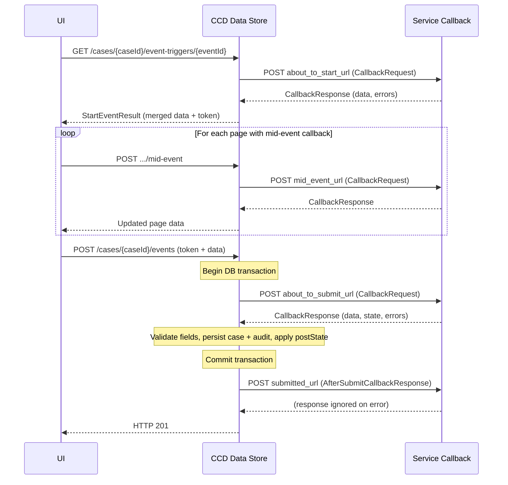

# Event Model

## TL;DR

- A CCD event is the atomic unit of change: it moves a case through a wizard, optionally fires HTTP callbacks, then persists updated data and a state transition.
- Three event-level callbacks run in fixed order: `about_to_start` (before the form opens), `about_to_submit` (inside the DB transaction, after the user clicks submit), and `submitted` (after commit — fire-and-forget).
- Mid-event callbacks fire between wizard pages; they are keyed to a page ID, not an individual field.
- `about_to_submit` failure rolls back the entire transaction; `submitted` failure is caught and logged — the case save is already committed.
- A callback-free event needs no webhook URL and no service-side code: CCD stores whatever the user typed.
- Decentralised events skip `about_to_submit` and `submitted` callbacks entirely — the service handles them via `submitHandler`.

## The lifecycle of one event

### Phase 1 — Start event

When a user (or system) opens an event form, the UI calls:

```
GET /cases/{caseId}/event-triggers/{eventId}
```

`StartEventController.getStartEventTrigger()` (`StartEventController.java:119`) validates the case, generates a short-lived **event token**, then fires `CallbackInvoker.invokeAboutToStartCallback()` if `about_to_start_url` is configured (`DefaultStartEventOperation.java:147`).

The `about_to_start` callback receives:

```json
{
  "case_details": { "...current case data..." },
  "case_details_before": { "...case data before event..." },
  "event_id": "createCase",
  "ignore_warning": false
}
```

The response `data` map is merged back into the form — use this to pre-populate fields or to enforce guard conditions that block the event entirely (return `errors`).

The token is included in the `StartEventResult` returned to the UI and must be echoed back on submit. This prevents two users from simultaneously submitting the same event on the same case.

### Phase 2 — Wizard pages and mid-event callbacks

The UI renders the event as a multi-step wizard. Each page is defined in the SDK config:

```java
// FieldCollection.java:495
fields().page("basicDetails")
        .mandatory(CaseData::getApplicantName)
        .page("documents", this::documentsCallback)   // mid-event callback on second page
        .optional(CaseData::getEvidence);
```

When the user advances from page N to page N+1, if page N has a mid-event callback the UI calls:

```
POST /cases/{caseId}/event-triggers/{eventId}/mid-event
```

The request shape is identical to other callbacks (`CallbackRequest.java`). The mid-event URL is taken from `WizardPage`, not the event definition (`CallbackInvoker.java:182`). Use mid-event callbacks to validate partial input or populate derived fields before the user continues.

### Phase 3 — Submit event

On the final wizard page the user clicks Submit. The UI calls:

```
POST /cases/{caseId}/events
```

The body is a `CaseDataContent` containing the event token, the event ID, and the user-entered data. The processing chain is:

1. `CaseController.createEvent()` delegates to `DefaultCreateEventOperation` (`CaseController.java:245`).
2. `DefaultCreateEventOperation` validates the idempotency key and calls `CreateCaseEventService.createCaseEvent()` (`DefaultCreateEventOperation.java:52-62`).
3. Inside the DB transaction (`CreateCaseEventService`):
   - Validates the event token (`CreateCaseEventService.java:210`).
   - Checks the case is in an allowed `preState` (`CreateCaseEventService.java:218`).
   - Merges the user-submitted data with the existing case data.
   - Calls `invokeAboutToSubmitCallback()` (`CreateCaseEventService.java:235`).
   - Runs `ValidateCaseFieldsOperation` against the updated data (`CreateCaseEventService.java:253`).
   - Persists the new case data and writes an audit row to `case_event` (`CreateCaseEventService.java:298`).
   - Applies the `postState` transition.
4. After the transaction commits, `DefaultCreateEventOperation` calls `invokeSubmittedCallback()` if `callBackURLSubmittedEvent` is set (`DefaultCreateEventOperation.java:58-60`). Any `CallbackException` is caught and logged; the case save is not undone (`DefaultCreateEventOperation.java:100-104`).

### State transitions

Every event carries optional `preState` and `postState` fields (`Event.java:29-30`). If `preState` is set, the event is only available when the case is in that state (or matches an allowed set). After a successful submit, CCD transitions the case to `postState`.

Setting neither is valid for events that are allowed from any state (e.g. internal system events). Using `.forAllStates()` in the SDK is the explicit way to express this.

```java
// CreateTestCase.java:93
configBuilder.event(CREATE_TEST_CASE)
    .initialState(Draft)               // pre-state: case does not exist yet
    .aboutToStartCallback(this::aboutToStart)
    .aboutToSubmitCallback(this::aboutToSubmit)
    .submittedCallback(this::submitted);
```

## Sequence diagram — event with all callbacks



## Callback contracts

### about_to_start

| Direction | Field | Notes |
|-----------|-------|-------|
| Request | `case_details` | Current case data before any user input |
| Request | `event_id` | String event ID |
| Response | `data` | Merged into the form; can pre-populate fields |
| Response | `errors` | Non-empty list blocks the event from opening |

### about_to_submit

| Direction | Field | Notes |
|-----------|-------|-------|
| Request | `case_details` | Case data after user edits (pre-persist) |
| Request | `case_details_before` | Case data as it was before the event started |
| Request | `ignore_warning` | Boolean passed through from the UI |
| Response | `data` | Replaces case data written to DB |
| Response | `state` | Optional — override the `postState` transition |
| Response | `errors` | Non-empty list causes HTTP 422; transaction rolls back |
| Response | `warnings` | Non-empty causes 422 unless `ignore_warning=true` |

### submitted

Uses `AfterSubmitCallbackResponse` (different shape from other callbacks):

| Field | Notes |
|-------|-------|
| `confirmation_header` | Markdown shown in the confirmation banner |
| `confirmation_body` | Markdown shown below the header |

The `submitted` callback fires outside the transaction. Failure is swallowed (`DefaultCreateEventOperation.java:100-104`) — the case has already been saved. Use it for side-effects (notifications, task creation) that are safe to lose on error.

## Callback-free events

Not every event needs a callback. A minimal event that lets a caseworker update a single field:

```java
configBuilder.event("caseworker-update-reference")
    .forStates(AwaitingDocuments, Submitted)
    .name("Update Reference")
    .grant(CRU, CASE_WORKER);

new PageBuilder(configBuilder.event("caseworker-update-reference"))
    .page("ref")
    .mandatory(CaseData::getCaseReference);
```

No `aboutToSubmitCallback`, no `submittedCallback`. CCD validates the field type, persists the update, and writes the audit row without calling out to the service at all. This is preferable for simple field-edits where no business logic is required.

## Retry behaviour

Callbacks are retried on failure with `@Retryable(maxAttempts=3)` using backoff of 1s then 3s (`CallbackService.java:75`). To disable retries for a specific event, call `EventBuilder.retries(0)` — `CallbackInvoker` detects the `[0]` list and switches to a single-attempt dispatch (`CallbackInvoker.java:76-83`). The `submitted` callback is not retried; it fires once.

## Decentralised events

When a case type is registered as decentralised (`ccd.decentralised.case-type-service-urls` map), the Data Store skips `about_to_submit` and `submitted` callbacks (`CallbackInvoker.java:98-99, 123-125`). Instead it calls `POST /ccd-persistence/cases` on the owning service, which handles the event entirely in-process via its `submitHandler`. See the decentralised CCD pages for details.

## See also

- [Callbacks](callbacks.md) — detailed callback dispatch, timeouts, retry, and error semantics
- [Add an event](../how-to/add-an-event.md) — step-by-step: define an event with the SDK
- [Callback contract reference](../reference/callback-contract.md) — full request/response field reference

## Example

<!-- source: libs/ccd-config-generator/test-projects/e2e/src/main/java/uk/gov/hmcts/divorce/sow014/nfd/CaseworkerAddNote.java:44-84 -->
```java
// from libs/ccd-config-generator/test-projects/e2e/src/main/java/uk/gov/hmcts/divorce/sow014/nfd/CaseworkerAddNote.java
@Override
public void configure(final ConfigBuilder<CaseData, State, UserRole> configBuilder) {
    new PageBuilder(configBuilder
        .event(CASEWORKER_ADD_NOTE)
        .forAllStates()
        .name("Add note")
        .description("Add note")
        .aboutToSubmitCallback(this::aboutToSubmit)
        .showEventNotes()
        .grant(CREATE_READ_UPDATE,
            CASE_WORKER, SOLICITOR, JUDGE)
        .grant(CREATE_READ_UPDATE_DELETE,
            SUPER_USER)
        .grantHistoryOnly(LEGAL_ADVISOR, JUDGE))
        .page("addCaseNotes")
        .pageLabel("Add case notes")
        .optional(CaseData::getNote);
}

public AboutToStartOrSubmitResponse<CaseData, State> aboutToSubmit(
    final CaseDetails<CaseData, State> details,
    final CaseDetails<CaseData, State> beforeDetails
) {
    var caseData = details.getData();
    // ... business logic ...
    return AboutToStartOrSubmitResponse.<CaseData, State>builder()
        .data(caseData)
        .build();
}
```
