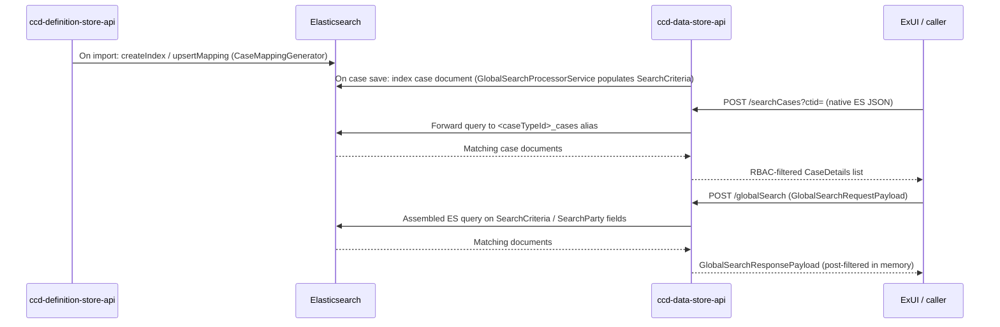

# Search Architecture

## TL;DR

- CCD exposes three distinct search surfaces: **work-basket search** (DB-backed, UI-driven), **global search** (`/globalSearch`, cross-jurisdiction ES), and **query_search** (`/searchCases` and `/internal/searchCases`, Elasticsearch v2).
- Work-basket inputs and results are configured via `WorkBasketInputFields` / `WorkBasketResultFields` definition sheets; they drive what filter inputs ExUI renders and what columns appear in the list.
- Global search is fed by `SearchCriteria` / `SearchParty` complex fields written into case data at save time by `GlobalSearchProcessorService`; it queries a shared ES index cross-jurisdiction.
- `POST /searchCases?ctid=` accepts a native Elasticsearch JSON body; `POST /internal/searchCases?ctid=&use_case=` is the internal UI variant that applies configured sort and shapes results for display.
- ES index mappings are generated by `ccd-definition-store-api` at definition import time and pushed into Elasticsearch; `ccd-data-store-api` never reads mappings from definition-store at query time.
- Elasticsearch must be explicitly enabled via `ELASTIC_SEARCH_ENABLED=true`; the work-basket-inputs endpoint (`GET .../work-basket-inputs`) is always active regardless.

---

## The three search surfaces

### 1. Work-basket search (DB-backed)

Work-basket search is the oldest surface. It is driven entirely by definition configuration and does not require Elasticsearch.

**Definition sheets involved:**

| Sheet | DB table | Definition-store endpoint |
|---|---|---|
| `WorkBasketInputFields` | `workbasket_input_case_field` | `GET /api/display/work-basket-input-definition/{id}` |
| `WorkBasketResultFields` | `workbasket_case_field` | `GET /api/display/work-basket-definition/{id}` |

`WorkBasketInputFields` rows specify which fields to render as filter inputs in the ExUI work-basket panel. Each row carries `CaseFieldID`, `CaseFieldElementPath` (dot-notation into complex types), `Label`, `DisplayOrder`, `AccessProfile`, `ShowCondition`, and `DisplayContextParameter` (`WorkBasketInputCaseFieldEntity.java:7,12`).

`WorkBasketResultFields` adds `SortOrder` (direction + priority columns) so the result list can be pre-sorted (`WorkBasketCaseFieldEntity.java:9,27`).

**Runtime endpoint:** `GET /caseworkers/{uid}/jurisdictions/{jid}/case-types/{ctid}/cases` (`QueryEndpoint.java:156`). This hits the relational DB, not Elasticsearch. The companion endpoint `GET .../work-basket-inputs` (`QueryEndpoint.java:205`) returns the input field configuration that ExUI uses to render the filter form.

The work-basket surface is **per-case-type** and **single-jurisdiction**. It cannot search across multiple case types simultaneously.

---

### 2. Global search (`/globalSearch`)

Global search is a cross-jurisdiction, cross-case-type surface built on Elasticsearch. It is driven by two special case-data fields — `SearchCriteria` and `SearchParty` — that service teams must declare in their case type definition.

**How the index is fed:**

When a case is saved, `GlobalSearchProcessorService.populateGlobalSearchData()` (`GlobalSearchProcessorService.java:47`) runs. If the case type has a `SearchCriteria` field, the processor extracts `SearchParty` entries (name, date of birth, address, email, phone) and `OtherCaseReference` values from the case data and writes them back as structured `SearchCriteria` collection entries. Elasticsearch indexes these entries.

There are two distinct `SearchCriteria` Java types that are easy to conflate:

- `domain.model.globalsearch.SearchCriteria` — the **case-data-level** complex field definition (what goes into the case JSON and gets indexed).
- `domain.model.search.global.SearchCriteria` — the **request-level** model used to build the ES query payload inside `GlobalSearchServiceImpl`.

**Runtime endpoint:** `POST /globalSearch` (`GlobalSearchEndpoint.java:62`). The request body is a `GlobalSearchRequestPayload`; the response is a `GlobalSearchResponsePayload`. `GlobalSearchServiceImpl.assembleSearchQuery()` translates the payload into an ES query. After ES returns results, `GlobalSearchParser.filterCases()` applies in-memory post-filtering.

**Result columns:** Configured via `SearchCasesResultFields` sheet → `search_cases_result_fields` table. This sheet has a `UseCase` column that allows different column sets for different contexts (e.g. `ORGCASES`, `WORKBASKET`). The definition-store endpoint is `GET /api/display/search-cases-result-fields/{id}?use_case=<value>` (`DisplayApiController.java:131–144`).

---

### 3. Query search — `searchCases` (Elasticsearch v2)

This is the primary Elasticsearch surface for service teams and integrations.

**External endpoint:** `POST /searchCases?ctid=` (`CaseSearchEndpoint.java:59`). The request body is a **native Elasticsearch JSON query** wrapped as an `ElasticsearchRequest`. The `ctid` parameter specifies which case type index to query. Passing `ctid=*` causes `elasticsearchQueryHelper.getCaseTypesAvailableToUser()` to expand to all case types accessible to the caller (`CaseSearchEndpoint.java:101–106`). Results are filtered through `AuthorisedCaseSearchOperation` (RBAC wrapper).

**Internal UI endpoint:** `POST /internal/searchCases?ctid=&use_case=` (`UICaseSearchController.java:47,73`). This variant accepts a single case type and an optional `use_case` value (e.g. `WORKBASKET`, `SEARCH`). The `use_case` drives which `SearchCasesResultFields` column set to apply and which sort configuration `ElasticsearchSortService` applies. Omitting `use_case` returns all fields (`UICaseSearchController.java:149–155`).

**Definition sheets that shape this surface:**

| Sheet | What it controls |
|---|---|
| `SearchInputFields` | Which fields ExUI renders as filter inputs on the Search screen |
| `SearchResultFields` | Which columns ExUI renders in search results; includes `SortOrder` |

These sheets (`search_input_case_field`, `search_result_case_field` tables) are UI hints only. They do not constrain which ES fields are queryable — any field with `searchable=true` on `CaseFieldEntity` can be queried in the native ES body.

---

## How Elasticsearch indexes are created and maintained

Index lifecycle is owned entirely by `ccd-definition-store-api`. `ccd-data-store-api` queries whatever index the alias points to; it does not push or modify mappings.

### Index creation on definition import

When a definition is imported via `POST /import`, `ImportServiceImpl` publishes a `DefinitionImportedEvent` (`ImportServiceImpl.java:300`). Either `SynchronousElasticDefinitionImportListener` (blocks import on ES failure, `failImportIfError=true`) or `AsynchronousElasticDefinitionImportListener` (ES errors do not fail import) handles the event.

For each `CaseTypeEntity` in the event:

1. If the alias does not yet exist, a new index `<name>-000001` is created and the alias is set (`ElasticDefinitionImportListener.java:68–71`).
2. `CaseMappingGenerator.generateMapping()` (`CaseMappingGenerator.java:33`) produces the ES mapping JSON from the case type's field definitions. This includes a `data` object (per-field, type-driven), `data_classification`, and alias mappings for any `SearchAliasField` entries. Text fields automatically get a `<name>_keyword` alias pointing to `field.keyword` for sort support (`CaseMappingGenerator.java:118–131`).
3. On the normal path (`reindex=false`), `HighLevelCCDElasticClient.upsertMapping()` merges the generated mapping into the existing index.

Index names follow the pattern `String.format(config.getCasesIndexNameFormat(), caseTypeId.toLowerCase())`, typically producing something like `divorce_divorcecase_cases-000001` (`ElasticDefinitionImportListener.java:165–168`).

### Reindex path

If `reindex=true` is passed at import time, definition-store sets the current index read-only, creates a new incremented index (e.g. `-000002`), reindexes data asynchronously, then atomically flips the alias. On failure it removes the new index and restores write access on the old one (`ElasticDefinitionImportListener.java:73–143`).

### Field searchability

`CaseFieldEntity.searchable` (default `true`) controls whether a field appears in the ES mapping at all. Fields whose CCD base type appears in the `config.getCcdIgnoredTypes()` list are excluded via `MappingGenerator.shouldIgnore()`. Non-searchable fields are present in case data but absent from the ES index.

### SearchAliasField

`SearchAliasFieldEntity` (sheet `SearchAliasFields`, table `search_alias_field`) maps a short alias name to a `caseFieldPath`. `CaseMappingGenerator.aliasMapping()` emits ES alias entries pointing to `data.<caseFieldPath>`, letting callers query by alias name instead of the full nested path (`SearchAliasFieldEntity.java:23–41`).

---

## Choosing the right surface

| Need | Surface | Endpoint |
|---|---|---|
| Caseworker work-basket list, single case type | Work-basket (DB) | `GET .../case-types/{ctid}/cases` |
| Cross-jurisdiction party/case-reference lookup | Global search (ES) | `POST /globalSearch` |
| Service-to-service ES query, flexible criteria | Query search external | `POST /searchCases?ctid=` |
| ExUI search screen, column/sort config applied | Query search internal | `POST /internal/searchCases?ctid=&use_case=SEARCH` |
| ExUI work-basket screen via ES | Query search internal | `POST /internal/searchCases?ctid=&use_case=WORKBASKET` |

Work-basket DB search and the ES surfaces can coexist. The `ELASTIC_SEARCH_ENABLED` environment variable (`application.properties:209`) gates all ES paths; the work-basket-inputs configuration endpoint is always served regardless.

---

## Data flow summary

---

## See also

- [Enable global search](../how-to/enable-global-search.md) — how to add `SearchCriteria` / `SearchParty` fields to a case type
- [Enable query search](../how-to/enable-query-search.md) — how to configure `SearchInputFields` and `SearchResultFields`
- [Work-basket](work-basket.md) — the DB-backed work-basket surface and how it relates to ES search

## Glossary

| Term | Meaning |
|---|---|
| `SearchCriteria` (case data) | Complex field on a case type; populated by `GlobalSearchProcessorService` at save time; feeds the global search ES index |
| `SearchParty` | Sub-field of `SearchCriteria`; holds party name, date of birth, address, email, phone for cross-case lookup |
| `use_case` | Parameter on `/internal/searchCases` and `SearchCasesResultFields`; selects which column/sort configuration to apply (e.g. `WORKBASKET`, `SEARCH`, `ORGCASES`) |
| `SearchAliasField` | Definition-store entity that maps a short alias name to a nested `caseFieldPath` in the ES index; allows querying by alias rather than full dot-notation path |
| `reindex` | Boolean flag on `POST /import`; when true, definition-store creates a new ES index, reindexes all case data, then atomically flips the alias |
