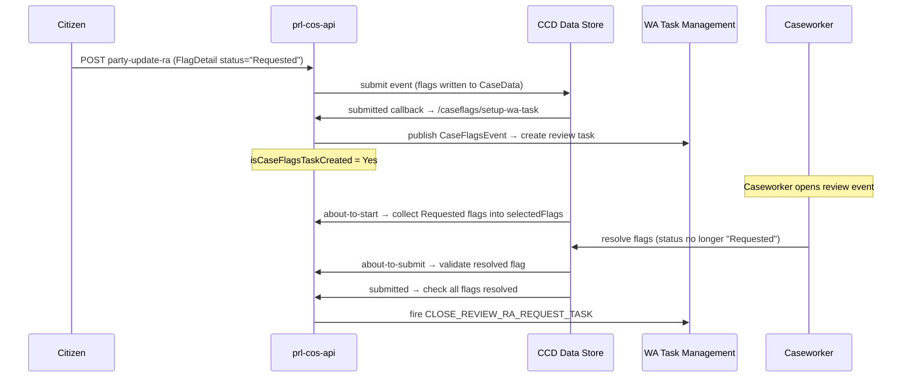

# Implement Reasonable Adjustments

## TL;DR

- Reasonable Adjustments (RA) are implemented on top of the standard CCD Case Flags mechanism — there is no separate RA data structure independent of `Flags`.
- Each party slot on `AllPartyFlags` holds a `Flags` complex type; RA flag codes are a constrained vocabulary within that type.
- When a citizen submits an RA request, the party's `FlagDetail.status` is set to `"Requested"` (a magic string), which triggers a WA task for caseworker review.
- The caseworker resolves flags via a CCD review event; when all flags leave `"Requested"` status the WA task closes automatically via `CLOSE_REVIEW_RA_REQUEST_TASK`.
- `isCaseFlagsTaskCreated` (`YesOrNo`) on `ReviewRaRequestWrapper` gates WA task lifecycle — it must be set to `Yes` before the close logic fires.

## Prerequisites

- Your case type already declares the `Flags` complex type on `CaseData` (case-level and/or per-party via `AllPartyFlags`).
- WA task management is configured — the `sdk/task-management` module is on the classpath, or your service has an equivalent WA integration.
- The CCD event that hosts the caseworker RA review is defined in your case definition.

## Steps

### 1. Declare flag fields on CaseData

Add a case-level `Flags` field and an `AllPartyFlags` holder to your `CaseData` class.

```java
// Case-level flags
@CCD(label = "Case flags")
private Flags caseFlags;                          // CaseData.java:714

// Per-party flags
@CCD(label = "All party flags")
private AllPartyFlags allPartyFlags;              // CaseData.java:786
```

`AllPartyFlags` holds up to five applicants, five respondents, solicitors, and barristers — each typed `Flags`. Field names such as `caApplicant1ExternalFlags` must match exactly the names used by the introspection logic in `CaseFlagsWaService` (`CaseFlagsWaService.java:115`).

### 2. Expose citizen RA endpoints

Wire citizen-facing endpoints so that the frontend can submit and retrieve RA flags per party.

```
POST  {caseId}/{eventId}/party-update-ra         # update citizen RA flags
GET   {caseId}/retrieve-ra-flags/{partyId}       # retrieve Flags object for a party
POST  {caseId}/language-support-notes            # append language support notes
```

These correspond to the methods in `ReasonableAdjustmentsController` (`ReasonableAdjustmentsController.java:49-107`). The POST delegates to `CaseService.updateCitizenRAflags`; the GET returns the `Flags` object directly.

### 3. Set flag status to "Requested" on citizen submission

When a citizen submits an RA request, set `FlagDetail.status = "Requested"` on the relevant party flag. This is the trigger string that downstream WA logic watches for (`CaseFlagsWaService.java:38`).

```java
flagDetail.setStatus("Requested");   // magic string — not an enum
```

Do not use any other string. The entire task-creation and close-task flow depends on this exact value.

### 4. Configure the WA task creation callback

Register a CCD callback on the event that writes updated flags back to the case. The endpoint `/caseflags/setup-wa-task` calls `setUpWaTaskForCaseFlagsEventHandler()` which publishes a `CaseFlagsEvent` to create a WA task (`CaseFlagsWaService.java:43-48`). A separate endpoint `/caseflags/check-wa-task-status` resets `isCaseFlagsTaskCreated` to `No` when all requested flags have been resolved (`CaseFlagsWaService.java:84-93`).

In your CCD definition (or `CCDConfig` implementation), wire the `submitted` webhook to `/caseflags/setup-wa-task`:

```java
event.submittedCallback((payload, caseDetails) ->
    caseFlagsWaService.checkCaseFlagsToCreateTask(payload));
```

`CaseFlagsWaService.checkCaseFlagsToCreateTask` sets `isCaseFlagsTaskCreated = Yes` on `ReviewRaRequestWrapper` when a task is raised.

### 5. Configure the caseworker review event

Define a CCD event for caseworkers to review RA requests. Wire its callbacks to:

| Stage | Endpoint | Purpose |
|---|---|---|
| `about-to-start` | `/caseflags/about-to-start` | Collects all `"Requested"` flags into `ReviewRaRequestWrapper.selectedFlags` (`CaseFlagsWaService.java:105-142`) |
| `about-to-submit` | `/caseflags/about-to-submit` | Validates the most-recently-modified flag is no longer `"Requested"` (`CaseFlagsController.java:125-152`) |
| `submitted` | `/caseflags/submitted-to-close-wa-task` | Closes the WA task if ALL flags are no longer `"Requested"` (`CaseFlagsWaService.java:51-75`) |

For language and special measures flags there is a parallel review path via `/review-lang-sm/about-to-start` and `/review-lang-sm/about-to-submit` (`CaseFlagsController.java:171-216`).

### 6. Handle deep-copy correctly

`CaseFlagsWaService.setSelectedFlags` deep-copies flags via a Jackson round-trip to avoid mutating originals (`CaseFlagsWaService.java:242-248`). If you extend or override this method, preserve that pattern — in-place mutation will corrupt the before/after comparison used by the WA task gate.

### 7. Align AllPartyFlags field names

`AllPartyFlags` is introspected via Java reflection to iterate all `Flags`-typed fields generically (`CaseFlagsWaService.java:115-117`, `221-239`). Any field added to `AllPartyFlags` must be of type `Flags` and follow the naming convention already used (e.g. `caApplicant1ExternalFlags`). A mismatch will cause silent skipping — the field won't be included in `"Requested"` flag aggregation.

## How RA flags propagate downstream



## Verify

1. Submit a citizen RA request and confirm `FlagDetail.status = "Requested"` is stored on the case via the CCD UI or the data-store API (`GET /cases/{caseId}`).
2. Confirm a WA task of the expected type appears in the task list for the case — `isCaseFlagsTaskCreated` on `ReviewRaRequestWrapper` should be `Yes`.
3. Open the caseworker review event, resolve all flags, submit, and confirm the WA task is closed (task no longer appears; `CLOSE_REVIEW_RA_REQUEST_TASK` event in case history).

## See also

- [`docs/ccd/explanation/case-flags.md`](../explanation/case-flags.md) — overview of the CCD Flags complex type and flag lifecycle
- [`docs/ccd/reference/glossary.md`](../reference/glossary.md) — definitions for Flags, FlagDetail, AllPartyFlags, WA

## Glossary

| Term | Definition |
|---|---|
| `Flags` | CCD built-in complex type holding a list of `FlagDetail` items for a case or party (`ccd-config-generator:sdk/.../type/Flags.java`, annotated `@ComplexType(name="Flags", generate=false)`) |
| `FlagDetail` | Individual flag with `status`, `name`, `subTypeValue`, and other metadata fields |
| `AllPartyFlags` | Per-service holder aggregating `Flags` for every party role; iterated via reflection in `CaseFlagsWaService` |
| `ReviewRaRequestWrapper` | Working-state object nested in `CaseData`; holds `selectedFlags` and `isCaseFlagsTaskCreated` for the caseworker review workflow |
| `"Requested"` | Magic string status value on `FlagDetail` that triggers WA task creation; not an enum (`CaseFlagsWaService.java:38`) |
