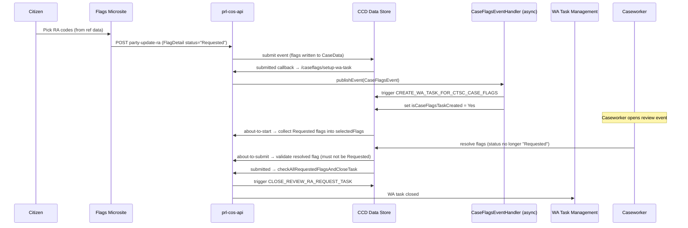

# Implement Reasonable Adjustments

## TL;DR

- Reasonable Adjustments (RA) is **not** a separate data structure — it rides on top of the standard CCD Case Flags v2.1 mechanism. There is a constrained vocabulary of RA flag codes (`RA0001`..`RA0047`) mastered in CFT Reference Data; you don't invent them.
- Each party slot on `AllPartyFlags` holds a `Flags` complex type; RA flags are `FlagDetail` entries on those collections, identified by `flagCode`. Citizens / external users only ever see flags whose ref-data `availableExternally = true`.
- When an RA request is submitted, `FlagDetail.status` is set to the **magic string** `"Requested"`. CCD does not enforce this value — the entire WA task lifecycle depends on the exact string.
- Two CCD events drive WA tasks: a `setUpWaTaskForCaseFlagsEventHandler` event publication sets `isCaseFlagsTaskCreated = Yes` (via async `CaseFlagsEventHandler` triggering `CREATE_WA_TASK_FOR_CTSC_CASE_FLAGS`); the caseworker review event resolves flags out of `"Requested"` and the `submitted` callback closes the WA task via `CLOSE_REVIEW_RA_REQUEST_TASK` when all are actioned.
- For mapping RA flags to downstream systems (HMC hearing requests, etc.) **always use `flagCode`, never string-match on display names.** This is explicit guidance from the Case Flags HLD and the IAC interpreter mapping pattern.
- Configuration boilerplate (`FlagLauncher` field, hidden flag collections, `#ARGUMENT(CREATE|UPDATE|READ)` `DisplayContextParameter`) is identical to base Case Flags — see [`docs/ccd/explanation/case-flags.md`](../explanation/case-flags.md) for the full mechanism.

## Prerequisites

- Your service has **already onboarded to Case Flags v1**. RA is an extension to v2.1; you cannot "do RA only".
- Your case type declares the `Flags` complex type on `CaseData` (case-level via `caseFlags`, and per-party via `AllPartyFlags` — or your service's equivalent).
- Reference Data has been updated on your behalf to (a) make the RA flags you want available to your service, (b) set `availableExternally = true` for any flag external users should see, and (c) set `DefaultStatus` (`Active` or `Requested`). This is **not** a service deployment — it goes through the Ref Data governance process (weekly forum, Mark Naylor / Alison Revitt panel approval).
- WA task management is configured — the `sdk/task-management` module is on the classpath, or your service has an equivalent WA integration.
- The CCD events that host the caseworker RA review (`CREATE_WA_TASK_FOR_CTSC_CASE_FLAGS`, `CLOSE_REVIEW_RA_REQUEST_TASK`, plus your review event) are defined in your case definition.

## RA flag vocabulary (reference data)

The full vocabulary of RA flag codes is mastered in `FlagDetails[…].csv` and behaviour overrides per service in `FlagService[…].csv`. Top-level structure:

| Range | Category | Example children |
|---|---|---|
| `RA0001` | Reasonable adjustment (root) | — |
| `RA0002` | I need documents in an alternative format | `RA0010` Coloured paper, `RA0012` Braille, `RA0013` Large print |
| `RA0003` | I need help with forms | `RA0017`, `RA0018` |
| `RA0004` | I need adjustments to get to / into / around buildings | `RA0019` Step-free access, `RA0021` Parking, `RA0022` Accessible toilet |
| `RA0005` | I need to bring support with me to a hearing | `RA0026` Carer, `RA0028` Assistance dog |
| `RA0006` | I need something to feel comfortable during my hearing | `RA0030` Lighting, `RA0031` Regular breaks, `RA0033` Private waiting area |
| `RA0007` | I need a certain hearing type | `RA0034` In-person, `RA0035` Video, `RA0036` Phone |
| `RA0008` | I need help communicating and understanding | `RA0009` Hearing Enhancement System, `RA0042` Sign Language Interpreter, `RA0046` Pre-hearing visit |

Two RA codes have a **sub-list** behaviour:

- **`RA0042`** (Sign Language Interpreter) — the UI does a type-ahead lookup against the `SignLanguage` category in `ListofValues[…].csv` (BSL `bfi`, ASL `ase`, Makaton `sign-mkn`, etc.). The picked entry sets `FlagDetail.subTypeKey` and `subTypeValue`.
- **`RA0009`** (Hearing Enhancement System) — parent of `RA0043` Hearing loop, `RA0044` Infrared receiver, `RA0045` Induction loop.

`RA0039` (Speech-to-text) and `RA0041` (Lip speaker) are **deprecated as top-level RA codes** — they duplicate `SignLanguage` sub-list values. Don't rely on them. <!-- CONFLUENCE-ONLY: deprecation guidance comes from Ref Data Flag Overview (page 1682839538); not encoded in source. -->

### Reference-data per-flag attributes that affect RA behaviour

These columns in `FlagService[…].csv` are not in source code — they're configured in CFT Ref Data and accessed by the ExUI Flags web component at runtime:

| Column | Effect on RA |
|---|---|
| `ServiceID` | `XXXX` = default (all RA flags available to all services under this ID); your service ID overrides specific defaults. Services only need to specify non-RA flags they require plus any RA flags they wish to override. |
| `HearingRelevant` | All RA flags should be `true` — they all matter for hearings. |
| `RequestReason` | If `true`, the citizen must enter a reason in `flagComment`. If `false`, the comment box is optional. |
| `DefaultStatus` | `Active` = auto-approved (e.g. hearing loop is non-controversial). `Requested` = needs caseworker / judicial review. |
| `AvailableExternally` | If `false`, the flag is hidden from external users (citizens, LRs). All citizen-facing RA flags must be `true`. |

If a service overrides a child flag to `availableExternally = true`, the parent flag's visibility is **also** auto-overridden externally — even if the parent is `false` by default. <!-- CONFLUENCE-ONLY: parent inheritance behaviour from Ref Data Flag Overview (page 1682839538). -->

> **The "Other" flag** is special: it is generated in the API response (not uploaded via CSV) and always has `DefaultStatus = "Requested"` and `AvailableExternally = true`. <!-- CONFLUENCE-ONLY: "Other" flag behaviour from RTRD Case Flags page (page 1531419500). -->

### Service-specific flag exclusions

A service can exclude specific RA flags from being shown to external users by **not** listing them in its `FlagService[…].csv` override. For example, PRL excludes `RA0021` (Parking space close to the venue) and `RA0024` (A different type of chair) because they are not relevant to remote hearings. Court admins still see all flags regardless of service exclusions. <!-- CONFLUENCE-ONLY: PRL exclusion pattern from PRL requirements page (page 1712767862). -->

## Steps

### 1. Declare flag fields on CaseData

Add a case-level `Flags` field and an `AllPartyFlags` holder to your `CaseData` class.

```java
// Case-level flags
@CCD(label = "Case flags")
private Flags caseFlags;                          // CaseData.java:714

// Per-party flags
@CCD(label = "All party flags")
private AllPartyFlags allPartyFlags;              // CaseData.java:786
```

`AllPartyFlags` holds up to five applicants, five respondents, solicitors, and barristers — each typed `Flags`. Field names such as `caApplicant1ExternalFlags` must match exactly the names used by the introspection logic in `CaseFlagsWaService` (`CaseFlagsWaService.java:115`).

`Flags` (`libs/ccd-config-generator:sdk/.../type/Flags.java`) carries: `partyName`, `roleOnCase`, `details` (collection of `FlagDetail`), and — new in v2.1 — `visibility` (`Internal` / `External`, **not enforced by CCD**) and `groupId` (UUID; services may use any string).

`FlagDetail` (`libs/ccd-config-generator:sdk/.../type/FlagDetail.java`) carries the per-flag fields that ref-data fills in (`flagCode`, `name`, `path`, `hearingRelevant`, `availableExternally`) and the per-instance state (`status`, `flagComment`, `dateTimeCreated`, `dateTimeModified`, `flagUpdateComment`, plus Welsh variants).

> **Case-level vs party-level layout.** Per the Case Flags HLD, instances of `Flags` are *not* required to be co-located in a collection — services can place them wherever the data model fits (per-party complex types, role-prefixed attributes, etc.). However, **case-level** flags are fixed: a hidden top-level `caseFlags` field of type `Flags` (its `details` collection holds `FlagDetail` entries directly).

### 2. Configure the Flags Tab and CCD events

This is identical to standard Case Flags v2.1 setup — RA inherits all of it.

**Tab**: Configure a tab named `'Case Flags'` visible only to HMCTS staff and judiciary (use a show-condition). All flag collections must be configured as **hidden** fields on the tab. A top-level `FlagLauncher`-typed field must be configured as **visible** with `CaseTypeTab.DisplayContextParameter = #ARGUMENT(READ)`.

**Events**: Configure two CCD events — `'Create Flag'` and `'Manage Flags'`:

| Event | DisplayContextParameter | Purpose |
|---|---|---|
| Create Flag | `#ARGUMENT(CREATE)` | Launches Flags web component in create mode |
| Manage Flags | `#ARGUMENT(UPDATE)` | Launches Flags web component in update mode |

For each event: hide all flag collections, expose a visible `FlagLauncher` field. The `#ARGUMENT(...)` vocabulary is **not validated by CCD** — the literal strings are interpreted by the ExUI web component. Multi-arg form like `#ARGUMENT(READ,LARGE_FONT)` is supported.

For services serving external professionals (LRs / citizens), additionally configure:

- A separate tab called `'Support'` (visible to external users)
- Events called `'Request Support'` and `'Manage Support'`

> **Event Summary and Event Description** are **not** displayed for any Case Flag event (Create Flag, Manage Flags, Request Support, Manage Support). ExUI suppresses these fields for flag journeys specifically. They remain displayed for all other event types per business configuration. <!-- CONFLUENCE-ONLY: Event Summary suppression from ExUI Reasonable Adjustments page (page 1638180516, A38). -->

> `FlagLauncher` (`libs/ccd-config-generator:sdk/.../type/FlagLauncher.java`) is an **empty** complex type — its sole purpose is to mark the field that launches the ExUI Flags web component. ExUI requires a *unique* `FlagLauncher` instance per Case View tab; **do not assign one `FlagLauncher` to multiple tabs**.

### Status visibility rules on tabs vs Manage screens

| Surface | Which flags are shown |
|---|---|
| Case Flags tab / Support tab | **All** instances: `Requested`, `Active`, `Inactive`, `Not approved` |
| Manage Flags / Manage Support screen | Only `Requested` and `Active` — `Inactive` and `Not approved` cannot be amended and are excluded |

When displaying a `Not approved` entry on the tab, both the flag comment (entered by the requester) and the "Not approved" decision reason text (entered by the approver) are shown in the format: `{<Flag comments>; Decision : <Not approved decision reason text>}`. <!-- CONFLUENCE-ONLY: status display rules from ExUI Reasonable Adjustments page (page 1638180516, A31). -->

### 3. Expose citizen RA endpoints

Wire citizen-facing endpoints so that the frontend can submit and retrieve RA flags per party.

```
POST  {caseId}/{eventId}/party-update-ra         # update citizen RA flags
GET   {caseId}/retrieve-ra-flags/{partyId}       # retrieve Flags object for a party
POST  {caseId}/language-support-notes            # append language support notes
```

These correspond to the methods in `ReasonableAdjustmentsController` (`ReasonableAdjustmentsController.java:42-107`). The POST delegates to `CaseService.updateCitizenRAflags`; the GET returns the `Flags` object directly.

PRL is the first service consuming the shared **"Flags Microsite"** — a citizen-facing UI that lets users pick RA codes from the ref-data list and submit them back to the service. <!-- CONFLUENCE-ONLY: "Flags Microsite" is the cross-service citizen UI per CUI RA Confluence page (1689789638); not modelled in PRL source. -->

### 4. Set flag status to "Requested" on submission

When a citizen (or LR) submits an RA request, set `FlagDetail.status = "Requested"` on the relevant party flag. This is the trigger string that downstream WA logic watches for (`CaseFlagsWaService.java:38`).

```java
flagDetail.setStatus("Requested");   // magic string — not an enum
```

Do not use any other string. The entire task-creation and close-task flow depends on this exact value. CCD itself does **not** validate the value (the HLD is explicit: status can be `Requested`, `Active`, `Inactive`, or `Not approved`, with no enforcement).

> **DefaultStatus vs explicit "Requested".** ExUI uses the `DefaultStatus` ref-data attribute differently depending on user type. For **Legal Rep** users, the flag is automatically created with `DefaultStatus` value (which may be `Active` for non-controversial adjustments like hearing loop). For **Staff** users, `DefaultStatus` is merely the pre-selected radio button on the "Confirm the status of the flag" screen — staff can override it before submission. If your citizen endpoints set status programmatically, always use `"Requested"` regardless of `DefaultStatus` — the citizen pathway requires caseworker approval. <!-- CONFLUENCE-ONLY: DefaultStatus UI behaviour from ExUI Reasonable Adjustments page (page 1638180516). -->

### 5. Configure the WA task creation callbacks

Register CCD callbacks on the events that write updated flags back to the case:

| Endpoint | Service method | Effect |
|---|---|---|
| `/caseflags/setup-wa-task` | `CaseFlagsWaService.setUpWaTaskForCaseFlagsEventHandler` | Publishes a `CaseFlagsEvent`. Async `CaseFlagsEventHandler` (`CaseFlagsEventHandler.java:39`) then triggers the CCD system event `CREATE_WA_TASK_FOR_CTSC_CASE_FLAGS` and sets `isCaseFlagsTaskCreated = Yes` — but only if there is at least one `Requested` flag on the case. |
| `/caseflags/check-wa-task-status` | `CaseFlagsWaService.checkCaseFlagsToCreateTask(caseData, caseDataBefore)` | If the case **previously had** `Requested` flags but now has **none**, sets `isCaseFlagsTaskCreated = No`. This is essentially a "task no longer needed" signal triggered by data changes. |

In your CCD definition (or `CCDConfig` implementation), wire the `submitted` webhook of the citizen / LR write event to `/caseflags/setup-wa-task`:

```java
event.submittedCallback((payload, caseDetails) ->
    caseFlagsWaService.setUpWaTaskForCaseFlagsEventHandler(authorisation, callbackRequest));
```

> **Asynchronous task creation.** `setUpWaTaskForCaseFlagsEventHandler` only publishes a Spring application event. The actual CCD `CREATE_WA_TASK_FOR_CTSC_CASE_FLAGS` event is fired by `CaseFlagsEventHandler.triggerDummyEventForCaseFlags` running on `@Async`. **Don't expect `isCaseFlagsTaskCreated` to be `Yes` synchronously after the callback returns** — it's set on the next case data update.

> **WA task not created for draft applications.** When a support request is submitted as part of a draft application (before case creation), no WA task is raised. The RA flags are instead reviewed as part of the "Check Application" task. Only flags submitted or edited **after case creation** trigger the `CREATE_WA_TASK_FOR_CTSC_CASE_FLAGS` flow. <!-- CONFLUENCE-ONLY: draft-application WA suppression from PRL requirements (page 1712767862). -->

<!-- DIVERGENCE: An earlier draft of this page said "checkCaseFlagsToCreateTask sets isCaseFlagsTaskCreated = Yes when a task is raised." That's wrong. Source (`CaseFlagsWaService.java:84-93`) shows it sets the flag to **No** when transitioning from "had requested flags" to "no requested flags". The `Yes` setter lives in `CaseFlagsEventHandler.java:39`. Source wins. -->

### 6. Configure the caseworker review event

Define a CCD event for caseworkers to review RA requests. Wire its callbacks to:

| Stage | Endpoint | Purpose |
|---|---|---|
| `about-to-start` | `/caseflags/about-to-start` | Collects all `"Requested"` flags into `ReviewRaRequestWrapper.selectedFlags` (`CaseFlagsWaService.java:105-142`). Deep-copies via Jackson round-trip (line 242–248). |
| `about-to-submit` | `/caseflags/about-to-submit` | Validates the most-recently-modified flag is no longer `"Requested"` (`CaseFlagsController.java:125-152`). If the user left a flag at `"Requested"`, returns the validation error `"Please select status other than Requested"`. |
| `submitted` | `/caseflags/submitted-to-close-wa-task` | If **all** flags on the case are no longer `"Requested"`, fires CCD system event `CLOSE_REVIEW_RA_REQUEST_TASK` and sets `isCaseFlagsTaskCreated = No` (`CaseFlagsWaService.java:51-75`). |

For language and special-measures flags there is a parallel review path via `/review-lang-sm/about-to-start` and `/review-lang-sm/about-to-submit` (`CaseFlagsController.java:171-216`).

> **Legal Rep deactivation is auto-approved.** When a Legal Rep or citizen indicates they no longer need a particular RA, the flag is immediately set to `Inactive` without requiring caseworker approval. The reason for deactivation is captured in `flagComment` but is not displayed to other users. Only **creation** of flags requires the `"Requested"` → review cycle. <!-- CONFLUENCE-ONLY: LR auto-deactivation behaviour from ExUI Reasonable Adjustments page (page 1638180516, assumption A13/A37). -->

### 7. Handle deep-copy correctly

`CaseFlagsWaService.setSelectedFlags` deep-copies flags via a Jackson round-trip (`writeValueAsString` then `readValue`) to avoid mutating originals (`CaseFlagsWaService.java:242-248`). If you extend or override this method, preserve that pattern — in-place mutation will corrupt the before/after comparison used by the WA task gate.

### 8. Align AllPartyFlags field names

`AllPartyFlags` is introspected via Java reflection to iterate all `Flags`-typed fields generically (`CaseFlagsWaService.java:115-117`, `221-239`). Any field added to `AllPartyFlags` must be of type `Flags` and follow the naming convention already used (e.g. `caApplicant1ExternalFlags`). A mismatch will cause silent skipping — the field won't be included in `"Requested"` flag aggregation.

### 9. Map flag codes — never display strings

The Case Flags HLD is unambiguous on this: when consuming flags downstream (HMC hearing requests, work allocation rules, business logic), **use `flagCode`. Do not pattern-match against `name` or other display strings.** Names are localised (Welsh variants) and may change without altering the code; codes are stable across ref-data versions.

## Downstream consumption: HMC hearing request mapping

If your service participates in Hearings Management, RA flags map into the manual hearing
request message via three fields. The IAC implementation pattern (Confluence ref:
*Interpreter languages and Reasonable Adjustments*, page 1700661767) is the canonical
example.

| Hearing-request field | Source flags | Behaviour |
|---|---|---|
| `interpreterLanguage` | `RA0042` (Sign Language Interpreter) or `PF0015` (Language Interpreter) | First active flag's `subTypeKey` only — single value field. |
| `reasonableAdjustments` | RA-prefixed and SM-prefixed flags on the party | List of `flagCode`s where `hearingRelevant = true`. |
| `otherReasonableAdjustmentDetails` | Free text composed from: secondary languages (when more than one), free-text languages added without a `subTypeKey`, and `flagComment` for each RA included | `name + ":" + comment + "; "` per flag. |

Pseudocode for setting reasonable adjustments (per IAC):

```
for each active RA case flag on party:
  if flag.hearingRelevant:
    reasonableAdjustments += flag.flagCode
    if flag.flagComment is not null:
      otherReasonableAdjustmentDetails += flag.name + ":" + flag.flagComment + "; "

for each active SM case flag on party:
  // same logic
```

<!-- CONFLUENCE-ONLY: HMC mapping rules are an IAC implementation, not in the PRL/CCD source tree. Other services should mirror the pattern. -->

## How RA flags propagate downstream



## Verify

1. Submit a citizen RA request and confirm `FlagDetail.status = "Requested"` with the expected `flagCode` is stored on the case via the CCD UI or the data-store API (`GET /cases/{caseId}`).
2. Confirm a WA task of the expected type appears in the task list for the case — `isCaseFlagsTaskCreated` on `ReviewRaRequestWrapper` should be `Yes` (allow a moment for the async handler to fire).
3. Confirm the case event audit shows `CREATE_WA_TASK_FOR_CTSC_CASE_FLAGS` in history.
4. Open the caseworker review event, resolve all flags, submit, and confirm the WA task is closed (task no longer appears; `CLOSE_REVIEW_RA_REQUEST_TASK` event in case history).

## See also

- [`docs/ccd/explanation/case-flags.md`](../explanation/case-flags.md) — overview of the CCD Flags complex type and flag lifecycle (the v2.1 mechanism this how-to builds on)
- [`docs/ccd/reference/glossary.md`](../reference/glossary.md) — definitions for `Flags`, `FlagDetail`, `AllPartyFlags`, WA
- Confluence: *Case Flags HLD Version 2.1* (page 1700663346) — canonical architecture
- Confluence: *Ref Data Flag Overview* (page 1682839538) — how the FlagDetails / FlagService / ListofValues CSVs feed CFT Ref Data
- Confluence: *Interpreter languages and Reasonable Adjustments* (page 1700661767) — IAC pattern for HMC mapping

## Glossary

See [Glossary](../reference/glossary.md) for term definitions used in this page.

