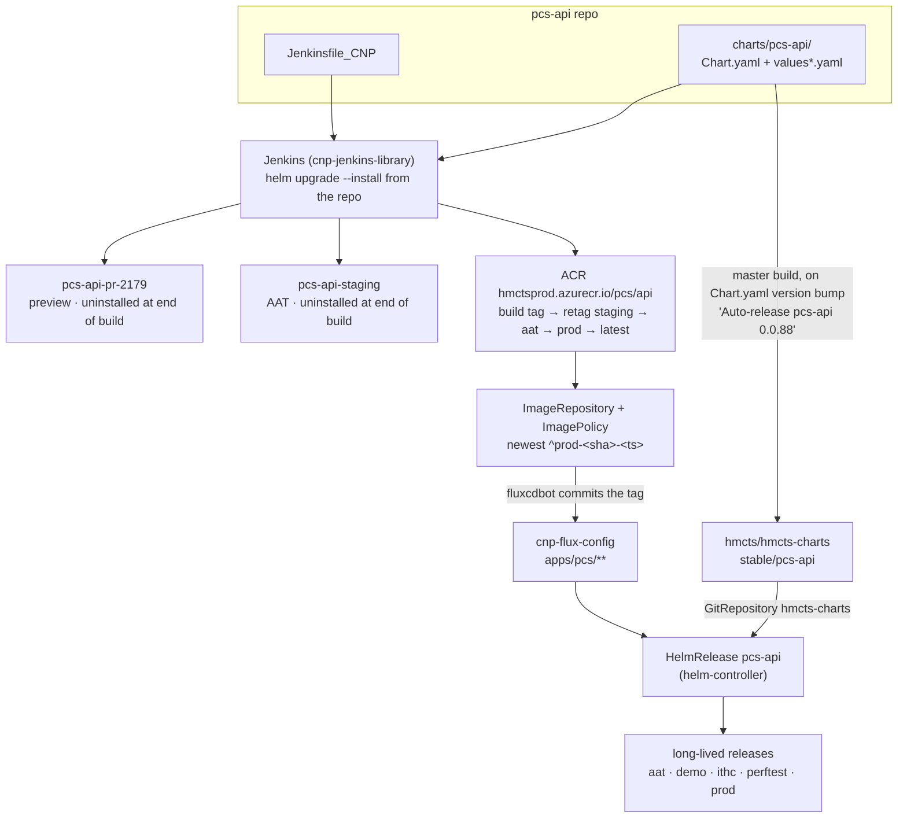

# Helm common components, Flux, and preview stacks

How a CFT service is packaged as a Helm chart built out of **common component charts**, how that
chart reaches each environment (Jenkins for ephemeral, Flux for steady-state), what the approach
buys you, and what has to be **cleaned up before a PR merges**.

Worked example throughout: `pcs-api` and `pcs-frontend`. Every claim below was checked against
`hmcts/cnp-flux-config@master`, `hmcts/hmcts-charts@master` and `hmcts/cnp-jenkins-library@master`
as of **24 Aug 2026**; the source file is cited so you can re-check when they move.

---

## 1. What "common components" means

HMCTS publishes reusable Helm charts to an OCI registry, `oci://hmctsprod.azurecr.io/helm`. They
come in three tiers:

| Tier | Examples | What it gives you |
|---|---|---|
| **Library** | `library` (v2) | Raw templates — `_deployment.tpl`, `_ingress.tpl`, `_hpa.tpl`, `_pdb.tpl`, `_secretproviderclass.tpl`, `_service.tpl`, affinity/tolerations/topology-spread helpers. Nothing renders on its own. |
| **Base app** | `java`, `nodejs` | The runtime contract for a Spring Boot / Node service: Deployment, Service, Ingress, HPA, PDB, ConfigMap, and the Key Vault CSI `SecretProviderClass`. `java` also optionally pulls in `postgresql`. |
| **Service** | `ccd` (umbrella), `xui-webapp`, `ccd-case-document-am-api`, `wa`, `aac-manage-case-assignment`, `am-org-role-mapping-service`, `servicebus`, `wiremock`, `postgresql` | Someone else's *whole service*, packaged so you can stand a copy of it up inside your own release. |

The dependency chain is real nesting. For `pcs-api`:

```
pcs-api (this repo's chart)
└── java 5.3.0
    ├── library 2.2.2          # the actual k8s templates
    └── postgresql 14.0.1      # bitnami, in-pod; preview only
└── ccd 9.2.3                  # umbrella — ~20 subcharts
    ├── ccd-definition-store-api 1.6.26 → java → library
    ├── ccd-data-store-api 2.0.40       → java → library
    ├── ccd-api-gateway-web 1.2.11      → nodejs → library
    ├── ccd-admin-web 2.2.15            → nodejs → library
    ├── elasticsearch, logstash, …
└── xui-webapp, ccd-case-document-am-api, wa, servicebus, wiremock, …
```

So `library` gets vendored many times over — every leaf service ultimately renders through the same
templates. That is the point: one definition of "what an HMCTS workload looks like on AKS".

> Note the two `postgresql` charts, which are easy to confuse. The **bitnami** one (a dependency of
> `java`, `postgresql.enabled` on `java`) runs Postgres *in the pod*. The **HMCTS** one (a top-level
> dependency of `pcs-api`, chart version 1.1.1) renders Azure Service Operator
> `FlexibleServersDatabase` resources — it creates *databases on a managed Azure server*. The
> `values.poddb.preview.template.yaml` overlay exists precisely to swap from the second to the first.

### What the service chart actually contains

`pcs-api/charts/pcs-api/` and `pcs-frontend/charts/pcs-frontend/` contain **no templates of their
own** beyond a `NOTES.txt`. They are pure composition:

```
charts/pcs-api/
├── Chart.yaml                              # dependency list + versions + conditions
├── values.yaml                             # the real, all-environment configuration
├── values.aat.template.yaml                # pipeline-substituted overlay for AAT
├── values.preview.template.yaml            # pipeline-substituted overlay for preview
├── values.ccd.preview.template.yaml        # label-gated: full CCD estate in the preview release
├── values.wa.preview.template.yaml         # label-gated: Camunda + WA task APIs
├── values.hearings.preview.template.yaml   # label-gated: HMC servicebus subscription
├── values.wiremock.preview.template.yaml   # label-gated: stubbed downstreams
├── values.poddb.preview.template.yaml      # label-gated: in-pod Postgres instead of the shared server
└── values.elasticsearch.preview.template.yaml
```

`Chart.yaml` is where composition happens — note the `condition:` on every optional dependency:

```yaml
dependencies:
  - name: java
    version: 5.3.0
    repository: 'oci://hmctsprod.azurecr.io/helm'      # no condition — always on
  - name: ccd
    version: 9.2.3
    repository: 'oci://hmctsprod.azurecr.io/helm'
    condition: ccd.enabled                              # off by default
  - name: wa
    version: ~1.1.0                                     # ~ = accept patch bumps
    condition: wa.enabled
```

and `values.yaml` switches every optional component **off**:

```yaml
ccd:            { enabled: false }
xui-webapp:     { enabled: false }
wa:             { enabled: false }
wiremock:       { enabled: false }
servicebus:     { enabled: false }
```

That default matters. In AAT/demo/perftest/prod the real CCD, XUI and WA are shared platform
deployments in their own namespaces; `pcs` only ever ships its own pod. The subcharts exist purely
so that a **preview** release can turn them on and get a private copy.

`pcs-frontend` is the same shape, smaller: `nodejs 3.2.1` always on, plus Bitnami `redis 28.0.7`
behind `redis.enabled` (off by default — AAT and prod use the managed Redis whose connection string
comes from Key Vault; preview runs a throwaway in-cluster one).

### The values contract

Configuration is namespaced by the base chart's name, and the base chart owns the vocabulary:

```yaml
java:                                    # or  nodejs:  for the frontend
  applicationPort: 3206
  image: 'hmctsprod.azurecr.io/pcs/api:latest'
  ingressHost: pcs-api-{{ .Values.global.environment }}.service.core-compute-{{ .Values.global.environment }}.internal
  aadIdentityName: pcs                   # workload identity → which Key Vaults it may read
  keyVaults:
    pcs:
      secrets:
        - name: api-POSTGRES-PASS
          alias: PCS_DB_PASSWORD         # vault secret name → env var name
  environment:                           # → ConfigMap → container env
    IDAM_API_URL: "https://idam-api.{{ .Values.global.environment }}.platform.hmcts.net"
  secrets:                               # → env var sourced from an existing k8s Secret
    PCS_DB_PASSWORD:
      secretRef: "{{ .Values.global.postgresSecret }}"
      key: password
```

Two things to notice:

- **`{{ .Values.global.environment }}` inside a values file.** The common charts run values through
  `tpl`, and the pipeline injects the environment with `--set global.environment=…`
  (`cnp-jenkins-library/vars/helmInstall.groovy`). One `values.yaml` therefore covers
  aat/demo/ithc/perftest/prod, which is why there is no `values.prod.yaml` in the repo. The same
  call also sets `global.enableKeyVaults=true`, `global.devMode=true` (this is what makes the
  `devmemoryRequests` / `devcpuRequests` keys in the preview overlays take effect) and the
  `global.tags.*` cost-allocation tags.
- **`keyVaults:` is a declaration, not a mount.** The chart renders a `SecretProviderClass`; the
  Azure Key Vault CSI driver resolves it at pod start using the workload identity named by
  `aadIdentityName`. No secret is ever in git, and `helm template` works without any Azure access.

---

## 2. Two delivery paths, one chart

The same chart directory is consumed by two completely different systems.



### Path A — Jenkins, for everything ephemeral

`Jenkinsfile_CNP` calls `withPipeline(type, product, component)` from
`@Library("Infrastructure@2.4.9")`. The library does the Helm work; the Jenkinsfile only supplies
environment variables and opt-ins.

**Release naming** (`Helm.groovy`, `ProjectBranch.groovy`) is `<product>-<component>-<imageTag>`,
where `imageTag` is the lowercased branch name for a PR and the literal string `staging` for master:

| Branch | Helm release | Where |
|---|---|---|
| `PR-2179` | `pcs-api-pr-2179` | preview cluster |
| `master` | `pcs-api-staging` | AAT — alongside, not instead of, Flux's `pcs-api` |

This is why `values.aat.template.yaml` sets `CASE_TYPE_SUFFIX: "staging"` and the Jenkinsfile tests
against `pcs-api-staging.aat.platform.hmcts.net`. The AAT release Jenkins creates is a **test
fixture**, torn down at the end of the build. The long-lived `pcs-api` in AAT is Flux's.

**Values resolution** (`helmInstall.groovy`) builds the `-f` list in this exact order:

1. `values.yaml` — required; if a `values.template.yaml` exists it is `envsubst`-ed *over* it first.
2. `values.<environment>.template.yaml` → `envsubst` → appended. (`preview` or `aat`.)
3. On a PR only, for each `pr-values:<x>` label:
   `values.<x>.<environment>.template.yaml` → `envsubst` → appended.

`envsubst` is why the overlays carry `${IMAGE_NAME}`, `${SERVICE_FQDN}`, `${SERVICE_NAME}`,
`${CHANGE_ID}` **and** `{{ .Values… }}` — two substitution passes, shell first, Helm second.

Which optional stacks a preview gets is therefore chosen **per PR, by GitHub label**:

| Label on the PR | Effect |
|---|---|
| `pr-values:ccd` | merges `values.ccd.preview.template.yaml` → private CCD definition store, data store, API gateway, admin web, Elasticsearch, XUI, CDAM. `Jenkinsfile_CNP` also sets `CCD_ENABLED=true` and turns on high-level data setup. |
| `pr-values:wa` | merges `values.wa.preview.template.yaml` → Camunda + `wa-task-management-api` + monitor, and uploads DMN/BPMN diagrams after install |
| `pr-values:wa-ft-tests` | additionally runs the WA functional suite |
| `pcs-frontend-pr:<N>` (on a pcs-api PR) | points this API preview at that frontend preview |
| `pcs-api-pr:<N>` (on a pcs-frontend PR) | points the frontend preview at that API preview, including its in-preview CCD, CDAM and XUI |
| `enable_e2e_*`, `e2e-tag:`, `e2e-spec:` | select the e2e suite/scope to run |
| `enable_keep_helm` | **keeps the preview release alive** after the build — see §4b |

So a PR label materially changes the topology of what gets deployed. A plain PR is one pod plus a
database; a `pr-values:ccd` + `pr-values:wa` PR is roughly a dozen services.

> **Ordering hazard.** Overlays are appended in the order the labels come back from the GitHub API,
> and later `-f` files win. `values.ccd.preview.template.yaml` and `values.wa.preview.template.yaml`
> both set `postgresql.setup.databases` — the CCD one lists three databases, the WA one lists six.
> Helm replaces lists rather than merging them, so with both labels applied the *last* one decides
> which databases exist. Worth knowing if a WA preview ever comes up without its Camunda database.

**Image promotion is a retag, not a rebuild** (`sectionPromoteBuildToStage.groovy`). The build pushes
`<tag>-<sha>-<timestamp>`; passing each gate retags the *same* image `staging-…` → `aat-…` →
`prod-…`, and a `prod` promotion additionally retags `latest`. Two consequences worth holding on to:

- `:latest` in the preview overlays (`xui/webapp:latest`, `ccd/api-gateway-web:latest`) means
  "whatever that service last promoted to prod" — not a nightly, and not pinned.
- ACR purges old tags per stage; `prod` is the generous one (`purgeAgo` 5 days, keep 5) and other
  stages are aggressive (2 hours, keep 3). Pinning a PR-tagged image into a long-lived environment
  is therefore fragile as well as unusual — see the perftest note in §4a.

After promotion the pipeline calls `reconcileFluxImageRepository`, which pokes Flux to re-scan the
ACR repository immediately rather than waiting for its poll interval.

### Path B — Flux, for everything long-lived

`cnp-flux-config` holds a `HelmRelease` per component. It does **not** point at the repo's chart
directory:

```yaml
# apps/pcs/pcs-api/pcs-api.yaml
kind: HelmRelease
metadata: { name: pcs-api }
spec:
  releaseName: pcs-api
  values:
    java:
      replicas: 2
      image: hmctsprod.azurecr.io/pcs/api:prod-e7bbf14-20260824071409 #{"$imagepolicy": "flux-system:pcs-api"}
  chart:
    spec:
      chart: ./stable/pcs-api
      sourceRef: { kind: GitRepository, name: hmcts-charts, namespace: flux-system }
      interval: 1m
```

**Where that chart actually lives.** Two similarly-named sources exist and are easy to mix up
(`apps/flux-system/base/`):

| GitRepository | URL | Included paths |
|---|---|---|
| `hmcts-charts` | `github.com/hmcts/**hmcts-charts**` | `/stable/` |
| `hmcts-stable` | `github.com/hmcts/**charts**` | `/stable/`, `/incubator/` |

`pcs-api` and `pcs-frontend` use the **first**. So `./stable/pcs-api` resolves to
`hmcts/hmcts-charts` → `stable/pcs-api`, a *published copy* of the repo's chart. It gets there from
the master pipeline: the commits are titled `Auto-release pcs-api 0.0.88`, authored by
`hmcts-jenkins-j-to-z`, and they fire on a `Chart.yaml` **`version:` bump**.

That is the causal reason a chart change needs a version bump. Without it there is no auto-release,
`hmcts/hmcts-charts` keeps the old chart, and every Flux-managed environment keeps running the old
templates however green the build was. (At the time of writing the published copy is `0.0.88` —
master's version — and the group-access branch bumps to `0.0.89`.)

> Minor drift worth ignoring rather than fixing blind: the published copy also carries a
> `values.aat.yaml` that does not exist in the repo and points at a long-dead registry
> (`hmcts.azurecr.io/hmcts/pcs-api:latest`) with an empty `ingressHost`. Nothing references it — the
> Flux `HelmRelease` names no values files, and Jenkins reads the repo, not the mirror.

Layout under `apps/pcs/`:

```
base/kustomize.yaml              # the Flux Kustomization; substitutes NAMESPACE, WI_NAME,
                                 # TEAM_NOTIFICATION_CHANNEL, TEAM_AAD_GROUP_ID
base/kustomization.yaml          # namespace + workload identity
pcs-api/pcs-api.yaml             # the base HelmRelease (image + replicas)
pcs-api/{aat,demo,prod,perftest}.yaml   # tiny per-environment patches
pcs-frontend/…                   # same shape ({demo,prod} only)
serviceaccount/<env>.yaml        # per-environment workload identity patch
<env>/base/kustomization.yaml    # which resources + which patches apply in that environment
automation/kustomization.yaml    # ImageRepository + ImagePolicy objects
preview/{aso,sops-secrets}/      # Azure Service Operator resources + SOPS secrets for preview
```

Environment patches are deliberately tiny — the chart's `values.yaml` already templated the
environment in, so a patch only carries genuine differences:

```yaml
# pcs-api/prod.yaml          # pcs-api/aat.yaml
values:                      # values:
  java:                      #   java:
    environment:             #     environment:
      IDAM_API_URL: …        #       HASH_PINS_ENABLED: "false"
                             #       ENABLE_TESTING_SUPPORT: "true"
```

**Preview is the exception.** `apps/pcs/preview/` contains only *supporting infrastructure* — the
shared `pcs-preview` Postgres flexible server (a `Standard_D2ds_v5`, GeneralPurpose, 2 vCPU),
the servicebus namespace, and SOPS-encrypted values. There is **no HelmRelease** for `pcs-api` or
`pcs-frontend` under `preview/`; the preview *applications* are installed by Jenkins.

### How image automation actually decides the tag

This part is not obvious from any single file, and it is where the 24 Aug perftest incident (§4a)
came from.

1. `ImageRepository` (`pcs-api/image-repo.yaml`) watches `hmctsprod.azurecr.io/pcs/api`. Its
   `hmcts.github.com/image-registry: hmctsprod` annotation selects a per-registry kustomize patch
   (`hmctsprod-image-repo.yaml`) that supplies the scan `interval` and `provider: azure` auth.
2. `ImagePolicy` (`pcs-api/image-policy.yaml`) has **no `filterTags` of its own**. It gets one from
   a kustomize patch in `apps/flux-system/automation/kustomization.yaml`:

   ```yaml
   - path: prod-image-policy.yaml
     target:
       kind: ImagePolicy
       annotationSelector: hmcts.github.com/prod-automated != disabled,
                           hmcts.github.com/image-policy-type != numerical
   ```

   …which **overwrites** `spec.filterTags.pattern` with `^prod-[a-f0-9]+-(?P<ts>[0-9]+)`.

   The corollary is the bit that catches people: **any ImagePolicy that wants a non-prod pattern must
   carry `hmcts.github.com/prod-automated: disabled`, or the patch silently replaces its pattern with
   the prod one.** `tests/flux-v2-image-automation.sh` enforces exactly this in CI.
3. `ImageUpdateAutomation` (`apps/flux-system/base/image-update-automation.yaml`) uses
   `strategy: Setters`, so it only rewrites lines whose trailing comment is keyed **`$imagepolicy`**.
   A marker keyed anything else is inert — the line is simply never updated.
4. `fluxcdbot` commits the rewritten tag back to `master`; the helm-controller rolls it out.

A green master build therefore reaches every Flux-managed environment without anyone editing YAML,
and `git log apps/pcs/pcs-api/` is a complete deployment history.

---

## 3. What the approach actually buys you

**A whole CCD estate from four lines of YAML.** `pr-values:ccd` gives a PR its own definition store,
data store, API gateway, admin web, Elasticsearch, XUI and CDAM — versions pinned in `Chart.yaml`,
maintained by the teams that own them. Nobody in PCS writes a Deployment for `ccd-data-store-api`.
This is what makes it viable to test a decentralised case type, a CCD definition change, or a
Notice-of-Change flow *on a pull request* rather than in a queue for AAT.

**Real isolation, so tests can be destructive.** Each preview gets its own databases
(`pr-<CHANGE_ID>-pcs`, `pr-<CHANGE_ID>-data-store`, `pr-<CHANGE_ID>-definition-store`), its own
Elasticsearch index, its own servicebus subscription filtered by
`hmctsDeploymentId: deployment-${SERVICE_NAME}`. Two PRs touching the same case type do not collide.

**One security and operations contract.** Key Vault via CSI + workload identity, ingress, probes,
HPA, PDB, topology spread — every service inherits the same implementation. A platform-wide fix
(a probe default, a CSI upgrade, a security header) ships as a chart version bump, not 200 PRs.

**Configuration that is actually small.** Because values are `tpl`-rendered against
`global.environment`, `pcs-api` describes five environments in one `values.yaml` and four ~6-line
patches.

**Composable topology per PR.** The label system means you pay for what you need: no CCD on a PR
that only changes a validator; wiremock instead of live downstreams when you want determinism; an
in-pod Postgres (`values.poddb.preview.template.yaml`) when the shared flexible server is contended.

**A promotion path that is auditable.** Every environment's running image is a line in a git repo
with a commit behind it, and promotion is a retag of a byte-identical image rather than a rebuild —
what passed AAT is literally what runs in prod.

### The costs, honestly

- **Deep, invisible defaults.** Overriding `keyVaults:` *replaces* the base chart's list rather than
  merging with it. That is exactly the bug on the current branch: overriding XUI's secret list
  silently dropped `appinsights-connection-string-mc`, `/api/monitoring-tools` started returning
  500, and every make-a-claim e2e journey died. Nothing in the PCS repo changed to cause it.
- **Upstream drift you don't control.** `:latest` means "last prod promotion of someone else's
  service", so an upstream release can turn your PR red overnight.
- **Version pinning is a mixture.** `java 5.3.0` is exact; `wa ~1.1.0` and
  `aac-manage-case-assignment ~0.2.20` accept patch bumps. A `~` dependency can move underneath you
  between two runs of `helm dependency build`, and `Chart.lock` is **not committed** in `pcs-api`.
- **Cross-repo mechanics that no single file explains.** The `$imagepolicy` setter key, the
  `prod-automated: disabled` annotation, and the version-bump-triggers-auto-release rule are each
  documented somewhere else, and getting one wrong fails quietly. §4a is a live example of two at
  once.
- **Shared-resource contention.** ~70 preview releases share one 2-vCPU flexible server, which is
  why `values.preview.template.yaml` and `values.ccd.preview.template.yaml` shrink every pool
  (`PCS_DB_POOL_MIN_IDLE: "0"`, `PCS_DB_POOL_MAX_SIZE: "2"`,
  `SPRING_DATASOURCE_HIKARI_MAXIMUM_POOL_SIZE: "4"`) under HDPI-8115. A leaked preview is not free.

---

## 4. Cleaning up before merge

Two distinct kinds of cleanup, easy to conflate.

### 4a. Cleaning up the *code* — the temporary overrides in the PR

Preview is a debugging environment, so it accumulates workarounds. They are cheap to add and they
look harmless once merged, because `values.*.preview.template.yaml` never runs in AAT or prod — it
only runs on **every future PR**. That is precisely why they are dangerous: a preview-only hack that
reaches master silently degrades every subsequent preview for everyone.

Current state of `HDPI-7052-test-GroupAccess-accessTypeRoles-fix` vs `origin/master` — four files:

| Change | Why it's there | Action before merge |
|---|---|---|
| `Jenkinsfile_CNP`: `enablePactAs([...])` commented out in `onPR()` (`60b9b110`) | Pact broker timed out while the platform was waking after auto-shutdown, killing builds before the test stages | **Revert.** PR builds must run pact consumer + deploy-check. |
| `values.ccd.preview.template.yaml`: `appinsights-connection-string-mc` added to XUI `keyVaults` (`b9d33af7`) | The 20 Aug XUI build needs it in `/api/monitoring-tools`; overriding the secret list had dropped the base chart's default | **Remove per review decision.** If preview journeys go red again, this is why — re-add via its own PR, or get RPX to make `monitoring-tools` tolerate the missing secret. |
| `Chart.yaml`: version `0.0.88 → 0.0.89`, `wa` dependency moved to the end | The bump is what triggers `Auto-release pcs-api 0.0.89` into `hmcts/hmcts-charts`; without it Flux environments keep the old chart | **Keep the bump.** Re-check the version has not been taken by a master merge in the meantime. |
| `values.yaml`: `wa: { enabled: false }` moved to the end | Cosmetic, mirrors the `Chart.yaml` reorder | Keep or drop — no behavioural effect. |

Two earlier items on the merge plan are **already done**: `ccd.ras.enabled` is back to `false`, and
the `am-role-assignment-service: pr-2781` block is gone from `values.ccd.preview.template.yaml`.

Deliberately *staying* in the preview template: `ENABLE_CASE_GROUP_ACCESS` and
`ENABLE_CASE_GROUP_ACCESS_FILTERING` on the in-chart CCD. Preview runs its own CCD, so PCS owns
those flags there; in AAT and prod the platform owns them, and neither `values.yaml` nor
`values.aat.template.yaml` should mention them.

#### The perftest pin — a worked example of both trapdoors firing

`cnp-flux-config/apps/pcs/pcs-api/perftest.yaml` pins a PR image so perftest can exercise this
branch. Reading the commit history for 24 Aug 2026 (times normalised to UTC) gives a clean
demonstration of the two mechanisms in §2:

| Time | Who | What |
|---|---|---|
| 21 Aug | Dean Cullen | Added the pin (`pr-2179-3938f19-…`) with marker `#{"$perftest-image-policy": …}` and a `perftest-pcs-api` policy filtering `^pr-2179-…` |
| 21–24 Aug | *(nobody)* | The pin never moved. `strategy: Setters` only rewrites `$imagepolicy` markers, so image automation ignored the line entirely. |
| 09:30 | jonsoloway | Bumped the image **by hand** to `pr-2179-b9d33af-…` |
| 09:34 | jonsoloway | Fixed the marker key to `$imagepolicy` |
| 09:37 | **fluxcdbot** | Immediately overwrote perftest with **`prod-e7bbf14-…`** — the policy lacked `prod-automated: disabled`, so the kustomize patch had replaced its `^pr-2179-` pattern with the prod pattern |
| 10:24 | jonsoloway | Added `hmcts.github.com/prod-automated: disabled` to `perftest-image-policy.yaml` |
| 10:33 | **fluxcdbot** | Restored `pr-2179-b9d33af-…` — the policy's own pattern now survives the build |

Both trapdoors are now closed upstream. What is **not** done is the pin itself: perftest still tracks
`^pr-2179-…`. Per
[`cnp-flux-config/docs/app-deployment-v2.md`](https://github.com/hmcts/cnp-flux-config/blob/master/docs/app-deployment-v2.md),
a non-prod pin should be reverted once it has served its purpose — restore the marker to
`flux-system:pcs-api`, delete `perftest-image-policy.yaml`, and drop its entry from
`apps/pcs/automation/kustomization.yaml`. Leaving it means perftest freezes on a branch that no
longer exists, on a tag ACR is entitled to purge.

#### A rule of thumb

Before merge, diff the chart directory and the Jenkinsfile against master specifically, and justify
every hunk:

```bash
git diff origin/master...HEAD -- charts/ Jenkinsfile_CNP
```

Ask of each one: *does this belong in master, or was it only ever true for this branch's preview?*
If it is a workaround for an upstream defect, it wants its own PR, its own ticket and its own
expiry — not a quiet ride into master on a feature branch. And check `cnp-flux-config` too: a branch
that needed a perftest pin left something behind in a repo your own `git diff` cannot see.

### 4b. Cleaning up the *deployment* — the preview stack itself

**Teardown is per build, not per merge.** This is the detail most people have backwards.
`sectionDeployToAKS.groovy` calls `helmUninstall` at the end of the section:

- on **master** — always (so `pcs-api-staging` never outlives its build);
- on a **PR** — unless the PR carries the `enable_keep_helm` label.

So a preview normally exists only for the duration of one build, and `enable_keep_helm` is what
keeps it around for manual testing. A stack that outlives its PR by days is one carrying that label
— which makes the label itself a pre-merge cleanup item.

**What `helmUninstall` actually removes** is the Helm release and any Jobs whose name starts with
the release prefix. That is all. Everything else depends on the resources cascading:

- **Databases.** The per-PR databases are Azure Service Operator `FlexibleServersDatabase`
  resources rendered by the HMCTS `postgresql` chart, on the shared `pcs-preview` server. Deleting
  the release deletes the CRs and ASO should drop the databases (no `reclaim-policy` override is set
  anywhere in `cnp-flux-config`, so the ASO default applies). When ASO does not reconcile the
  deletion, the database survives — invisibly, on a 2-vCPU server shared ~70 ways. This is why
  `/pcs-api-uninstall-preview` uninstalls **and then verifies the databases were actually dropped**,
  rather than trusting the uninstall.
- **Stale Flyway state.** A surviving `pr-<N>-pcs` database crash-loops the pod with a checksum
  mismatch if that PR number is ever reused.
- **Servicebus subscriptions.** `values.hearings.preview.template.yaml` sets
  `ignoreSubscriptionDeletion: true` — deliberate, to avoid churning the shared `hmc-to-cft-aat`
  topic, but it means the subscription is yours to remove.
- **Elasticsearch PVCs**, when `values.elasticsearch.preview.template.yaml` enabled persistence.

So "cleaning up before merge" is genuinely two checklists: strip the branch back to what belongs in
master (including anything it left in `cnp-flux-config`), and make sure the preview estate it
created has actually gone.

---

## 5. Where to look

| Question | File |
|---|---|
| What does my service depend on, at what version? | `charts/<name>/Chart.yaml` |
| What runs in AAT/demo/prod? | `charts/<name>/values.yaml` + `cnp-flux-config/apps/<ns>/<name>/<env>.yaml` |
| What does a PR preview run? | `charts/<name>/values.preview.template.yaml` + whichever `values.<x>.preview.template.yaml` the PR's labels select |
| Which labels select what? | `Jenkinsfile_CNP` → `onPR()`, and `cnp-jenkins-library/vars/helmInstall.groovy` for the resolution rule |
| What is the Helm release called? | `cnp-jenkins-library` — `Helm.groovy` (`<chart>-<imageTag>`) + `ProjectBranch.groovy` (`imageTag`) |
| When does a preview get torn down? | `cnp-jenkins-library/vars/sectionDeployToAKS.groovy` + `vars/helmUninstall.groovy` |
| What image is live in an environment? | `cnp-flux-config/apps/<ns>/<name>/<name>.yaml` (`$imagepolicy` line) + `<env>.yaml` |
| Why did/didn't the image update? | `apps/flux-system/base/image-update-automation.yaml` (setter key), `apps/flux-system/automation/kustomization.yaml` + `prod-image-policy.yaml` (pattern patch), `tests/flux-v2-image-automation.sh` (the CI rule) |
| Where does `./stable/<name>` come from? | `apps/flux-system/base/hmcts-charts-gitrepo.yaml` → `github.com/hmcts/hmcts-charts`, published by the master pipeline on a `Chart.yaml` version bump |
| What does the base chart give me by default? | `helm dependency build && helm template charts/<name>` — or read `charts/<name>/charts/java/templates/` after a dependency build |
| Adding an app or environment to Flux | [`cnp-flux-config/docs/app-deployment-v2.md`](https://github.com/hmcts/cnp-flux-config/blob/master/docs/app-deployment-v2.md) |

Rendering the effective config locally:

```bash
# what Helm will produce for a preview with CCD enabled
cd apps/pcs/pcs-api
helm dependency build charts/pcs-api
helm template pcs-api-pr-0 charts/pcs-api \
  -f charts/pcs-api/values.yaml \
  -f charts/pcs-api/values.preview.template.yaml \
  -f charts/pcs-api/values.ccd.preview.template.yaml \
  --set global.environment=preview --set global.enableKeyVaults=true --set global.devMode=true
# (the ${...} placeholders stay literal — envsubst does those in Jenkins, Helm does not)

# what kustomize will produce for a Flux environment
cd /path/to/cnp-flux-config
kustomize build --load-restrictor LoadRestrictionsNone apps/pcs/aat/base

# the effective ImagePolicy after the prod-pattern patch — i.e. what will really be tracked
kustomize build --load-restrictor LoadRestrictionsNone clusters/ptl-intsvc/base \
  | yq 'select(.kind == "ImagePolicy" and .metadata.name == "perftest-pcs-api")'
```

## Related

- [Cloud Native Platform](cloud-native-platform.md)
- `apps/pcs/CLAUDE.md` — PCS product overview
- `apps/pcs/pcs-api/docs/group-access/merge-to-master-plan.md` — the live pre-merge checklist this
  page's §4a summarises
