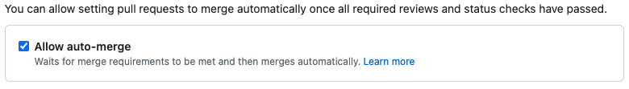

# Automated dependency updates

Renovate is a tool that automates dependency updates in your project.
It can save you time by automatically creating pull requests to update your dependencies.

Here's how to set it up:

`renovate.json` or `.github/renovate.json`:

```json
{
  "$schema": "https://docs.renovatebot.com/renovate-schema.json",
  "extends": [
    "local>hmcts/.github:renovate-config"
  ]
}
```

This configuration will use the default configuration for most options, and will label pull requests with the "dependencies" label.

It will only run in the morning to minimise disruption to your day and to also create the pull requests while the non production environments are running.

You can see all the configured options in [hmcts/.github:renovate-config.json](https://github.com/hmcts/.github/blob/master/renovate-config.json).

## Minimising work for your team

It's great that renovate is keeping your dependencies up to date, but it can take a lot of time to manage it.

We have provided two presets that will automerge pull requests for you if their CI checks are passing.

Depending on your project's test coverage, you can use one of the following presets:

[`automerge-minor`](https://github.com/hmcts/.github/blob/master/renovate/automerge-minor.json):

```json
{
  "$schema": "https://docs.renovatebot.com/renovate-schema.json",
  "extends": [
    "local>hmcts/.github:renovate-config",
    "local>hmcts/.github//renovate/automerge-minor"
  ]
}
```

[`automerge-all`](https://github.com/hmcts/.github/blob/master/renovate/automerge-all.json):

```json
{
  "$schema": "https://docs.renovatebot.com/renovate-schema.json",
  "extends": [
    "local>hmcts/.github:renovate-config",
    "local>hmcts/.github//renovate/automerge-all"
  ]
}
```

Prefer one of these two presets over writing your own `packageRules`. A hand-rolled config that
sets `"automerge": true` at the top level and then tries to carve out an exception for majors by
scoping `automerge: false` to specific packages (e.g. `matchPackageNames: ["node"]`) will still
auto-merge every *other* package's major bump — Renovate applies `packageRules` in order with
last-match-wins, so a package-specific rule doesn't act as a general major-version guard. If you
must write custom rules, add an explicit catch-all `matchUpdateTypes: ["major"]` rule with
`automerge: false` as the last entry. A major dependency bump can pass every CI check and still
break the app at runtime (e.g. a plugin changing its default output layout) with no compile error
to catch it, so this is not a theoretical risk.

[renovate-approve](https://github.com/apps/renovate-approve) will automatically approve pull requests from renovate, so you don't need to worry about approving them.

Make sure you [enable auto-merge on the repository settings](https://docs.github.com/en/pull-requests/collaborating-with-pull-requests/incorporating-changes-from-a-pull-request/automatically-merging-a-pull-request#enabling-auto-merge):



If the repository's branch protection is a ruleset requiring an approving review, Renovate PRs stay
`REVIEW_REQUIRED`/blocked no matter what automerge preset is configured, unless the Renovate app is
itself listed as a bypass actor on that ruleset (`bypass_mode: pull_request`, so it can only bypass
while merging a PR, never on a direct push to the protected branch). Also check that `renovate.json`'s
`extends` actually includes one of the automerge presets above — inheriting only the base
`hmcts/.github:renovate-config` preset enables automerge for nothing.

### Codeowners

If you have codeowners setup in your repository renovate won't be able to merge the pull requests automatically unless you remove the dependency files from `CODEOWNERS`.

For Java:

```
# https://help.github.com/en/articles/about-code-owners

* @hmcts/$team-name

# Renovate files
gradle/wrapper/gradle-wrapper.jar
gradle/wrapper/gradle-wrapper.properties
Dockerfile
build.gradle
charts/**/Chart.yaml
infrastructure/state.tf # or whichever file you use for terraform provider version sometimes provider.tf
.github/workflows/*.yaml
```

For NodeJS:

```
# https://help.github.com/en/articles/about-code-owners

* @hmcts/$team-name

# Renovate
.pnp.cjs
.yarn/**
package.json
yarn.lock
charts/**/Chart.yaml
.github/workflows/*.yaml
```

## Grouping pull requests

Renovate will create a pull request for each dependency update, which can be a lot of pull requests.

If you are subscribed to the whole repository you will get a notification for each pull request.
The above section on `CODEOWNERS` would help with this as you can unsubscribe from the repository and then won't get requested for review.

If you group the pull requests it will reduce the number of pull requests you get from renovate.

Below are a couple of examples on how to accomplish this:

- [sscs-renovate](https://github.com/hmcts/sscs-common/blob/master/.github/sscs-renovate.json)
- [cnp-jenkins-docker](https://github.com/hmcts/cnp-jenkins-docker/blob/a510706034dc2f288142046b254947919e30aed2/.github/renovate.json#L7)

For more information, see the [Renovate documentation](https://docs.renovatebot.com/).

## Wiring CI automation to Renovate PRs

If you build a workflow that reacts to Renovate PRs (e.g. a `workflow_run` gate that
checks the PR author, or an autofix bot that pushes a fix when CI fails), these things
catch people out:

- **Match the author via the REST API, not `gh pr view --json author` or other
  GraphQL-backed lookups.** For a GitHub App like Renovate, GraphQL renders the author
  as `login: "app/renovate"`, while the REST API (`gh api repos/<org>/<repo>/pulls/<n>
  --jq .user.login`) and the `workflow_run` payload both give the canonical
  `renovate[bot]` form. A gate comparing against `"renovate[bot]"` using the GraphQL
  form never matches, and fails silently if the same comparison is only ever used to
  *exclude* Renovate PRs (a non-match is safe there, so the bug stays invisible).
- **If the workflow calls `claude-code-action`, set `allowed_bots`.** The action
  refuses to run when the triggering actor is non-human ("Workflow initiated by
  non-human actor: renovate (type: Bot)"). On a `workflow_run` fired from a Renovate
  PR, the actor is Renovate, so any Claude Code Action step needs
  `allowed_bots: "renovate"` (or `'*'` to allow all bots) or it fails at the
  actor-validation step before your prompt ever runs.
- **A non-Renovate commit takes the branch out of Renovate's management, permanently.**
  Once any commit from a different identity lands on a Renovate-opened branch,
  Renovate's edited-branch detection stops rebasing that branch and stops
  auto-merging that PR — there is no automatic recovery short of adding the pushing
  identity to `gitIgnoredAuthors` in `renovate.json`. If your automation pushes fixes
  to Renovate PRs and you don't want to add that allowlist entry, budget for every
  fixed PR moving to manual review and merge from then on, and say so in the PR
  comment your automation leaves.
- **If that autofix step runs `claude` with `--dangerously-skip-permissions`, an
  `--allowedTools` list passed alongside it enforces nothing.** Bypass mode stops the
  permission system being consulted at all, so an allow-list — which only pre-approves
  actions that would otherwise prompt — has nothing left to restrict; only deny rules
  (`--disallowedTools`) still apply in that mode. A workflow relying on the allow-list
  to keep an unattended agent from running `git push` or similar needs a deny rule, not
  an allow-list, once `--dangerously-skip-permissions` is in play.

## Dependabot vs Renovate

We do not recommend using dependabot.

It is nowhere near as powerful as renovate.

Features missing:

- Centralised configuration
- Flexible scheduling
- Automerge
- Grouping pull requests
- Regex support for dependency files
- Many missing package managers - gradle wrapper, helm, terraform, nodejs version manager, etc
