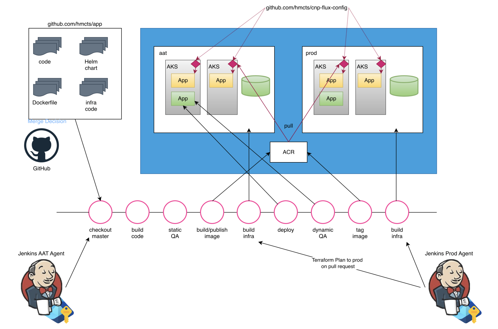
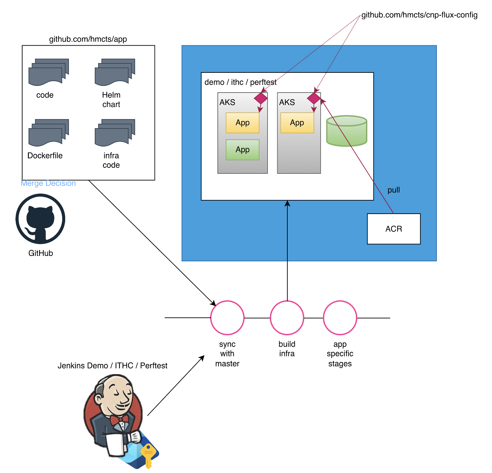

# Jenkins agents

The common pipeline is executed on Jenkins agents. These are the machines that run the pipeline stages and execute the tasks defined in the Jenkinsfile.

For security purposes, Jenkins agents have only the minimum necessary permissions to perform their tasks.

Jenkins agents will have access to a single environment so a pipeline may use multiple agents to deploy to different environments.

For pipelines that only target a single environment, a single agent will be used.

