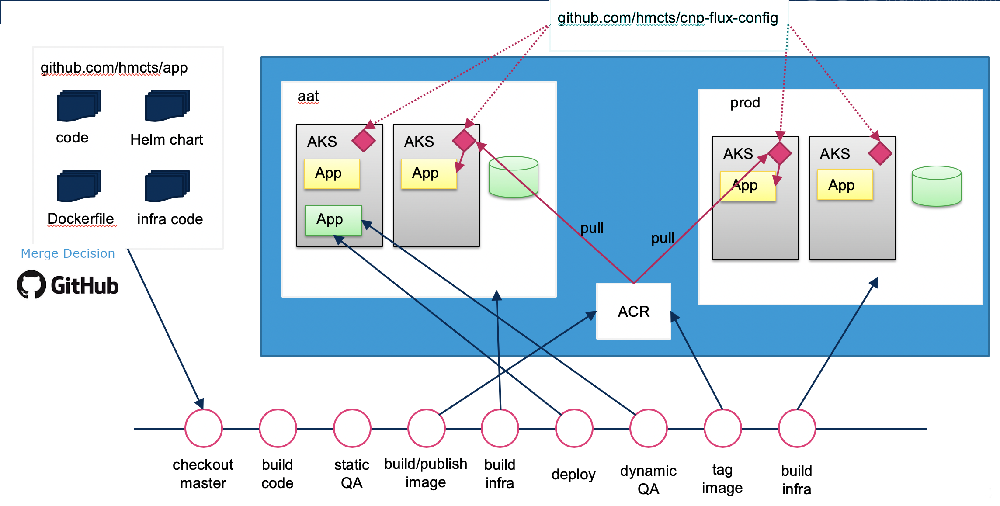
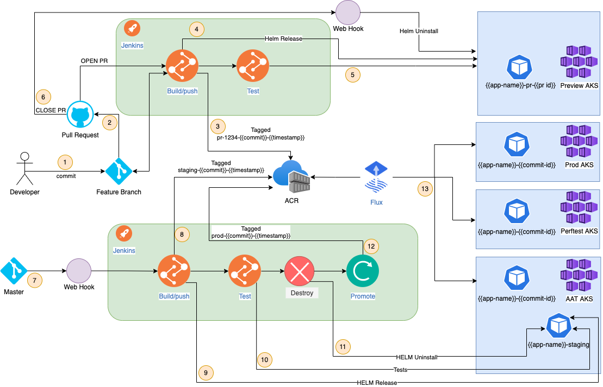

# Common pipeline

> To get onboarded to the common pipeline please see [Jenkins setup](../new-component/jenkins-repository.md).

The common pipeline is a Jenkins pipeline defined by [code](https://github.com/hmcts/cnp-jenkins-library)
which implements Continuous Delivery to production while enforcing a standard set of
checks on the code processed.

It enables HMCTS Reform to deploy changes to the platform in a well defined
manner providing the confidence that all the test and verification
stages have been executed in a structured and repeatable sequence.
This allows for fast feedback to developers to improve code development velocity.

The delivery pipeline combines infrastructure and database schema changes with the
application deployment, therefore taking advantage of the microservices architecture
in use at HMCTS.

Code changes are subjected to a round of static tests - consisting of unit tests, static
code analysis and security checks - before being deployed to a non-prod environment in a
non-publicly accessible AKS (Kubernetes) deployment. Here, a range of smoke tests and
non-destructive functional tests verifies the app is functioning. At this point a promotion
process is started which labels the Docker image produced by the previous stages of the
pipeline as production-ready. Production deployments are managed by flux which takes care
of keeping an application deployment up to date with the latest production-ready image generated
by the delivery pipeline.

Smoke tests are available in production as part of a flux deployment and run from a separate container.

The entire Delivery Pipeline is a hands-off, automated process, triggered at the point of change. Code merged
to master is deployed to production without any further human intervention. For this reason:

- PRs need to be carefully reviewed
- Feature Flagging, to separate the deployment of changes from their activation, is a practical necessity for all apps.

### More information

For an in-depth guide on how the common pipeline works and how it should be used, please refer to the [cnp-jenkins-library README](https://github.com/hmcts/cnp-jenkins-library/blob/master/README.md)

### Deploying applications using the common pipeline

[Helm](https://helm.sh) is the package manager for Kubernetes.
We deploy all of our applications using a helm chart to Kubernetes.
For more information about Helm, please see the related new component
[docs](../new-component/helm-chart.md)

The diagram below shows the end to end workflow of how an application is deployed throughout the SDLC, Perftest is an example of a non path to live environment that is _optionally_ deployed to.

An application consists of the different infrastructure levels of platform, product and component as detailed in [Infrastructure levels](../new-component/infrastructure-as-code.md#infrastructure-levels).

The product and component levels are combined to define the name of the application, denoted by app-name in the diagram below. The values for product and component should be defined in the Jenkinsfile within the github repo.

Example: [cnp-plum-frontend](https://github.com/hmcts/cnp-plum-frontend/blob/master/Jenkinsfile_CNP)

The environments shown in the diagram reflect CFT. Review the table below to see the corresponding SDS environment names.

|CFT Environment|SDS Environment|
|-|-|
|AAT|Staging|
|Perftest|Test|
|Preview|Dev|
|Prod|Prod|

End to end process:

1. Commit changes to feature branch
2. Create a pull request
3. Jenkins will push an image with tag
4. Jenkins will force a new Helm release to AKS
5. Jenkins will run automated tests
6. Merging and closing the PR will merge the feature with master
7. The merge with master will trigger a webhook to start the Jenkins pipeline
8. Jenkins will push an image with tag
9. Jenkins will force a new Helm release to AKS
10. Jenkins will run automated tests
11. Jenkins will destroy the pod
12. Jenkins will promote the image by:
    - retagging the image in ACR
    - updating the github flux repo with the new image name
13. Flux will see new changes and deploy new pod

Step 2 above happens regardless of whether the PR is marked as a draft — the GitHub Branch Source plugin indexes and builds every open PR the same way, so a draft PR still gets the full image build, Helm deploy and automated test run. Marking a PR ready for review doesn't itself trigger anything either. To hold a PR back from building, use `[skip ci]` in the commit message.

More information on how Jenkins works can be found on the [jenkins-agents](jenkins-agents.md) page.

### Finding your pipeline

Within Jenkins, there exists the concept of organisation folders. This enables Jenkins to scan a GitHub Organization to discover repositories and automatically create managed pipelines for them.

Your pipeline will exist within a specific organisation folder which should have been defined when the pipeline integration was first configured.

See [Jenkins setup](../new-component/jenkins-repository.md#scan-jenkins) for details.

### Finding your application

Within AKS, your application pods will exist within a namespace. The namespace will correspond to what has been configured in the Jenkins team-config.yml file.

[CFT example](https://github.com/hmcts/cnp-jenkins-config/blob/4172d1409ec33072a867dee75fb8bb15192961e0/team-config.yml#L3)

[SDS example](https://github.com/hmcts/sds-jenkins-config/blob/edda067f268fe4056c19963fc5c7419cbd559856/team-config.yml#L3)

### Resource locks

Resources in Azure are locked in Staging or Production to prevent their destruction.

If you need to rename or destroy a resource, you will need to temporarily remove the lock. This can be done using the link in the readme of the [Azure Resource Locks](https://github.com/hmcts/azure-resource-locks/#pipeline-jobs) repository.

### SSH access to resources

To SSH into Azure resources, such as a Postgres Database, you will typically need to go via a Bastion.

- Staging and production resources use the Production Bastion
- Other resources use the Non-production Bastion

To SSH into the bastion, you must first get a temporary access pass on [myaccess.microsoft.com](https://myaccess.microsoft.com/@CJSCommonPlatform.onmicrosoft.com#/access-packages).

### Building infrastructure in the demo environment

To build infrastructure in demo, you will need to create a branch called "demo". All merges to this branch will be deployed in the Demo environment.

### Key vaults build failures

If your infrastructure pipeline requires the use of a Key Vault to build, and the Key Vault is also itself being built in the pipeline, then it is common for the first deployment to fail. Just rebuild the pipeline.

### Team secrets in custom hooks

`sectionDeployToAKS` and `sectionNightlyTests` call `withTeamSecrets` for you, but a custom hook such as `afterSuccess('<stage>')` does not get team vault secrets automatically. This matters for branches like `perftest` and `demo`, which are deployed by flux rather than by the pipeline and so never reach `sectionDeployToAKS` at all.

To read team secrets inside such a hook, capture `pipelineConf = config` at the top level of `withPipeline`, build an `AppPipelineConfig` with its own `vaultSecrets` map, and call `withTeamSecrets(vaultConfig, environment) { ... }` explicitly — it already iterates every vault in the map, so there's no need to recurse yourself. Whether you also need a `withSubscription` wrapper around it depends on which agent the hook runs on: on the primary agent (for example a `checkout` hook) `withTeamSecrets` has nothing to authenticate with, so you do; on an environment agent (a stage token suffixed `:<environment>`, such as `dbmigrate:perftest`) it authenticates itself via that environment's managed identity, so wrapping it in `withSubscription` is redundant.

### Retries restart the whole parallel stage

The `retry` wrapper around an expensive stage (e.g. a multi-branch functional/E2E stage) is configured in `cnp-jenkins-library`, not in your repo's Jenkinsfile. A transient agent blip partway through such a stage restarts the *entire* stage — including every other branch already running inside it, from Checkout — rather than just the step that failed. No per-repo Jenkinsfile change can scope a retry down to the failed branch alone; raise it with Platform Operations if a stage's retry cost is a problem.

### E2E tests on a PR need the `enable_e2e_test` label

`enable_e2e_test` is the switch that turns on end-to-end testing for a PR build in `sectionDeployToAKS`; labels like `enable_e2e_regression` only select which suite runs once E2E is already enabled — they do nothing on their own. A PR carrying a suite-selection label but not `enable_e2e_test` still builds, deploys and reports success, having silently skipped the E2E stage entirely. Separately, `enableE2eTest()` is only wired up from the `onMaster()` path in the shared library — PR-time E2E is entirely this separate, label-gated path, not a scaled-down version of what runs on master.

### `enable_keep_helm` keeps a PR's preview release instead of tearing it down

By default a PR build uninstalls its Helm release once the build finishes. Adding the
`enable_keep_helm` label leaves the preview release in place instead. The label is read
once, during the `AKS deploy` stage, so adding it after a build has already started
doesn't save that run — label first, then build or rebuild. Keeping the release this way
isn't permanent: the preview namespace still gets reaped on the usual schedule, and the
next build of that PR redeploys over it regardless of the label.

### A green PR build does not guarantee a green master build

Where a repo's end-to-end suite is split by tag (for example a small `@smoke`/`@PR` set run against the preview deploy, and a wider `@regression` set run only against AAT on master), a PR build only exercises the smaller set. Removing or changing something the wider suite asserts — a UI control, a page's structure — can pass every PR check and still break the master build once it deploys to AAT and runs the suite a PR never ran. Grep the E2E specs for anything asserting the behaviour you're changing before treating a green PR as sufficient, and know that a master failure of this kind blocks that build's image promotion, so the change also isn't live until the suite is fixed and master goes green again.

### A PR build cannot prove an infrastructure change

A PR build only deploys to Preview; the `Apply … in <env>` Terraform stage that applies infrastructure changes to AAT (Staging) runs on master builds only. A PR carrying a Terraform module or provider change can pass every stage green without that change ever being applied against AAT — only the resulting master build actually exercises it.

### Docker build stage

The pipeline's Docker build step uses `az acr build` (ACR Tasks), which builds with the legacy (non-BuildKit) Docker builder. That builder walks every stage declared in the Dockerfile in file order, regardless of `--target` — a stage is only skipped if it's declared *after* the target stage. A leftover or unused stage placed earlier in the file (for example an old `development` stage with its own `COPY . .`) is still built on every single run even though `--target runtime` is set; the fix is to delete or reorder the stage, not to rely on `--target` alone.

The `Waiting for an agent...` line an `az acr build` run prints early is not evidence of queueing — it's logged speculatively before the run polls for an agent, and ACR build-run records typically show sub-second queue waits. If a Docker build stage is slow, look at the actual remote build execution time rather than chasing ACR agent capacity.

A master build's "promote the image by retagging it in ACR" step (see step 12 above) runs `az acr build` to produce a `:staging` tag, then, later in the same build, `az acr import`s that image to both a `:prod-<sha>-<timestamp>` tag and `:latest`. There is no separate promotion job to wait for — `:latest` moves the moment that one build reaches its import step. A chart or preview environment pinned to `:latest` therefore only picks up a merge once the triggering master build finishes; check the build's own log for the `az acr import ... -t <image>:latest` line rather than looking elsewhere for a promotion stage.

### SonarCloud coverage gate counts untested files as zero

See [Troubleshooting — SonarCloud "Automatic Analysis" creates a second, separate project](../troubleshooting.md#sonarcloud-automatic-analysis-creates-a-second-separate-project) if a `SonarCloud Code Analysis` PR check fails on files unrelated to your change, or a PR gets no Sonar comment despite the pipeline's own scan passing.

`new_coverage` is measured only over the files Sonar's scan covers (`sonar.sources`/`sonar.tests`), but within that set, any file the unit-test runner never imports has no lcov record at all and Sonar counts it as 0% covered — even if the file is genuinely exercised by a separate Playwright/E2E suite that never produces lcov output. On a page-per-directory frontend this is easy to hit hard: dozens of page handlers covered only by E2E tests can drag a real ~80%+ unit-test coverage figure down into the 20-30% range and fail the gate on a PR that changed nothing risky. Check for files Sonar's scan includes but the lcov report never mentions; either write unit tests for them or add them to `sonar.coverage.exclusions` (keep them in `sonar.sources` so code smells are still analysed). Near-identical page handlers can separately trip `new_duplicated_lines_density`; `sonar.cpd.exclusions` is the equivalent relief for duplication. Read the gate directly rather than guessing at what's failing: `https://sonarcloud.io/api/qualitygates/project_status?projectKey=<key>&pullRequest=<n>`.

### A bare `Array.prototype.sort()` fails Sonar's reliability rating

Sonar's JS/TS ruleset scores a `.sort()` call with no comparator as a bug: the default lexicographic order mis-collates anything beyond plain ASCII, so the array ends up sorted, just not the way a reader would expect. A single occurrence is enough to pin `new_reliability_rating` below the grade the gate requires. Passing an explicit comparator — `.sort((a, b) => a.localeCompare(b))`, or an existing project helper that wraps it — satisfies the rule; grep for bare `.sort(` calls in new code before relying on the gate to find them for you.

### OWASP dependency-check results can flip without a code change

See [Troubleshooting — a build fails on the dependency check with no dependency or code changes](../troubleshooting.md#---a-build-fails-on-the-dependency-check-with-no-dependency-or-code-changes) — the pipeline's `dependencyCheckAggregate` step scores against the live NVD feed on every run, so identical commits can pass or fail depending purely on feed timing and per-agent caching.

### Yarn quarantines packages published in the last 24 hours

Yarn 4.15+ ships `npmMinimalAgeGate`, a client-side gate (default one day) that refuses to install any npm package version published more recently than that window. A Renovate PR bumping to a version published within the last day fails `yarn install` outright — including Renovate's own lockfile-update step — with an error (`YN0016: ... quarantined`) that reads like an npm registry restriction but is yarn refusing the install locally. The PR stays red until the version ages past the gate, or until `minimumReleaseAge` is set in `renovate.json` so Renovate never proposes a version yarn will still refuse.

### Troubleshooting build issues

See [troubleshooting issues](../troubleshooting/).
