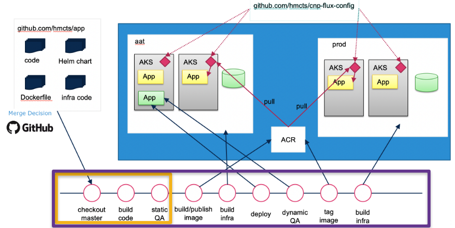

# Jenkins setup

Use this page when adding a GitHub repository to Jenkins.

For team-level Jenkins metadata and build dashboards, use [Jenkins](../../tutorials/cnp-onboarding/team-jenkins.md).

> To find out more about the common pipeline, see its [documentation](../common-pipeline/overview.md).

There are Jenkins servers for both CFT (Civil, Family & Tribunal) and SDS (Shared Digital Services).

The setup depends on the business area your application is in.

Before starting, make sure the repository exists and access is managed through the correct GitHub teams.

See [Github](../../tutorials/cnp-onboarding/team-github.md) and [creating a GitHub repository](github-repo.md#create-a-github-repository).

## Add the GitHub topic

Add the [required GitHub topic](#github-topics) to the repository so it appears in the Jenkins organisation scan.

## Add the repository to the Jenkins allowlist

Raise a pull request to add your repository to the Jenkins allowlist.

Only repositories present in this file will be picked up by the Jenkins org scan.

CFT: [hmcts/cnp-jenkins-config/deployment-controls.yml](https://github.com/hmcts/cnp-jenkins-config/blob/master/deployment-controls.yml)

SDS: [hmcts/sds-jenkins-config/deployment-controls.yml](https://github.com/hmcts/sds-jenkins-config/blob/master/deployment-controls.yml)

Add an entry in the following format:

```yaml
- repo: https://github.com/hmcts/<your-repo-name>.git
  deployment-enabled: true
```

## Scan Jenkins

Scan the organisation manually in Jenkins if it does not scan automatically.

## A pull request opened before onboarding may never get built

Jenkins multibranch discovery for pull requests is triggered by a `pull_request` webhook
event, not by the org scan alone. If a pull request was opened before the repository's
GitHub topic and allowlist entry were in place, that event carried no matching Jenkins job to
build against — merging the allowlist PR afterwards does not retroactively pick it up, and the
multibranch project can sit with zero indexed branches. Closing and reopening the pull request
fires a fresh `pull_request` event and triggers discovery immediately, without waiting for the
next scheduled organisation scan.

## Watch for a duplicate SonarCloud project

A newly created repository can end up analysed by SonarCloud twice: once as the project the
common pipeline scans via the repo's `sonar-project.properties`, and once by SonarCloud's own
GitHub App "Automatic Analysis", which auto-imports any new repository under the org and creates
a second project keyed `hmcts_<repo-name>`. Automatic Analysis reads `.sonarcloud.properties`,
not `sonar-project.properties` — with neither file present it scans the whole repository
(config, charts, test fixtures, SQL migrations) instead of the pipeline's configured `sonar.sources`
scope, and can fail its own quality gate on files the pipeline-scanned project never sees. Both
projects post a separate GitHub commit status, so a PR can show one Sonar check green and another
red for the same commit. Either disable Automatic Analysis for the repository in SonarCloud's
project settings, or add a `.sonarcloud.properties` matching the pipeline's source scope so both
projects agree.

## Allow production deployments

To allow Jenkins to deploy to production, add your GitHub repository to the approved repositories list.

CFT: [hmcts/cnp-jenkins-config/environment-approvals.yml](https://github.com/hmcts/cnp-jenkins-config/blob/master/environment-approvals.yml)

SDS: [hmcts/sds-jenkins-config/environment-approvals.yml](https://github.com/hmcts/sds-jenkins-config/blob/master/environment-approvals.yml)

## Pipeline stages and deployment controls

The diagram below illustrates which pipeline stages are available depending on your `deployment-enabled` setting in `deployment-controls.yml`:



- **Orange box**: stages available when your repository is in `deployment-controls.yml` but `deployment-enabled` is not set to `true`: `checkout master`, `build code`, `static QA`
- **Purple box**: all stages available when `deployment-enabled: true` is set, including build, deploy, test, tag and production infrastructure stages

Without `deployment-enabled: true`, no Docker images will be published, no infrastructure will be applied, and no deployments to AKS will occur.

## GitHub topics

Jenkins looks for repositories by searching for GitHub topics.

The topics are named after the Jenkins instance the repository will be built on. CFT repositories are split alphabetically across multiple topics.

For example, if your repository starts with `div`, `d` is in the CFT `jenkins-cft-d-i` topic.

See the [GitHub documentation](https://docs.github.com/en/repositories/managing-your-repositorys-settings-and-features/customizing-your-repository/classifying-your-repository-with-topics#adding-topics-to-your-repository) on how to add a topic.

### CFT topics

- `jenkins-cft-a-c`
- `jenkins-cft-d-i`
- `jenkins-cft-j-z`

### SDS topics

SDS repositories are not currently split, but they may be in the future.

- `jenkins-sds`
