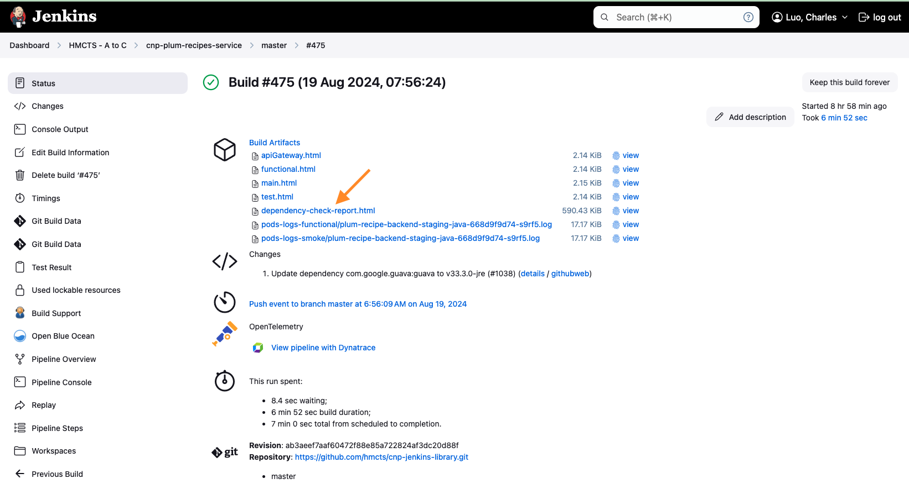

# Troubleshooting issues

## Table of Contents

- [GitHub](#github)
- [Microsoft Entra ID and account access](#microsoft-entra-id-and-account-access)
- [Jenkins](#jenkins)
- [Debug Application Startup issues in AKS](#debug-application-startup-issues-in-aks)
- [VPN](#vpn)
- [Flux and Gitops](#flux-and-gitops)
- [Connecting to AKS Clusters](#connecting-to-aks-clusters)
- [Golden Path](#golden-path)

## GitHub
---

GitHub troubleshooting has moved to the [GitHub onboarding troubleshooting section](../tutorials/cnp-onboarding/person-github.md#troubleshooting).

## Microsoft Entra ID and account access
---

Troubleshooting for inactive account emails, deleted tenant accounts, guest invitations and access groups has moved to [Microsoft Entra ID troubleshooting](../tutorials/cnp-onboarding/person-entra-id.md#troubleshooting).

## Jenkins
---
### Jenkins is unavailable

  - Check if there is a planned outage in "#cloud-native-announce"
  - Please note Jenkins could be temporarily unavailable while rolling out a change, give it a few minutes before you raise an issue.

### Cannot login to Jenkins

  - Login to Jenkins is managed by Microsoft Entra ID. Follow [Jenkins person onboarding](../tutorials/cnp-onboarding/person-jenkins.md) to check the user's access groups.

### You are now logged out of Jenkins/ Infinite loop when trying to login to Jenkins

  - Please try clearing browser cookies on [login.microsoft.com](https://login.microsoftonline.com/)

### Cannot see my new repo in Jenkins org / Dashboard

  - See [Jenkins setup](new-component/jenkins-repository.md) to add your app to the Jenkins organisation scan

### Cannot see my branch/PR or This project is currently disabled in Jenkins

- Any branches which are also filed as PRs are not listed as a branch, they will only be listed in pull requests section.
- Branch/ PR is not listed if its last commit creation date is older than 30 days.

### Sonar scan cannot find default branch

You may get the error below, when the pipeline has not ran on the master/main branch first.

When you run it on the master/main branch it will setup the default branch and then the pull request build will start working.

```
[2021-09-16T10:59:54.154Z] Execution failed for task ':sonarqube'.
[2021-09-16T10:59:54.154Z] > Could not find a default branch to fall back on.
```

### Sonar scan timeout

- Please see [sonarcloud status](https://status.sonarqube.com/) for any known issues with sonar cloud.
- Remember that Platform Operation do not maintain SonarCloud, issues are usually discussed on community forums.

### Static checks fail with exit code 3 and a Java stack trace about a scanner component

This is a SonarCloud server-side fault, not a config or code problem, even though the surface error (`Unable to load component class org.sonar.scanner.scan.filesystem.ProjectFileIndexer` or similar) reads like one. Find the deepest `Caused by:` line in the console log — it is usually an HTTP 500 from SonarCloud's own scanner endpoint (`batch/project.protobuf`). Two tells that confirm it's infrastructure rather than your change: the unit/integration test stages already passed before the scanner ran, and no `report-task.txt` is produced because the scan never completed. Re-trigger the build rather than editing `sonar-project.properties` or bisecting commits. The GitHub `SonarCloud`/`SonarCloud Code Analysis` checks on the PR can still show pass while this Jenkins stage fails — they come from SonarCloud's separate GitHub App analysis, not from the scan that just failed, so a green Sonar tick does not mean the pipeline's scanner ran.

### Sonar scan quality gate failure

If you receive this error: `Pipeline aborted due to quality gate failure: NONE` on master, try a re-run of the pipeline. This may simply be an intermittent issue caused by sonarcloud or because the GitHub repo has only just been created and this is the first time you're running the pipeline.

### Sonar scan succeeds but no PR comment appears

Analysis completing and the quality gate evaluating correctly does not mean SonarCloud will comment on the PR. PR decoration also requires the receiving SonarCloud project to have a **DevOps Platform binding** to the GitHub repo, plus the SonarCloud GitHub App installed with access to that repo. Both live in SonarCloud's own project settings (Administration → DevOps Platform Integration) — nothing in `build.gradle`, `Jenkinsfile_CNP` or `sonar-project.properties` can create or fix that binding, so changing `sonar.projectKey` will not restore comments; it can only move the (still unbound) analysis to a different project.

A repo can end up with more than one SonarCloud project for the same GitHub repo — typically one created by SonarCloud's GitHub-import/Automatic Analysis (source-only, so it reports 0% coverage, but bound and therefore able to comment) and one fed by the Jenkins `sonarqube` task (full coverage data, but not bound unless someone did it manually). If comments stopped after previously working, check for duplicate/orphaned projects for the repo and confirm which one Jenkins is actually publishing to before asking platform/Sonar admins to bind it.

### Coverage percentage doesn't match the raw jacoco XML

`sonar.coverage.exclusions` in `sonar-project.properties` strips whole categories of classes (generated code, config, domain/model classes are common exclusions) before SonarCloud computes its coverage percentage. Computing coverage by hand from the jacoco XML report — summing covered/total lines across every class — includes those excluded classes and can read tens of percentage points lower than what SonarCloud actually reports for the project. If you need the real figure, query the SonarCloud API (or read the dashboard) rather than the raw jacoco XML.

### Build / Docker Build / Unit Test failure

  - If your build is failing in these stages, it's most likely to fail in your local as well. Look at the first line of the Jenkins step that fails and try run the same command Jenkins is running.
  - Try on a colleague's machine as you might have cached something locally.

### Helm Upgrade Failed, Helm Release timed out waiting for condition, Helm Release Failure

  - See [Connecting to AKS Clusters](#connecting-to-aks-clusters) and connect to the relevant cluster.
  - These errors usually mean your pods didn't start as expected in time.
  - It could be that they are stuck in `Pending`, `ContainerCreating` status or might be failing to startup leading to `CrashLoopBackOff` status.
  - Follow [Debug Application Startup issues in AKS](#debug-application-startup-issues-in-aks) to troubleshoot further

### Jenkins managed helm releases / pods are automatically deleted

  - To maintain the health of the cluster, it is important to cleanup unwanted pods regularly.
  - Helm release is cleared for PRs which are merged or closed.
  - Helm release of PRs raised by dependency bots (based on `dependencies` label) is cleared once the functional tests pass.
  - Helm release on AAT Staging is also cleared once functional tests pass.
  - For optimal usage, You can also configure your pipeline to [clear Helm releases on successful build](https://github.com/hmcts/cnp-jenkins-library#clear-helm-release-on-successful-build).
  - A scheduled pipeline runs every hour to clear any helm releases which are not updated in last 3 days. Teams can do more frequent cleanup by overriding in the [cleanup script](https://github.com/hmcts/cnp-aks-pipelines/blob/0fe733120f78b6dabcdd5895bb16134085631842/scripts/delete-inactive-helm-releases.sh#L5)

### Smoke / Functional test failure

  - Jenkins only sets secrets as environment variables and runs the `gradle` / `yarn` task to run tests.
  - Access the URL on VPN and try running tests manually using the `TEST_URL` printed in the logs.
  - You can also run tests locally by setting the required secrets while on the VPN.
  - To add additional logging, see [Example config](#example-2).

### Terraform/ Build Infrastructure failure

  - It is important that you need to review your plan in a pull request before applying it to an environment.
  - Please check if its an intermittent failure with Azure as a retry could fix it.
  - Also, see if there are any open issues/discussions on community channels for the failure.
  - There could be open GitHub issues on terraform/ azurerm, so googling it could help as well.

### Using branches to troubleshoot issues

If your pipeline is throwing an error, you may be able to more easily troubleshoot the issue by using a branch in the cnp-jenkins-library repo.

#### Example 1
Gradle is failing because a plugin cannot be found in artifactory. You've checked the plugin exists and there are no typos in your code.
You can check if the issue lies with artifactory by temporarily bypassing it using a [branch](https://github.com/hmcts/cnp-jenkins-library/blob/073ad8587b7281d62bac705ed984e739a0911c83/resources/uk/gov/hmcts/gradle/init.gradle#L3).

And then referencing that branch within your repo's [Jenkinsfile](https://github.com/hmcts/sds-toffee-recipes-service/pull/12/files)

In this example, the issue is network related. This may be down to routing in Azure or traffic being blocked by a firewall.

#### Example 2
Gradle is failing a functional test. To help get more information on why, you could update the Gradle logging level in a branch of [cnp-jenkins-library](https://github.com/hmcts/cnp-jenkins-library/blob/cfb31f3a2699b2a1dafd66fed0b525ae145d627d/src/uk/gov/hmcts/contino/GradleBuilder.groovy#L62)

And then reference this branch within your repo's [Jenkinsfile](https://github.com/hmcts/document-management-store-app/blob/646593336377fd59112b0b6c84fd223d0cb7832c/Jenkinsfile_CNP#L12)

### Error message `channel_not_found`

When you want to send Jenkins pipeline notifications to a slack channel, you must make sure the Jenkins app has been added to the channel.

If you don't do this, you will receive the `channel_not_found` error message and the pipeline will fail.

See the instructions on the [team Slack onboarding](../tutorials/cnp-onboarding/team-slack.md) section to add Jenkins to a build notices channel.

If you are getting this message on a PR pipeline and the error also says `Failed to notify @U1234ABCD`, that means your GitHub username has been mapped to an invalid Slack ID.

Find your Slack ID by clicking on `View profile` within the Slack app, then click on the three dots and click `Copy member ID`.

Update your GitHub to Slack user mapping by following [Slack onboarding](../tutorials/cnp-onboarding/person-slack.md#github-to-slack-mapping) and try running the pipeline again.

### Pushing to a PR while its build is running wastes a build, not just a build slot

A new push does not cancel the build already running for the previous commit. The CNP pipeline serialises preview deploys on a per-PR lock (`Trying to acquire lock on [Resource: <product>-aat-deploy]`), so the new build queues behind the old one rather than replacing it — and if you push again before either finishes, a third build queues too. Only the build for your current head commit's result matters, so batch fixes into one push per PR per cycle rather than pushing after each small change; check `gh api repos/<org>/<repo>/commits/<sha>/statuses` or the Jenkins job's build list directly, since a superseded build that finishes with a real result never posts a commit status and can be missed entirely.

Manually stopping a superseded build in Jenkins is worse than leaving it queued: the abort posts an `ERROR`/`ABORTED` GitHub commit status for the PR, and that can land after — and overwrite — a newer, still-running build's status for the current head commit. `gh pr view --json statusCheckRollup` then reports the PR as failed even though a relevant build is still in progress. Read the Jenkins build directly (build number and its `building` flag) rather than trusting the GitHub status rollup when a stop/retrigger race is possible.

### Sandbox Jenkins is not automatically picking up my changes

Because we have a prod and sandbox Jenkins instance, sometimes your pushes to master may be picked up by prod Jenkins instead.

If this happens, simply run the master build manually on sandbox jenkins.

## Debug Application Startup issues in AKS
---
- There could be many reasons why applications could fail to startup like :
    - A secret referred in helm chart is missing in keyvaults
    - Pod identity is not able to pull keyvault secrets due to missing permissions
    - There is not enough space in the cluster to fit in a new pod.
    - Pod is scheduled, but fails to pass readiness (`/health/readiness`) or  liveness (`/health/liveness`) checks.
    - A misconfigured environment variable, example - incorrect URL of a dependent service.
    - The product's shared preview PostgreSQL server has run out of connections — see [Preview database creation fails](#preview-database-creation-fails).
    - The pod is OOMKilled despite a generous `memoryLimits` — see [OOMKilled despite a generous memoryLimits](#oomkilled-despite-a-generous-memorylimits).

- Below are some handy kubectl commands to debug the issues

    To check latest events on your namespace:

     ```shell
     kubectl get events -n <your-namespace>
     ```

     To check status of pods:

     ```shell
     kubectl get pods -n <your-namespace> | grep <helm-release-name>

     #Examples
     # kubectl get pods -n ccd | grep ccd-data-store-api
     # kubectl get pods -n ccd | grep pr-123
     ```

     To check status of a specific pod which is not running

     ```shell
     kubectl describe pod <pod-name> -n <your-namespace>
     ```

     To check logs of pods which is not starting

     ```shell
     kubectl logs <pod-name> -n <your-namespace>

     #To follow logs
     kubectl logs <pod-name> -n <your-namespace> -f

     # To check previous pod logs if its restarting
     kubectl logs <pod-name> -n <your-namespace> -p

     ```

### `coalesce.go` warnings in a CCD-chart deploy log are usually noise

A CCD-based preview/PR deploy routinely logs Helm's `coalesce.go: warning: cannot overwrite table with non table for <release>.ccd.<subchart>.<key>` for dozens of unrelated keys (`keyVaults`, `draft-store-service`, `rpe-service-auth-provider`, several subchart levels deep) — including on builds that deploy and pass cleanly. It's composition noise from how the CCD subcharts merge nested values, not evidence that a specific values key (e.g. `postgresql.setup.databases`) resolved to an empty map. Confirm an actual values regression against the rendered output (`helm template` / `helm get values`) rather than treating this warning as diagnostic.

### Preview database creation fails

Every PR preview namespace for a product gets its own database on one small shared flexible server. When idle JDBC pool connections accumulate across many previews — a `*_MIN_IDLE` setting that keeps connections open on an otherwise-idle release, or a scheduler thread count that keeps the pool fully warm — the server approaches `max_connections` and its control-plane API starts failing. New PRs then can't get a database created at all, and pods crashloop on `FATAL: database "..." does not exist` or a Hikari connection timeout, even though the failing PR's own Helm values are correct.

Check connection counts against `max_connections` and look for oversized `*_MIN_IDLE` settings rather than raising the server's limit. `*_MAX_POOL_SIZE` is only a ceiling on connections drawn during active load, not a reservation — raising it doesn't by itself add to what an idle release holds open across dozens of concurrent previews.

### Raising E2E parallelism against a CCD-backed preview exhausts the Hikari pool, not CPU

Increasing Playwright (or similar) worker count against a single preview release without also raising `DATA_STORE_DB_MAX_POOL_SIZE`/`DEFINITION_STORE_DB_MAX_POOL_SIZE` causes CCD's data-store/definition-store Hikari pools to saturate (logged as `total=N, active=N, waiting=M`) even though the pod's CPU and memory usage stay well under its request. This looks like a compute-bound ceiling but is actually a connection-pool ceiling — worker count and pool size both need raising together, roughly in proportion, to get a real parallelism gain.

### OOMKilled despite a generous memoryLimits

Jenkins-driven helm deploys (`helmInstall.groovy`) always pass `--set global.devMode=true` — Preview, PR builds and the Jenkins-managed AAT "staging" release alike. In devMode the chart reads `devmemoryLimits`/`devmemoryRequests`/`devcpuLimits`/`devcpuRequests` with no fallback to the non-dev keys, so a chart setting only `memoryLimits` gets the base chart's default instead (512Mi on chart-base and chart-nodejs, 1Gi on chart-java). Set `devmemoryLimits` alongside `memoryLimits` for anything Jenkins deploys. GitHub Actions deploys and Flux-managed `HelmRelease`s never set `global.devMode`.

The same app in the same AAT namespace can run under two independent releases with different memory behaviour: a Jenkins-managed `<app>-staging` (devMode on) and a Flux-managed `<app>` (devMode off, tracking a prod image tag). Check which one a pod belongs to before changing chart values:

```bash
kubectl get pod -n <namespace> <pod> -o jsonpath='{.metadata.labels.app\.kubernetes\.io/instance}{"\n"}'
```

`kubectl top pods` reports the cgroup working set the OOM-killer compares against the limit, but it's a live snapshot and resets once a pod restarts. To confirm a kill actually happened:

```bash
kubectl get pod -n <namespace> <pod> -o jsonpath='{.status.containerStatuses[0].lastState.terminated.reason}{"\n"}'
```

For history, Container Insights (`oms_agent`) is only enabled on perftest and prod — but `kube-prometheus-stack` runs on every CFT cluster and scrapes cAdvisor via the kubelet `ServiceMonitor` regardless of any chart's own `prometheus.enabled`, so `container_memory_working_set_bytes` is available for 30 days on AAT too. AAT is two clusters with a Prometheus each; only one runs Grafana, and that Grafana has both wired in as datasources.

### Preview pod is healthy but the pipeline's startup checker still fails

Every pod reaches `condition met`, then the pipeline's startup checker fails anyway with no HTTP status logged, just a private-DNS record for the PR's hostname being created seconds before the check runs (`the resource record '...' does not exist` followed immediately by `Registering DNS for ... with ttl = 300`). This is a DNS-propagation race, not an application problem — the checker (from the shared `cnp-jenkins-library`) can hit the hostname before the new A record has propagated, and its retry budget isn't reliable against a cold record (it may log only one attempt before giving up). Retriggering the build is the practical fix; re-reading the app logs as the checker's error message suggests will not show anything, since the app was never unhealthy.

### ACR tag dates are not build times

`createdTime`/`lastUpdateTime` from `az acr manifest list-metadata` record when a tag was last pointed at a manifest, so re-pushing `:latest` updates them without a new build. To date the code in a running pod, read file timestamps inside the container instead.

## VPN
---

VPN access and troubleshooting has moved to [VPN onboarding](../tutorials/cnp-onboarding/person-vpn.md).

## Flux and Gitops
---

   > Always check __why__ your release or pod has failed in the first instance.
   > Although you may have permissions to delete a helm release or pod in a non-production environment, use this privilege wisely as you could be _hiding a potential bug_ which could also _occur in production_.

### Latest image is not updated in cluster

- Start with checking [cnp-flux-config](https://github.com/hmcts/cnp-flux-config) to make sure flux has updated/ committed the image.
- If image hasn't been committed to GitHub, see [Flux did not commit latest image to GitHub](#flux-did-not-commit-latest-image-to-github).
- If flux has committed the new image to GitHub, check if the `HelmRelease` has been updated by Flux. Run below command and check that the image tag has been updated in the output

    ```shell
    kubectl get hr -n <your-namespace> <your-helm-release-name> -o yaml
    ```
- If Image is not updated in above, [Change in git is not applied to cluster](#change-in-git-is-not-applied-to-cluster).
- If the image tag is updated and still application pods are not deployed, see [Updated HelmRelease is not deployed to cluster](#updated-helmrelease-is-not-deployed-to-cluster)

### Flux did not commit latest image to GitHub

   - Image automation is run from management cluster (CFTPTL). Please login to cftptl cluster before further troubleshooting.
   - Image reflector controller keeps polling ACR for new images, but it should generally update the new image in 10 minutes.
   - Check status of `imagerepositories` and verify the last scan.

    ```shell
    kubectl get imagerepositories -n flux-system  <repository name(usually helm release name)>
    ```
   - If the last scan doesn't update, check image reflector controller logs to see if there any logs related to the helm repo.

    ```shell
    kubectl logs -n flux-system -l app=image-reflector-controller --tail=-1
    # search for specific image
    kubectl logs -n flux-system -l app=image-reflector-controller --tail=-1 | grep <Release Name>
    ```
   - If the last scan is latest, check `imagepolicy` status to verify that the image returned matches the expectation.

    ```shell
    kubectl get imagepolicies -n flux-system <policy name(usually helm release name)>
    ```
   - If it doesn't match the expected tag, verify image reflector controller logs as described above.
   - If the `imagepolicy` object returned shows the expected image, but it didn't commit to GitHub, check image automation controller logs.

    ```shell
    kubectl logs -n flux-system -l app=image-automation-controller
    # search for specific image
    kubectl logs -n flux-system -l app=image-automation-controller | grep <Release Name>
    ```

### Updated HelmRelease is not deployed to cluster

   - Helm operator queues all the updates, so it could take up to 20 minutes sometimes to be picked up.
   - Check HelmRelease status to see the status.

    ```shell
    kubectl get hr -n <namespace> <Release Name>
    ```
   - Look at helm operator logs to see if there are any errors specific to your helm release

    ```shell
    kubectl logs -n flux-system -l app=helm-controller --tail=1000 | grep <Release Name>
    ```
   - If you see any errors like, `status 'pending-install' of release does not allow a safe upgrade"`. You need to delete `HelmRelease` for fixing this, request help from Platform Operations if you do not have permissions.

    ```shell
    kubectl delete hr <helm-release-name> -n <namespace>
    ```
   - In most cases, helm release gets timed out with an error in log similar to ` failed: timed out waiting for the condition`. This usually means application pods didn't startup in time and you need to look at your pods to know more.

     Check the latest status on helm release and if it has already been rolled back to previous release.

    ```shell
    kubectl describe hr <helm-release-name> -n <your-namespace>
    ```
   - If you are looking at pods after a long time, `HelmRelease` might have been rolled back and you won't have failed pods. Easiest way is to add a simple change like a dummy environment variable in flux-config to re-trigger the release and debug the issue when it occurs.

   - If your old pods are still running when you check, follow [Debug Application Startup issues in AKS](#debug-application-startup-issues-in-aks) to troubleshoot further.

### Change in git is not applied to cluster

   - To check if latest github commit has been downloaded by checking status

    ```shell
    kubectl get gitrepositories flux-config -n flux-system
    ```
   - If the commit doesn't match latest id, verify source controller logs to see any related errors

    ```shell
    kubectl logs -n flux-system -l app=source-controller
    ```
   - If commit id is recent, verify status of flux kustomization for your namespace to get the version of git applied.

    ```shell
    kubectl get kustomizations.kustomize.toolkit.fluxcd.io -n flux-system <namespace>
    ```
   - If the above status doesn't show latest commit/ show any error , see kustomize controller logs to find relevant errors.

   ```shell
   kubectl logs -n flux-system -l app=kustomize-controller
   # search for specific image
   kubectl logs -n flux-system -l app=kustomize-controller | grep <namespace>
   ```

## Connecting to AKS Clusters
---
- By Default, all developers have read access to non-prod AKS clusters and slightly higher privileges to their namespaces.
- You can connect to AKS clusters using `az aks get-credentials`. Below are some handy commands:
- CFT clusters run a Gatekeeper policy (`azurepolicy-k8sazurev1blocknakedpods`) that rejects any Pod not owned by a controller. If you want an ad-hoc container to poke around the cluster with (e.g. to check DNS or connectivity from inside the namespace), wrap it in a `Job` rather than applying a bare Pod manifest — the latter is rejected outright.

### CFT clusters

```bash
# Sandbox
az aks get-credentials --resource-group cft-sbox-00-rg --name cft-sbox-00-aks --subscription DCD-CFTAPPS-SBOX
az aks get-credentials --resource-group cft-sbox-01-rg --name cft-sbox-01-aks --subscription DCD-CFTAPPS-SBOX

# Preview (only one cluster is active at a given time)
az aks get-credentials --resource-group cft-preview-00-rg --name cft-preview-00-aks --subscription DCD-CFTAPPS-DEV
az aks get-credentials --resource-group cft-preview-01-rg --name cft-preview-01-aks --subscription DCD-CFTAPPS-DEV

# AAT
az aks get-credentials --resource-group cft-aat-00-rg --name cft-aat-00-aks --subscription DCD-CFTAPPS-STG
az aks get-credentials --resource-group cft-aat-01-rg --name cft-aat-01-aks --subscription DCD-CFTAPPS-STG

# Perftest
az aks get-credentials --resource-group cft-perftest-00-rg --name cft-perftest-00-aks --subscription DCD-CFTAPPS-TEST
az aks get-credentials --resource-group cft-perftest-01-rg --name cft-perftest-01-aks --subscription DCD-CFTAPPS-TEST

# ITHC
az aks get-credentials --resource-group cft-ithc-00-rg --name cft-ithc-00-aks --subscription DCD-CFTAPPS-ITHC
az aks get-credentials --resource-group cft-ithc-01-rg --name cft-ithc-01-aks --subscription DCD-CFTAPPS-ITHC

# Demo
az aks get-credentials --resource-group cft-demo-00-rg --name cft-demo-00-aks --subscription DCD-CFTAPPS-DEMO
az aks get-credentials --resource-group cft-demo-01-rg --name cft-demo-01-aks --subscription DCD-CFTAPPS-DEMO

# Prod (Requires additional permissions)
az aks get-credentials --resource-group cft-prod-00-rg --name cft-prod-00-aks --subscription DCD-CFTAPPS-PROD
az aks get-credentials --resource-group cft-prod-01-rg --name cft-prod-01-aks --subscription DCD-CFTAPPS-PROD

# CFTPTL (Prod management)
az aks get-credentials --resource-group cft-ptl-00-rg --name cft-ptl-00-aks --subscription DTS-CFTPTL-INTSVC
```

### SDS clusters

```bash
# Sandbox
az aks get-credentials --resource-group ss-sbox-00-rg --name ss-sbox-00-aks --subscription DTS-SHAREDSERVICES-SBOX
az aks get-credentials --resource-group ss-sbox-01-rg --name ss-sbox-01-aks --subscription DTS-SHAREDSERVICES-SBOX

# Dev
az aks get-credentials --resource-group ss-dev-01-rg --name ss-dev-01-aks --subscription DTS-SHAREDSERVICES-DEV

# Staging
az aks get-credentials --resource-group ss-stg-00-rg --name ss-stg-00-aks --subscription DTS-SHAREDSERVICES-STG
az aks get-credentials --resource-group ss-stg-01-rg --name ss-stg-01-aks --subscription DTS-SHAREDSERVICES-STG

# Test
az aks get-credentials --resource-group ss-test-00-rg --name ss-test-00-aks --subscription DTS-SHAREDSERVICES-TEST
az aks get-credentials --resource-group ss-test-01-rg --name ss-test-01-aks --subscription DTS-SHAREDSERVICES-TEST

# ITHC
az aks get-credentials --resource-group ss-ithc-00-rg --name ss-ithc-00-aks --subscription DTS-SHAREDSERVICES-ITHC
az aks get-credentials --resource-group ss-ithc-01-rg --name ss-ithc-01-aks --subscription DTS-SHAREDSERVICES-ITHC

# Demo
az aks get-credentials --resource-group ss-demo-00-rg --name ss-demo-00-aks --subscription DTS-SHAREDSERVICES-DEMO
az aks get-credentials --resource-group ss-demo-01-rg --name ss-demo-01-aks --subscription DTS-SHAREDSERVICES-DEMO

# Prod (Requires additional permissions)
az aks get-credentials --resource-group ss-prod-00-rg --name ss-prod-00-aks --subscription DTS-SHAREDSERVICES-PROD
az aks get-credentials --resource-group ss-prod-01-rg --name ss-prod-01-aks --subscription DTS-SHAREDSERVICES-PROD

# SDSPTL (Prod management)
az aks get-credentials --resource-group ss-ptl-00-rg --name ss-ptl-00-aks --subscription DTS-SHAREDSERVICESPTL
```

Once you have logged in, you can switch between clusters using [kubectx](https://github.com/ahmetb/kubectx) or below kubectl commands:

```shell
kubectl config use-context cft-perftest-00-aks
kubectl config use-context cft-aat-00-aks
```

## Golden Path
---
### IDAM / OIDC Errors

#### - A strict OIDC client rejects sign-in against real AAT/demo IDAM on an issuer mismatch

Deployed AAT/demo IDAM's OIDC discovery document advertises the public `idam-web-public.<env>.platform.hmcts.net` hostname as the issuer, but the id_tokens it actually signs carry the internal ForgeRock hostname as `iss`. A strict client (for example `openid-client` v6) validates the id_token's `iss` against the discovery document and rejects every sign-in on that mismatch. This is a different failure from the local `rse-idam-simulator` issuer drift described in [Running with cftlib](../../apps/ccd/docs/tutorials/running-with-cftlib.md#troubleshooting) — it affects any client integrating with a real deployed IDAM, not just the local stack.

Once the client is reconciled to expect the internal issuer, a second, opposite-direction mismatch appears: the unsigned `iss` query parameter IDAM appends to the OAuth callback URL carries the *public* hostname, which now conflicts with the internal issuer the id_token check expects. That callback parameter is not signed and should be ignored rather than validated against the id_token's `iss`.

To discover the real signed issuer without a full sign-in flow, run a scope-restricted `client_credentials` grant against the environment at boot time and read the `iss` claim of the token it returns, rather than assuming either hostname.

### NodeJS Errors

#### - URL.canParse is not a function
```
TypeError: URL.canParse is not a function
  at parseSpec (/usr/lib/node_modules/corepack/dist/lib/corepack.cjs:23025:21)
  at loadSpec (/usr/lib/node_modules/corepack/dist/lib/corepack.cjs:23088:11)
  at async Engine.findProjectSpec (/usr/lib/node_modules/corepack/dist/lib/corepack.cjs:23262:22)
  at async Engine.executePackageManagerRequest (/usr/lib/node_modules/corepack/dist/lib/corepack.cjs:23314:24)
  at async Object.runMain (/usr/lib/node_modules/corepack/dist/lib/corepack.cjs:24007:5)

Node.js v18.16.0
```

#### Solution

Bump the node version in `.nvmrc` to `18.17`

### - A Docker image with `packageManager` pinned in `package.json` tries to download Yarn at container start

When `package.json` pins a `packageManager` version, `yarn` on `PATH` inside the image is really a Corepack shim, which resolves the pinned version from Corepack's own cache — separate from the `.yarn/cache` folder Yarn itself populates. That cache is normally only populated as a side effect of running `yarn install` in the image. If a Docker build trims the image by removing what looks like a redundant cache directory without checking whether it's Corepack's, the built image passes `tsc`, lint, and unit tests (none of which start a fresh shim) but tries to fetch Yarn from the network the first time a container actually runs `yarn` — invisible until you run the built image itself, ideally with `--network none`, rather than trusting static checks.

### - After(build) is deprecated

```
after(build) is deprecated, consider using 'afterSuccess', 'afterFailure', 'afterAlways' instead This change is enforced from 30/01/2023
```

#### Solution

Update references in any Jenkinsfiles in your repo to `afterSuccess(build)`

### - Yarn security vulnerabilities

#### Error

```
Security vulnerabilities were found that were not ignored.
```

#### Solution

In your local git repo, run `yarn install` to install the packages contained in your package.json.

Yarn v3 stores the packages within the repo in the `.yarn/cache` folder.

You can run `yarn info` to get a flow diagram output showing the packages and the dependencies they contain.

This should help you determine which packages contain vulnerable dependencies.

You can send the output of this command to a file for easier reading in your IDE: `yarn info > /tmp/yarn-deps.txt`.

To upgrade the dependencies, you can update the version in the package.json file manually.

Search [npmjs](https://npmjs.com) for the package name to find the latest version.

You can also run `yarn upgrade-interactive` and select the package that needs updated with the arrow keys on your keyboard and hit Enter.

This will update the package.json file too.

Because the packages are stored within the repo, you need to run `yarn install` again before committing the changes to GitHub.

If you don't run `yarn install` after updating the package.json file, you will receive an error in the pipeline about `yarn install` changing the lockfile, which is forbidden.

If a new version of the affected package has not yet been released, you can temporarily ignore the issue by running:

```
yarn npm audit --recursive --environment production --json > yarn-audit-known-issues
```

This is a **temporary** measure and all packages **must** be updated when new versions are released to ensure security vulnerabilities are mitigated.

The Renovate tool should raise pull requests automatically when a new package version is released. You can simply approve this change and merge the PR to mitigate the vulnerabilities.

### - Yarn test failures

#### Error

```
Page / › should have no accessibility errors.
```

#### Solution

This error means the accessibility test for the root page (/) is failing. This often happens if the govuk-frontend package is outdated or if its template files aren’t correctly set up in your project. To fix it, update govuk-frontend to the latest version and ensure the GOV.UK template is in your views directory.

1) Update govuk-frontend to the latest Version

```
yarn add govuk-frontend@latest
```

2) Move the GOV.UK Template to the Views Directory

```
mkdir -p src/main/views/govuk
mv node_modules/govuk-frontend/dist/govuk src/main/views/
```

3) Run the a11y test to check if the issue is resolved:

```
yarn test:a11y
```

### - Linting and Prettier Issues

#### Error: Code Style Violations or Formatting Issues

```
ESLint: Unexpected token (error)
Prettier: Code style issues found in the following file(s)
```

#### Solution

1) Run ESLint to Fix Linting Errors

```
yarn lint --fix
```

This will attempt to resolve common issues like incorrect syntax, unused variables, or improper indentation based on your ESLint configuration.

2) Use Prettier to reformat all files in the src/ directory to match the project’s style guide:

```
yarn prettier --write src/
```

3) Verify fixes

```
yarn lint
```

### Helm chart is deprecated
#### Error

```
Version of nodejs helm chart below 3.1.0 is deprecated, please upgrade to latest release https://github.com/hmcts/chart-nodejs/releases This change is enforced from 30/06/2024
```

In your git repo, open `charts/labs-YourGithubUsername-nodejs/Chart.yaml` and update the nodejs dependency to the minimum version from the error message:

```
apiVersion: v2
appVersion: '1.0'
description: A Helm chart for labs-YourGithubUsername-nodejs App
name: labs-YourGithubUsername-nodejs
home: https://github.com/hmcts/labs-YourGithubUsername-nodejs
version: 0.0.7
dependencies:
  - name: nodejs
    version: 3.1.1
    repository: 'https://hmctspublic.azurecr.io/helm/v1/repo/'
```

Remember to increment the version of your chart as well e.g. from `0.0.7` to `0.0.8`.

### Non-whitelisted pattern found in HelmRelease

#### Error

```
!! Non whitelisted pattern found in HelmRelease: apps/labs/labs-YourGithubUsername-nodejs/labs-YourGithubUsername-nodejs.yaml it should be prod-[a-f0-9]+-(?P<ts>[0-9]+)
```

#### Solution

In the flux config repo, after running the `create-lab-flux-config.sh` script, you should have the following files under `apps/labs/labs-YourGithubusername-nodejs`:

- labs-YourGitbubUsername-nodejs.yaml
- image-policy.yaml
- image-repo.yaml

In the `labs-YourGithubusername-nodejs.yaml` file, you will see a value for `image` under `values/nodejs`.

This will be pointing to the docker image stored in Azure Container Registry (ACR).

If all the previous steps of the tutorial worked as expected, the tag on this image should be something like `prod-[a-f0-9]+-(?P<ts>[0-9]+)`.

If the tag does not match this pattern, you will receive the above error when you submit your PR to the flux config repo.

Check the ACR via the Azure Portal or via `az acr` commands in your terminal to see if an image with the right tag exists:

```
az acr manifest list-metadata hmctssandbox.azurecr.io/labs/YourGithubusername-nodejs
```

If a tag with the right pattern does not exist, make sure your Jenkins pipeline has passed as it should create an image with the right tag.

You can enter the tag manually in the `labs-YourGithubusername-nodejs.yaml` file and push it to your branch.

As long as the pattern matches, the tests should pass and you can merge your PR after approval.

### Azure Front Door - Our Services are Unavailable - 502 Error

#### Error

On browsing to your application you receive:

```
Our services aren't available right now. We're working to restore all services as soon as possible. Please check back soon. 0tEdHXAAAAAADUxvBayGtQLDTjRthnz9XTE9OMjFFREdFMDMyMQBFZGdl
```

#### Solution

This is likely the result of missing or incorrect DNAT rules on Azure Firewall. Review the tutorial guide to make sure you've submitted and merged a PR to add this in code.

Check the pipeline passed after merging. If the pipeline failed, it's possible the rules were not created.

Check the IP your rule is forwarding to. It should be the private IP of the frontend Application Gateway.

You can find this [here](https://github.com/hmcts/azure-platform-terraform/blob/6f0b867e75b7e9cee9e7adc87084f6911eb5373d/environments/sbox/sbox.tfvars#L20).

### Terraform state lock

#### Error

Sometimes when Terraform apply runs in one of the Azure Devops pipelines, it may fail with following (or similar) error:

```
│ Error message: state blob is already locked
│ Lock Info:
│   ID:        <lock-id>
│   Path:      subscription-tfstate/UK South/hub/hub-terraform-infra/sbox/hub_infra/terraform.tfstate
│   Operation: OperationTypeApply
│   Who:       vsts@fv-az635-78
│   Version:   1.10.1
│   Created:   2025-01-07 16:02:25.188636401 +0000 UTC
│   Info:   
```

This issue usually occurs when the pipeline has failed or has been cancelled after the plan phase and before the lock release phase has been run. 
To fix this the lock has to be released manually. 

#### Solution

1. Identify the storage account used by the Terraform pipeline, this is usually contained within **Terraform Init phase** like so: 
	
	```command
	/home/vsts/.local/bin/terraform init -backend-config=storage_account_name=<account-name>
	```
2. Identify the **.tfstate** file path, this is usually given in the **Terraform error message** in the **Apply phase** like so:
	
	```
	│ Error message: state blob is already locked
	│ Lock Info:
	│ ID:        <lock-id>
	│ Path:      subscription-tfstate/UK South/hub/hub-terraform-infra/sbox/hub_infra/terraform.tfstate
	```
3. In Azure Portal find the Storage Account by searching for all resources using the name identified in **Step 1**
4. Follow the path identified in **Step 2** until you find find the **terraform.tfstate** - it will have an active lease, right click and select **"Break Lease"** which will release the lock
5. Given you have released the lock from the correct terraform state file the next pipeline run should now pass

### Java (Spring Boot) Golden Path Errors

#### - Dependencies security vulnerabilities can be resolved by updating the version

We recommend to use the [OWASP Dependency Checker](https://jeremylong.github.io/DependencyCheck/dependency-check-gradle/index.md).
The checker provides monitoring of the project's dependencies and creates a report of known vulnerable components that are included in the build.

#### Solution

To resolve security vulnerabilities flagged by the OWASP Dependency Check plugin that can be resolved by upgrading dependencies,
you can follow this chain of commands. The goal here is to update the flagged dependencies to their latest safe versions:

Step 1: Run Dependency Check to Identify Vulnerabilities

```shell
./gradlew dependencyCheckAnalyze --info
```
If your project already has the Jenkins CI pipeline set up, you can run the dependency check by triggering the pipeline.

Step 2: Review the Report
After running the dependency check, open the generated report (e.g., build/reports/dependency-check-report.html) to
identify the vulnerable dependencies and note their current versions. To access the generated report in Jenkins,
you can find it in the Build Artifacts.



Step 3: Upgrade Vulnerable Dependencies
Once you've identified the dependencies that need upgrading, use the following steps:

- Check for Latest Versions:

Use the Gradle command to check for the latest versions of the dependencies that have vulnerabilities:

```shell
./gradlew dependencyUpdates -Drevision=release
```
Alternatively you can go to the [Maven Repository](https://mvnrepository.com/) and search for the dependency to find the latest version.

- Update Dependencies in build.gradle:

Manually update the version numbers of the flagged dependencies in your build.gradle file to the latest versions identified.

For example, if a vulnerable dependency was:
```groovy
implementation 'com.example:some-dependency:1.0.0'
```
And the latest safe version is 1.2.0, update it to:

```groovy
implementation 'com.example:some-dependency:1.2.0'
```
Repeat this for all vulnerable dependencies flagged by the report.

- Re-sync Gradle Dependencies:

After updating the build.gradle file, re-sync the Gradle project to apply the changes:

```shell
./gradlew build --refresh-dependencies
```

Step 4: Re-run the Dependency Check
After upgrading the dependencies, run the dependency check again to ensure that the vulnerabilities have been resolved:

```shell
./gradlew dependencyCheckAnalyze --info
```

#### - Suppress false positives in the OWASP Dependency Checker

Because of the way the dependency checker works, false positives and false negatives may exist. We can suppress these false positives by providing
the dependency checker with the path to a suppression file in the `build.gradle` file.

```
dependencyCheck {
  suppressionFile = 'path/to/suppression.xml'
}
```

Here is an example of how to configure the suppression file [build.gradle](https://github.com/hmcts/template-spring-boot/blob/2b93593d233b4e3590e5a6d01054b1dd79bfd7c6/skeleton/build.gradle#L153)
Here is the aforementioned [suppression file](https://github.com/hmcts/template-spring-boot/blob/master/skeleton/config/owasp/suppressions.xml)

When writing a suppression, match it against the `packageUrl`/CPE actually reported for that CVE in the HTML report, not the artifact name you'd expect. The checker matches CVEs against a shared CPE, so a CVE against one artifact can be reported against a different (but related) artifact on the same release line — for example a CVE in `spring-cloud-commons` reported against `spring-cloud-starter`. A suppression regex written for the "obvious" artifact name silently fails to suppress it, and this is only caught by running the real scan — checking a suppression regex against a predicted purl instead of the one actually in the report gives false confidence that it works.


#### - A build fails on the dependency check with no dependency or code changes

The checker matches your dependencies against the live NVD CVE feed on every run, not a pinned snapshot, so an identical build can pass in the morning and fail later the same day purely because a new CVE was published against one of your dependencies in the meantime. Before treating this as a regression in your PR, check the report for a CVE with a very recent publish date — if the flagged dependency hasn't changed, it's the feed, not your change, and the fix is to triage/suppress the new CVE rather than bisect your commits.

A related but distinct failure is `DatabaseException: Error connecting to the database` (or similar wording) with an otherwise-empty vulnerability report — this is the checker losing its connection to the NVD data mirror mid-scan, not a scan result. Re-run the build; if it goes green with no changes, it was transient.

The same feed volatility cuts the other way when deciding whether to remove a suppression: a suppressed CVE not appearing in one report is not proof it's gone. Because the checker re-queries the live feed each run, the same suppressed CVE can be absent from one build's report and present in the next even with no dependency change. Only remove a suppression once you've confirmed via `dependencyInsight` (or equivalent resolved-coordinate evidence) that the vulnerable version range no longer resolves anywhere in the dependency graph — not because it "hasn't shown up in a few runs".

#### - "NoSuchMethodError" when running the OWASP Dependency Checker

With the Dependency-Check v9.0.0 users may encounter issues with  `NoSuchMethodError` exceptions due to dependency resolution.

#### Solution

You will need to pin some of the transitive dependencies to the versions that are compatible with the Dependency-Check. e.g.

``` groovy
dependencies {
    constraints {
        // org.owasp.dependencycheck needs at least this version of jackson. Other plugins pull in older versions..
        add("implementation", "com.fasterxml.jackson:jackson-bom:2.16.1")

        // org.owasp.dependencycheck needs these versions. Other plugins pull in older versions..
        add("implementation", "org.apache.commons:commons-lang3:3.14.0")
        add("implementation", "org.apache.commons:commons-text:1.11.0")
    }
}
```
